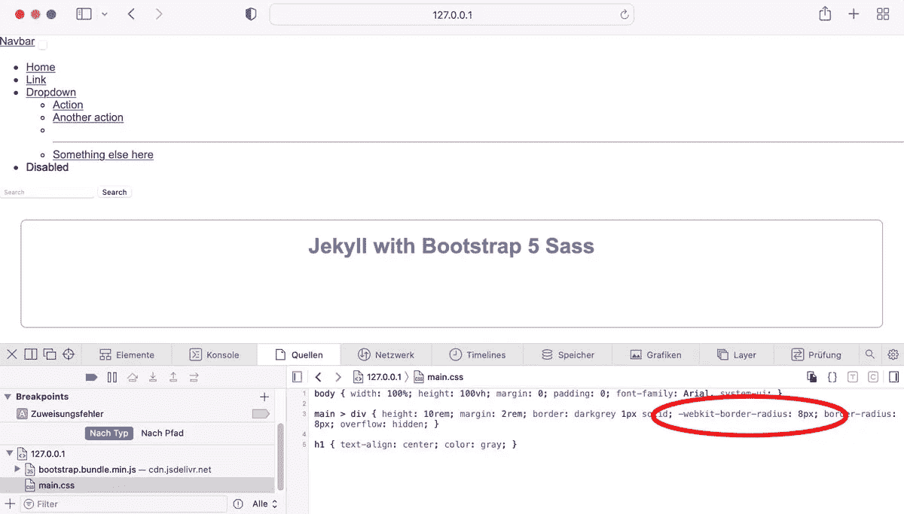
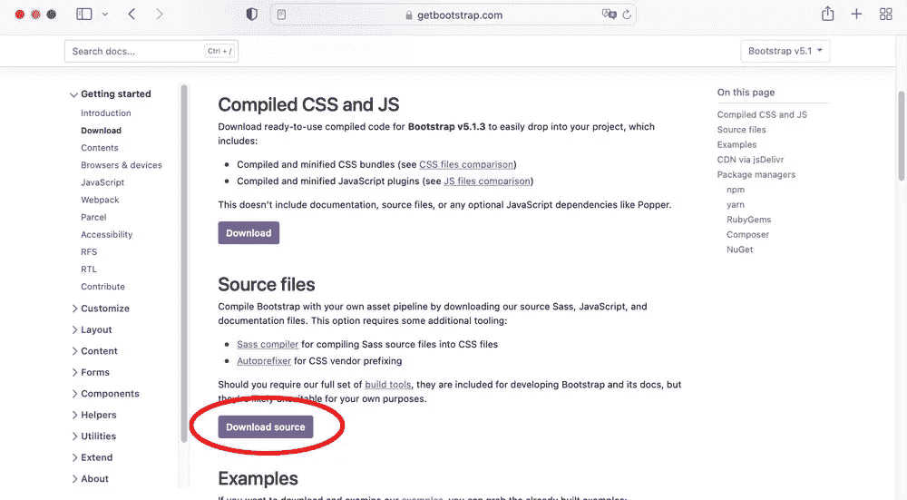
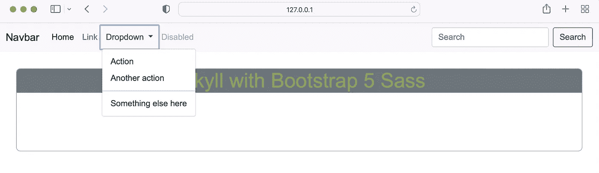
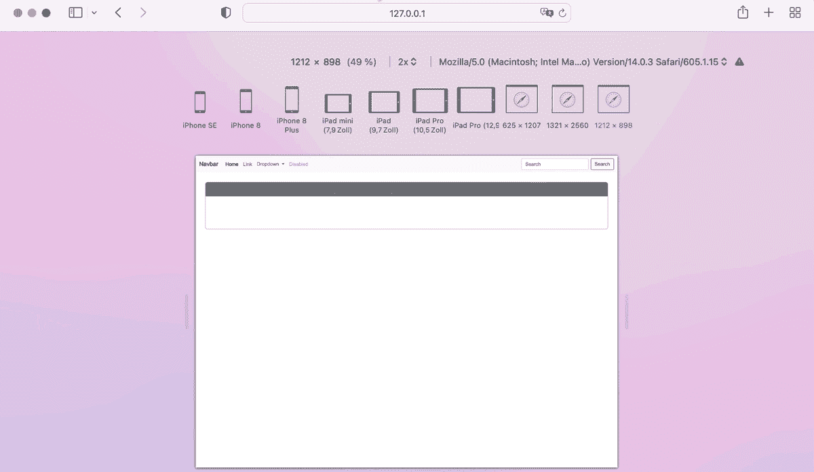

# 如何将 Bootstrap 5 Sass 添加到 Jekyll

> 原文：<https://medium.com/codex/how-to-add-bootstrap-5-sass-to-jekyll-e3b189f71552?source=collection_archive---------13----------------------->


照片由[詹姆斯·哈里逊](https://unsplash.com/@jstrippa?utm_source=unsplash&utm_medium=referral&utm_content=creditCopyText)在 [Unsplash](https://unsplash.com/s/photos/programming?utm_source=unsplash&utm_medium=referral&utm_content=creditCopyText) 上拍摄

# 介绍

静态站点生成器 [Jekyll](https://jekyllrb.com/) 允许你以不同的方式添加 Bootstrap 5。最简单的方法是使用预编译的 CSS 和 JavaScript 包，如我的[上一篇文章](/@robinkloeckner/how-to-add-bootstrap-5-to-jekyll-in-two-easy-ways-4d9dd3c8c895)中所述。或者，您可以使用 Bootstrap 的 Sass 和 JavaScript 源文件，并自己编译它们。Bootstrap 的 Sass 文件包含许多你可以利用的地图、mixins 和其他特性。在 Jekyll 中添加和使用这些文件相对容易，因为 Jekyll 带有内置的 Sass 编译器。

# 在本指南中

一个干净的 Jekyll 项目被设置为生成静态网站。安装程序将准备好编译 Sass，并通过集成 autoprefixer 插件添加供应商特定的 CSS 前缀。随后，您将学习如何将 Bootstrap 5.1.3 的 Sass 源文件添加到您的 Jekyll 项目中。第一种方法是简单地导入所有的 Sass 源文件。第二种方法是只导入属于您正在使用的组件的源文件。

# 先决条件

*   基本了解[杰基尔](https://jekyllrb.com/docs/)的工作原理
*   Ruby 版本 3.0.0 或更高版本，以及安装在您机器上的 Jekyll 和 bundler gems

# 清理设置

**新项目**

在所需的工作目录下打开您的终端，用

```
bundle init
```

并将所需的 Jekyll 和 WEBrick gems 添加到 Gemfile 中

```
bundle add jekyll webrick
```

**布局**

在项目根目录下创建一个`_layouts`文件夹。在该文件夹中，创建一个名为`default.html`的可重用布局文件，包含以下内容:

这个基本布局文件链接了 head 部分中的`main.css`样式表。这个文件将位于`assets/css/`目录中，并且将包括 Bootstrap 5 CSS 和自定义 CSS。主体包括一个`nav.html`部分，它将包含一个引导 5 导航条。在构建过程中，`{{ content }}`占位符将被页面内容替换。在结束的`<body>`元素之前，链接了一个简化版的 Bootstrap 5 JavaScript，因为 Bootstrap 的一些元素依赖 JavaScript 才能正常工作。因为本指南是关于 Sass 的实现，所以我们使用 CDN 来获取 JavaScript。上面的`<script>`标签取自[引导程序文档](https://getbootstrap.com/docs/5.1/getting-started/introduction/)。有关如何在您的 Jekyll 项目中使用 Bootstrap 的 JavaScript 的更多信息，请查看我的[上一篇文章](/@robinkloeckner/how-to-add-bootstrap-5-to-jekyll-in-two-easy-ways-4d9dd3c8c895)。

**第一页**

在项目根目录下创建一个包含以下内容的文件`index.html`(或者您可以使用一个 Markdown 文件):

在这个文件的顶部，定义了一个用于呈现内容的布局。正文内容仅仅由`<div>`中的`<h1>`标题组成。这些内容将被呈现到`default.html`文件中的`<main>`元素中。

**导航栏**

为了说明引导程序是否正确嵌入本指南的末尾，使用了来自[引导程序文档](https://getbootstrap.com/docs/5.1/components/navbar/)的标准导航栏。在你的项目根目录下创建一个文件夹`_includes`。在`_includes/`中创建一个包含以下内容的`nav.html`文件:

导航栏需要 Bootstrap 的样式表和 JavaScript 才能正常工作。

**造型**

网站的样式通常被分割成多个文件，这些文件必须在部署之前进行编译和打包。默认情况下，Jekyll 可以将多个 Sass 文件编译并捆绑成一个 CSS 文件。它希望 Sass 文件位于`_sass/`目录中。因此，在您的项目根目录中创建一个新文件夹`_sass`。在`_sass/`中创建一个新文件`base.scss`，它包含了页面内容的基本样式，即呈现到`default.html`文件的`<main>`元素中的内容。

将以下内容添加到`base.scss`:

在你的项目根目录下创建一个新文件夹`assets`。在`assets/`中创建另一个文件夹`css`。现在在`assets/css/`中创建一个新文件`main.scss`，内容如下:

该文件作为网站样式的入口点，并导入位于`_sass`的所有其他 Sass 文件。因为`_sass/`是 Sass 文件的默认位置，所以只需将文件名( *base* )作为导入值，不需要潜在的下划线，而不是完整的路径。

默认情况下，在构建过程中，`assets/`中的所有文件都将被复制到`_site`文件夹中。除此之外，Sass 文件必须被编译成 CSS。`main.scss`开头的两条虚线(前面空的物质)示意 Jekyll 编译它们，而不是简单的复制文件。只有在第一个 Sass 文件中需要这两条虚线。

注意:在`main.scss`中，您可以从`_sass/`目录导入任意数量的 Sass 文件。为了简单起见，我们只限于单个文件。

**自动修复机**

如[文档](https://getbootstrap.com/docs/5.1/getting-started/download/)中所述，使用 Bootstrap 的 Sass 源文件需要一个编译器将它们编译成 CSS 文件，还需要一个 autoprefixer 来添加供应商特定的 CSS 前缀。虽然 Jekyll 带有内置的 Sass 编译器，但它不提供 CSS 前缀。解决这个问题的一个简单方法是安装 Jekyll-autoprefixer gem 作为插件。

使用以下命令将 jekyll-autoprefixer gem 添加到 gem 文件中

```
bundle add jekyll-autoprefixer
```

此外，如果您在构建过程中遇到错误，请在 2.7 版本中添加 ExecJS(参见此 [GitHub 问题](https://github.com/vwochnik/jekyll-autoprefixer/issues/11))

```
bundle add execjs -v 2.7
```

要启用插件，请在项目根目录下创建一个包含以下内容的`_config.yml`文件:

前两行激活 autoprefixer 插件。然后可以在 *autoprefixer* 关键字下配置插件。在我们的例子中，我们只是希望前缀支持每个浏览器的最后四个版本。

**这是我们的基本设置**

Jekyll 项目现在具有以下结构:

```
/
 _includes/
   nav.html
 _layouts/
   default.html
 _sass/
   base.scss
 assets/
   css/
     main.scss
 _config.yml
 Gemfile
 index.html
```

使用构建项目

```
bundle exec jekyll serve
```

并浏览`[http://127.0.0.1:4000](http://127.0.0.1:4000.)` [。](http://127.0.0.1:4000.)



网站现在由来自 Bootstrap 的导航栏和来自`index.html`文件的内容组成。正如您所看到的，来自`base.scss`的样式被应用于`index.html`的内容，这表明 Sass 文件被正确地处理和链接。

如果您将`Safari > 2`添加到 autoprefixer 配置中的浏览器列表中，并重新构建项目，`main.css`包含一个新行`-webkit-border-radius: 8px;`。这是因为 CSS 属性 *border-radius* 只在 Safari 版本 3 到 5 中使用 *-webkit* 前缀。`Safari > 2`向 autoprefixer 发出信号，将 *-webkit* 前缀添加到任何 Safari 版本都不完全支持的每个 CSS 属性中> 2。这验证了插件被正确实现。

该设置是后续部分的基础。

**源代码**

GitHub: [Jekyll 基础设置](https://github.com/robinkloeckner/jekyll_bootstrap5_sass/tree/master/00_base)

# 下载引导程序 5

点击**源文件**部分的*下载源文件*按钮，从[下载页面](https://getbootstrap.com/docs/5.0/getting-started/download/)下载 Bootstrap 5。然后下载后解压 *bootstrap-5.1.3* 文件夹。



# 向 Jekyll 添加源文件

在`_sass/`目录下新建一个文件夹`bootstrap`。这个文件夹将包含所有 Bootstrap 的 Sass 源文件，与我们的自定义 Sass 文件分开。`bootstrap-5.1.3/scss/`包含必要的 Sass 文件。将它们全部复制到 Jekyll 项目的`_sass/bootstrap/`中。

Jekyll 项目现在具有以下结构:

```
/ 
 _includes/
   nav.html
 _layouts/
   default.html
 _sass/
   base.scss
 assets/
   css/
     bootstrap/
       forms/
         ...
       helpers/
         ...
       mixins/
         ...
       utilities/
         ...
       vendor/
         ...
       ...
       bootstrap.scss
       bootstrap-grid.scss
       bootstrap-reboot.scss
       bootstrap-utilities.scss
     main.scss
 _config.yml
 Gemfile
 Gemfile.lock
 index.html
```

# 选项 1:嵌入所有 Bootstrap 的 Sass

在 Jekyll 中使用引导 Sass 源文件的最简单的方法是从`assets/css/`文件夹中 Sass 入口文件`main.scss`顶部的`_sass/bootstrap/`导入`bootstrap.scss`。`bootstrap.scss`依次以正确的顺序从引导导入所有剩余的 Sass 文件。更新后的`main.scss`文件现在看起来如下:

因为 Bootstrap 的 Sass 文件位于子文件夹`bootstrap/`中，所以相对于`_sass`目录的路径必须放在文件名的前面。引导必须在自定义样式之前导入。否则构建过程将会失败。

此时，Bootstrap 的 Sass 文件已经嵌入到 Jekyll 中。重建项目时，默认的引导样式将应用于导航栏。为了验证 Bootstrap 的变量、mixins 和其他特性可以在自定义`base.scss`文件中使用，用新颜色覆盖 Bootstrap 的`$primary`变量，并将其应用到`<h1>`元素，并将背景颜色设置为`$secondary`:

使用重新生成项目

```
bundle exec jekyll serve
```

并浏览`[http://127.0.0.1](http://127.0.0.1:)` [:](http://127.0.0.1:)



正如您所看到的，默认的引导样式应用于导航栏。此外，当默认二级色应用于`<h1>`的背景时，原色被成功覆盖并应用于字体颜色。

**源代码**

GitHub: [Jekyll 与 Bootstrap 5 Sass —选项 1](https://github.com/robinkloeckner/jekyll_bootstrap5_sass/tree/master/01_scss_bundle)

# 选项 2:有选择地嵌入引导 Sass

您可以只导入您真正需要的文件，而不是导入所有引导 Sass 文件。在这种情况下，导入的顺序很重要。**恢复选项 1** 的潜在变化。根据[引导程序文档](https://getbootstrap.com/docs/5.1/customize/sass/)中的结构修改`main.scss`文件:

必须导入的第一个文件是`functions.scss`，这是正确处理源代码所必需的。在第二步中，Bootstrap 的默认变量可以在第三步导入之前被覆盖。如果你第一次使用 Bootstrap，这可能看起来很奇怪，但是只要你一开始就导入`_functions.scss`，Bootstrap 就会正确地处理修改。

要验证本指南末尾的引导程序是否正确嵌入，只需覆盖原色即可。在默认变量之后，必须导入 Bootstrap 的 mixins 和一个用于生成`:root` CSS 变量的根脚本。

在第四步中，您可以有选择地导入所需的源文件。因为一些源文件依赖于其他文件，所以很难确定你需要哪一个。在上面的例子中，文件列在 *4 下。*和 *5。*默认导航栏需要具有与选项 1 相同的外观和行为。最后，您可以导入剩余的自定义 Sass 文件。

将修改后的原色应用于`<h1>`的字体，并将 Bootstrap 的默认二级色设置为背景色。修改后的`base.scss`文件如下所示:

使用重新生成项目

```
bundle exec jekyll serve
```

并浏览`[http://127.0.0.1](http://127.0.0.1:)`。



导航栏现在具有与选项 1 相同的外观和行为。此外，Bootstrap 的主要颜色会被覆盖和应用，这将验证 Bootstrap 是否正确嵌入。

**源代码**

GitHub: [Jekyll 与 Bootstrap 5 Sass —选项 2](https://github.com/robinkloeckner/jekyll_bootstrap5_sass/tree/master/02_scss_individual)

# 摘要

我们构建了一个干净的 Jekyll 设置，包括用于添加特定于供应商的 CSS 前缀的 Jekyll-autoprefixer gem。然后我们下载了 Bootstrap 5.1.3，随后以两种不同的方式添加了 Sass 源文件。第一种方法是导入主引导样式表，然后导入剩余的文件。第二种方法是只导入我们正在使用的组件的 Sass 文件。

感谢您的阅读:)

# 进一步阅读

了解如何用两种不同的语言为包含静态内容的多页面网站构建 Jekyll 设置。