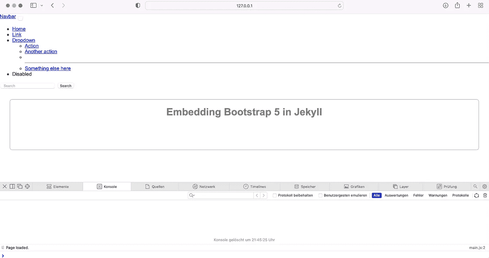
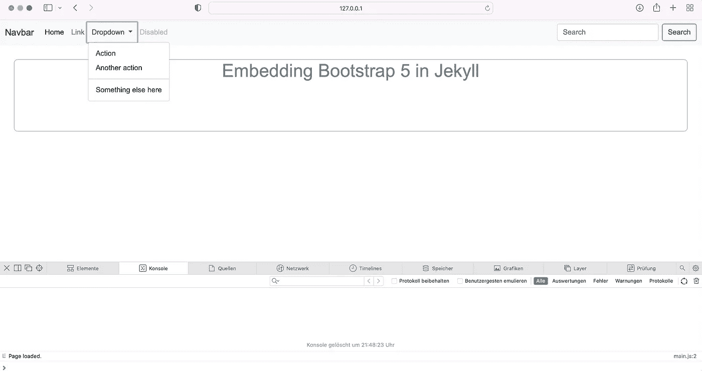
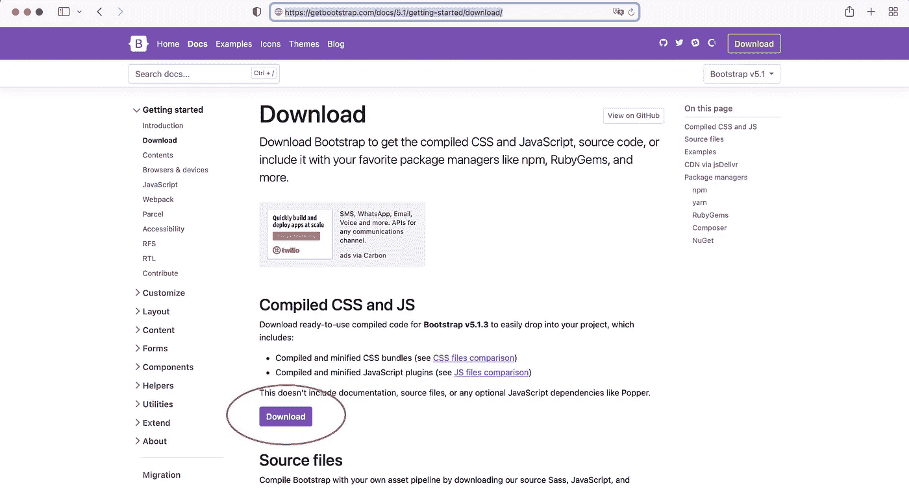
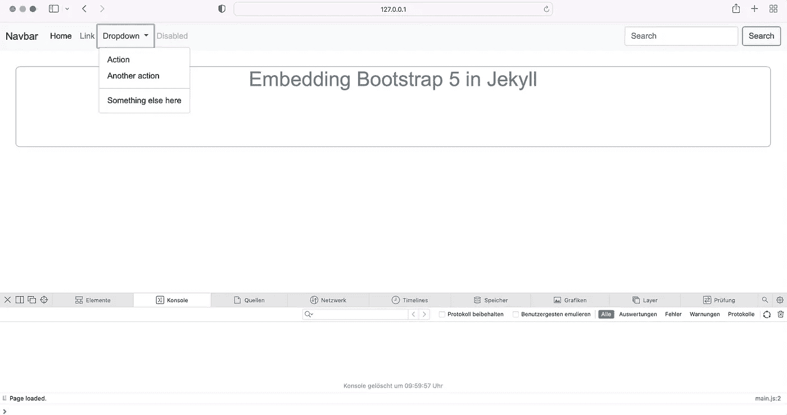

# 如何用两种简单的方法将 Bootstrap 5 添加到 Jekyll

> 原文：<https://medium.com/codex/how-to-add-bootstrap-5-to-jekyll-in-two-easy-ways-4d9dd3c8c895?source=collection_archive---------12----------------------->


照片由[詹姆斯·哈里森](https://unsplash.com/@jstrippa?utm_source=unsplash&utm_medium=referral&utm_content=creditCopyText)在 [Unsplash](https://unsplash.com/s/photos/programming?utm_source=unsplash&utm_medium=referral&utm_content=creditCopyText) 上拍摄

# **简介**

Jekyll 是一个构建静态网站的伟大框架。默认情况下，它允许你将你的源代码分割成更小的单元，并编译它们来清理 HTML、CSS 和 JavaScript 文件。它还允许您以不同的方式嵌入 CSS 和 JavaScript 框架。最广泛使用的框架之一是 [Bootstrap](https://getbootstrap.com/) ，目前在 5.1.3 版本中。然而，当第一次使用 Jekyll 和 Bootstrap 时，在 Jekyll 项目中嵌入 Bootstrap 时，您可能会遇到一些意想不到的问题。

# **在本指南中**

一开始就创建了一个干净的 Jekyll 项目。随后，以两种简单的方式添加引导程序 5.1.3。首先从 CDN 获取 Bootstrap 的 CSS 和 JavaScript 捆绑文件。第二种方法是在 Jekyll 中嵌入 CSS 和 JavaScript 包，并从 web 服务器获取它们。

# **先决条件**

*   对杰基尔如何工作的基本了解
*   Ruby 版本 3.0.0 或更高版本，以及安装在您机器上的 Jekyll 和 bundler gems

# **清理设置**

**新项目**

在所需的工作目录下打开终端，用

```
bundle init
```

然后将所需的 Jekyll 和 WEBrick gems 添加到 Gemfile 中

```
bundle add jekyll webrick
```

**第一页**

在您的项目根目录中创建一个包含以下内容的`index.html`文件(或者您可以使用 Markdown 文件):

Jekyll 将使用这个文件的内容来构建网站的`index.html`文件。在顶部，我们将布局定义为前端内容，告诉 Jekyll 如何呈现页面内容。

**布局**

接下来，在项目根目录下创建一个文件夹`_layouts`。在该文件夹中，创建一个名为`layout.html`的可重用布局文件，其内容如下:

样式表链接在 head 部分。文档的主体包括`nav.html`，它将保存导航栏的 HTML，以及结束`<body>`元素之前的 JavaScript 文件。CSS 和 JavaScript 文件稍后将在`assets/`文件夹中创建，它们将在构建时被复制。`{{content}}`是页面内容的占位符。对于`index.html`文件，`{{content}}`将在构建过程中被替换为

**导航栏**

我们将创建一个导航栏来说明 Bootstrap 是否正确嵌入。在项目根目录下新建一个文件夹`_includes`。在该文件夹中，使用来自引导程序的以下[示例代码创建一个`nav.html`文件:](https://getbootstrap.com/docs/5.1/components/navbar/)

上面的代码需要 Bootstrap 的 CSS 和 JavaScript 才能正常工作。

**造型**

在项目根目录下创建一个`assets`文件夹。在构建过程中，`assets/`中的所有文件和文件夹都将被复制。在`assets/`中创建另一个文件夹`css`。在这个文件夹中创建`styles.scss`，它将作为网站 CSS 的入口点。为了更大的灵活性，我们将使用 Sass 文件而不是 CSS 文件。

`styles.scss`

文件开头的两条虚线(前面空的物质)是强制的，表示 Jekyll 处理文件而不是简单地复制它。注意:只有在第一个 Sass 文件中，空的前端内容才是必需的！

`styles.scss`的主要目的是导入其他文件，这些文件将保存网站不同部分的样式。默认情况下，Jekyll 希望导入的 Sass 文件位于`_sass/`中。因此，仅指示文件名*基*作为`@import`值而非完整路径就足够了。

现在在项目根目录下创建文件夹`_sass`。在`_sass/`内部创建一个`base.scss`文件，为内容提供一些基本样式:

这个基本样式应用于`index.html`文件的内容，以验证 CSS 是否被正确加载。

**JavaScript**

在`assets/`目录中为 JavaScript 文件创建一个文件夹`js`。在那个文件夹中用下面的代码创建`main.js`:

这个脚本只是记录加载的*页面。*到控制台验证 JavaScript 是否正确加载。

**结果**

Jekyll 项目现在具有以下结构:

```
/
 _includes/
   nav.html
 _layouts/
   default.html
 _sass/
   base.scss
 assets/
   css/
     styles.scss
   js/
     main.js
 Gemfile
 index.html
```

使用构建项目

```
bundle exec jekyll serve
```

并浏览 [http://127.0.0.1:4000](http://127.0.0.1:4000) 。



定制的 CSS 和 JavaScript 被正确嵌入，正如您在浏览器的控制台和内容的应用样式中所看到的。因为 Bootstrap 还没有嵌入，所以导航栏缺少任何样式。

**源代码**

GitHub: [清理 Jekyll 设置](https://github.com/robinkloeckner/jekyll_bootstrap5_beginner/tree/main/00_base)

# **选项 1:从内容递送网络获取引导程序 5**

在 Jekyll 中添加 Bootstrap 最简单的方法是从[内容交付网络](https://de.wikipedia.org/wiki/Content_Delivery_Network) (CDN)获取 Bootstrap 的捆绑 CSS 和 JavaScript 文件。CDN 是一个分布式服务器网络，供应商使用它来交付各种内容。

**实施**

我们需要做的就是在布局文件中添加一个`<link>`和一个`<script>`元素来引用 CDN。

[引导文档](https://getbootstrap.com/docs/5.1/getting-started/introduction/)提供了引用 [jsDelivr](https://www.jsdelivr.com/package/npm/bootstrap) CDN 的相关代码片段。

在我们链接自定义 CSS 之前，将以下代码片段添加到 head 部分:

为了导入 Bootstrap 的 JavaScript，我们在链接自定义 JavaScript 之前添加了以下代码片段:

然后，浏览器将从 CDN 获取捆绑的 CSS 和 JavaScript 版本的 Bootstrap 5.1.3。

在自定义 CSS 和 JavaScript 文件之前设置 Bootstrap 中的`<link>`和`<script>`元素是很重要的。否则，在自定义 CSS 和 JavaScript 中使用 Bootstrap 时，您可能会遇到问题。

**结果**

更新后的`layout.html`文件现在看起来如下:

使用重新生成项目

```
bundle exec jekyll serve
```

并浏览 [http://127.0.0.1:4000](http://127.0.0.1:4000`) 。



正如您所看到的，默认的引导样式已经应用于导航栏。当点击*下拉菜单*时，会出现一个子菜单，表明 Bootstrap 的 JavaScript 也已正确嵌入。

**源代码**

GitHub: [带引导程序 5 的 Jekyll 选项 1](https://github.com/robinkloeckner/jekyll_bootstrap5_beginner/tree/main/01_cdn)

# **选项 2:添加 Bootstrap 5 包到 Jekyll**

另一种方法是将 Bootstrap 的 CSS 和 JavaScript 包下载并复制到`assets/`目录，然后将它们与网站的其余文件一起托管在 web 服务器上。然后，浏览器将从 web 服务器而不是 CDN 获取 CSS 和 JavaScript 包。

**下载捆绑包**

Bootstrap 提供不同的下载选项。在 [Bootstrap 5.1](https://getbootstrap.com/docs/5.1/getting-started/download/) 的下载页面上，点击页面最开始的**编译 CSS 和 JS** 部分的*下载*，解压下载的 *bootstrap-5.1.3-dist* 文件夹。



**实施**

下载的文件夹提供了不同的编译 CSS 和 JavaScript 包。嵌入引导 CSS 最简单的方法是将`bootstrap.min.css`和`bootstrap.min.css.map`从`css/`文件夹复制到 Jekyll 项目的`assets/css/`目录。`bootstrap.min.css`是完整的引导 CSS 的编译和缩小版本，而`bootstrap.min.css.map`是将缩小的 CSS 映射回原始源文件的源映射。通常在开发过程中使用源地图。如果不需要，就把源图文件和`bootstrap.min.css`末尾的链接去掉。

与 CSS 类似，将下载的`js/`文件夹中的`bootstrap.bundle.min.js`和`bootstrap.bundle.min.js.map`复制到 Jekyll 项目的`assets/js/`中。相比`bootstrap.min.js` `bootstrap.bundle.min.js`包含第三方库 [Popper.js](https://popper.js.org/) ，这是一些 Bootstrap 插件所需要的。同样，`bootstrap.bundle.min.js.map`将缩小的 JavaScript 版本映射到原始源代码，主要用于开发目的。如果不需要的话，把源文件和`bootstrap.bundle.min.js`末尾的 linkt 去掉。

现在通过在`default.html`布局文件中添加`<link>`和`<script>`元素来嵌入 Bootstrap。由于`assets/`文件夹是在构建过程中按原样复制的，每个元素的引用都指向`assets/`文件夹中相应的引导文件。

将以下`<link>`元素添加到自定义 CSS 的之前的文档头部分*。否则，不能在自定义 CSS 中覆盖 Bootstrap 的 CSS 类:*

Bootstrap 的 JavaScript 的`<script>`元素必须添加在`default.html`布局文件中的自定义 Javascript 之前。否则，在您的自定义 CSS 中使用它时，您可能会遇到问题。

**结果**

`default.html`文件现在看起来如下:

Jekyll 项目现在具有以下结构:

```
/
 _includes/
   nav.html
 _layouts/
   default.html
 _sass/
   base.scss
 assets/
   css/
     bootstrap.min.css
     bootstrap.min.css
     styles.scss
   js/
     bootstrap.bundle.min.js
     bootstrap.bundle.min.js.map
     main.js
 Gemfile
 index.html
```

使用重新生成项目

```
bundle exec jekyll serve
```

并浏览 [http://127.0.0.1:4000](http://127.0.0.1:4000`) 。



正如您所看到的，默认的引导样式已经应用于导航栏。当点击*Dropdown*时，会出现一个子菜单，表明 Bootstrap 的 JavaScript 也已正确嵌入。

使用“bundle exec build”进行生产构建后，引导软件包将与网站的其余文件一起复制到“_site”文件夹中。此文件夹可以按原样上传到您的 web 服务器。然后，浏览器将从您的 web 服务器而不是选项 1 中的 CDN 获取包。

**源代码**

GitHub: [带引导程序 5 的 Jekyll 选项 2](https://github.com/robinkloeckner/jekyll_bootstrap5_beginner/tree/main/02_css)

# **总结**

在本指南中，我们建立了一个干净的 Jekyll 设置，并随后以两种简单的方式添加了 Bootstrap 5。首先从 CDN 中获取捆绑的 CSS 和 JavaScript 文件。其次，将下载的 CSS 和 JavaScript 包复制到项目中，然后上传到 web 服务器。

感谢您的阅读:)

# *延伸阅读*

[学习如何用两种不同的语言为包含静态内容的多页面网站构建 Jekyll 设置。](/@robinkloeckner/build-a-ready-to-use-jekyll-setup-part-1-new-project-24ad21073192)