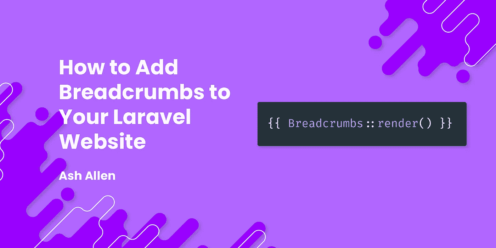

# 如何添加面包屑到你的 Laravel 网站

> 原文：<https://medium.com/codex/how-to-add-breadcrumbs-to-your-laravel-website-3b5def21ff4f?source=collection_archive---------17----------------------->



# 介绍

面包屑是改善应用程序和网站的 UI(用户界面)和 UX(用户体验)的好方法。它们有助于减少用户迷路的机会，让用户更容易浏览你的网站。

在本文中，我们将介绍什么是面包屑，它们的好处，以及如何将它们添加到您自己的 Laravel 网站或应用程序中。

如果你有兴趣找出不同的方法来改进你的网站，一定要看看我最近的一篇名为 [17 种方法让你的网站做好赢得](https://ashallendesign.co.uk/blog/17-ways-to-get-your-website-ready-to-win)的准备的文章。

# 使用面包屑有什么好处？

面包屑来自[汉瑟和葛丽特](https://en.wikipedia.org/wiki/Hansel_and_Gretel)的故事，这是一个关于一对兄妹的童话故事，他们在森林里留下了面包屑的痕迹，这样他们就可以找到回去的路。在 web 开发世界中，面包屑以同样的方式工作；它们为我们留下了踪迹，这样我们就知道我们在系统中的位置以及如何返回。

你以前几乎肯定遇到过面包屑。例如，让我们想象一下，我们在一个服装网站上，我们正在看男士 t 恤。您可能会在页面顶部附近看到与此类似的内容:

**首页>男装> T 恤**

这是一个面包屑，它显示我们在男士 t 恤页面上。通常，每个“面包屑”都是一个链接，带你回到另一个页面。

面包屑是有益的，因为:

1.  它们可以降低跳出率，减少用户迷路的机会。如果你的用户开始对他们在网站或应用程序中的位置感到困惑，他们会变得沮丧。这有时会导致他们离开。因此，面包屑通过为用户提供更多的可见性来解决这个问题。
2.  它们可以为你的访问者或用户提供一种“向上提升”的方式。例如，让我们想象一下，一个访问者在谷歌搜索了“男士 t 恤”，并登陆了你网站的 t 恤页面。但是，现在他们想看看你提供的其他男装。他们不必去你网站的主导航，他们可能会点击一级到“男装”。通过以简单的方式呈现面包屑，你已经允许用户直接导航到他们的导航，而不需要四处寻找。
3.  如果你的面包屑设置正确，它们对搜索引擎优化非常有用。它们帮助搜索引擎爬虫更好地了解你网站的页面结构。这种结构有时会显示在您的搜索引擎结果中。

如果你有兴趣阅读更多使用面包屑的好处，看看这两篇由[尼尔森诺曼集团](https://www.nngroup.com/articles/breadcrumb-navigation-useful/)和 [Infidigit](https://www.infidigit.com/blog/breadcrumbs/) 撰写的文章。

# 如何将它们添加到您的 Laravel 网站

为了将面包屑添加到您的 Laravel 项目中，我们将使用[diglactic/Laravel-bread crumbs](https://github.com/diglactic/laravel-breadcrumbs)包。我已经在相当多的项目中使用了这种方法，从小网站到相当大的应用程序，我总是发现它非常容易设置和使用。

# 安装和配置

让我们从使用 Composer 安装软件包开始，命令如下:

```
composer require diglactic/laravel-breadcrumbs
```

现在我们已经安装了这个包，我们可以使用下面的命令发布配置文件:

```
php artisan vendor:publish --tag=breadcrumbs-config
```

现在您应该有了一个新创建的`config/breadcrumbs.php`文件，可以用来编辑包的配置。在这篇特别的文章中，我们只关心配置文件中的`view`选项。但是，您可以随意探索该文件，并根据自己的需要进行修改。

默认情况下，当我们将面包屑输出到我们的页面时，包将使用 [Bootstrap 5](https://getbootstrap.com/) 对它们进行样式化。所以，如果你正在使用 Bootstrap 5 设计你的 UI，你不需要马上做任何改变。

然而，如果你为你的 CSS 使用 [Tailwind](https://tailwindcss.com/) ，你可以更新`breadcrumbs.php`配置文件中的`view`，这样这个包就使用 Tailwind 来渲染而不是引导。在这种情况下，您可以像这样更新您的配置文件:

```
return [

    // ...

    'view' => 'breadcrumbs::tailwind',

    // ...

];
```

# 为面包屑使用自定义样式

在我个人看来，我相当喜欢面包屑的顺风版本的默认样式。然而，如果你发现你想要一个更定制的外观设计，你可以很容易地自己添加这个。

首先，你可以创建一个新的`resources/views/partials/breadcrumbs.blade.php`文件。该文档提供了一个方便的小模板，您可以直接从这个文件开始:

```
@unless ($breadcrumbs->isEmpty())
    <ol class="breadcrumb">
        @foreach ($breadcrumbs as $breadcrumb)

            @if (!is_null($breadcrumb->url) && !$loop->last)
                <li class="breadcrumb-item">
                    <a href="{{ $breadcrumb->url }}">
                        {{ $breadcrumb->title }}
                    </a>
                </li>
            @else
                <li class="breadcrumb-item active">
                    {{ $breadcrumb->title }}
                </li>
            @endif

        @endforeach
    </ol>
@endunless
```

现在，您可以将自己的样式和结构添加到该模板中，并使其更适合您的应用程序或网站的设计。在过去的项目中，我使用了这种方法，这样我就可以使用 Tailwind UI 中的样式添加面包屑。

要使用我们的定制样式，剩下要做的就是更新配置文件。我们只需要更改`view`字段，指向我们刚刚创建的新刀片文件。下面是一个可能的例子:

```
return [  

    // ...

    'view' => 'partials/breadcrumbs',

    // ...

];
```

# 定义面包屑

既然我们已经获得了包设置的配置，我们就可以开始定义面包屑来显示了。

在我们开始定义任何面包屑之前，让我们看一下这个基本的示例`routes/web.php`文件:

```
<?php

use App\Http\Controllers\UserController;
use Illuminate\Support\Facades\Route;

Route::get(
    '/users', [UserController::class,'index']
)->name('users.index');Route::get(
    '/users/{user}', [UserController::class,'show']
)->name('users.show');Route::get(
    '/users/{user}/edit', [UserController::class,'edit']
)->name('users.edit');
```

这个包的工作原理是，我们为我们拥有的每条路线定义一个面包屑。因此，在这个特定的例子中，因为我们有 3 条路由，我们需要定义 3 个面包屑。

为此，我们首先需要定义一个新的空的`routes/breadcrumbs.php`文件。一旦我们创建了它，我们可以添加定义我们的第一个面包屑:

```
use App\Models\User;
use Diglactic\Breadcrumbs\Breadcrumbs;
use Diglactic\Breadcrumbs\Generator as BreadcrumbTrail;

Breadcrumbs::for('users.index', function (BreadcrumbTrail $trail) {
    $trail->push('Users', route('users.index'));
});
```

让我们快速看一下上面的代码在做什么。我们基本上是为您可以通过`users.index`路径访问的页面定义一个面包屑。然后我们告诉这个包将`Users`推到一个堆栈上进行显示，并显示一个到`users.index`页面的链接。

我们将定义我们的其他路线，并再次看看我们的面包屑文件可能看起来像什么:

```
use App\Models\User;
use Diglactic\Breadcrumbs\Breadcrumbs;
use Diglactic\Breadcrumbs\Generator as BreadcrumbTrail;

Breadcrumbs::for('users.index', function (BreadcrumbTrail $trail) {
    $trail->push('Users', route('users.index'));
});

Breadcrumbs::for('users.show', function (BreadcrumbTrail $trail, User $project) {
    $trail->parent('users.index');

    $trail->push($user->name, route('users.show', $user));
});

Breadcrumbs::for('users.edit', function (BreadcrumbTrail $trail, User $project) {
    $trail->parent('users.show');

    $trail->push('Edit', route('users.edit', $user));
});
```

在上面的几行中，我们为另外两条路线定义了两个面包屑。

对于第一条路线，我们添加了一个 breadcrumb，它将把用户的名字作为用户“显示”路线的链接推送到堆栈上。如果我们要在浏览器中导航到此路线，则面包屑将具有以下结构作为示例:

**用户>灰艾伦**

对于第二条路线，我们添加了一个 breadcrumb，它会将“Edit”作为用户的 show 路线的链接推送到堆栈上。如果我们要在浏览器中导航到此路线，则面包屑将具有以下结构作为示例:

**用户>灰艾伦>编辑**

# 显示面包屑

我们快到了！既然我们已经定义了我们的面包屑，我们现在可以将它们输出到我们的页面，供我们的访问者开始使用。为此，我们只需要在我们的刀片视图文件中找到一个我们想要渲染它们的位置，然后添加:

```
{{ Breadcrumbs::render() }}
```

就是这样！这就是你需要做的！

现在，您应该能够看到您的页面上显示的面包屑，并且应该能够点击不同的链接来浏览不同的页面。

这个包非常全面，所以我强烈建议查看他们的文档，看看你能做的其他很酷的事情。

# 结论

希望这篇文章已经解释了使用面包屑的好处，以及它们如何帮助你的用户。它还应该让您对如何轻松地将它们添加到自己的 Laravel 应用程序中有所了解。

如果这篇文章对你有所帮助，我很乐意听听。同样，如果你对这篇文章有任何改进的反馈，我也很乐意听到。

如果你有兴趣在我每次发布新帖子时得到更新，请随意注册我的简讯。

继续建造令人敬畏的东西！🚀

*最初发表于*[T5【https://ashallendesign.co.uk】](https://ashallendesign.co.uk/blog/how-to-add-breadcrumbs-to-your-laravel-website)*。*