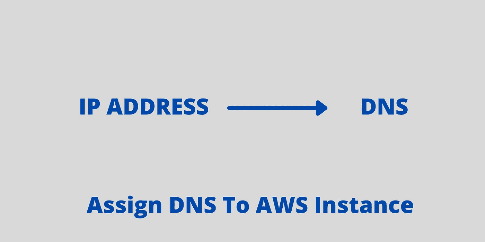

# 如何给你的 AWS LightSail 实例添加域名？

> 原文：<https://medium.com/codex/how-to-add-domain-name-to-your-aws-lightsail-instance-5ec58ed7b9a0?source=collection_archive---------4----------------------->

对于客户来说，记住 IP 地址是一件困难的事情。DNS 会很容易被记住。本文演示了如何为 AWS Lightsail 实例分配 DNS。

如何给你的 AWS LightSail 实例添加域名？

无论何时创建 AWS Lightsail 实例，都可以使用该实例的 IP 地址来访问它。使用 IP 地址对开发者来说很容易。然而，用户/客户并不乐意使用 IP…