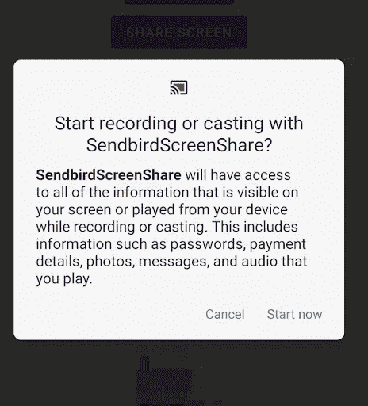

# 如何通过 Sendbird 呼叫将屏幕共享添加到您的 Android 应用程序

> 原文：<https://medium.com/codex/how-to-add-screen-sharing-to-your-android-app-with-sendbird-calls-7824655fa57c?source=collection_archive---------3----------------------->

仙鸟 2022

## 使用 Sendbird 调用实现屏幕共享的 2 部分指南的第 2 部分

解决方案工程师| [Sendbird](https://www.sendbird.com/)

*我们建议您查看* [*示例应用*](https://github.com/warodri-sendbird/tutorial-share-screen-android) *获取您可能需要的代码。如需更多指导，请访问我们的* [*文档*](https://sendbird.com/docs/calls/v1/android/guides/direct-call#2-share-screen) *。请访问我们的* [*网站*](https://sendbird.com/features/voice-and-video) *了解更多关于 Sendbird Calls 可以提供的服务。*

> *成为第一个了解新教程、开发者相关聊天/电话发布以及其他重要更新的人，* [*注册*](https://get.sendbird.com/dev-newsletter-subscription.html) *我们的开发者简讯。*

# 介绍

本指南由两部分组成。在 [**Part 1**](https://sendbird.com/developer/tutorials/android-video-chat-sendbird-calls) 中，我们向大家展示了如何用视频实现通话。在第 2 部分中，我们将向您展示如何实现一个简单的屏幕共享功能。Android Sendbird Calls Share 屏幕示例的官方 Github 存储库可从 [**这里**](https://github.com/sendbird/examples-calls-android/tree/main/DirectCall) 获得。

**注:**

*   为了本教程的简单，我们将在我们的 **gradle** 文件中使用 targetSdkVersion 28，这样如果你使用版本 29 或更旧的版本，我们就不必实现 Google 要求的服务。
*   本指南假设您已经完成了第 1 部分。

# 步骤 1:修改权限

在第一部分中，我们添加了成功进行视频通话所需的所有权限。现在在第 2 部分中，我们需要用额外的权限修改原始清单。FOREGROUND_SERVICE 权限允许屏幕共享。

接下来，在应用程序标签 **<应用程序>…</应用程序>，**中，将以下内容添加到您的清单中，以定义前台服务:

# 第二步。修改用户界面

既然我们已经向清单添加了适当的权限/服务，那么让我们修改我们在第 1 部分中创建的 activity_main.xml 布局。我们要添加一个按钮，允许共享我们的屏幕。

我们独特屏幕的布局

添加按钮后，您的 xml 看起来将如上所示。

# 第三步。修改实现

现在我们需要修改我们的实现。首先，去你的 MainActivity.java。在第 1 部分中，我们为按钮、视频视图和另一个屏幕共享按钮创建了一个全局变量列表。

然后添加一个全局变量来请求进行屏幕录制的权限(设置任何大于零的数字)

现在，在我们的 initElementsOnScreen 方法中，您将希望初始化 butShareScreen 并设置 onClickListener。

## 共享您的屏幕

为了分享你的屏幕，Android 使用了**媒体投影仪管理器**。您需要为您的用户请求许可才能这样做。

如前所述，如果您的 **targetSdkVersion** 是 **29** 或更高版本，您将需要实现一个**前台服务**(根据 Android 请求)。为了简单起见，我们将使用版本 28。

当您单击屏幕上的**共享屏幕**按钮时，startScreenShare()方法将会执行。

该函数将向用户请求 **MediaProjectionManager** 权限。

请求许可录制(和共享)屏幕

一旦用户接受， **onActivityResult(…)** 将自动执行:

我们的最后一个调用是 Sendbird Calls 中的 **startScreenShare(…)** 方法。下面的代码将为我们完成所有的工作。

## 停止屏幕共享

要停止共享您的屏幕，您需要从我们的全局 **mCurrentCall** 调用 **stopScreenShare** 方法。

确保首先检查有效的对象。一旦屏幕共享过程完成，将调用 **CompletionHandler** 。不管有没有错误，继续执行您的代码。在本指南中，为了关注本质，我们选择不添加 UI 元素来结束屏幕共享。

# 结论

我们已经完成了本教程。在第 1 部分中，我们实现了打电话的功能，现在在第 2 部分中，我们添加了共享屏幕的功能。