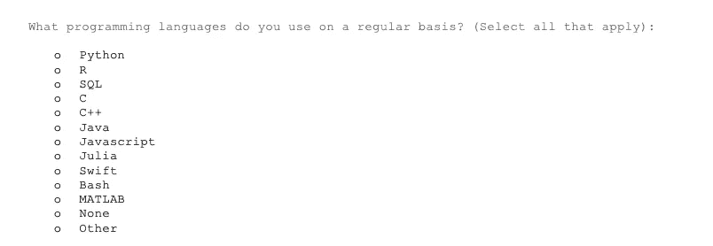
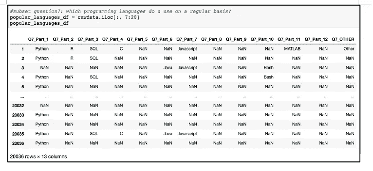
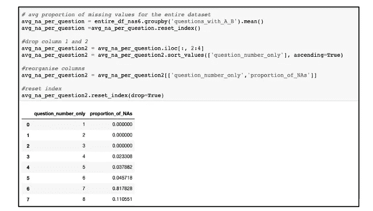
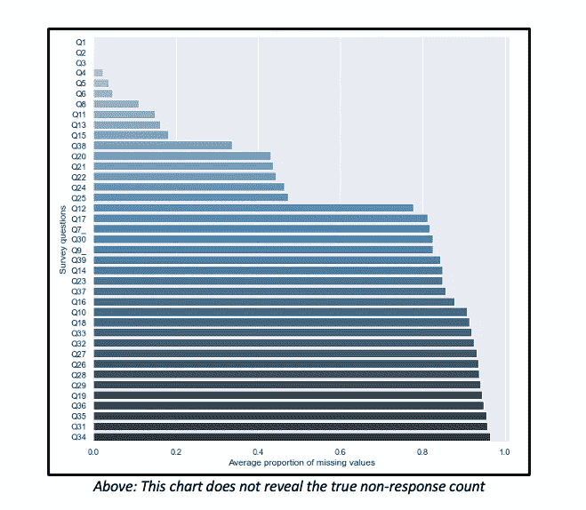
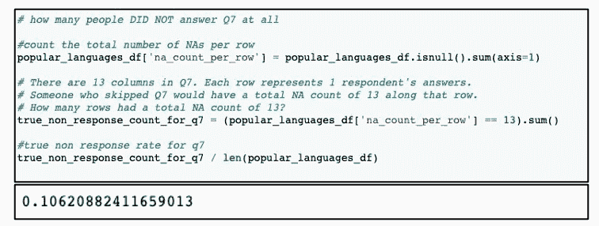
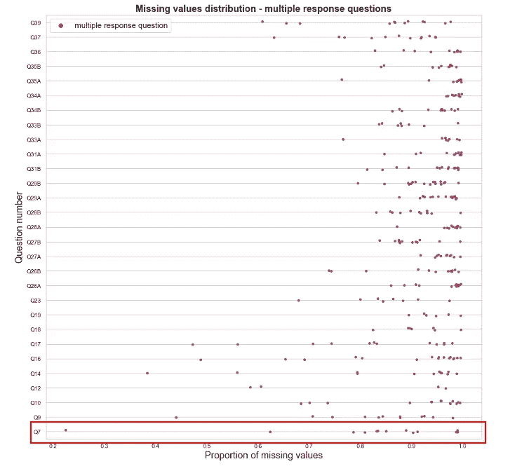
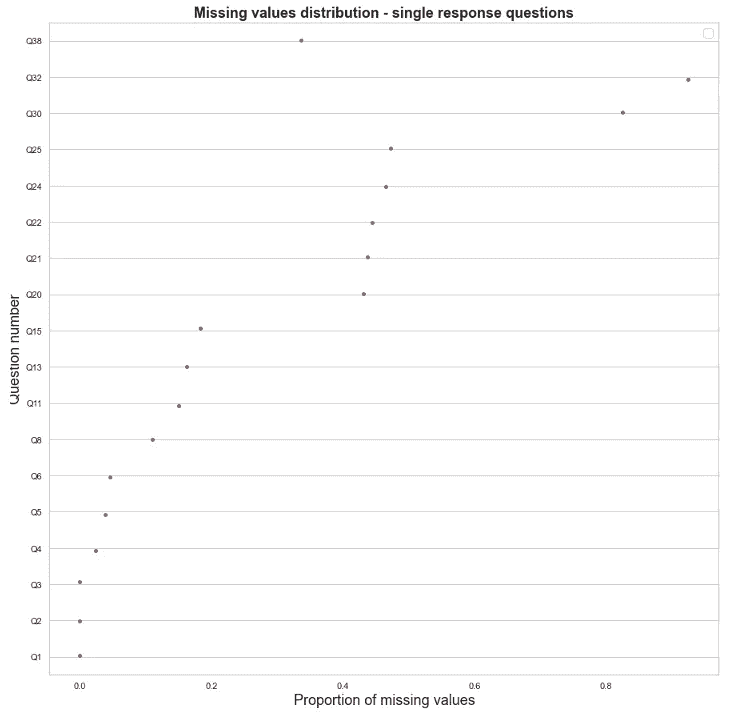

# 如何分析多重响应调查中的 NAs

> 原文：<https://medium.com/codex/how-to-analyse-multiple-response-surveys-7dde4c6feb9d?source=collection_archive---------10----------------------->

## 休伊·费恩·泰，格雷格·佩奇

卢克·切瑟在 [Unsplash](https://unsplash.com?utm_source=medium&utm_medium=referral) 上的照片

最有可能的情况是，您遇到了要求您*【选择所有适用项】*来回答某个特定提示的问卷。这些多重回答问题有其缺点，但它们是将几个可能的答案浓缩到一个问题中的有效方法。

分析调查问题的一个重要部分涉及计算无答复率。当某个特定问题的无回复率达到峰值时，这可能表明受访者不想回答这个问题(可能是一个太私人的问题)，一个不清楚的问题需要重新措辞，或者可能是一个调查太长。

当调查回答数据存储在 CSV 中时，多项回答问题的每个部分通常都有自己的列，从以有助于快速分析的格式组织数据的角度来看，这是有意义的。

假设我们对问题 7 ( *)的回答感兴趣，“你经常使用什么编程语言？”(选择所有适用的选项))*。

上图:作者本人图像

该问题所有部分的完整答案以表格形式显示在下面的屏幕截图中:

上图:作者本人图像

但是，确定多个回答问题的缺失值的真实程度并不像计算空值的平均数量那样简单。下面的代码演示了这样一个过程，它会为多项回答问题显示一个误导性的高数字。

上图:作者本人图像

如下图 1 所示，提供了每个问题缺失值平均值的图形表示。

**图表 1**

此图表不区分单项回答和多项回答问题；取而代之的是，它把所有的问题放在一起，每当问题的任何部分没有得到回答时，就把回答者的答案记录为 NaN，然后给出每个问题的 NaN 的平均值。

图表 1 会误导我们认为问题 7 的无回答率大于 80%，而实际上大约是 10.62%。(基于完全没有回答任何选项的受访者的百分比)

上图:作者本人图像

获取回复率模式的更好方法是将单个回复问题与多个回复问题分开。

**图表 2**

上图:作者本人图像

从图表 2 可以看出，大多数人没有忽视问题 7。事实上，15531 人说 Python 是他们最常用的编程语言，这一回答代表了所有受访者的 77%。但是因为没有多少人继续选择其他选项，比如 Bash、C++和 Javascript，这增加了这个问题的平均不回答率。

关于问卷中缺失的值，图表 2 还告诉了我们什么？让我们和图 3 一起检查一下，图 3 显示了人们对诸如*、“你多大了”、“你编程/写代码有多少年了？”*

**图表三:**

上图:作者本人图像

我们看到，在第 25 个问题左右，回答数量下降到 50%。下降趋势一直持续到最后回升(问题 38 和 39)。

从这些结果中我们可以推断出什么？

通过让人们从包括“无”在内的一系列选项中进行选择，调查设计者减少了社会期望偏差的可能性，这种偏差发生在人们根据社会规范以使自己看起来不错的方式回答问题时。

要求回答者*“选择所有适用项”*的问题也缩短了完成调查所需的时间，因为所有选项都在一个页面上的一个问题中。相比之下，尽管受访者可能会被迫对每个单项问题进行更深入的思考，但他们可能会过早退出调查，因为他们需要更多时间来完成调查。想象一下，如果我们把所有的多重回答问题分解成这样的问题，会发生什么？

**你用 Python 吗？**

是

不

**你用 SQL 吗？**

是

不

**你用 R 吗？**

是
否

就一个问题，重复这个格式 9 次以上。这项调查太乏味了，无法完成。

也就是说，对于大多数人来说，这个调查可能有点长。所有多项回答问题都包含一个“无”选项，这意味着如果问题与他们无关，受访者可以勾选该框。由于人们在很多情况下没有选择那个选项，我们可以假设他们跳过了那些问题。

与此同时，从完成所有 39 个问题的人那里可以收集到有用的见解。这些人都是热情的人，真心希望帮助调查设计者了解数据科学社区的发展。调查设计者可以考虑对这些受访者进行广泛的定性访谈，以更深入地了解行业发展。

*数据来源:* [*Kaggle*](https://www.kaggle.com/c/kaggle-survey-2020)