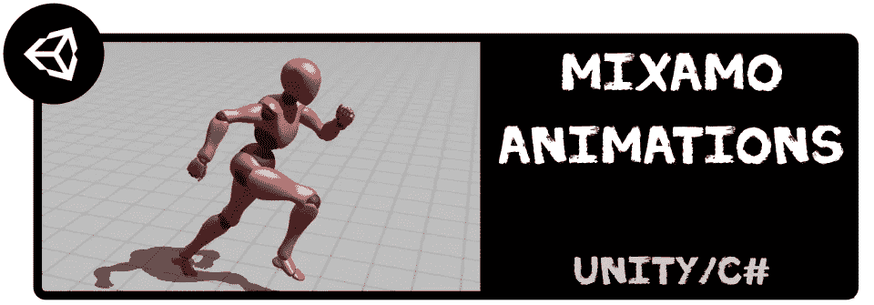

# 如何用 Mixamo 和 Unity/C#制作一个简单播放器的动画并移动它

> 原文：<https://medium.com/codex/how-to-animate-and-move-a-simple-player-with-mixamo-and-unity-c-721470b54551?source=collection_archive---------3----------------------->

## 让我们看看如何使用 Adobe Mixamo 和 Unity 的动画师的免费资源来制作一个基本玩家角色的动画！

🚀 [*在 Github 上找到我所有的 Unity 教程！*](https://github.com/users/MinaPecheux/projects/1)

*本教程有视频和文本两种格式——见下文🙂*