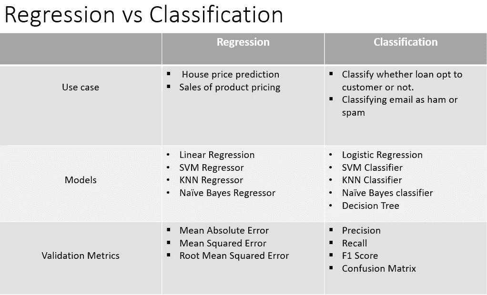
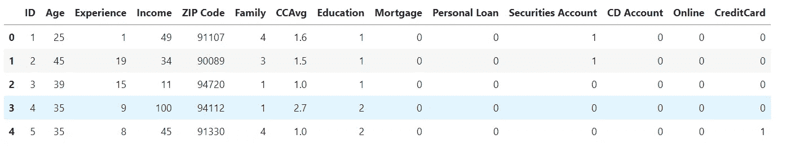
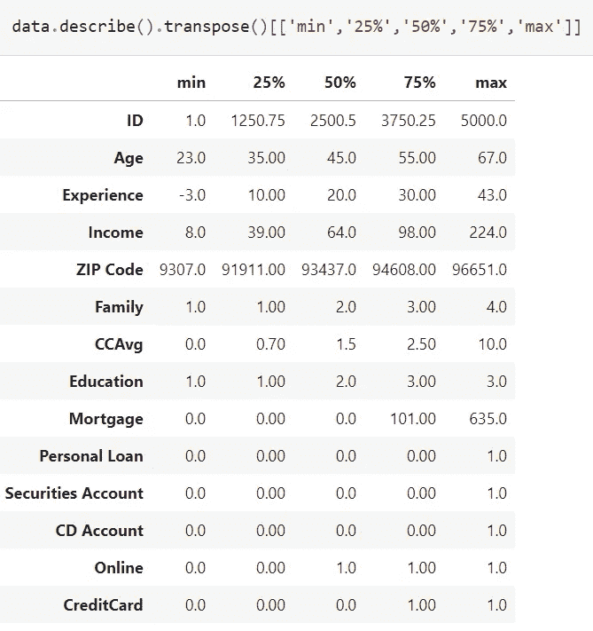
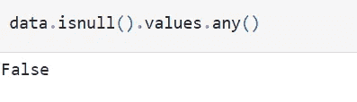
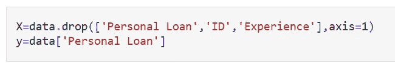
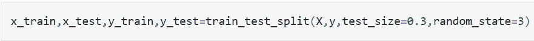
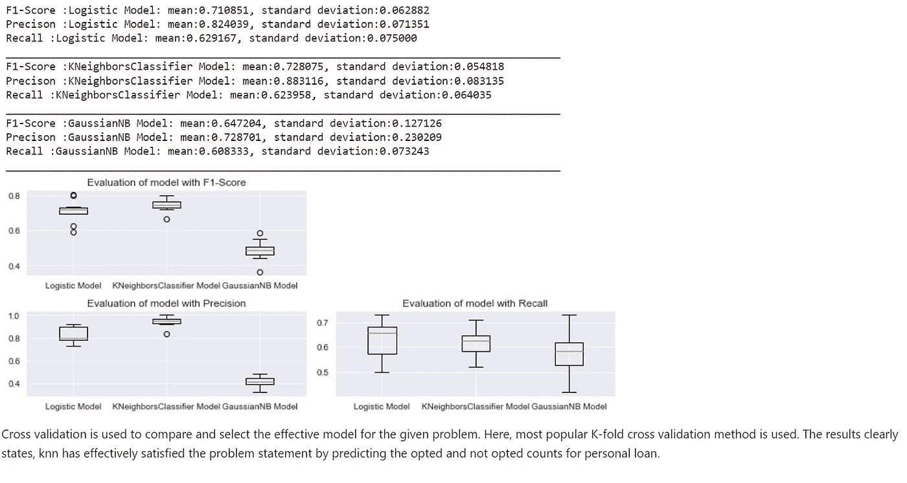

# 如何处理有监督的机器学习问题？

> 原文：<https://medium.com/codex/how-to-approach-supervised-machine-learning-problems-9c36fb724ee3?source=collection_archive---------15----------------------->

机器学习(ML)是人工智能的子集。它使计算机能够从真实世界的数据中学习，而无需显式编程。为此，ML 提供了统计工具来探索和建立数学模型。它有三种类型，即监督学习、无监督学习和强化学习。在本文中，让我们关注监督学习。

监督学习是一种使用包含输入和期望输出的数据建立数学模型的方法。在这里，我们训练模型以找到输入和输出特征之间的潜在模式或关系。监督学习有回归和分类两种类型，回归处理连续目标变量问题，分类处理二元目标变量问题。

**监督学习的例子:**

*   确定一个人是否患有癌症——分类

数据将包括有和没有癌症检测的人的信息(输入)，并且对于每个记录，我们将有一个标签(输出)指示该人是否检测到癌症。

*   预测产品的销售—回归

数据将包括产品过去的销售信息(输入)，对于每条记录，我们将有一个销售价格(输出)，基于这些历史信息，我们需要建立一个模型来预测未来的销售价格。

# **逐步解决监督学习问题的方法**

这里，我选择**银行贷款选择与否**用例来说明 python 的步骤:

1.  我们从 Numpy，Pandas，Seaborn，Matplotlib，Sklearn 导入必要的库。Numpy 有助于解决数学运算，Pandas 有助于读取数据集和处理数据集相关运算，Matplotlib 和 Seaborn 在可视化方面提供了广泛的支持，Sklearn(也称为 scikit-learn)是用于预测数据分析的高效工具。

2.在熊猫图书馆的帮助下读取数据(从 json、csv、excel 等)

3.使用 head() & tail()函数探索数据集中的要素。

这里的关键注意事项是确定问题是回归还是分类类型。

> ***如何识别问题是回归型还是分类型？***
> 
> *检查目标变量，是否有连续变量或二进制(即 0 或 1)。如果是连续的，那么问题在回归方面，如果是二元的，问题在分类方面。如上面的差异表所示，这两种类型的型号各不相同。*

在银行选择与否数据集中，目标标签是二进制。所以，这是在分类方面。

4.尝试从给定特征中识别目标标签(输出)。下面的代码片段包含数据集的所有特征(银行贷款选择与否数据集)。这里我们的目标标签是**个人贷款**。

5.使用 shape 函数探索数据集的形状，使用 describe()探索统计信息。

6.检查数据集是否有空值。如果是，用 fillna(均值、中值、众数)处理，或者用 dropna()。

7.检查每列中是否有任何特性具有杂项值，当特性具有负值时，使用 abs()。

8.使用 Matplotlib 和 seaborn 库的可视化技术获得更好的数据洞察力(参考下面给出的 GitHub 链接获取示例)。

9.使用 corr()检查输入要素和目标之间的相关性。您也可以与热图保持一致。

10.特征选择是建模的关键步骤之一。请记住，任何唯一的 ID 或名称都不会给模型提供任何信息。从 corr()和唯一 ID 得到的最不相关的特征被排除。

x 具有独立特征(输入)，y 具有非独立特征(输出)。对于独立变量，列“ID”(因为唯一的数字)、非独立变量(“个人贷款”)和经验特征被排除。经验随着年龄的增长而增加，这是直觉上可以理解的。相关特征降低了学习性能并导致模型不稳定。

11.现在，将数据分成 70:30 的比例进行训练和测试。

12.分割后，将分割的训练数据拟合到最准确的分类侧模型，如逻辑回归、高斯朴素贝叶斯和 KNN 分类器。(参考下面给出的 GitHub 链接了解模型构建代码)。

13.使用交叉验证技术中的相应分类指标(如 F1 得分、精确度、召回率和混淆率)来验证模型。如果结果不符合预期，则使用网格搜索的超参数调整来调整模型。下面是银行选择与否用例的结果

# 资源

GitHub 链接:**[**https://GitHub . com/keerthidurairaj 97/Identifying-potential-customers-for-loans**](https://github.com/keerthidurairaj97/Identifying-potential-customers-for-loans)**

1.  **[https://numpy.org/](https://numpy.org/)**
2.  **[https://pandas.pydata.org/](https://pandas.pydata.org/)**
3.  **[https://pandas . pydata . org/pandas-docs/version/0 . 13 . 1/visualization . html](https://pandas.pydata.org/pandas-docs/version/0.13.1/visualization.html)**
4.  **[https://scikit-learn.org/stable/](https://scikit-learn.org/stable/)**
5.  **[https://seaborn.pydata.org/](https://seaborn.pydata.org/)**

**我希望听到一些反馈。感谢您的宝贵时间！**