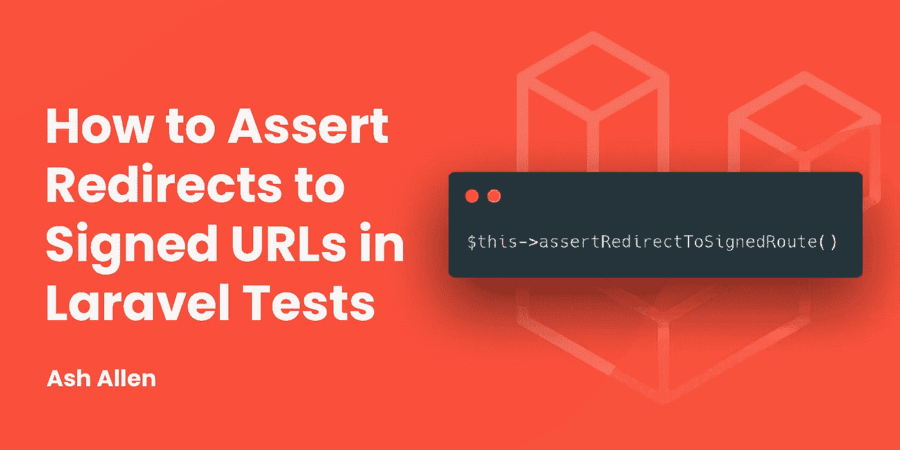

# 如何在 Laravel 测试中断言重定向到已签名的 URL

> 原文：<https://medium.com/codex/how-to-assert-redirects-to-signed-urls-in-laravel-tests-952e0026ffd9?source=collection_archive---------19----------------------->



# 介绍

我最近做了一个[拉请求](https://github.com/laravel/framework/pull/38349)，合并到 Laravel 框架中，并在 [v8.55](https://github.com/laravel/framework/releases/tag/v8.55.0) 中发布。它添加了一个新的`assertRedirectToSignedRoute()`方法，您可以在测试中使用它。

我已经在我的几个项目中使用这种方法很长时间了，通过使用宏来添加它，但是我决定向框架发出一个 pull 请求，试图帮助其他可能也使用它的开发人员。

顺便说一下，如果你对学习宏感兴趣，可以看看我的[如何使用 Laravel Macros](https://ashallendesign.co.uk/blog/how-to-swap-items-in-an-array-using-laravel-macros) 交换数组中的项目的文章。

# 什么是签约路线？

在我们开始测试已签名的 URL 之前，让我们快速地看一下它们是什么以及它们可以用来做什么。

签名的 URL 只是应用程序中的命名路由的 URL，它在查询字符串中包含签名。

以下是一个签名 URL 的示例:

[***https://my-website.co.uk/protected?signature = 41 cacd 19 b 33 b 5d 29d 46876762 e6b 0091 e 236 A8 C2 ab 59 a 656 df 88 a 31 b 500471 e 1***](https://my-website.co.uk/protected?signature=41cacd19b33b5d29d46876762e6b0091e236a8c2ab59a656df88a31b500471e1)

如您所见，URL 包含一个`signature`参数。

现在，如果我们尝试走这条路，我们可以使用`signed`中间件来验证 URL 自创建以来没有被篡改过。当我们想要创建一个应该可以公开访问但需要一点保护的路由时，这非常有用。如果 URL 以任何方式改变，当有人导航到它时，他们将收到 403 错误响应。

您可以使用如下代码生成签名的 URL:

```
use Illuminate\Support\Facades\URL;

return URL::signedRoute('protected-route', ['user' => 1]);
```

如果你订阅了我的时事通讯并且有鹰眼，你可能已经注意到我在“确认订阅”邮件中使用了签名路线。签名的路由如下所示:

[***https://ashallendesign.co.uk/subscribe/confirm?email = example % 40 example . com&signature = f 6 def 8 b 181 B2 ff 43629994 BDA 724 f 6 ada 19 b 3677 bbaf 09 BC 656 ecde 7 ba 1144 C3***](https://ashallendesign.co.uk/subscribe/confirm?email=example%40example.com&signature=f6def8b181b2ff43629994bda724f6ada19b3677bbaf09bc656ecde7ba1144c3)

当有人走这条路线时，就证实了他想订阅时事通讯。通过签署这个网址，我可以有信心，它没有被篡改，有人不会试图淹没我的通讯，并签署了许多随机的电子邮件地址。

# 什么是临时签名的 URL？

上面讨论的签名 URL 没有截止日期，通常应该可以无限期访问。但是，有时您可能希望创建一个可以在特定时间内访问的签名 URL。它们的工作方式与一般的签名 URL 相同，但是它们在查询字符串中也有一个到期时间。

以下是一个临时签名 URL 的示例:

[***https://my-website.co.uk/protected?expires=1628978674&signature = EC 582 ea 358 f 0d 357 edd 91 FD 456 a 01 b 0 e 0 a 3 BC 62 FB 460 a 2853 a 82 c 921 CD 6 f 54***](https://my-website.co.uk/protected?expires=1628978674&signature=ec582ea358f0d357edd91fd456a01b0e0b0a3bc62fb460a2853a82c921cd6f54)

如您所见，URL 包含了`signature`和`expires`参数。

与一般的签名 URL 类似，如果 URL 被篡改或有人试图在过期时间后导航到它，将返回 403 错误响应。

# 测试重定向到已签名的路由

既然我们已经简要介绍了 Laravel 中的签名路由，我们可以看看如何编写一个测试来断言控制器重定向到一个签名的 URL。请注意，下面的测试将是非常基础的，我们将只测试重定向；但是，希望它们有助于解释整体概念。

让我们想象一下，我们有下面这个具有`/my-route`路线的一次性控制器:

```
class RandomController extends Controller
{
    public function __invoke(): RedirectResponse
    {
        // Do something...

        return redirect()->signedRoute(
            'example.route', ['param' => 'hello']
        );
    }
}
```

如果我们想测试控制器是否返回了一个指向已签名路由的重定向，但并不特别关心 URL 是什么，我们可以编写如下测试:

```
/** @test */
public function user_is_redirected_to_signed_route(): void
{
    $this->get('/my-route')
        ->assertRedirectToSignedRoute();
}
```

或者，如果我们想更严格地检查重定向是否指向特定的路由，我们可以编写下面的测试:

```
/** @test */
public function user_is_redirected_to_signed_route(): void
{
    $this->get('/my-route')
        ->assertRedirectToSignedRoute(
            route('example.route', ['param' => 'hello']
        )
    );
}
```

`assertRedirectToSignedRoute()`方法也适用于临时签署的路由。所以，如果我们的控制器返回了`redirect()->temporarySignedRoute()`而不是`redirect()->signedRoute()`，上面的测试仍然可以工作。

# 结论

虽然这篇文章比通常的要短一些，但希望它能让你对 Laravel 中的签名 URL 有一个简单的了解，以及如何编写测试，让你的控制器正确地重定向到它们。

如果这篇文章对你有所帮助，我很乐意听听。同样，如果你对这篇文章有任何改进的反馈，我也很乐意听到。

如果你有兴趣在我每次发布新帖子时得到更新，请随意注册我的简讯。

继续建造令人敬畏的东西！🚀

*最初发表于*[T5【https://ashallendesign.co.uk】](https://ashallendesign.co.uk/blog/how-to-assert-redirects-to-signed-urls-in-laravel-tests)*。*