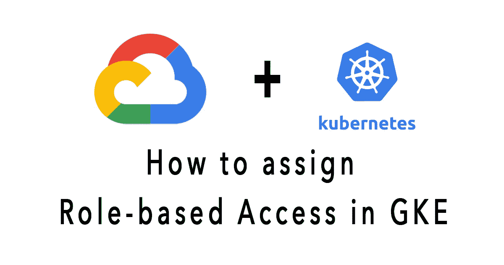

# 如何在 GCP Kubernetes 引擎中分配基于角色的访问权限

> 原文：<https://medium.com/codex/how-to-assign-role-based-access-in-gcp-kubernetes-engine-1f54938531bf?source=collection_archive---------2----------------------->

## [法典](http://medium.com/codex)

虽然[基于角色的访问控制(RBAC)](https://kubernetes.io/docs/reference/access-authn-authz/rbac/) 资源定义是所有 Kubernetes 平台的标准，但在构建任何云提供商时，都需要了解它们与底层认证和授权提供商的交互。

RBAC 是一个强大的安全机制，提供了很大的灵活性，你如何限制…