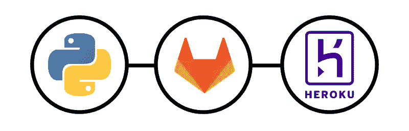

# 如何使用 Heroku 自动部署 Flask Python 应用程序

> 原文：<https://medium.com/codex/how-to-auto-deploy-a-flask-python-app-with-heroku-8a2cab2fc78c?source=collection_archive---------3----------------------->

## 让我们看看如何为 Flask 应用程序设置 Gitlab CI/CD 流程！

最近，我不得不准备一个关于 **CI/CD、自动化**和所有那些 DevOps 核心概念的小演示，这些概念帮助你为项目建立**一个安全和健壮的工作流程。所以我决定**创建一些示例项目**来展示 CI/CD 的一些特性，比如自动部署或者…**