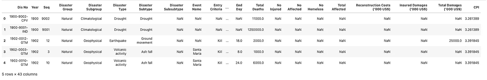
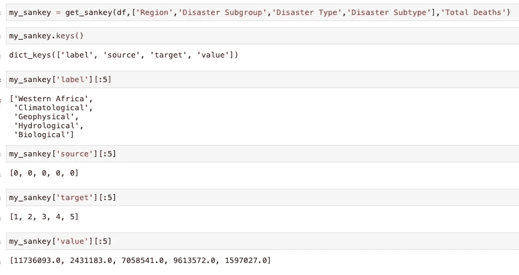
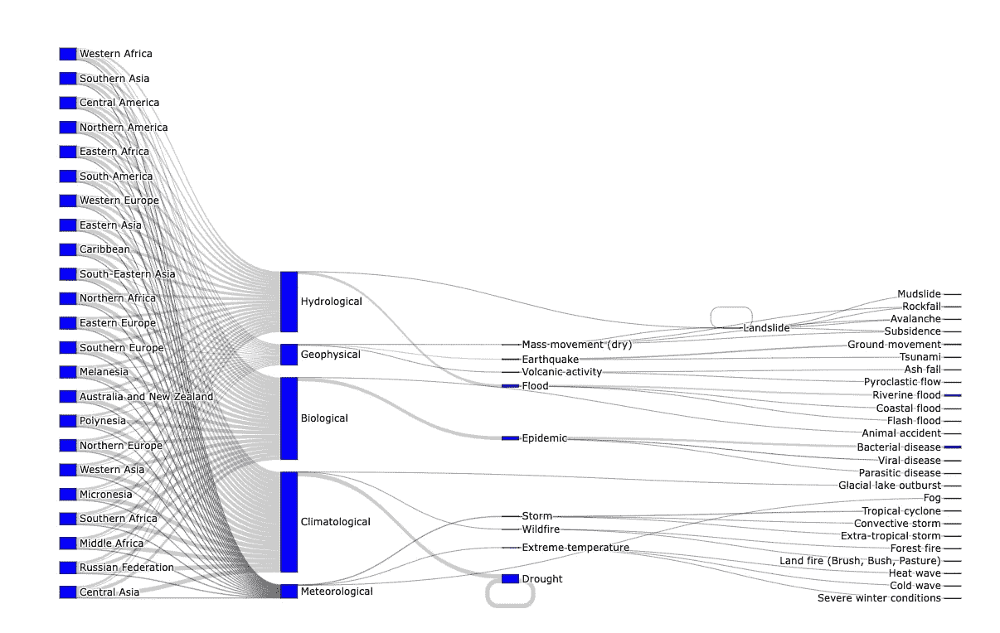

# 如何自动生成桑基图的数据结构

> 原文：<https://medium.com/codex/how-to-automatically-generate-data-structure-for-sankey-diagrams-6082e332139f?source=collection_archive---------1----------------------->

## 通过使用 Python，熊猫，Plotly

大家好。我是来自土耳其的贝桑。在我决定写这个故事之前，我一直在写关于姜戈的文章。您可以从下面获得该系列:

[](https://github.com/mebaysan/DjangoAdminForMedium/blob/main/README.md) [## djangodadminformedium/readme . MD 位于 main mebaysan/djangodadminformedium

### 我开始准备这个 repo 来解释我们如何在 Django 中定制管理应用程序。本次回购依赖于一个媒介…

github.com](https://github.com/mebaysan/DjangoAdminForMedium/blob/main/README.md) 

在这个故事中，我们将尝试介绍如何自动生成用于 Sankey 图的数据结构。为此，我们将编写一个函数来从任何数据帧生成数据结构，并使用 Plotly 来创建一个图。当然，也将使用熊猫来处理数据。


由[瓦尔德马·布兰德](https://unsplash.com/@waldemarbrandt67w?utm_source=unsplash&utm_medium=referral&utm_content=creditCopyText)在 [Unsplash](https://unsplash.com/s/photos/sankey-diagram?utm_source=unsplash&utm_medium=referral&utm_content=creditCopyText) 拍摄的照片

我们将使用来自 Kaggle 的`Natural Disasters 1900–2021`数据集。您可以使用以下链接下载数据集:

[](https://www.kaggle.com/jnegrini/emdat19002021) [## 自然灾害 1900-2021 年

### 通过 EM-DAT 数据库列出世界范围的自然灾害

www.kaggle.com](https://www.kaggle.com/jnegrini/emdat19002021) 

在我们开始之前，稍微解释一下桑基图是什么会比较好。我很满意地说，我们可以通过使用桑基图来可视化流程。如果您想了解更多详情，可以访问以下链接:

*   [数据可视化目录](https://datavizcatalogue.com/methods/sankey_diagram.html)
*   [Python 图库](https://www.python-graph-gallery.com/sankey-diagram/)
*   [Python 中的桑基图(Plotly 文档)](https://plotly.com/python/sankey-diagram/)

开始编码吧。

# 检查数据集

在我们深入这个故事之前，我应该分享这个信息:我们将使用以下包:

```
import pandas as pd
import plotly.graph_objects as go
```

我在本地下载了数据集。所以，我用熊猫就能轻松读懂。该数据集是关于 1900 年至 2021 年间的自然灾害。我们将使用这个数据集的一些列。

```
df = pd.read_csv('EMDAT_1900-2021_NatDis.csv')df.head()
```



作者图片

现在我们可以编写函数来帮助我们创建数据结构。

# 创建助手功能

如果你浏览了 Plotly 关于 sankey 图的官方文档，你可能会发现我们需要创建节点来表示其他节点。为此，我们将在几分钟后创建的数据结构应该包含这些列(特性、变量)。

```
['label', 'source', 'target', 'value']
```

我用字典数据类型做了这个梦。我觉得函数的工作逻辑很简单。该函数采用一个数据帧，以链的形式从给定的目标列中提取节点。例如:

```
get_sankey(df,['Region','Disaster Subgroup','Disaster Type','Disaster Subtype'],'Total Deaths')
```

该函数通过使用作为第二个参数给出的第二个列表从第一个参数中提取节点。然后指出`Total Deaths`值作为节点的值。

下面我们可以看到数据结构中每个键的前 5 项。



作者图片

返回的字典(我们在上面提到的将要创建的数据结构)的键表示以下内容:

*   `label`指节点
*   `source`指父节点。比如哪个节点是我的父节点。假设我们用这个键来连接。
*   `target`指子(目标)节点。例如，哪些节点是我的子节点。假设我们用这个键来连接。
*   `value`指节点上所表示的值。这里，使用了提供给函数的第三个参数。

我能听到你的问题；“伙计，一切都很好，但是做这些事情的主要功能在哪里”🤓

## 该功能

此外，你可以从我的 Gists 获得代码。这里我们可以看到我试图用最简单的方法。我们只需要在函数的第二个参数中给出“sankey path”。然后，它将能够生成数据结构。

## 做真实的例子

我想在结束之前，我们应该用上面提到的数据集做一个真实的例子。

我将使用数据集创建数据结构。

```
my_sankey = get_sankey(df,['Region','Disaster Subgroup','Disaster Type','Disaster Subtype'],'Total Deaths')
```

现在，我需要使用 Plotly 的`graph_objects`创建一个 sankey 图。我们将使用`label`键在`go.Sankey`的`node`属性中创建节点。然后，我们将使用我们已经提到过的键(`source`，`target`)，因为它们有助于在`go.Sankey`的`link`属性中链接我们的节点。

```
fig = go.Figure(data=[go.Sankey(
node = dict(
  pad = 15,
  thickness = 20,
  line = dict(color = "black", width = 0.5),
  label = my_sankey['label'],
  color = "blue"
),link = dict(
  source = my_sankey['source'],
  target = my_sankey['target'],
  value = my_sankey['value']
))
])fig.update_layout(height=1500,margin={'t':0,'b':0})
```

我们成功地创建了一个桑基图。通过使用我们的 helper 函数，您可以使用更多功能来创建 sankey 图。



作者图片

# 最后

希望你喜欢读它。我本人喜欢写作和编码。我离开是为了在数据结构上添加一个颜色属性，作为对您的挑战。大概，争取差不多 15 分钟，就能解决了。

亲切的问候。