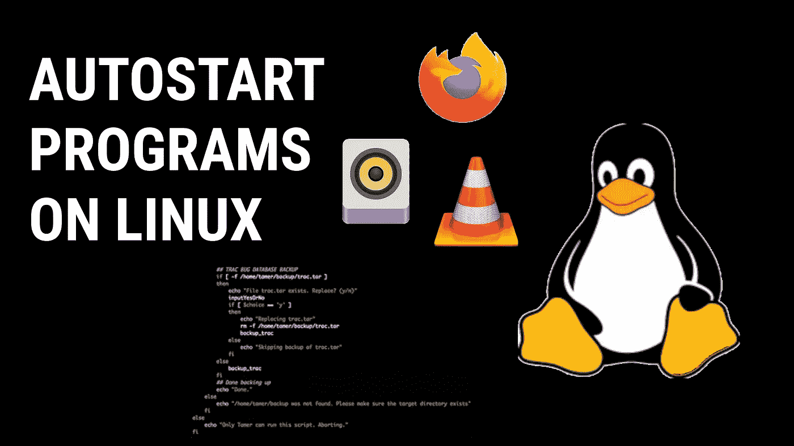
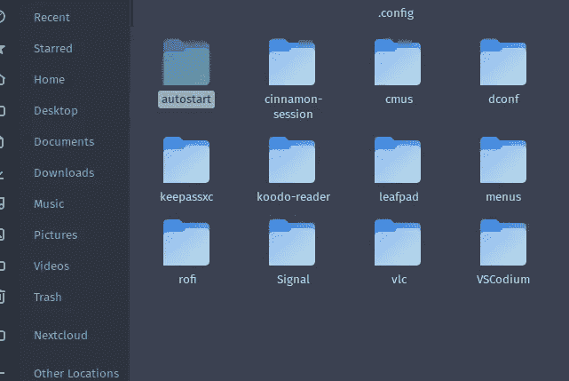
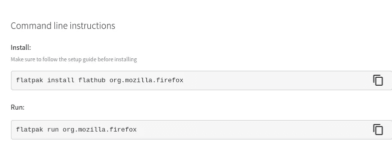
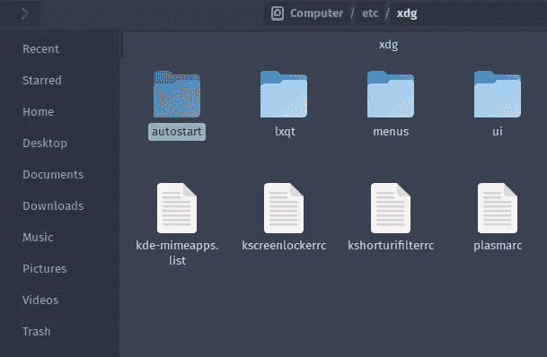

# 如何在 Linux 上自动启动脚本和程序？

> 原文：<https://medium.com/codex/how-to-autostart-scripts-programs-on-linux-568567a240c8?source=collection_archive---------2----------------------->

这是我发现很难找到好的教程/指南的话题之一。如果你使用的是像 KDE、Gnome 或 cinnamon 这样的桌面环境，它们都有一个自动启动应用程序，你可以用它来自动启动脚本和应用程序。

这在服务器上是不可能的，如果你使用的是窗口管理器也是如此。因此，有许多方法可以做到这一点，但我将只讨论几种。



# Spawn Vs SHCMD

在进入主题之前，有必要知道`spawn`命令和 `SHCMD`在自动启动脚本中的作用。

spawn 命令主要用在程序中，这将运行程序，例如`spawn firefox` 将运行 Firefox。

SHCMD 命令用于运行 bash 命令，通过它您可以运行其他脚本和命令。例如，这是为了运行 rofi。

```
SHCMD("rofi -combi-modi window,drun,ssh   -show combi -icon-theme  -show-icons")
```

# 。配置/自动启动

您的主目录中有一个文件夹，允许您在启动时运行应用程序。



```
path to the folder: /home/$USER/.config/autostart
```

在这里您可以添加您的”。桌面”文件，以便在启动时自动启动它们。你可以找到你的。`/usr/share/applications` 文件夹中的桌面文件。该方法是用户特定的，这意味着可以针对不同的用户进行不同的配置。

# 在窗口管理器上自动启动

你的窗口管理器会有一个自动启动配置文件。这对于不同的窗口管理器是不同的。转到您的自动启动脚本，并添加您希望在启动时启动的程序名称。例如，要在启动时启动 Firefox，在文件中添加`spawn firefox`命令。

**用于自动启动平板包:**用于自动启动平板包，进入[flathub.org](https://flathub.org)，搜索您的应用，点击应用图标。然后向下滚动并为您的 Flatpak 复制 run 命令，然后您可以在您的 autostart 脚本中使用它。



```
flatpak run org.mozilla.firefox
```

# 为系统中的所有用户自动启动程序

如果您需要启动程序，这将为系统中的所有用户自动启动，然后您需要添加。桌面文件在:-



```
/etc/xdg/autostart
```

> 如果你喜欢这个博客，请别忘了鼓掌。如果你想了解更多关于隐私、安全、技术和 Linux 的知识，可以考虑关注我。另外，任何我觉得有趣和有价值的东西。