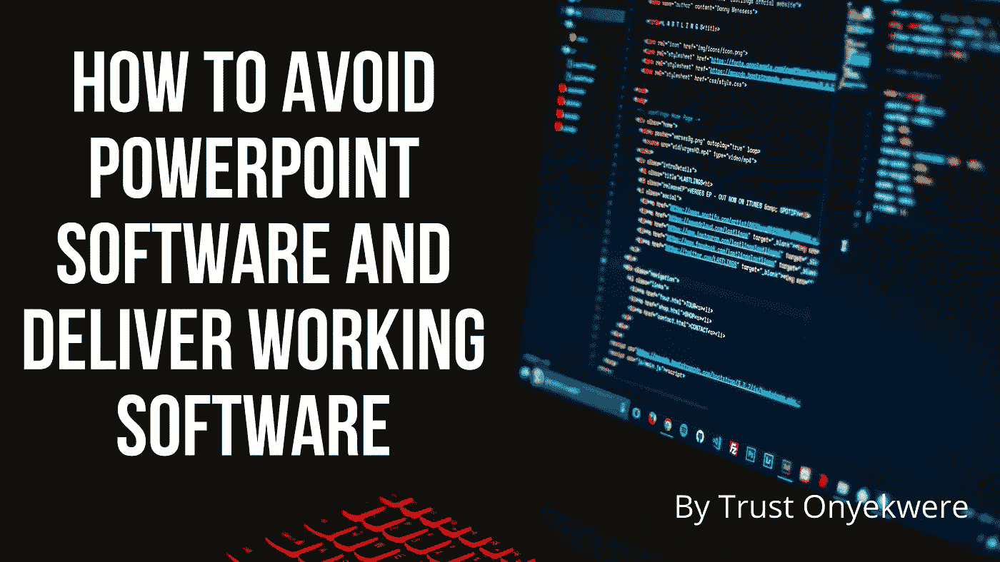
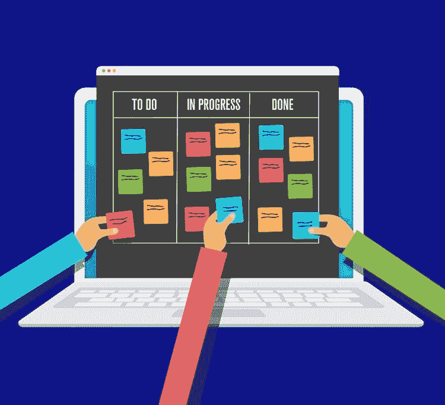

# 如何构建和交付工作软件

> 原文：<https://medium.com/codex/how-to-avoid-powerpoint-software-and-deliver-working-software-d3176a32d4bd?source=collection_archive---------9----------------------->

# 交付工作软件:从最高价值开始

为了构建工作软件，我们需要理解敏捷软件开发。

敏捷宣言中的第一条原则是，我们的最高优先级是通过早期和持续交付有价值的软件来满足客户。在考虑这一理论时，优先级和值这两个术语至关重要。

那么，优先考虑高价值软件意味着什么？令人惊讶的是，这个问题的答案之一可以追溯到十九世纪一位名叫维尔弗雷多·帕累托的意大利经济学家。当他在温室里收获豌豆时，他发现 20%的豌豆荚产出了 80%的豌豆。

他是一名经济学家，所以他将这个比率与罗马的财富分配进行了比较。他发现 20%的人口拥有这个城市 80%的土地。因此，这个 80/20 的比例现在被称为帕累托法则或 80/20 定律。80%的效果来自 20%的原因。

快进到 20 世纪 90 年代，一家名为 Standish Group 的咨询公司发布了一份报告，称大多数软件项目都失败了。这是因为他们花了太多时间来构建没人会使用的软件功能。

这样想:如果你使用一个像微软 Word 这样的程序，你可能只使用了它的一小部分功能。您可能使用过拼写检查、打印或复制粘贴，但可能从未使用过邮件合并或数百种语言包中的任何一种。大多数软件产品都是如此。

事实上，根据这项研究，一个软件产品中有 45%的功能绝大多数客户从未使用过。19%很少使用，而 16%偶尔使用。最后 13%经常用，7%一直用。仔细看就能看出帕累托法则。只有 20%的产品功能是经常使用或经常使用的。

所以如果你在一个敏捷团队中工作，这 20%是软件中最有价值的部分，所以你会想从这里开始。这将是在第一个 sprint 中交付的最高优先级的一部分。

这看起来没什么大不了的，但是它不同于大多数软件开发团队的工作方式。如果你在设计一个带有联系方式的简单网站，考虑一下你的选择。通常，项目经理会将此分为两个里程碑。第一个里程碑将是建立一个具有所有表单字段的网站，第二个可能是将某些表单字段输入到数据库中。

现在，想象你和一个敏捷团队一起在网站上工作。您要做的第一件事是询问客户哪个表单字段最有价值？他们可能会说这是客户的名字和电子邮件地址。

因此，您可以创建一个简单的网站，只获取客户的名字和电子邮件地址，而不是完成所有表单字段的里程碑。开发团队将致力于最有价值和最高优先级的特性，然后向下移动到较低优先级的特性，直到整个产品完成。

# 使用任务板来区分优先级

现在你知道了对敏捷团队来说，区分高价值活动的优先级有多重要。他们必须首先关注消费者经常使用的功能。一旦这些功能完成，他们就可以转移到不太重要或优先级较低的工作上。

任务板的设计是这些敏捷团队帮助他们可视化工作的一种方式。如下图所示，任务板是一个基本的泳道图。它被称为泳道图，因为它类似于游泳池的立柱。

照片由[平面图](https://www.planview.com/resources/articles/what-is-task-board/)拍摄

现在这些列或泳道中的每一个都保存了一小批作品。通常，这些被称为任务。任务所在的列显示该任务的状态。最简单的任务板只有三列。*待办事项，进行中或正在做，已完成*。如果您的团队有精益思想的背景，那么他们可以将这些列称为工作队列。

现在，一个典型的敏捷团队会以用户故事的形式撰写客户价值的广泛陈述。然后，团队将在任务板上创建一个用户故事栏。这些用户故事将按照从上到下的顺序排列，就像任务一样。

然后，在待办事项栏中，完成这类用户故事的工作会聚集在它的旁边。重要的是要记住，许多敏捷团队误用了任务板。他们会简单地开始做他们觉得最舒服的任务，然后把它传递给大家。这就是为什么对于团队来说，通常最好从一个有卡片和贴纸的真正的板开始。

现在请记住，任务板不仅仅是展示您正在做什么的一种方式，相反，它是验证团队正在从事最高价值功能的一个关键部分。

# 避免 PowerPoint 软件

交付高价值工作软件的概念是许多敏捷团队被绊倒的一个方面。注意，根据宣言的原则七，工作软件是成功的主要指标。但是工作软件怎么可能每隔几周就发布一次呢？要做到这一点，您需要在迭代或冲刺中向客户交付小的、功能完整的产品特性。

让我们考虑创建一个基本的网站。我们只需要一个 web 表单，收集并在数据库中存储客户的联系方式。这是一个完整的项目，如果你仔细想想，还会有一些潜在的里程碑。您必须首先为第一个里程碑构建数据库。

然后需要开发将表单链接到数据库的软件。然后，您可能需要开发将表单连接到数据库的软件。最后，您必须创建一个捕捉信息的表单。您可能还需要额外的代码来确保表单中有正确的数据。

所以，如果你认为网站是一个项目，你会期望它有很多里程碑。然而，敏捷团队并不认为软件是一个项目；相反，它认为这是一种在短时间内交付给消费者的具有优先价值的产品。因此，你不会试图一次解决所有问题。所以你没有试图一次解决所有问题。

记住，我们不能一心多用。相反，你要专注于提供高价值的功能。因此，您可能有一个简单的网页，只记录客户的名字和电子邮件地址。要记住的关键是，这种形式将是完全工作的软件。

这意味着，如果您输入了您的名字和电子邮件地址，这个简单的网站将验证它们是否正确，将您的姓名和地址保存到数据库中，并定期备份数据。虽然很少有消费者会认为这是一个功能齐全的产品，但这是可能的。因此，当在敏捷团队中工作时，您只能向客户展示正在工作的软件。

一些团队犯了向客户展示 PowerPoint 演示或线框的错误。然而，这些都是故事；它们不是客户可以使用的实际软件。客户应该能够将软件投入生产，并在每个 sprint 结束时结束开发。他们不应该等待部署、测试或其他方式来完成产品。团队应该总是构建和推动工作软件。

敏捷团队这么做有很多原因。但最重要的一点是，这些团队发现工作软件是交流进展的最佳方式。它是否会阻止客户询问诸如我们何时可以发货之类的问题？每当他们看到这个软件，它就有可能被发货。

另一个原因是，它强化了敏捷团队致力于最高价值特性的承诺。这意味着最常用的功能将是最先完成的功能。

耶！您已到达这篇文章的结尾。

耶！您已到达这篇文章的结尾。

我们已经为那些想要构建工作软件并淘汰 PowerPoint 软件的软件开发人员提供了重要的观点和经验。

是时候采取行动，开始在你的下一个软件项目中应用学到的经验了。