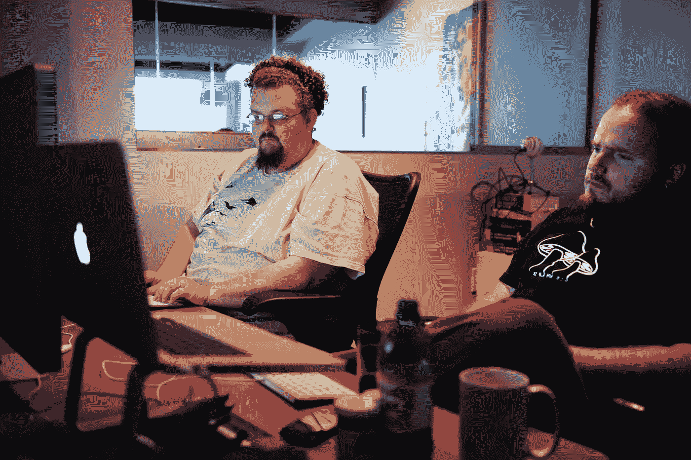

# 如何成为一名有用的软件工程师

> 原文：<https://medium.com/codex/how-to-be-a-helpful-software-engineer-848cc62e87e8?source=collection_archive---------7----------------------->

机智、耐心，不要把同事的笔记本电脑扔出窗外。

奥比·费尔南德斯在 [Unsplash](https://unsplash.com/s/photos/programmer?utm_source=unsplash&utm_medium=referral&utm_content=creditCopyText) 上的照片

关于玩好软件工程大游戏的一封短信。

人们普遍认为软件工程师是一群与世隔绝、喜怒无常且无用的人。当然，这与事实相去甚远。