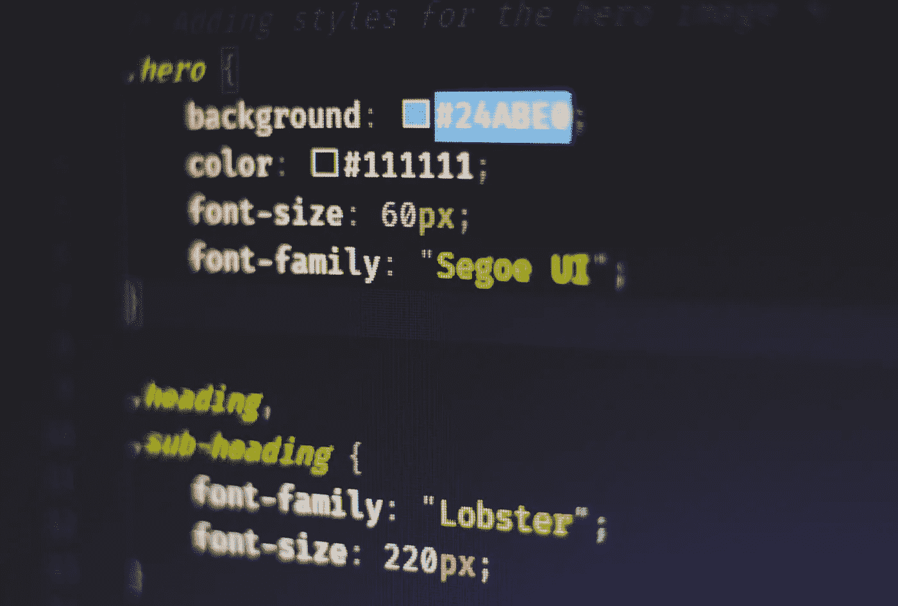

# 如何成为一名程序员|任何人的权威指南

> 原文：<https://medium.com/codex/how-to-be-a-programmer-a-definitive-guide-for-anyone-4ef3ea38575a?source=collection_archive---------6----------------------->

在我们开始研究如何成为一名计算机程序员之前，我需要确保我们对程序员的工作有一个完整的理解。简单来说，程序员就是写代码告诉计算机或其他设备做什么的人。

从某种意义上说，程序员是数字建筑师，他们致力于设计我们都认为理所当然的技术特性和功能。这是一个令人惊奇的职业，如果你曾经发现自己在思考关于互联网的小事，那么你可能想知道如何成为一名程序员。

在大多数情况下，一个**计算机程序员正在基于其他人的设计参数**构建或创造一些东西。然而，一些程序员设计他们的程序，所以如果你是一个企业家类型的人，这总是一个选择。

既然我们已经回答了这个问题，让我们继续讨论**如何学习编程并成为一名优秀的程序员**

如何成为一名程序员:一步一步的指南

*学编程很难*，我不打算撒谎。然而，当你将其与其他技能和职业道路进行比较时，成为程序员成为你最容易做出的选择之一。

*   程序员工作在一个非常令人兴奋的领域，每天都在创造新的挑战和新的知识。
*   与其他技能相比，编程非常容易学习，简单到你甚至可以把它作为一种爱好来学习。
*   随着编程的广泛应用，程序员有机会为自己工作，想工作多久就工作多久，想在家工作就在家工作。

从上面所列的，你可以看到有很多原因让你想成为一名电脑程序员。幸运的是，你可以通过六个简单的步骤做到这一点。我在这里向你展示。

**第一步:决定你对哪个行业/领域感兴趣**

在考虑如何成为一名程序员时，重要的是要明白编程是一个非常广阔的领域，知道你想从事什么领域的工作，从长远来看会对你有帮助。当试图做出这个决定时，想想你为什么想成为一名程序员——你想去哪里？你想达到什么目的？一些受欢迎的程序员类型包括:

*   **Web 开发人员:**这类程序员可以进一步分为前端(客户端)和后端(服务器端)。前端程序员编写的代码决定了网站视觉部分的外观。然而，后端程序员负责提供网站、网络应用和其他复杂程序在**上运行的框架。**
*   软件程序员:你可能已经猜到了，软件程序员负责编写软件。他们通常根据一个概念或设计来创造工作产品。
*   **移动应用开发:**目前全球智能手机用户数量为 63.78 亿，随着用户数量的持续增长，对令人兴奋的新移动应用的需求也在增长。移动应用程序开发正迅速成为最赚钱的编程领域之一。，特别是如果你是自由职业者，因为独自工作对移动程序员来说是很常见的。
*   **数据库管理员:**数据库管理员主要负责获取、保护、组织和分析大量的公司数据。如果您喜欢分析消费者数据或统计数据，那么您应该仔细研究一下数据库管理员。
*   除了上面提到的领域，学习如何编程打开了许多其他领域和机会，如果没有一个吸引你，简单的研究将帮助你发现计算机程序员的大量工作机会。

**第二步:学习一门(或两门)编程语言**

一旦你进入了编程领域，你需要学习与该领域相关的编程语言。比如你需要 CSS 和 Javascript 做前端开发者，需要 SQL 做数据库管理员，需要 Java、Kotlin 或者 Swift 之类的东西做移动应用开发者。

下面是流行的编程语言及其用法。不过，你也应该做一些研究，以确保你学习的编程语言与你的领域相关。

*   **HTML/CSS:** 虽然有无数编程语言可供有抱负的程序员使用，但你至少应该对前端结构有一个基本的了解。如果你想从事任何形式的前端开发，HTML 和 CSS 对你来说尤其重要。虽然它们是两种独立的语言，但它们几乎总是被一起使用来创建巧妙而吸引人的网页。
*   **Python:** 学习如何成为一名 Python 程序员对于任何现代代码来说都是至关重要的。Python 是世界上最广泛和最通用的编程语言之一。这种语言对于那些希望在软件开发、人工智能、机器学习、数据科学或几乎任何其他编程行业工作的人来说特别有用。
*   JavaScript: JavaScript 也是另一种用途广泛的编程语言。它用于交互式 web 应用程序、后端 web 开发、移动应用程序开发、游戏开发以及许多其他应用程序。对于一个新的有抱负的程序员来说，JavaScript 是一个非常好的学习起点。
*   **Java:** 就像 Python 和 JavaScript 一样，Java 也是一种通用的编程语言。它也相当容易学，如果你想学习如何快速成为一名程序员，你应该学习 Java。
*   **Swift:** Swift 最近由苹果公司发布，旨在使 iOS 应用开发成长为当今最受欢迎的编程语言之一。与其他编程语言相比，Swift 的学习简单明了得多。如果你对 iOS 应用程序开发感兴趣，你应该去看看 Swift。

许多其他的编程语言被用于一些其他的事情。你可以研究一下，以帮助你了解哪种编程语言最适合你和你所从事的行业。

**第三步:练习，练习，再练习。**

如果你想成为一名计算机程序员，并且是一名优秀的程序员，那么你需要不断地练习。

没错，成为一个优秀高效的程序员，关键是要一直练习。你的编程之旅，从开始到结束，都将以实践和大量实践为特征。

与他人分享你的代码，这将有助于你更好地学习，每天尝试和学习新的东西，并不断练习，直到你达到你所选择的语言的流利程度。

**第四步:建立你的投资组合**

当你学习如何编码并成为一名高效的程序员时，你必须在这个过程中建立你的作品集，这样你才能有一个像样的作品集展示给未来的雇主。

在学习如何编码并成为一名程序员时，保存所有的小代码片段，确保你把它们保存在某个地方。Github 不会错，一个网站也是个好主意。

**第五步:申请工作**

快进到未来，你已经选择了一个领域/行业，你已经成为一个相当高效的程序员，你不断地练习，你已经建立了一个展示你所有酷的和令人惊叹的工作的作品集，并希望建立一份简历。

那么在这一点上，是你开始申请工作的时候了。搜索符合你偏好的编程语言和领域/行业的入门级编程工作。

在申请工作的时候，做一名自由职业的程序员并不是一个坏主意，这将确保你不会变得生疏，并提供一个额外的收入来源。

**第六步:永远不要停止学习**

编程是一个快速变化的领域，今天学习成为一名程序员所需的技能并不一定能确保你明天仍然有用。在不断发展的编程世界中，确保自己价值的唯一方法就是每天学习。你需要不断学习新的技能和语言。