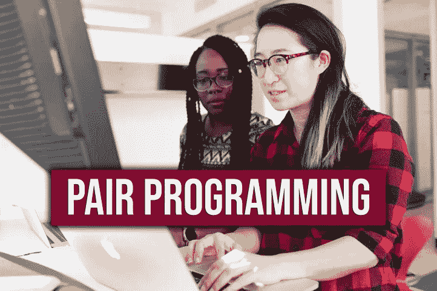

# 如何成为一个更好的开发者？结对编程是你所需要的

> 原文：<https://medium.com/codex/how-to-become-a-better-developer-pair-programming-is-what-you-need-ad0a87ca7eb7?source=collection_archive---------13----------------------->

## 这种方法让我学到了比过去两年多的东西

目前，我在一家公司做初级**后端软件工程师**。这是我在一家公司做软件工程师的第一份工作，所以有很多东西我还不知道。