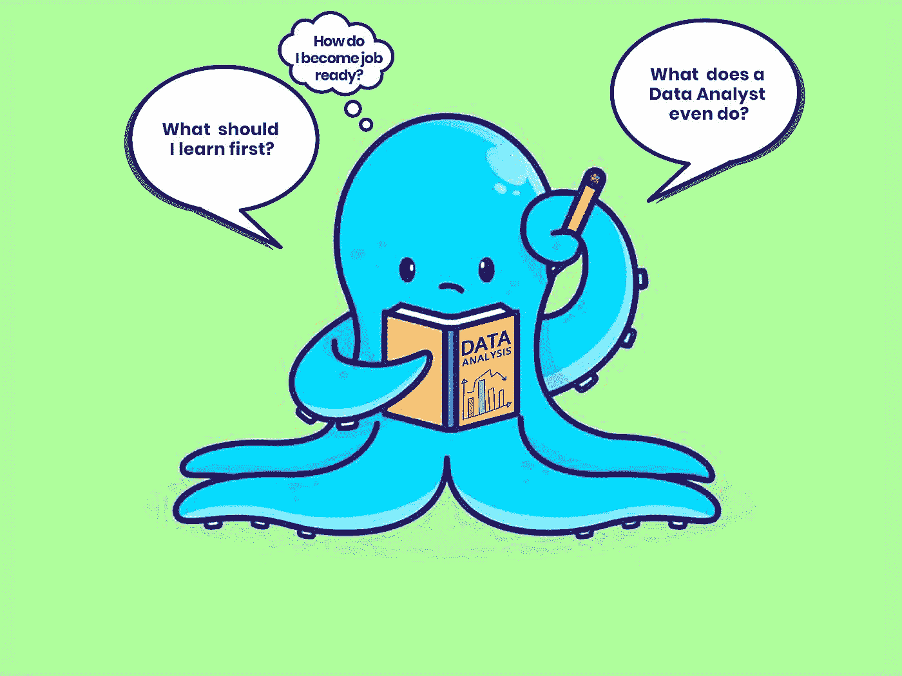

# 如何在 2023 年成为一名数据分析师——初学者指南

> 原文：<https://medium.com/codex/how-to-become-a-data-analyst-in-2022-a-beginners-guide-2580d902ef6e?source=collection_archive---------2----------------------->

枕木插图

如果你是数据分析的新手，并且发现理解底层概念或构建学习路线图很困难，那么本指南就是为你准备的。您将深入了解数据分析的工作原理以及执行该过程所需的具体步骤。您还将大致了解作为数据分析师您将做些什么，以及在该领域取得成功所需的基本技能。

# 什么是数据分析？

数据分析是对数据的收集、转换和组织，以提取有价值的信息和可行的见解，从而做出预测和有效的决策。

我们每天都在创造和使用数据。事实上，[每天都有 2.5 万亿字节的数据](https://www.google.com/amp/s/www.forbes.com/sites/bernardmarr/2018/05/21/how-much-data-do-we-create-every-day-the-mind-blowing-stats-everyone-should-read/amp/)产生。每当你在谷歌上搜索答案或在社交媒体上分享照片和情感时，你都在创造数据。当你在 Spotify 上喜欢一首歌，在亚马逊上发表评论或请求天气预报时，你也在创建数据。

Imgflip

从睡眠习惯到健康、食物摄入和消费习惯，每天都在被跟踪、测量和分享。数据为决策提供信息，这就是为什么网飞可以预测你喜欢的节目，谷歌可以在你输入第二个词之前完成你的搜索。

数据不仅仅是科技公司的专利。每个业务部门，包括金融、农业和医疗保健，都变得更加数据驱动，因为这有助于他们找到更有效的方法来提高业务绩效和盈利能力。他们都收集和分析数据，以改善他们的客户体验和运营。

对数据分析师的需求与日俱增。美国目前有 [437，078](https://www.linkedin.com/mwlite/search/jobs?keyword=Data+Analyst&geoId=103644278&locationName=United+States) 个数据分析师的职位空缺。入门级数据分析师的平均工资大约是[7.2 万美元/年](https://www.salary.com/research/salary/listing/data-analyst-salary)，外加丰厚的津贴和奖金。

据 Investopedia 称，熟练的数据分析师是世界上最受欢迎的专业人士之一，但对这些职位的需求超过了熟练专业人士。但是，通过本指南，您将了解成为一名合格的数据分析师所需的所有先决条件和技能。

# 数据分析师是做什么的？

据说“数据分析师集探险家、侦探和艺术家于一身。”作为数据分析师，您将检查数据，清理和查询数据，探索有意义的趋势，并以可视化形式传达您的发现。

你还将寻求回答相关的业务问题或挑战，如“我们如何提高客户保持率？，“或者“我们如何提高客户满意度？”

数据分析师的工作因组织而异，但没关系，您需要知道如何收集、处理、分析和可视化数据，以获得有意义的见解。

# 数据分析师的基本技能

典型的 data analyst 工具箱包括以下内容:

# 1.电子表格:

电子表格用于收集数据并将其组织成可读格式。您还可以使用它们来分析小型数据集并进行快速可视化。最流行的电子表格应用程序是 Excel 和 Google Sheets。

# 2.结构化查询语言(SQL):

SQL 用于清理、存储、检索、操作和分析数据。流行的 SQL 数据库包括 MSSQL、MySQL、PostgreSQL、OracleDB、Big query 等

# 3.Python 编程语言:

Python 是一种通用的编程语言，但是它有不同的库包，分析师可以使用这些库包来完成许多数据任务，例如操纵、清理、分析和可视化数据。Python 库的例子包括

*   **Matplotlib** :用于在 python 中构建交互式数据可视化。
*   **熊猫:**用于数据清理、操纵、探索和分析。
*   **Numpy:** 用于处理数值分析和函数，即维度数组和数学公式。
*   Seaborn :统计数据可视化和更多。

# 4.r 编程语言:

r 编程主要用于[统计分析](https://www.google.com/amp/s/www.techtarget.com/whatis/definition/statistical-analysis%3famp=1)和数据可视化。除了许多其他功能之外，它还提供了许多库包，您可以使用它们来清理、浏览和可视化数据。r 通常用在集成开发环境(IDE)r studio 中。RStudio 可以方便地查看存储在您环境中的数据并与之交互。

# 5.数据可视化:

数据可视化是数据分析师的一项基本技能，因为它可以帮助您快速有效地交流信息。流行的数据可视化工具包括 Microsoft Power BI 和 Tableau。

# 6.统计数据:

数据分析师还必须熟悉假设检验、概率分布、回归等统计方法。这将指导您的分析和探索，因为它可以帮助您避免常见错误，并确保您的数据得到正确解释。

分析师亚历克斯

在培养技术技能的同时，您还需要发展软技能，如批判性思维、解决问题、表达、沟通、好奇心、协作、商业导向等。通过获得和磨练这些技能，您将能够满足行业的最新需求，并更有效地开展工作。

# 数据分析过程

有效分析数据有六个步骤，它将帮助你把数据分析过程分解成更小、更易管理的部分。这里有一个快速概述:

# 1.提问。

第一步是与利益相关者合作，提出实际问题并定义业务问题。你必须确定他们的目标，以及什么是成功的结果。

你必须确保你的问题是公平的，也就是说，它们不会产生或强化偏见。

你问的问题越多，你对你的数据了解的就越多，在你的分析结束时，你的洞察力就越强大。

# 2.准备或收集数据。

目标明确后，下一步就是从各种来源收集数据。这些数据可以是定性的，也可以是定量的，例如客户评论、客户满意度调查、网站参与度、每个客户的年龄和地址、反馈、购买历史、交易数据等

但是，获得的数据可能不是结构化的，因此您必须对数据进行清理和处理。

# 3.处理或清理数据。

数据清理在数据分析过程中至关重要，可确保数据集的完整性、正确性和相关性。

这一阶段需要花费时间，因为这是您识别和删除错误、差距、重复、不需要的数据点等等的地方。这个阶段构建您的数据，并确保您的分析生成准确的结果。据说，一名优秀的数据分析师通常会花[70%到 90%](https://www.projectpro.io/article/data-analysis-process/612) 的时间进行数据清理。这个过程可以使用 Excel、SQL、Python、R、e.t.c 等工具来完成。

# 4.分析数据。

在数据清理之后，是时候使用不同的技术和统计分析方法来解决您在“提问阶段”发现的业务问题了在这里，您将发现与业务问题相关的见解、模式和趋势。

有不同的数据分析方法；因此，你的方法取决于你想从分析中获得的结果。以下是一些类型的数据分析方法:

*   **探索性数据分析:**调查数据以发现模式或异常。
*   **预测分析:**根据所提供数据中观察到的模式预测趋势。
*   **规范性分析:**为未来如何优化业务流程提供具体建议。
*   **诊断分析:**揭示特定模式和趋势的原因。
*   **时间序列分析:**分析一段时间间隔内采集的数据点序列。

# 6.分享你的发现。

在这个阶段，您使用 Tableau 和 PowerBI 等数据可视化工具，以可视化或图形化的形式交流您的发现。数据可视化帮助您快速有效地交流信息，并帮助利益相关者看到和理解趋势、模式和错误。它还能帮助他们获得有价值的见解，从而更好地简化他们的流程。

# 6.行动。

为了总结您的分析，您将根据您的发现向利益相关者提供建议，以便他们可以决定如何最好地实施更改并做出数据驱动的决策。“行动阶段”是利用你的洞察力更好地解决业务问题。

谷歌数据分析课程

# 如何成为一名工作就绪的数据分析师

# 1.建立重要的技能组合。

有很多方法可以让自己具备数据分析技能。你可以决定从免费的在线资源中自学，或者参加指导认证，如[谷歌数据分析课程](https://coursera.org/professional-certificates/google-data-analytics)或 [IBM 数据分析师证书](https://coursera.org/professional-certificates/ibm-data-analyst)。然而，你可以通过在 Coursera 上申请经济资助来免费获得这些认证。其他可以用来提高技能的免费资源有 [W3schools](https://www.w3schools.com/) 、 [datacamp](https://www.datacamp.com/) 、 [hackerRank](https://www.hackerrank.com/) 、 [freecodecamp](https://www.freecodecamp.org/) 、e.t.c。你也可以阅读一些有见地的书籍，如 [Python for Data Analysis](https://book4you.org/book/3367370/62327b) 、 [SQL for DataAnalysis](https://book4you.org/book/17395241/6237e2) 、[用数据讲故事](https://book4you.org/book/2739588/d6a893)等等

ALX 和乌达城的纳米学位奖学金是另一个难得的机会。该计划通过帮助初学者建立所需技能的熟练程度，为数据分析师的职业生涯做准备。

# 2.用真实的数据项目实践。

实践学习提高了你的技术技能，展示了你利用数据分析解决业务问题的能力。您可以使用来自 [Kaggle](https://www.kaggle.com/) 、[data.gov](https://data.gov/)、[地球数据](https://www.earthdata.nasa.gov/)等网站的开源数据集进行练习。从分析商业、媒体、政府、医疗保健等领域的案例研究开始，然后创建一个 [GitHub](https://github.com/) 存储库来记录您的 SQL 查询和代码。GitHub 是一个平台，让你可以跟踪你的项目，展示你的技能，并有效地合作。

# 3.开发一个项目组合。

强大而有吸引力的产品组合是在数据分析中获得关注的关键。将[实践项目](https://www.coursera.org/articles/data-analytics-projects-for-beginners)放在一起，展示你执行不同阶段数据分析的能力。你的作品集将向潜在雇主展示你不仅掌握了正确的技能，还能在现实世界中运用它们。在建立了你的技能和项目组合后，你就可以开始申请实习和初级职位了。

# 底线。

数据分析师的职业要求高薪津贴，并有机会通过帮助企业实现更好的结果来产生影响。为了继续致力于这一过程，加入数据分析师社区，如 [All about the data](https://twitter.com/i/communities/1493622797523984397) 、 [Kaggle](https://www.kaggle.com/) 、 [data subreddits](https://www.reddit.com/) 等，以增长您的专业知识并寻找灵感。记得分享你的项目，获得反馈，并从中获得乐趣。