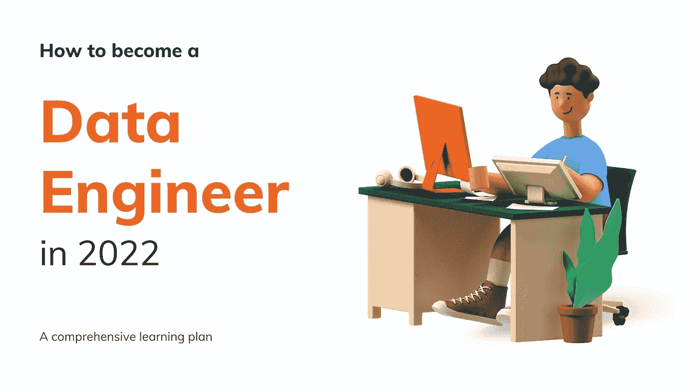

# 如何成为数据工程师:完整路线图

> 原文：<https://medium.com/codex/how-to-become-a-data-engineer-905686dee7ce?source=collection_archive---------0----------------------->

## 数据工程 101

## 2022 年如何学习数据工程的完整路线图

2012 年 10 月，HBR 预测数据科学将是 21 世纪最性感的工作。在本世纪的第一个 10 年，它确实看起来完全匹配。

然而，公司很快意识到，没有适当的数据基础设施和高质量的数据，数据科学项目注定会失败。这导致了对能够解决这些问题的人的巨大需求，即**数据工程师(简称 DE)**。

很多人在 [LinkedIn](https://www.linkedin.com/in/saikatdt/) 上问我如何成为一名数据工程师？

所以，你来这里是因为你想成为一名数据工程师，但是为什么呢？让我先回答这个问题。

**为什么要在 2022 年成为“数据工程师”？**

因此，目前高质量数据工程师的供应非常少，而需求是天文数字。正常的经济学会告诉你，当供给不能满足需求时，价格必然会上涨。

> “需求越大，回报越大”

根据 Glassdoor、 [Ambitionbox](https://www.ambitionbox.com/profile/data-engineer-salary) 和 [Payscale](https://www.payscale.com/research/US/Job=Data_Engineer/Salary) ，印度数据工程师的平均年薪为 80-90 万卢比。然而，薪水从 3-4 拉克不等，对于有 10 年以上工作经验的人来说高达 30 拉克。

更多的人甚至考虑从其他数据角色转向数据工程师角色。这是一个伟大的举动，即使你不进入数据领域。

 [## 2022 年数据工程是一项伟大职业的 4 个理由？

### 数据工程是本世纪最性感的新工作。这里有 4 个理由来解释为什么以及现在是否是一个好时机…

withsaikat.medium.com](https://withsaikat.medium.com/4-reasons-why-data-engineering-is-a-great-career-move-in-2022-3ef07b1e14f3) 

很好，既然我们已经解决了为什么，那就让我们深入研究**如何做？**

**成为一名数据工程师需要具备哪些技能？**

就像数据科学或全栈开发人员角色一样，数据工程角色也是多学科的。在成为一名伟大的数据工程师之前，你需要学习很多相关的主题。

然而，并不是所有的东西都是开始或进入角色所需要的。

# 初学者注意

> 初学者不应该因为需要学习的大量工具和主题而感到不知所措。
> 
> 学习有几个阶段，作为初学者，你应该只专注于完善基础。
> 
> 一旦你感到舒适，你就可以进入高级话题，随着时间的推移，你会有宾至如归的感觉。

正如我上面提到的，我将把完整的技能和主题分为**基础，高级主题&好的。**

**基本面**

基础是任何建筑最重要的部分，也是任何建筑开始的地方。因此，把它建得更好是很重要的。

很容易分心。然而，花 3-4 个月的时间来建立基础是很重要的。

一旦掌握了这一部分，下一阶段的学习就会容易得多。

以下是**要涵盖的基本**主题，没有特定的顺序。

1.  **数据库概念:**

基本的数据库概念，规范化，关键字，约束，数据库存储等。

2.**编程**

基本语法、处理文件、连接数据库、构建基本 API、处理结构化(数据库和表格)和非结构化(xml、json 等)。)数据。

[Youtube 上的 Python。](https://www.youtube.com/playlist?list=PL-osiE80TeTskrapNbzXhwoFUiLCjGgY7)

[Udemy 上的 Java](https://www.udemy.com/course/java-programming-tutorial-for-beginners/)

**3。SQL**

基本数据提取、连接表、键和约束、窗口函数、集合函数等。数据定义和数据修改查询。

a.[w3school 上的 SQL 教程](https://www.w3schools.in/sql)

b.[来自可汗学院的 SQL](https://www.khanacademy.org/computing/computer-programming/sql)

c.基于场景的动手操作来自 [Mentorskool](https://www.mentorskool.com/) 的 SQL 系列。

**4。数据仓库和数据建模**

基本的数据仓库概念，数据仓库的数据建模，星型雪花模式，事实和维度表等。

**5。云基础知识**

了解云计算的基础知识、SAAS、PAAS、IAAS 产品、分布式计算、资本支出与运营支出、弹性可扩展性、云中的存储和计算、云中的数据堆栈。

6。Hadoop 生态系统& Spark

Hadoop 的历史，Hadoop 1，2，3，HDFS，MapReduce，YARN，Sqoop，Hive，PIG，HBase，Oozie，zookeeper，SPARK 基础知识

用 [Python](/geekculture/mapreduce-with-python-5d12a772d5b3) / [Java](https://www.tutorialspoint.com/hadoop/hadoop_mapreduce.htm#:~:text=MapReduce%20is%20a%20processing%20technique,(key%2Fvalue%20pairs).) 进行基本的 MapReduce 编程

与 Udemy 中的 [Python](https://www.udemy.com/course/apache-spark-programming-in-python-for-beginners/?src=sac&kw=Spark+3+in+python) 擦出火花，与 [Scala](https://www.udemy.com/course/apache-spark-programming-in-scala/?src=sac&kw=Spark)

[星火专修课程](https://forms.gle/88c2r9wPtorjFPdL6)

1 **st End2ERnd 项目:**此时，您已经具备了创建第一个基本 DE 项目所需的所有技能。在构建过程中，请注意以下几点:

a.从网上收集免费数据。

b.将数据转换成 csv / json 格式，并使用 Python 读取数据

c.使用 Python 分析和清理数据

d.将数据加载到仓库/数据库服务器中。

你不能错过 Zoomcamp 系列。我发现了最好的免费数据工程课程。

**高级主题**

1.  **Spark 中使用 Python / Scala 的 ETL**

在 Python / Scala 中创建 ETL 代码，PySpark，Spark SQL，Spark Context，Spark Jobs，Spark submit，优化 Spark Jobs。

**2。数据处理库/结构**

RDDs、数据集、数据框架等。熊猫，熊猫

不同的文件类型( **CSV、JSON、AVRO、协议缓冲区、拼花和 ORC** )。)

**3。NOSQL Db**

pick any(Casandra/MongoDB)\ Graph DB 很少需要，但是很好。

**4。工作流管理和调度器**

这是现代数据堆栈中一个非常重要的组件。在**气流**(最受欢迎和市场领导者)或其他东西( **Luigi，Prefect)** 之间选择

[大气流教程](https://airflow-tutorial.readthedocs.io/en/latest/airflow-intro.html)

**5。数据流**

数据速度是大数据和数据工程的关键参数之一。

我们都希望实时分析和反馈什么可行什么不可行，反向 ETL 和实时分析已经成为新业务中的必备工具。

**阿帕奇卡夫卡，暴风女，弗林克斯。火花流。**

**创建流数据管道**

**6。云中的 DE(AWS/GCP/Azure)**

涵盖任何主要云提供商的完整数据工程生命周期。完成下面 1–3 中的任何一项，并完成第 4 点。因为 Azure / Google / AWS 的数据产品在概念上并没有太大的不同，一旦他们习惯了其中一个，就可以很容易地选择另一个。

例如:

1.  **Azure Stack:**Azure Data Lake，Azure Synapse，Azure Data Factory，Azure Cosmos DB，Azure Event Hub，Power BI。

参考[Ramesh Retnaswami 关于数据工厂以及 Spark 和 Databricks](https://www.udemy.com/course/learn-azure-data-factory-from-scratch/) [的](https://www.udemy.com/course/azure-databricks-spark-core-for-data-engineers/)课程。

1.  **Google Stack:** 大查询、发布-订阅、数据流、数据块、查看器
2.  **AWS 栈:** AWS S3，AWS Kinesis，AWS Glue，Redshift，AWS 雅典娜，Lambda，AWS RDS
3.  **云数据仓库/湖:**数据块，雪花

2

端到端数据工程项目

**好到有**

1.  **仪表板工具:**对于数据工程角色来说，对任何特定仪表板工具的深入了解并不是必须的。然而，这是非常重要的，也是非常好的。仪表板真的可以帮助识别潜在的数据质量问题，坏数据的影响，并可以为开发人员节省大量时间。

权势人物/表姑/旁观者是这个领域的主要参与者。

**2。Docker :** Docker 有助于远离与基础设施相关的复杂性。这有助于独立轻松地设置数据环境。

**3。开发操作/数据操作**

**4。现代数据栈:**现代数据栈是指一套独立的大多开源的工具集。这些工具为业务提供了灵活性。即使是中小型企业和初创企业，现在也可以轻松建立现代数据架构，而无需担心供应商锁定和高昂的许可成本。

了解堆栈中的不同工具以及它们如何适应整个 DE 路线图是很好的。

[**five tran**](https://www.fivetran.com/blog/what-is-the-modern-data-stack)**用于 ETL， **Airflow** 用于编排，任何云仓库/湖， **DBT** 用于数据转换， **Hightouch** 用于反向 ETL， **Monte Carlo** 用于数据可观察性等。**

****

**【https://www.fivetran.com/blog/what-is-the-modern-data-stack **

****最终项目:**现在，所有重要的课程都已完成，重要的是利用学到的知识，创建一个端到端的管道作为顶点项目。要纳入的重要主题有:**

1.  **构建运行 ETL/ELT 管道的容器**
2.  **用 python 创建管道在 lake 中加载数据。**
3.  **创建流程编排来运行代码**
4.  **在 Spark、批处理和流处理上运行作业**
5.  **仓库的数据建模**
6.  **将数据从湖上传到仓库**
7.  **转换仓库中的数据并为仪表板做准备。**
8.  **数据可视化和构建仪表板。**
9.  **证明文件**

****结论****

**作为一名数据工程师，我们在日常工作中可能不需要这些技能。然而，根据角色的不同，你可能经常需要其中的一个或多个。**

**学好这些需要时间。所以，每天坚持学习。复合学习将确保随着时间的推移你会变得更好。没有捷径，不要相信那些声称一两个月就能做一个数据工程师的人。**

****保持最新:****

**你是否已经像我一样，作为基于 GUI 的 ETL 开发人员或数据建模人员在这个行业工作过？或者甚至是基于代码的数据工程师？**

**保持相关性的唯一秘诀是保持更新，了解行业内发生的所有变化。在 LinkedIn 上关注数据领导者，阅读博客和新闻信函。最重要的是每天坚持学习。**

** [## 感觉被冷落:以下是如何在 IT 行业保持相关性的方法

### 世界正在快速变化。技术的变化甚至更快。以下是您如何浏览这些内容，以及…

medium.com](/tech-start/feeling-left-out-heres-how-to-stay-relevant-in-it-sector-dbccc51889b4) 

**免费规划师**

点击以下链接，获取免费的项目规划工具，作为数据工程师准备工作的一部分。您可以勾选已经完成的项目，并跟踪进度。

该计划是无价的，但我希望你们都有免费的。然而，如果你真的从博客中获得了任何价值，并且只有在你愿意的情况下，你可以支付你觉得有价值的任何东西。这会让我有动力继续写作，增加价值。

[**我要 DE2022 学习计划。**](https://withsaikatdt.gumroad.com/l/DE2022)

 [## 2022 年数据工程路线图:研究计划

### 嗨，学习者，有了这个学习计划，你将会知道数据制作背后的本质…

withsaikatdt.gumroad.com](https://withsaikatdt.gumroad.com/l/DE2022) 

你可以跟着做或者制定自己的时间表，但是勾掉所有的项目会让你有信心面对任何面试，也会让你对自己掌握了必要的技能感到满意。

我希望博客和规划者都能激励你继续学习。去粉碎你 2022 年的数据工程梦想吧…..

如果你仍然感到失落，请不要犹豫，在这里与我预约一些时间。

 [## 在 topmate.io 上预订与 Saikat 的时间

### 我帮助你发现定义你的职业。

topmate.io](https://topmate.io/saikatdutta) 

我将分享更多关于数据行业的故事、文章和经验。你可以关注我更多这样的帖子。

***感谢*** *的阅读！如果你想与我取得联系，请随时通过*withsaikatdt@gmail.com*或我的* [*LinkedIn 个人资料*](https://www.linkedin.com/in/saikatdt/) *联系我。***