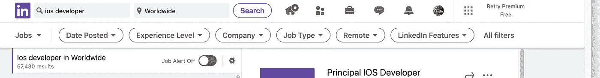
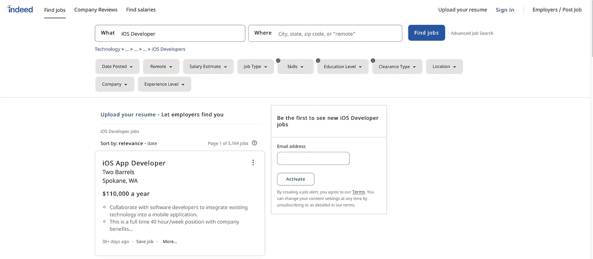
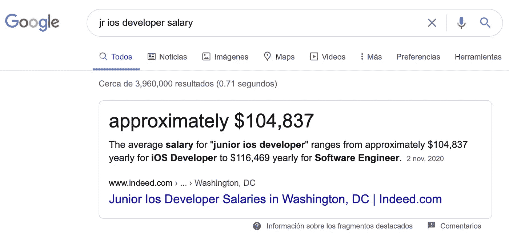
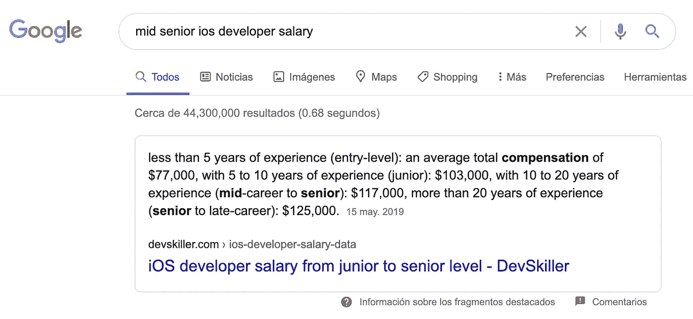
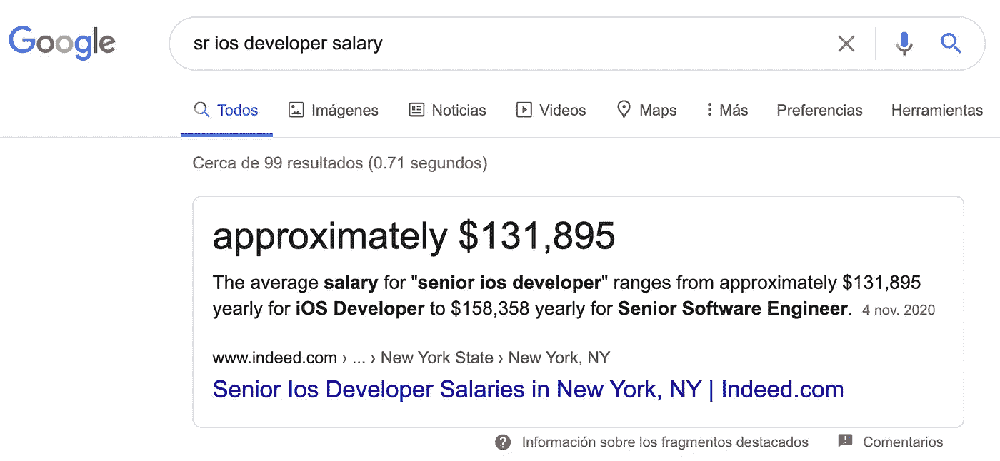

# iOS 开发者:30 天内从 Noob 到 Ninja 第一天的工作机会

> 原文：<https://medium.com/codex/how-to-become-an-ios-developer-in-30-days-day-1-job-opportunities-6df6c42ee950?source=collection_archive---------1----------------------->

在这篇文章中，我将谈论为什么你应该尝试成为一名 iOS 开发者。

作为一名 iOS 开发人员，有很多机会可以找到工作。我知道目前的情况对每个人来说都很困难。

我在想如何帮助别人学习新的东西，所以我将根据我在一些工作机会中发现的要求创建一个 iOS 课程。

首先，我想告诉你，在学习 iOS 开发上投入时间为你打开了许多机会。如果你正在寻找新的职业，我会尽力帮助你。

# 有多少份工作？

不用花太多时间，至少你可以找到 **117，644** 个工作机会。

幸运的是，我们正处于数字时代，所以你只需要在一些网站上搜索，比如 Indeed，Linked In，Glassdoor 等等。

**领英**

[https://www.linkedin.com/jobs/search/?geoId=92000000&关键词= ios %开发者&地点=全球](https://www.linkedin.com/jobs/search/?geoId=92000000&keywords=ios%20developer&location=Worldwide)

67，480 个结果(11 月 15 日至 20 日)

**的确**

[https://www.indeed.com/jobs?q=iOS+Developer&l =](https://www.indeed.com/jobs?q=iOS+Developer&l=)

50，164 个结果(11 月 15 日至 20 日)，每页列出 10 个职位。

# 可能的薪资是多少？

工资取决于你的经验，所以让我们假设在这个课程结束后，你将成为一个小的 iOS 开发人员。

*   6 万美元——8.5 万美元一年(Jr. iOS 开发者)。

*   90，000 美元—120，000 美元一年(中级 iOS 开发人员)。

*   12 万美元—15 万美元一年(高级 iOS 开发人员)。

我很确定你可以继续你的事业，成为一名 Mid。iOS 开发人员然后有了经验，并在许多项目中工作，你将是一个高级 iOS 开发人员，这只是取决于你。

话虽如此，让我们看看这些公司在寻找什么。

*   能够编写干净的模块化代码(Swift，Objective C)。
*   固体、干燥、YAGNI、亲吻等设计原则。
*   熟悉复杂的故事板和约束。
*   设计模式和架构概念，如 MVC、MVVM 和 MVP、构建器、工厂、单例、适配器、代理、门面、桥、观察者、命令。
*   多线程— GCD 和 n 操作。
*   版本控制— GIT、GitHub、拉请求、分支、位桶。
*   如何避免内存泄漏？
*   连接 iOS 应用程序的 RESTful APIs。
*   基础框架。

哇，有很多东西需要学习，但是不要担心，我会尽量隐藏至少我确信你会用到的东西，我也会分享一些资源，帮助你继续学习一些主题。

我认为这个帖子已经足够了，我会继续写下一个帖子，不要忘记关注我，如果你对个人培训感兴趣，请告诉我。

史蒂夫·乔布斯(Steve Jobs):“这个国家的每个人都应该学会**给电脑编程**，因为**电脑**教会**你**如何思考”