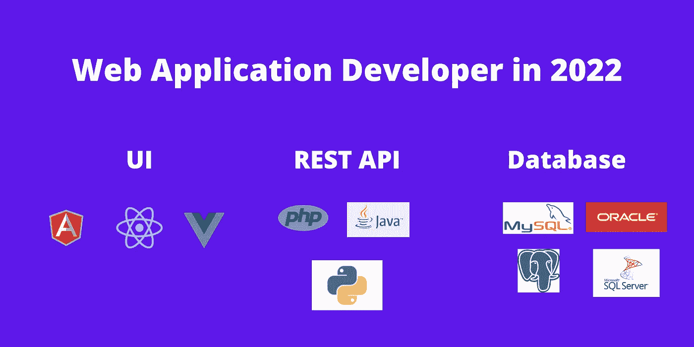

# 2022 年如何成为 Web 应用开发者

> 原文：<https://medium.com/codex/how-to-become-an-web-application-developer-in-2022-9663c6830e0c?source=collection_archive---------5----------------------->

成为一名 web 应用开发者需要哪些语言和工具？在这里，我给出了我推荐的 web 应用程序开发技术栈。

Web 应用程序开发

你是想找一份 web 应用程序开发的工作，还是打算学习 web 应用程序开发？如果是，那么你是在正确的文章。这篇文章解释了你需要关注的话题和语言，以及…