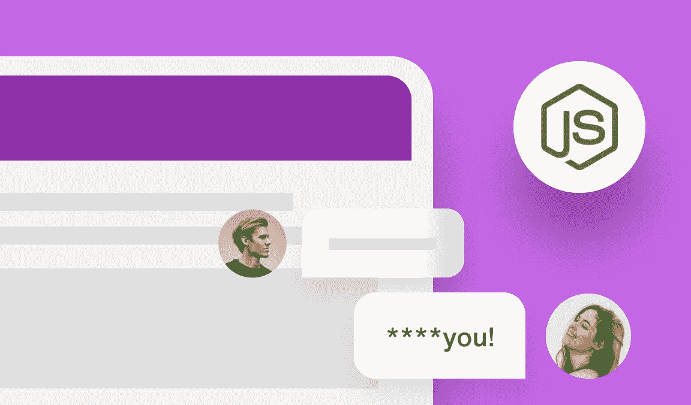
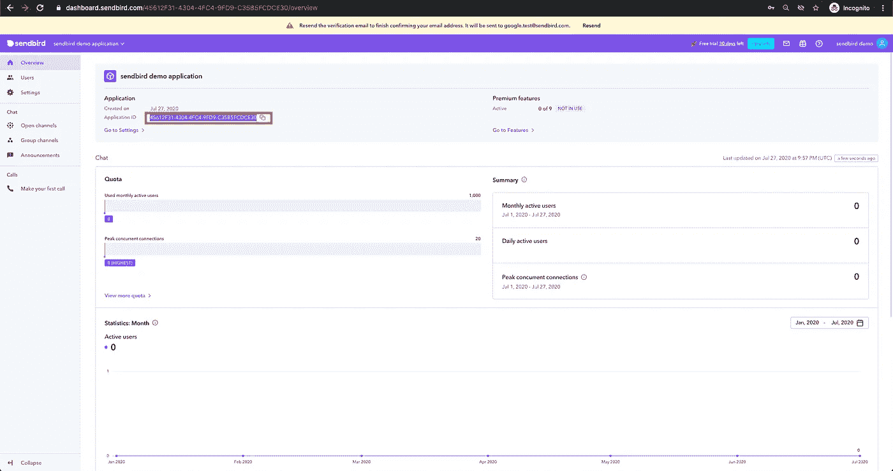
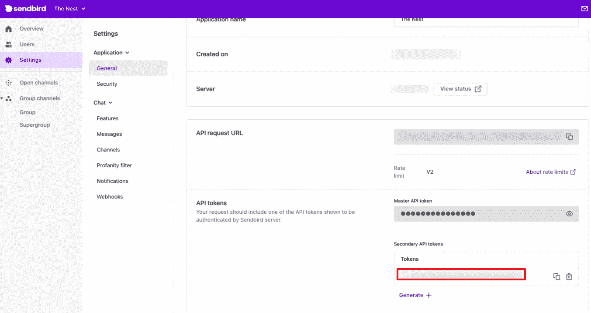
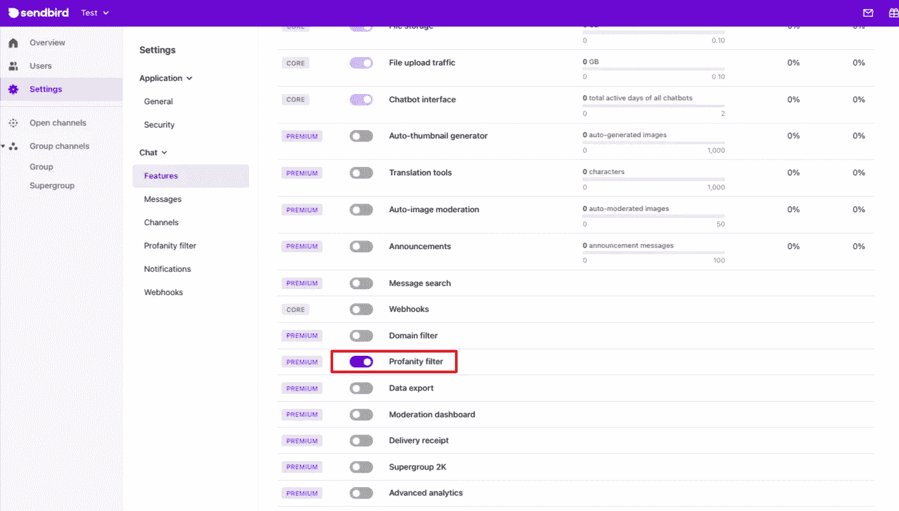
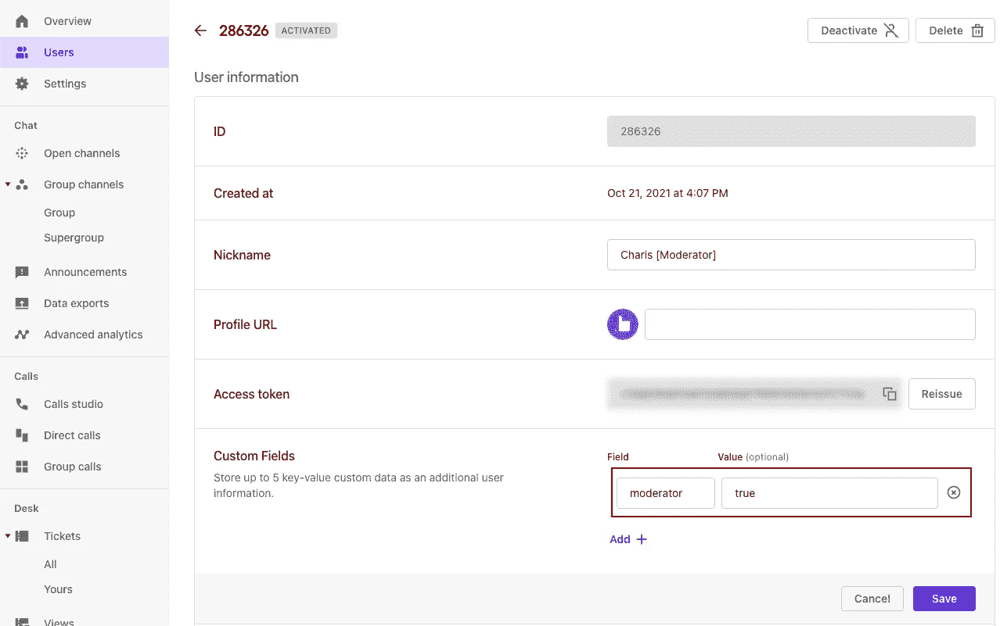
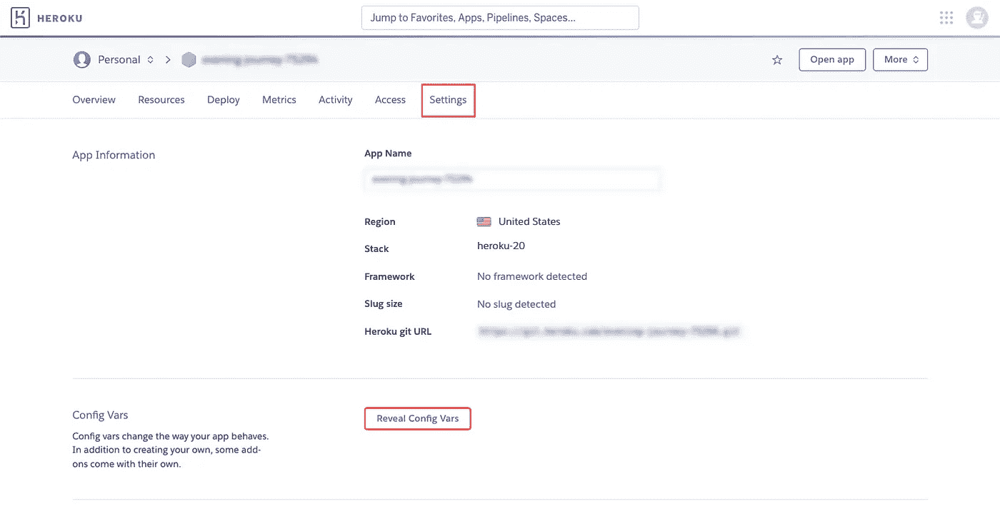
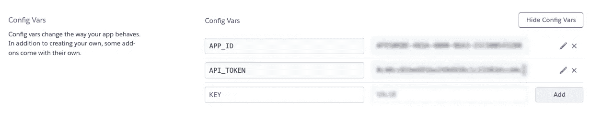
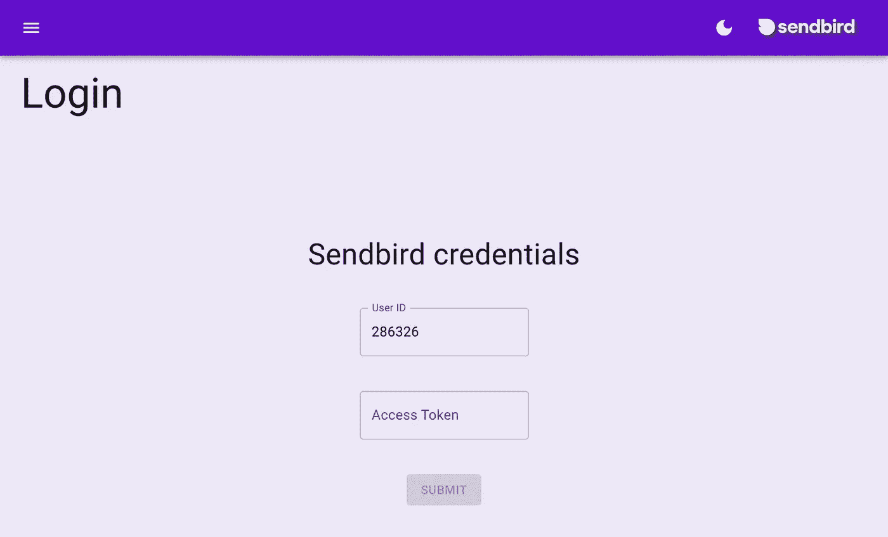
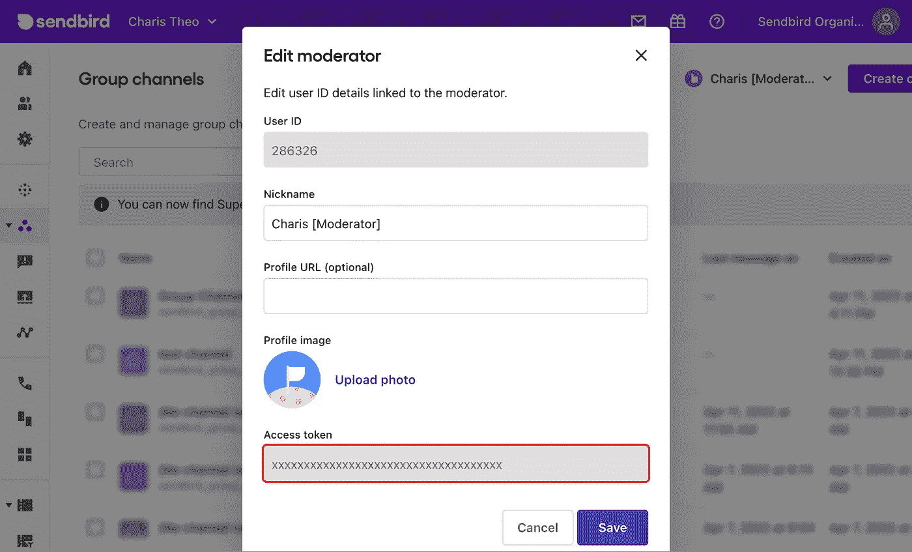

# 如何用 Node.js 构建聊天审核仪表板

> 原文：<https://medium.com/codex/how-to-build-a-chat-moderation-dashboard-with-node-js-9404736364a?source=collection_archive---------5----------------------->

仙鸟 2022

## 展示对参与者行为的洞察，并采取快速行动，保持健康的对话

由哈里·西奥多楼
解决方案工程师| [森伯德](https://www.sendbird.com)

*你可能会发现查看一个* [*实时审核仪表盘*](https://sb-moderation.herokuapp.com/) *，以及一个审核仪表盘* [*样本 app*](https://github.com/charisTheo/sendbird-moderation-dashboard/) *很有用。有关本教程的其他指导，请参见* [*文档*](https://sendbird.com/docs/chat/v3/platform-api/moderation/moderation-overview) *。您也可以查看 Sendbird Chat 的* [*演示*](https://sendbird.com/demos/in-app-chat) *并访问我们的* [*网站*](https://sendbird.com/features/chat-messaging) *以了解更多有关 Sendbird Chat 的信息。*

# 介绍

应用内聊天是一种培养社区建设和人际关系的工具。它在应用程序用户之间创建个人的、真实的关系，并服务于各种用例。从传播重要新闻和品牌更新到促进朋友之间的联系，应用内聊天有可能创造一个丰富、方便和有效的交流环境，让社区能够蓬勃发展。

与此同时，重要的是要记住维持一个安全空间的必要性，在这个空间里，所有行为者都可以做出积极的贡献。为了确保用户安全，Sendbird Chat 提供了调节工具，用户和调节者可以利用这些工具来保护社区免受有害行为的影响，并确保所有人的安全空间。

在本教程中，我们将在 Sendbird Chat 中为您的聊天应用程序构建一个审核仪表板。该仪表板将提供对参与者行为的洞察，并允许您快速采取行动以保持对话健康。

本教程结束时，您将学会如何:

*   列出您的聊天用户的审核内容
*   使用您组织中各种版主都可以使用的在线工具来处理这些内容

使用最终控制面板，您将能够:

*   按**用户**、**消息、**和**频道**列出所有**上报项目**
*   按日期和类型过滤报告的项目(“可疑”、“骚扰”、“不适当”或“垃圾邮件”)
*   查看频道中的**过滤掉脏话的消息**
*   **删除脏话**或**举报信息**
*   **静音/取消静音**上报用户
*   **禁止/解禁**举报用户
*   **冻结/解冻**通道

在我们开始构建审核仪表板之前，让我们回顾一些先决条件。

# 先决条件

为了能够遵循本教程，您将需要以下内容:

*   一个 Sendbird 应用程序以及您的应用程序 ID 和一个辅助 API 令牌。您可以从 [**Sendbird 仪表板**](https://dashboard.sendbird.com/) 中获得您的应用程序 ID 和一个辅助 API 令牌。

*应用 ID*

*二级 API 令牌*

*   确保您的 Sendbird 组织启用了脏话过滤(这是可选的，请 [**联系销售**](https://sendbird.com/contact-sales) 进行设置。)

*   一个免费的 [**Heroku**](https://www.heroku.com/) 账号
*   Node.js >=您计算机上安装的版本 16

请注意，如果您熟悉 JavaScript，您将从本教程中获益匪浅。

说完了，让我们开始吧。💻

# Web 服务器安装

对于后端服务器，我们将使用 Sendbird [**审核 API**](https://sendbird.com/docs/chat/v3/platform-api/moderation/moderation-overview#2-features) 来禁止和屏蔽用户。我们将使用 [**报告 API**](https://sendbird.com/docs/chat/v3/platform-api/report/report-overview) 来列出报告的用户、消息和渠道。

要使用 [**express.js**](https://expressjs.com/) 引导后端节点服务器，请从命令行使用以下命令:

一旦前面的命令完成，请确保更新项目根目录下的 **package.json** 文件中的 npm 脚本(在 sb-moderation-server/目录中):

## 安装服务器依赖项

在继续下一步之前，让我们确保拥有本教程后面部分所需的所有依赖项。要安装后端服务器所需的所有依赖项，请在项目的根目录下运行以下命令:

## Sendbird 应用程序凭据

要将 Sendbird 应用程序的凭证添加到我们的后端，我们需要创建一个. env 文件，该文件将在服务器启动之前加载。

1.  在项目的根目录下，创建一个名为**的文件。env** 包含以下内容:

2.将以下几行添加到 app.js 文件的顶部:

**注意**:如果您在本教程中使用 git，**不要忘记添加。env 在你的。gitignore** 文件！如果你还没有一个. gitignore 文件，确保创建一个并添加 ****/。env** 在里面。添加到 git 中进行跟踪。

应用上述更改后，您应该能够在服务器运行时访问您的应用程序凭据，如 process.env.APP_ID，而无需将它们存储在代码中。应用 ID 和 API 令牌稍后会派上用场。

## API 路线

要将服务器作为前端的 API 运行(下一节中的 web dashboard ),我们需要用 express 服务器指定所有路由。

每个 API 路由都有一个控制器来处理每个路由的请求和响应。让我们首先定义我们的控制器；这些将是服务器的核心。

首先，在项目的根目录下创建一个名为“控制器”的新目录。

然后，我们将在这个新目录中创建四个新文件，每个文件对应一种类型的控制器:身份验证、Sendbird 报告、Sendbird 亵渎和 Sendbird 审核操作(禁止、静音)。

## 认证控制器

该控制器将处理用户从前端仪表板到服务器的身份验证请求(登录和注销)。

围绕我们的审核仪表板和 Sendbird 服务器的认证过程的结构是基于使用**会话令牌**。如果您想了解有关会话令牌以及它们与访问令牌有何不同的更多信息，请参见 [**文档**](https://sendbird.com/docs/chat/v3/platform-api/user/creating-users/create-a-user#2-access-token-vs-session-token) 。

首先，让我们在 controllers/auth.js 下创建一个新文件来保存我们的身份验证逻辑。然后将以下代码添加到 auth.js 文件中:

用户 ID 和访问令牌来自前端，仪表板用户使用他们的凭证进行身份验证。然后，我们使用这些凭证将用户连接到 Sendbird 服务器，以检查所提供的凭证是否正确。

一旦我们成功地将用户连接到 Sendbird 服务器，我们就添加一个额外的检查，上面的 **isModerator(user)** ，以确保正在尝试认证的当前用户是一个版主。

区分版主和普通聊天用户的一种方法是为每个版主添加元数据。您可以通过使用 [**平台 API**](https://sendbird.com/docs/chat/v3/platform-api/user/managing-metadata/user-create-metadata) 或从**用户**>>**用户信息** > **自定义字段**下的 [**Sendbird 仪表板**](https://dashboard.sendbird.com/) 来完成此操作，如下所示:

如果您遵循上面截图中的示例，请确保您在 controllers/auth.js 文件中的任何位置都包含了帮助函数 isModerator:

一旦用户通过了所有的认证检查，我们继续为该用户生成一个新的会话令牌**,我们将把它作为无状态令牌发送给前端。然后，该会话令牌将保存在前端的 [**本地存储器**](https://developer.mozilla.org/en-US/docs/Web/API/Window/localStorage) 中，并将在随后对我们的服务器的 API 请求中使用，以验证有效的认证。**

为了注销用户，我们只需删除用户当前拥有的任何会话令牌。因此，在 controllers/auth.js 文件中，添加以下内容:

如果您想了解有关删除用户会话令牌的更多信息，请参见 [**文档**](https://sendbird.com/docs/chat/v3/platform-api/user/managing-session-tokens/revoke-all-session-tokens) 。

## Sendbird 报告

该控制器将处理从前端仪表板到服务器的报告内容(用户、消息和频道)请求。如果您想了解更多关于查询 Sendbird 报告的信息，请访问我们的 [**文档**](https://sendbird.com/docs/chat/v3/platform-api/report/listing-reports/list-reports) 。

首先，让我们在 controllers/reports.js 下创建一个新文件来保存我们的查询逻辑。然后将以下代码添加到 reports.js 文件中:

**注意**:我们正在递归地调用 Sendbird API 来检索所有的报告，并将它们一次发送到前端。如果您遇到可伸缩性问题，您可能希望像 Sendbird API 处理响应 json 中的 **next** 字段一样处理分页。

## Sendbird 脏话(可选)

该控制器将处理从前端仪表板到服务器的 Sendbird 脏话过滤消息的请求。如果您想了解更多关于查询 Sendbird 的脏话过滤信息，请参见 [**文档**](https://sendbird.com/docs/chat/v3/platform-api/report/listing-reports/list-moderated-messages) 。

首先，让我们在 controllers/profanities.js 下创建一个新文件来保存我们的查询逻辑。然后将以下代码添加到 profanities.js 文件中:

## 链接到 Sendbird 仪表板

为了在我们的自定义审核仪表板前端安全地提供到 [**Sendbird 仪表板**](https://dashboard.sendbird.com/) 的链接，我们需要指定一个 API route 来构建并返回到群组频道、开放频道或用户的链接。

为此，让我们在 controllers/links.js 下创建一个新文件来保存链接生成逻辑。然后将以下代码添加到 links.js 文件中:

## 仙鸟节制

该控制器将处理对调节动作的请求(例如，查看被禁止的用户、禁止用户、删除消息、冻结频道等)。)从前端仪表板到服务器。如果你想了解更多关于 Sendbird 提供的审核操作，请查看 [**文档**](https://sendbird.com/docs/chat/v3/platform-api/moderation/moderation-overview#1-overview) 。

首先，让我们在 controllers/moderation.js 下创建一个新文件，它将保存我们的审核操作逻辑。然后将以下代码添加到每个部分的 moderation.js 文件中。

## 认证中间件

现在，为上述所有路由添加身份验证检查是至关重要的，因为我们不希望组织外部的任何人能够采取强有力的措施，例如禁止用户进入某个渠道。

我们将通过检查我们在上面的登录过程中生成的仪表板用户的会话令牌来做到这一点，这是在我们创建身份验证控制器的第一步中。

为此，我们需要在 middleware/index.js 下创建一个新的目录和文件，并添加以下代码:

上面的代码将检查授权头中的无记名令牌。然后，该令牌(会话令牌)将用于连接到 Sendbird websocket 服务器，以验证连接是否成功。如果连接成功，我们断开 websocket，然后让用户通过调用 **next()** 来完成原始请求。否则，我们停止最初的请求并返回一个 403(禁止)状态的响应。

为了在我们的最终应用程序中成功地完成上述工作，我们需要在登录期间在前端处理会话令牌，并处理每个需要身份验证的后续请求。我们将在下面几节中看到如何做到这一点。

## 将控制器连接到 API 路由

将它们结合在一起，我们将按照 express.js 定义它们的方式，将刚刚创建的认证中间件和控制器连接到 API 路由。为此，我们需要一个新文件，在其中定义所有的路线和方法:

1.  在项目的根目录下创建一个名为 **routes** 的新目录。
2.  在 **routes/index.js** 下新建一个文件。
3.  在导入所有控制器并定义了您想要使用的路线和方法之后，您的 routes/index.js 文件应该如下所示:

要将上述路线应用到我们的应用程序中，请在项目根目录下的 **app.js** 文件中添加以下代码行。

最后，为了在我们的前端中的各种 URL 路径中处理对 index.html 文件的静态文件请求，在 **app.js** 文件中添加以下代码行:

您的 app.js 文件现在应该如下所示:

您的项目结构应该如下所示:

# Web 仪表板设置

在将我们的前端代码包含到这个项目中之前，如果项目的根目录中有 **public** 目录，请确保删除它。(如果您在本教程开始时使用了 express-generator，它就会生成)。

**注意**:如果你还没有在你的项目中初始化 git，那么在继续之前这样做是一个好主意。您可以通过在根项目目录中运行 **git init** 来做到这一点。

然后我们将创建一个名为 **web** 的新目录，它将存放我们的前端应用程序。为了使本教程更简单，您可以将 [**这个分支**](https://github.com/charisTheo/sendbird-moderation-dashboard/tree/dash-front-end) 作为 git 子模块添加到您的项目中，在项目的根目录下使用以下命令:

如果您喜欢从头开始创建自己的前端项目，您可以在项目的根目录中使用[**create-react-app**](https://reactjs.org/docs/create-a-new-react-app.html)生成一个新的 React.js 项目。请记住，要在本地测试这一点，您可能需要在您的 **package.json** 文件中指定" **proxy** "字段:

不管您选择添加前端代码的方式如何，您的文件结构现在应该看起来像这样:

然后，我们将看看当用户登录并从我们的后端 API 请求数据时，前端代码是如何工作的，比如报告的内容和 Sendbird 通道。

如果您遵循了整个教程，并且从这个 [**库**](https://github.com/charisTheo/sendbird-moderation-dashboard/tree/dash-front-end) 中克隆了 dash-frontend 分支，那么您现在应该已经准备好运行这个项目了。如果你想详细了解前端代码是如何工作的，你可以继续阅读。否则，您可以跳到下面的**部署**部分。

## 登录页面

无论您是使用自己的前端代码，还是遵循上面的教程(登录页面位于 web/src/pages/login.js)，您都应该能够处理从前端到我们之前设置的后端 API 的登录请求:

上面的 **POST** 登录请求转到 **/api/auth** API 路由，该路由由我们前面指定的行 **app.post('/api/auth '，authController.login)** 处理。这是所有认证检查发生的地方，一旦用户被成功认证，我们**将从 API 返回的会话令牌**保存到本地存储，因为它将在随后的 API 调用中使用:

## 报告页面

在仪表板的主页中，我们希望检索并显示所有关于用户、消息和渠道的报告内容。

为此，我们使用之前(登录期间)在上面详述的 **getLoginDetails** 实用函数的帮助下检索的会话令牌。然后，在使用如下的 **getAuthHeaders** 函数将令牌附加到授权头之后，我们向后端 API 发出请求:

**注意**:如果到目前为止您已经完成了整个教程，那么您应该可以在 web/src/pages/home.js 文件中找到上面的代码。

下面是上面用来生成授权头的 **getAuthHeaders** 实用函数:

## 审核操作用户界面

虽然在前端处理 UI 更改和过滤与本教程无关，但是如果您使用 [**这个分支**](https://github.com/charisTheo/sendbird-moderation-dashboard/tree/dash-front-end) 来设置这个项目的前端，您就已经知道了。

有关禁止或静音用户等审核操作的更多信息，您可以在 [**banButton.js**](https://github.com/charisTheo/sendbird-moderation-dashboard/blob/dash-front-end/src/components/banButton.js) 和 [**muteButton.js**](https://github.com/charisTheo/sendbird-moderation-dashboard/blob/dash-front-end/src/components/muteButton.js) 组件中查看如何在前端处理这些操作的示例。

## 脏话过滤(可选)

有关如何处理脏话的响应并将它们显示到 UI 的更多信息，请查看/src/pages/profanity.js [**文件**](https://github.com/charisTheo/sendbird-moderation-dashboard/blob/dash-front-end/src/pages/profanity.js) 。

# 部署

## 生产

要在本地运行仪表板的生产版本，请执行以下步骤:

1.  从 **web/** 目录内部运行 **npm 运行构建**。
2.  一旦以上完成，首先通过从项目的根目录运行 **npm start** 来启动您的 API 服务器。
3.  在浏览器中打开一个新标签，导航至[**http://localhost:3000**](http://localhost:3000/)。
4.  如果您使用的是。env 文件加载您的应用 ID 和 API 令牌，就像在本教程中一样，确保您更新了 **app.js** 文件第一行中的 **dotenv** 配置，并重新启动您的服务器:

## 发展

1.  首先从项目的根目录运行 **npm run dev** 来启动 API 服务器。
2.  从 **web/** 目录中运行 **npm start** 来启动您的前端服务器。您可能会被要求在另一个端口上运行，因为 API 服务器已经在端口 3000 上运行了。在这种情况下，请键入“y”接受。
3.  浏览器中应该会打开一个新标签。如果没有，请在[**http://localhost:3001**](http://localhost:3001/)打开您的浏览器，或者打开您的前端开发服务器为您设置的任何端口。

## 部署到 Heroku

**先决条件**

1.  一个免费的 [**Heroku 账号**](https://signup.heroku.com/signup/dc)
2.  您机器上安装的 [**Heroku CLI**](https://devcenter.heroku.com/articles/heroku-cli)

如果还没有，请在项目的根目录中初始化一个 git 存储库:

然后使用 Heroku CLI 进行身份验证，创建一个新的应用程序，并将您的本地 git 存储库推送到 Heroku:

最后，我们需要在新的 Heroku 应用程序中指定 Sendbird 应用程序凭证，如应用程序 ID 和 API 令牌。

为此，打开你的 [**Heroku 应用仪表板**](https://dashboard.heroku.com/apps) ，选择你的新应用。然后，从顶部应用程序菜单中，选择“**设置**，然后选择“**显示配置变量**”:

现在添加您的 Sendbird 应用程序 ID 为 **APP_ID** ，添加该应用程序的 API 令牌为 **API_TOKEN** :

如果有必要，在设置 Heroku 配置变量后重新构建您的应用程序，尽管它们应该已经应用于您的应用程序。

## 登录到实时仪表板

如果您已经按照上述步骤部署了您的应用程序，那么您现在应该有一个可随时访问的仪表板公共 URL。

要登录到您的仪表板，您需要确保您有一个 Sendbird 用户，其元数据包括**{版主:真}** 字段，并且您手头有该用户的 ID 和访问令牌。

# 结论

就是这样！在本教程中，我们讨论了设置自定义 Sendbird 审核仪表板并实时部署它的服务器和仪表板实现，以便我们可以随时使用它。有了它，您将能够缓和对话，以确保为您的用户提供安全、可靠和积极的聊天体验。

一如既往，如果您有任何问题，请访问我们的 [**社区网站**](https://community.sendbird.com/) 或 [**与我们联系**](https://sendbird.com/contact-us) 。我们总是乐于助人！

快乐仪表板建筑！🖥