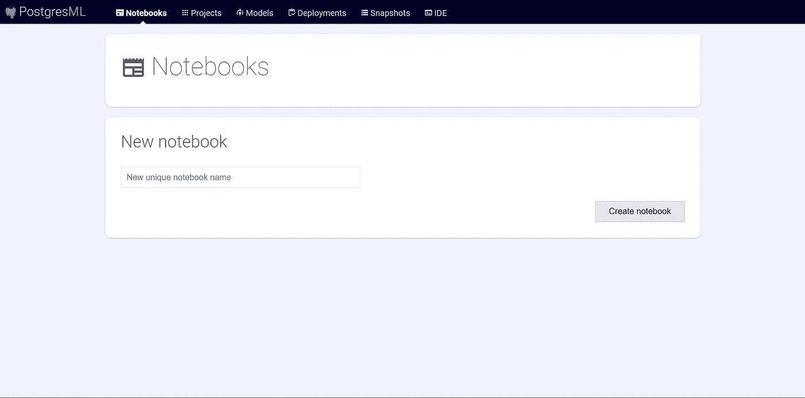
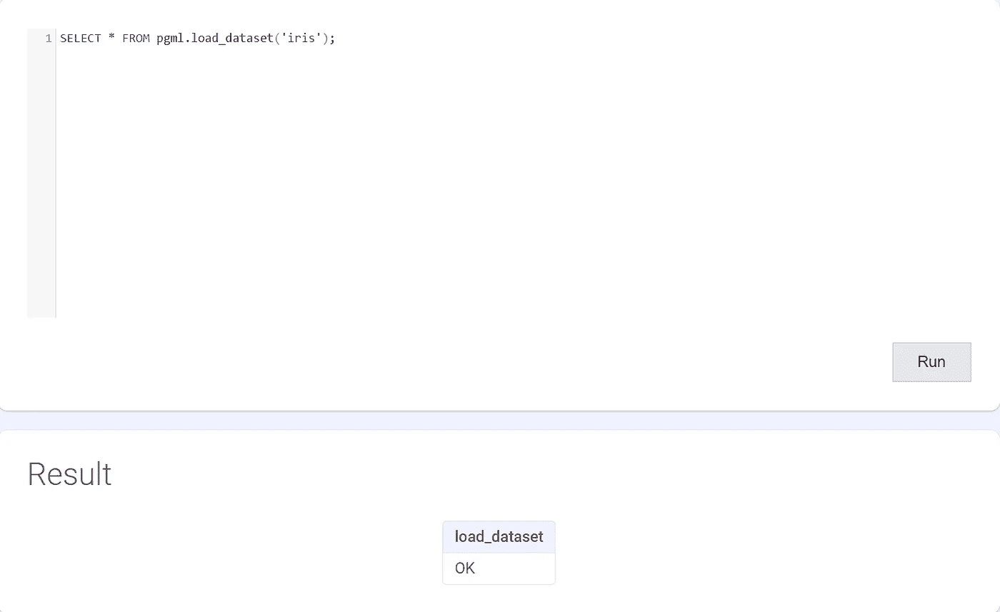
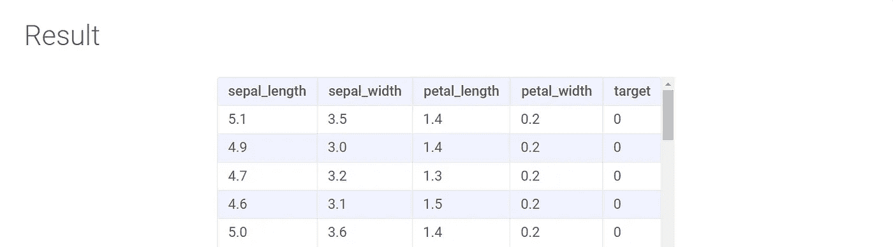
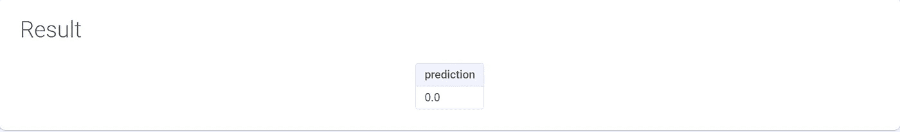
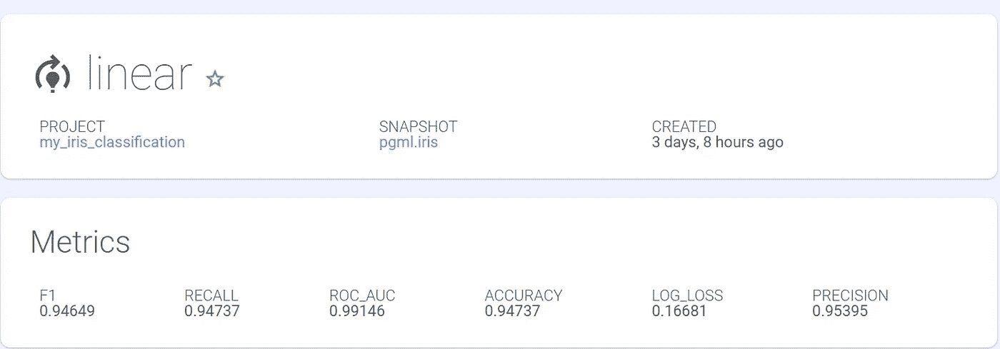

# 如何用 SQL 建立分类模型

> 原文：<https://medium.com/codex/how-to-build-a-classification-model-with-sql-84d4c8a928c5?source=collection_archive---------5----------------------->

## PostgresML 介绍，PostgreSQL 的开源扩展，仅使用 SQL 构建、微调和部署 ML 模型；循序渐进的指南


Wolfgang Hasselmann 在 [Unsplash](https://unsplash.com/?utm_source=medium&utm_medium=referral) 上拍摄的照片

# 介绍

SQL 是一种强大的编程语言，用于存储、操作和检索数据库中的数据。然而，当涉及到开发机器学习(ML)模型时，Python 将是最合适的，原因有几个，例如伟大的 ML 库和框架、灵活性、平台独立性和广泛的活跃社区。

SQL 呢？如果我们在数据仓库的中心构建和运行 ML 模型，数据就保存在那里，而不必离开数据库，会怎么样？这种方法使我们能够有效地运行算法，而无需将数据传输到外部目的地，这可能会导致运行和维护模型的运营费用更高，尤其是在处理大型数据集时。

这是我的问题，它让我选择了多个基于云的解决方案，如 [Oracle Autonomous DB](https://www.oracle.com/ca-en/autonomous-database/what-is-autonomous-database/) 、 [Google BigQueryML](https://cloud.google.com/bigquery-ml/docs/introduction#:~:text=BigQuery%20ML%20lets%20you%20create,the%20need%20to%20move%20data.) 和 [AWS RedshiftML](https://aws.amazon.com/redshift/features/redshift-ml/) ，它们都支持 ML 系统。除了这些云服务，还有一个 PostgreSQL 的开源扩展，称为 [PostgresML](https://postgresml.org/) ，它目前使用来自 [Scikit-Learn](https://scikit-learn.org/) 、 [XGBoost](https://xgboost.readthedocs.io/) 和 [LightGBM](https://lightgbm.readthedocs.io/) 库的算法支持分类和回归模型的 ML 开发工作流。它最初是作为一个分布式生产就绪解决方案出现的，以消除从数据库中提取数据并将其转换为 ML 模型的有用格式的延迟和复杂性。

在这篇介绍性的笔记中，我将使用我们友好的 [iris](https://archive.ics.uci.edu/ml/datasets/iris) 数据集带您浏览 PostgresML 的不同组件，同时构建一个简单的多分类模型。这样，我们将提高机器学习和 SQL 的知识，这是数据世界中的两项基本技能。

本说明的其余部分将涵盖以下主题:

*   PostgresML 安装
*   PostgresML 中的数据摄取
*   PostgresML 中的模型训练
*   PostgresML 中的模型预测和性能评估

# 装置

## 步骤 1:安装必备组件

多亏了容器化服务，我们从 PostgresML 开始所需要的只是设置以下先决条件:

*   [](https://www.docker.com/)**(运行 PostgresMl-extension、model performance monitoring dashboard 和 documentation 的服务)**
*   **[**Docker 编写**](https://docs.docker.com/compose/) (管理多个容器)**

**在我之前的博客中，我简要描述了这两个系统，以防你需要快速复习。**

**[](https://blog.devgenius.io/how-to-build-an-ecommerce-sales-dashboard-with-apache-superset-and-docker-100c19eee603) [## 如何用 Apache-superset 和 Docker 构建电子商务销售仪表板

### 构建电子商务仪表板的灵活开源平台。

blog.devgenius.io](https://blog.devgenius.io/how-to-build-an-ecommerce-sales-dashboard-with-apache-superset-and-docker-100c19eee603) 

## 步骤 2:克隆 PostgresML 存储库

让我们从克隆源代码开始:

```
$ git clone [https://github.com/postgresml/postgresml.git](https://github.com/postgresml/postgresml.git)
```

## 步骤 3:启动 dockerized 服务

接下来，我们将使用 docker-compose 文件来为我们构建和运行 docker 化的服务:

```
$ cd postgresml && docker-compose up
```

在后台，docker-compose 运行三个容器:

*   *PostgresML-extension* —这是为 PostgreSQL 系统安装基于 Python 的 ML 扩展并将 ML 工作流的各种元素(如数据摄取和模型训练)定义为 PostgreSQL 函数的主容器。本质上，PostgresML 使用 [Scikit Learn](https://scikit-learn.org/) 和 [XGBoost](https://xgboost.readthedocs.io/) 来加载数据集、训练回归/分类模型、微调超参数并进行预测。
*   *PostgresML-Dashboard*—Dashboard 提供了一个有用的 UI 工具，可以在数据库内的不同项目和数据集之间导航。它还使用户能够通过内置的 SQL IDE 与模型进行交互。这很方便，特别是在将 ML 工作流视为 PostgreSQL 表时。在这篇笔记中，我将使用仪表板工具来构建我的模型并获得一些预测。
*   最后，这个容器提供 PostgresML 文档。

## 步骤 4:验证您的安装

太好了！让我们在进入开发阶段之前验证一下安装。一旦容器达到它们的运行状态，打开一个新的浏览器并通过端口 8000 登录到本地仪表板:

```
[http://localhost:8000/](http://localhost:8000/)
```

您应该能够看到如下所示的主窗口。



PostgresML 主仪表板的视图。“作者提供的图像”

## 使用 IRIS 数据集快速解决多分类问题

由于这篇介绍性笔记的重点将是描述 PostgresML 的组件，而不是构建一个复杂的 ML 模型，所以我决定使用我们有用的 IRIS 数据集来构建一个简单的多分类问题。

Fisher 的 Iris 数据集，也称为 Iris flower 数据集，是一个多变量数据集，包括三种鸢尾([鸢尾](https://en.wikipedia.org/wiki/Iris_setosa)、[海滨鸢尾](https://en.wikipedia.org/wiki/Iris_virginica)和[杂色鸢尾](https://en.wikipedia.org/wiki/Iris_versicolor))中每一种的 50 个样本。从每个样本中，萼片和花瓣的长度和宽度以厘米为单位进行测量。目标是创建一个区分模型，根据这些属性的组合来区分物种。下面是来自维基百科的一个简单的图形 EDA，代表了这四个特性之间的关系:

[](https://commons.wikimedia.org/wiki/File:Iris_dataset_scatterplot.svg) [## 文件:Iris 数据集散点图

### 来自维基共享，自由媒体仓库

commons.wikimedia.org](https://commons.wikimedia.org/wiki/File:Iris_dataset_scatterplot.svg) 

## 输入数据

ML 工作流程的第一步是获取和准备数据集。这通常是数据科学项目中最困难和最耗时的部分，但由于预处理的虹膜数据集，我们可以跳过这一步。样本数据集的完整列表可以在`posgresml-extension/example`文件夹下找到。

要在仪表板中加载 iris 数据集，请导航到内置的 SQL IDE 并运行以下查询:

您应该会看到类似这样的内容:



作者图片

这意味着`iris` 数据集被成功加载，现在可以在`pgml` 方案中使用了。在后台，PostgresML 调用 Scikit-learn 库为我们加载数据集。要浏览数据，请在我们用来加载数据的同一个 SQL IDE 中运行以下查询:

这导致:



作者图片

这是一种探索我们的数据集并更好地了解其结构的简单方法。数据集包含四个对应于萼片或花瓣结构信息的预测列和一个响应(或标签)列，该列引用属于特定类型鸢尾属植物(Setosa、Versicolour 和 Virginica)的类:

## 模特培训

在 PostgresML 中，训练回归或分类模型相当简单，只需要运行一次训练调用。以下是可接受参数的完整列表:

在这一步中，我们:

*   给我们的项目起个名字。
*   确定问题的类型，即分类或回归。PostgresML 也使用这个参数调用相关的度量来评估模型性能。
*   提供已经加载的 pgml 方案中的表或视图的名称。
*   标识目标列。这个自变量相当于类标签、因变量和输出变量。
*   指定特定的算法，例如 XGBoost、SVM 和线性。
*   可选地提供关于如何实现超参数调整的细节。例如，`search_param`允许我们以字典格式列出想要调优的超参数的名称和范围，使用`search`可以设置超参数调优策略(即网格或随机搜索)。
*   选择性地确定测试规模和测试抽样策略。默认情况下，将随机抽取 25%的数据(由`test_size`指定)来衡量模型的性能。

从这里开始，PostgresML 在 PostgreSQL 数据库中注册一个新项目，并使用 Python ML 库来训练和验证针对 pgml 方案中的目标表的模型。然后，将使用与特定任务相关的预定义指标，根据测试数据集对结果进行评估。例如，混淆矩阵用于衡量分类模型的性能，而 RMSE 用于回归模型。

太好了！让我们导航到 SQL IDE，使用以下命令在 iris 数据集上训练一个简单的线性模型:

模型训练过程完成后，您应该会在笔记本上看到以下结果:


作者图片

通过运行训练功能，我们可以:

*   创建了一个名为“我的虹膜分类”的新项目
*   拍摄了 pgml.iris 表的快照，以使该过程可重现。这是一个有用的特性，因为真实世界中的数据往往会频繁更改，因此拥有快照将使及时返回变得简单。
*   使用功能和目标列对 pgml.iris 表中包含的数据训练线性分类器。
*   将模型部署到生产中。有时，部署状态会更改为未部署，这意味着模型性能评估不满足部署标准。

太好了！现在，我们已经准备好向线性分类器模型提供看不见的数据点，并进行预测。

## 模型预测法

PostgresML 使用最近部署的模型为给定的新数据点提供在线预测。通过对预测函数的一次调用，我们将能够向模型传递一组新的输入，并接收一个预测。

让我们测试我们的分类器算法，看看它是否正确地识别了一个新的输入数组的鸢尾花类型，我们知道它属于 Setosa 花(或类 0)。导航到 IDE 并运行以下查询:

您应该会在笔记本上看到以下结果:



作者图片

给定我们刚刚传递给函数的新特性数组，预测列表示目标列的可能结果。注意`ARRAY[...]`必须与训练中使用的特征顺序相同。

我们可以简单地预测多个随机点，并将它们与数据集中的实际标签进行比较:

下面是我得到的结果:


作者图片

## 模型性能评估

太好了！到目前为止，我们已经训练了我们的模型，并生成了一些随机预测，但在将我们的模型部署到实际生产中之前，我们需要通过根据几个指标对模型进行评估来验证模型的可信度。

在控制面板中，如果您导航到“项目”选项卡并选择我们新创建的项目“my_iris_project”，您会发现我们的线性分类器根据常用的分类评估指标“混淆矩阵”进行了测试。



作者图片

# 结论

感谢阅读！这是对 PostgresML 的介绍，它是对 PostgreSQL 的扩展，具有在 SQL 中构建、评估和部署回归或分类模型的能力。在这份介绍性说明中，我们回顾了如何使用 docker 安装 PostgresML、导入预定义数据、训练和验证简单的分类器模型，以及使用看不见的数据点评估模型的性能，所有这些都在 PostgresML dashboard 应用程序的 SQL IDE 中完成。

请继续关注下一篇博客，通过一些案例研究，这篇博客将更多地关注 PostgresML 在解决现实世界问题中的应用。

此外，如果您是数据科学家、分析师或工程师，并且希望使用 PostgresML 在 SQL 中实现您的回归/分类模型，请联系我。我就差一个 ping 了:)**