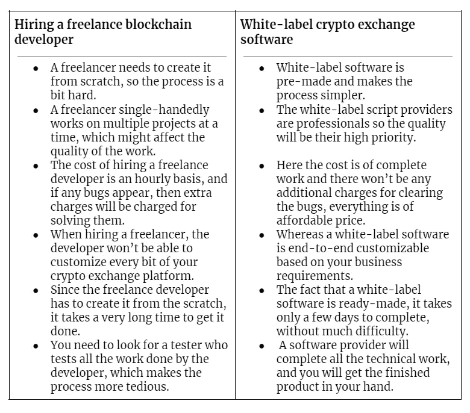

# 没有编码技能如何搭建加密货币交易所？

> 原文：<https://medium.com/codex/how-to-build-a-cryptocurrency-exchange-without-coding-skills-dbd0b582704?source=collection_archive---------12----------------------->

## 创建和推出流行的加密交易所，如币安、比特币基地和本地比特币，无需编码技能

加密领域的人都很清楚，加密交易业务的增长是不可阻挡的。甚至在新冠肺炎疫情密码交易所业务也看到了巨大的增长，这表明了在这个数字时代的密码交易所业务的能力。但到目前为止，许多人对开展加密交换业务犹豫不决，认为技术人员只能进入这一行业，这是不正确的。一个没有技术知识的人也能开办密码交换业务，我来告诉你，怎么可能。

一个没有编码技能的初创公司/创业者如何创建一个加密货币交易所？

# 一个没有编码技能的初创公司/创业者如何创建一个加密货币交易所？

嗯，这个问题的答案很简单，有两种可能的方式，企业家或初创公司可以建立他们自己的密码交换平台，而不需要编码技能，

*   你可以雇佣一个自由的区块链开发者
*   或者你可以从一个可靠的软件提供商那里得到一个白色标签的加密交换软件。

尽管有两种可能的方式，但在当前市场中，其中只有一种是可行的。让我们通过比较来看看哪种方法是最好的，为什么这么说。

自由职业者开发商 vs 白标加密交换软件提供商

在研究了这些比较之后，很明显，任何人在计划创建一个加密交换平台时，获得白标软件都是更明智的选择。让我们看看从脚本提供商那里获得白标软件的一些商业好处。

## **白标加密交换软件的商业利益:**

**可扩展性**:白标加密交换软件具有定制的功能、视觉效果、界面等，可为您的交换提供高可扩展性。

**监控**:您可以高效的监控您的密码交换平台。

**投资回报特性**:它让您可以自由集成激动人心的投资回报特性，为您带来丰厚利润。

**测试模块**:测试模块使你能够在你的加密交换平台上运行多个测试。

**经济高效**:获得白标软件的成本通过减少投资来节省您的开支。

**持续时间:**白标软件是一个预先开发的软件，您可以在几天内部署它。

这里我只提到了使用白标软件的一些商业好处，除了这些好处，获得白标软件还有更多好处。但是现在，是时候让我们来看看加密交换平台中的工作模型的类型了。因为根据不同的加密交换工作模式，您应该选择您集成的功能也有所不同，所以让我们来看看它。

**加密交换平台的工作模式**

1.  基于广告或 P2P
2.  用户到管理员
3.  订单簿

**集成到基于广告或 P2P 加密交换平台的功能**

*   托管证券
*   争议功能
*   托管钱包
*   买卖订单发布(如广告)
*   多种支付方式等等。

**集成到用户对管理员加密交换平台的功能:**

*   场外交易，
*   即时买卖
*   IEO 模块
*   立桩标界

**集成到订单簿加密交换平台的功能**

*   订单簿，
*   现货交易，
*   订单类型，
*   匹配引擎，
*   衍生品交易
*   加密和法定支付网关
*   加密钱包和更多。

我上面提到的这些特性是专门针对该工作模型的，但是有些特性对于所有类型的加密交换平台都是通用的，它们是:

**所有类型的白标加密交换软件的共同特征:**

*   多种加密货币支持
*   推荐选项
*   管理面板
*   用户面板
*   高级用户界面/UX 及更多
*   多语言支持
*   多个交易对
*   保证金交易
*   KYC/反洗钱
*   HTTPs 身份验证，
*   生物认证，
*   监狱登录，
*   数据加密，
*   双因素认证，
*   SQL 注入预防，
*   反拒绝服务(DoS)，
*   跨站点请求伪造(CSRF)保护，
*   服务器端请求伪造(SSRF)保护，
*   反分布式拒绝服务及更多。

除基本功能外，强制功能被集成到加密交换白标软件中，高级功能需要额外付费。并不是所有的白标脚本提供商都能以合理的价格提供这种服务，只有少数提供商能够以合理的成本提供高质量的白标解决方案。你需要做一些研究，选择你的脚本提供者。

# **最后的话**

选择正确的白标软件提供商是在没有任何编码技能的情况下构建您的加密交换平台的最重要的一步。你需要根据一些标准来进行你的研究。你需要寻找他们的评级，评论，他们提供的服务，以及他们提供的价格。这些是你在选择白标软件提供商时需要记住的强制性因素。一旦你联系到一个可信的 [**白标加密交换软件**](https://www.firebeetechnoservices.com/white-label-cryptocurrency-exchange-software?utm_source=cryptoexwithcoding&utm_medium=codexmedium&utm_campaign=kartz) 提供商，你就可以传达你的要求。最后，他们将完成启动您的加密交换平台所需的所有工作。