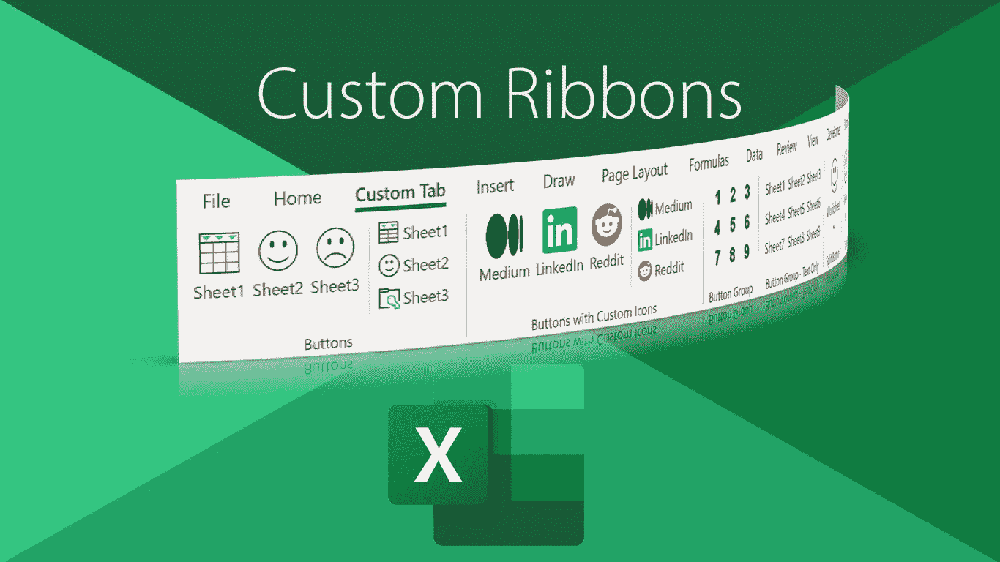

# 如何在 Excel 中构建自定义功能区

> 原文：<https://medium.com/codex/how-to-build-a-custom-ribbon-in-excel-a3bc531551e1?source=collection_archive---------0----------------------->

## 使用 XML 和 VBA

自从 Office 2007 发布以来，微软的带状界面就一直伴随着我们。虽然遇到了不同的反应，随着时间的推移，许多人承认这是一个可行的替代老化乏味的菜单，我们已经习惯了。

微软开发功能区是为了提高用户对每个 Office 产品中嵌套内容的认识。[据说](https://ux.stackexchange.com/questions/8238/is-microsofts-ribbon-ui-really-that-great-from-a-usability-perspective) …