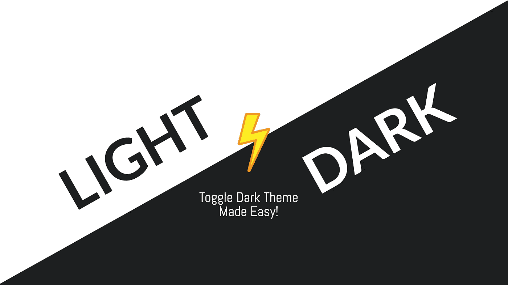

# 如何用 CSS 和 Javascript 构建一个黑暗模式切换？

> 原文：<https://medium.com/codex/how-to-build-a-dark-mode-toggle-with-css-and-javascript-88a095622aa8?source=collection_archive---------4----------------------->

你好朋友们👋在被问了很多次如何进行黑暗模式切换后，我决定用 HTML、CSS 和 JavaScript 来编写这个循序渐进的教程。

按照这个教程，你需要在你的笔记本电脑上安装两个东西。

1.  网络浏览器:谷歌浏览器、火狐浏览器或任何其他网络浏览器。
2.  文本编辑器:…