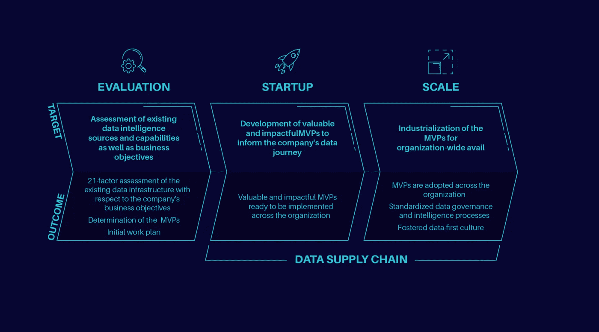

# 如何在您的组织内建立一个数据智能创业公司

> 原文：<https://medium.com/codex/how-to-build-a-data-intelligence-startup-within-your-organization-296272ba9a51?source=collection_archive---------19----------------------->

## 我们相信有一个更有效和可扩展的挑战，有一个良好的 D&A 部门

# 概观

随着拥有一个好的数据和分析部门变得越来越重要，组织的领导者一直在寻找组织和构建这些部门的方法。传统上，有三种方法。然而，考虑到行业中最新的变革趋势，结合大多数组织的典型方法，我们相信有一种更高效、更可扩展的解决方案来应对这一挑战。

# 介绍

数据世界正在蓬勃发展。根据 QuantumHub 的调查，大约 67%的被调查公司一直在扩展他们的数据科学服务。2020 年，与前一年相比，职位发布总数增长了 37%。[此外，Forbes](https://www.forbes.com/sites/louiscolumbus/2020/05/31/what-you-need-to-know-about-bi-in-2020/?sh=51ad7903aa8a) 报道称，54%的企业认为基于云的商业智能对他们当前和未来的计划至关重要；根据 [Select Hub](https://www.selecthub.com/business-intelligence/business-intelligence-trends) 的数据，2020 年商业智能应用的市场价值为 177 亿美元。

这表明，不仅越来越多的组织开始意识到数据智能的重要性(在某些行业中，数据智能标志着生死之别)，而且他们还积极致力于扩展和提高数据智能能力。例如，Gartner 报告称，到 2023 年，超过三分之一的大型组织将拥有从事决策智能的分析师。

随着拥有强大的数据和分析(D&A)部门变得越来越重要，组织领导正在寻找组织和构建这些部门的方法。

根据我们的经验，组织通常会通过以下方式之一应对这一挑战:

*   他们创建一个**单独的 D &一个部门**；
*   **组织**中的每个部门**发展自己的 D & A 能力**；或者
*   他们**根据特定项目**构建他们的 D & A 需求和能力**。**

每种方法都有明显的优势。然而，它们也有可能对组织有害的弱点，这取决于它们寻求实现的目标。

为了帮助领导者应对构建 D&A 能力的挑战，我们将仔细研究以下方法，努力发现如果正确实施，它们在哪些方面可能最有益。

我们将提出一个更有效的数据情报方法的建议来结束这一检查。这种 ***以产品为中心的*方法**已经被证明能够为具有各种数据智能需求和期望的组织带来积极的结果。它是敏捷的、注重结果的、可管理的。这种方法允许组织首先处理业务关键型任务，快速测试各种假设，并在短短几个月内推出有价值且有影响力的数据产品。

# 如何组织你的 D&A 部门？

从财务到供应链，甚至到人力资源，现有业务部门的数据智能需求不断增长。所有这些部门都需要快速可靠地获得洞察力。因此，如何构建数据情报能力的问题通常可以归结为**数据科学应该向哪个部门报告的问题。**

当组织构建他们的 D&A 团队时，这个问题往往是决定性的因素。确定新组建的数据团队的报告关系是至关重要的，但是过早地锁定这一职能的结构会导致不好的结果。

除了报告关系，组织在组建 D&A 团队时通常还会考虑两个因素:

*   **一个团队需要多大的 D&**；和
*   组织的总体业务战略是什么(将会是什么)。

这导致了在组织中构建 D&A 团队的三种不同方法。

## 独立的 D&A 部门

根据我们的经验，这是最常用的方法之一。通常会建立一个独立的 D&A 部门，作为现有 BI 部门的替代或扩展，增加高级分析功能。然后，该部门继续向首席信息官组织报告。

这种方法的主要好处是，该部门在首席信息官组织下受到很好的保护，而首席信息官组织与首席执行官有直接联系。如果公司需要改变流程，这一点尤为重要。获得首席执行官和高层领导的关注，可以更容易地**释放资金，推动具有更高价值潜力的更大项目**。如果过去有过失败的数字计划，拥有一位来自知名公司的声誉良好的首席分析官可以增加部门的可信度。

通常情况下，D&A 中央部门有足够的临界质量来吸引人工智能和机器学习等领域的顶尖人才。对于当今数据行业的许多高级专家和领导者来说，更大的团队、更高的预算和更大的项目组合是一个极具吸引力的提议。

另一方面，独立的数据分析部门可能会有问题，因为他们倾向于优先考虑更大的、通常是结构化的项目。这些项目需要他们重点关注节约和投资回报。结果，**他们移动得居然慢了**。然而，公司运营部门的管理层需要快速有效的洞察力来满足客户和其他利益相关方的日常需求。

另一个挑战是**缩放**。由于各种业务职能对数据智能的需求不断增加，集中式 D & A 团队一直在争夺资源。D & A 因此从一个解决方案变成了阻碍数字创新。自助分析和本地团队(通常有很多)有助于在组织中扩展数据智能。不幸的是，我们的经验表明，中央 D & A 经理经常优先考虑他们自己的项目，而不是用更好的流程、数据和技术来支持分析团队。事实上，我们甚至看到 D & A 团队在管理公司范围的项目时表现得像一个竞争者，而不是一个商业伙伴。

出于这些原因，我们建议谨慎实施独立的 D&A 团队。我们建议推迟团队的实施，直到有一个拥有共同愿景的强大的分析社区(稍后将详细介绍)。

## 自由放任的方法

我们经常看到组织采取的另一种方法是让每个部门组织自己的数据科学和分析工作。这种方法有两个显著的优势(特别是当组织处于数据智能之旅的开始时):速度和实验性。

当分析团队接近业务时，他们对需求有更深的理解，他们可以**更快地行动**。有了信任和沟通，迭代可以进行得更快。由于**这些团队与业务**完全一致，他们也更好地理解最终目标，并倾向于花更多的时间来计算和试验解决方案，以最好地支持他们的利益相关者的目标。

另一方面，自由放任方法的挑战出现在两个方面:1)维护和 2)扩展。

**维护**成为项目初期完成后的一个突出问题。业务线(LOB)团队往往行动迅速。由于这个原因，团队不会带着最佳实践投入生产。这种项目在几年后失败是很常见的，通常是当团队的一个关键成员离开时。

对良好实践的不良遵从加上资金的缺乏导致了第二个挑战— **扩展**。本地团队通常没有足够的资源来投资于适当的采用和培训策略，或者投资于他们系统的生产化。这意味着他们无法接受新用户的浪潮。

自由放任的方法是一个很好的起点，在大多数情况下比沉重的自上而下的结构更合适。然而，当涉及到决策智能项目的维护和公司范围的影响时，它的缺点变得明显。

# 以项目为中心的方法

这种方法是普遍存在的，并不仅限于 D&A。但是，由于分析的探索性质，它可能会对 D&A 产生特别负面的影响。这种方法背后的策略是根据估计的投资回报或其他财务 KPI 为特定的 D&A 项目获得资金。

任何分析团队，无论规模大小或在公司层级中的位置如何，都可以采用这种方法。从这个角度来看，这是**最民主的交付分析预算的方式**。

资助项目面临的挑战是**缺乏跨部门和单位的数据智能和协作的整体愿景**。这种实现数字创新的方式可以比作在没有任何城市规划的情况下建造摩天大楼。摩天大楼可能是创新和现代的，但城市将缺乏基本的必需品，如公共交通或污水系统。

# 潜在解决方案:精益方法

尽管上述方法在正确实施时都可以交付可靠且有影响力的结果，但我们一次又一次地体验到，“正确实施”的努力对所有相关方来说都是艰巨的。为此，我们提出了一种大多数企业已经非常熟悉的构建 D&A 团队的方法，这种方法已被证明是成功的，并且是生产流程不可或缺的一部分。

精益方法基于现有的创新解决方案——产品创新。它采用与制造和销售产品相同的原则，并将这些原则应用于公司内部使用的数字产品。

## 关于精益方法

精益方法遵循了一个正在革新 IT 行业的趋势:**软件即服务(SaaS)** 。SaaS 公司正在通过其简化的订阅价格、可扩展性和营销来改变行业。我们看到了这种方法的显著优势，并将其应用于内部项目。以下方面尤其相关:

*   基于产品的方法，经常添加新功能，以便快速了解什么增加了价值，并避免冗长的理论辩论。
*   随着时间的推移，巧妙地将人工智能添加到工作流中，以便快速采用。要获得灵感，想想开始使用谷歌地图推荐是多么容易。
*   专注于用户体验以获得关注和采纳。
*   明确的价值主张、有效的文案和强大的营销，以便清楚地解释好处并获得资金批准。
*   简单定价，涵盖用户不关心的一切(例如，基础设施)，以便专注于业务价值，避免分散注意力的辩论或微观管理。

**在** [**dyvenia**](http://dyvenia.com) **，我们遵循评估—启动—规模方法，需要上图中描述的阶段和结果。**

根据我们的经验，围绕这三个阶段构建 D&A 更容易。有了这些阶段，D&A 可以在整个公司迅速获得吸引力和声誉。

在这种方式下，D&A 更像是一个卓越的中心，而不是一个头重脚轻的部门。D&A 仍然可以向首席信息官组织汇报，但他也将涉足业务。在这种运营模式下，战略对话将围绕数据产品的评估、启动和规模展开，同时以最终用户为中心。

关于基础设施的一句话。这种模式强调数据产品，因为它们可以推动牵引力，获得资金，并且更容易很好地沟通。然而，IT 和技术专家仍然必须在后台工作，以实现基础设施的现代化。使用云和基础设施作为代码解决方案，可以轻松实现基础设施的现代化。然而，这仍然需要努力和资源。我们的建议是将所有基础设施成本包括在企业的每个数据产品的价格中。当然，这取决于公司文化，但我们通常会发现，基础设施资金自行获得批准更具挑战性。

## 主要优势

1.  **更少的组织难题**。在这种方法下，拥有一个中央 D & A 部门仍然是明智的，但是 D & A 的角色是作为投资组合的所有者和推动者。它不应该与现有的分析团队竞争，而是应该提高协作的成功率。激励措施是一致的，因为当一个数字产品成功并交付时，本地团队会获得成功，D & A 会在其投资组合中收到积极的影响。
2.  **以正确的方式做实验**。遵循“精益启动”(链接到本书)方法，自由放任的方法不会成为扩展瓶颈，而只是 MVP(最小可行产品)的“启动”阶段。在 MVP 阶段，唯一的目标是了解最终用户的需求，以及他们是否/如何使用数字产品。
3.  **更容易的资金审批**。最后，有了(数字)产品，融资就容易多了。业务经理可以看到数字产品及其对 KPI 的影响之间的直接联系，因此他们将更容易批准预算。随着规模和采用率的增加，产品开发成本也会降低。这将节省下来的资金重新投入到数据挖掘中不太明显但仍然重要的方面，包括数据治理、质量和目录工作。

# 没有银弹，但有一个银方向

精益方法并不是解决 D&A 面临的所有问题的唯一方法。有些情况下，采用传统方法是有意义的。

同时，如果一个企业有中央资金批准的历史，产品驱动的方法可能在开始时难以实施。在这种情况下，通常最好从标准的集中预算方法开始，为团队赢得声誉，然后再尝试改变这种方法。

最后，产品视图可以让人们忘记那些不太明显的举措，这些举措对于支持不断增长的数字产品组合仍然至关重要。**基础设施、数据治理和安全性**都是需要并行管理的事情，但是试图让业务合作伙伴关心这些事情是错误的。平心而论，上一次有人问*他们的车*是怎么生产的是什么时候？假设所有“无聊”的东西都包含在最终价格里了。为产品定价需要强大而精明的领导，不仅要考虑开发时间等可见的特性，还要考虑所有其他不太可见的方面，这些方面仍然需要正确的构建和管理。

## 结论

所有公司和部门的数据和分析需求都在增长，但该行业仍然支离破碎，缺乏既定的标准。在寻找解决方案的过程中，公司领导正在评估不同的选项(有些选项比其他选项更好)。但总体而言，仍然缺乏对数据的一致看法。

公司对产品很熟悉。毕竟，这是他们赖以生存的东西。那么，为什么不把这些熟悉的过程应用到 D&A 呢？初创公司在发展业务时遵循简单的基于产品的方法，正以创纪录的速度实现高增长。

基于产品的数据驱动数字创新方法存在挑战，尤其是在挑战集中资金审批等既定做法方面。然而，这种趋势有利于范围广、定义明确的数字产品，这在观察 SaaS 行业时尤其明显。

*本文原载于 dyvenia 网站***。关注我们，了解更多关于数据基础、管理和领导力的有用内容。**