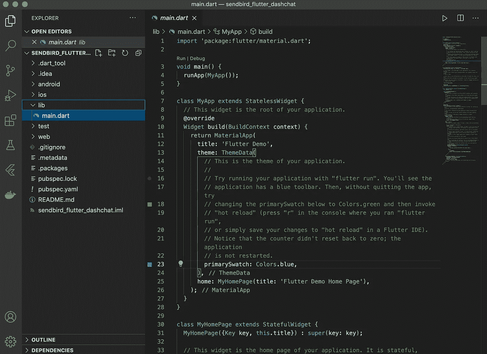
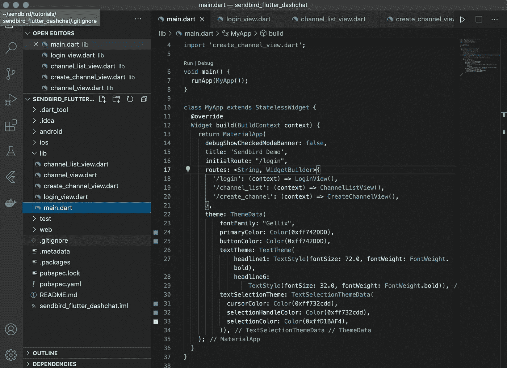
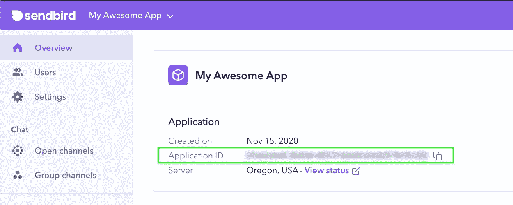
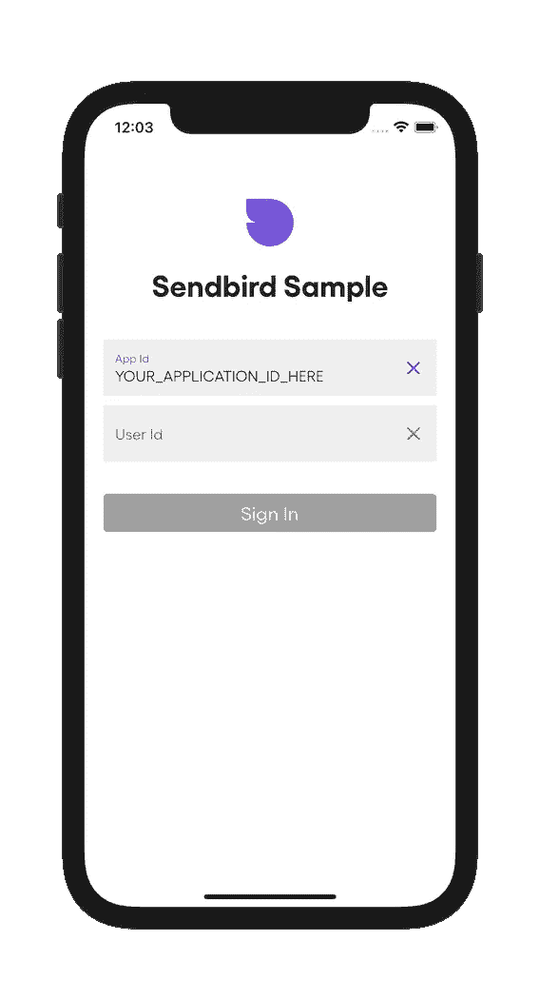
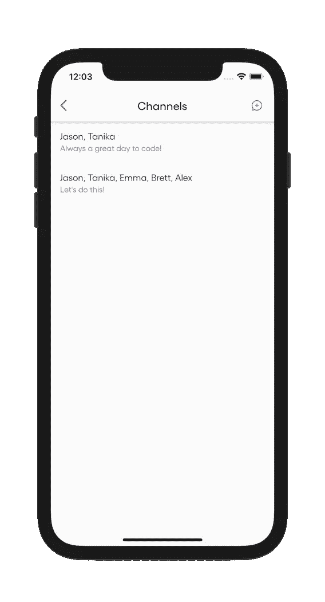
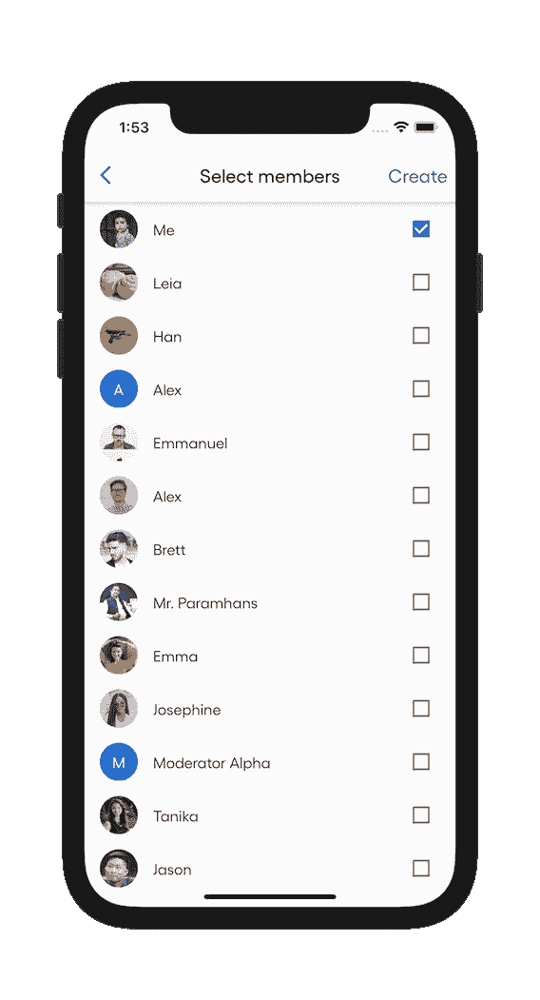
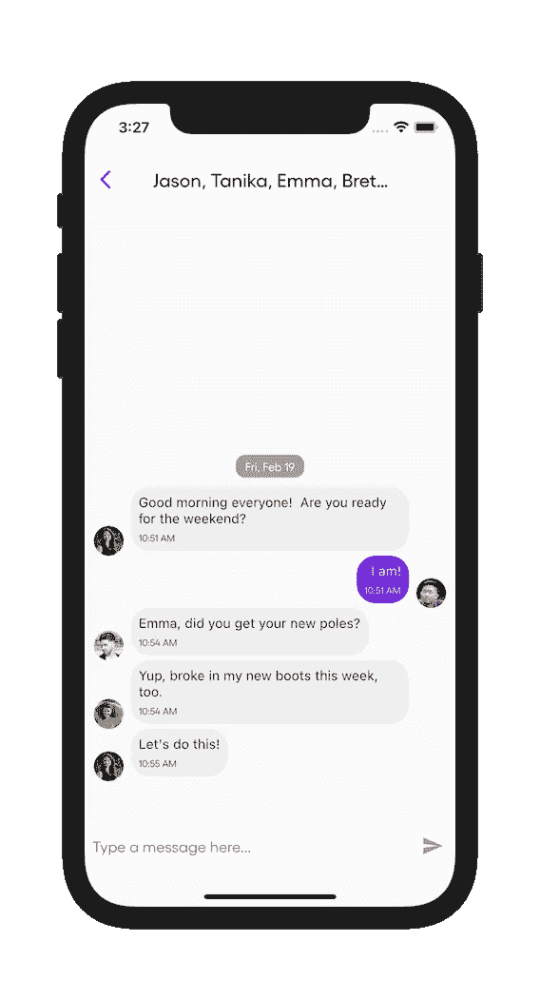

# 如何用 Sendbird 和第三方 ui 构建一个 Flutter 聊天应用

> 原文：<https://medium.com/codex/how-to-build-a-flutter-chat-app-with-sendbird-and-3rd-party-uis-e1c9a68fd88d?source=collection_archive---------2----------------------->

由谷嘉诚
开发商代言| [仙鸟](https://www.sendbird.com)

*查看一个颤振聊天 app 的* [*样本代码*](https://github.com/sendbirdcommunity/sendbird-flutter-dashchat-demo) *，我们的* [*颤振聊天文档*](https://sendbird.com/docs/chat/v3/flutter/quickstart/send-first-message) *，以及一个应用内聊天的* [*演示*](https://sendbird.com/features/chat-messaging) *。*

# 介绍

本教程将演示如何集成新的 Sendbird Flutter SDK 和 DashChat UI 插件。它将提供一个基本的聊天体验，以纳入您的应用程序。

Sendbird 和 DashChat 有许多特性，但是我们将限制我们的范围以保持本教程的基本性。本教程结束时，您将能够:

*   将 Sendbird Flutter SDK 添加、初始化并连接到 Flutter 应用程序
*   显示用户所属的聊天频道列表
*   创建新的聊天频道
*   将 Sendbird 与 DashChat 集成以显示一个交互式聊天频道

为了让本教程尽可能容易理解，我们将使用 Flutter 的默认继承窗口小部件进行状态管理，并将每个视图的逻辑组合在同一个视图中。dart 文件。

我们开始吧！

# 什么是颤振？

[Flutter](https://flutter.dev/) 是一个用 [Dart](https://dart.dev/) 编写的开源跨平台开发框架，Dart 是一种旨在开发高性能 web 应用的 C 风格语言。使用 Flutter，可以为 iOS、Android、macOS、Windows 和 Linux 开发应用程序。你也可以在 Chrome、Firefox、Safari、Edge 以及物联网或智能设备上构建 web 应用。

# 什么是 Sendbird Flutter SDK？

通过[**Sendbird SDK for Flutter**](https://pub.dev/packages/sendbird_sdk)，您可以高效地将实时聊天集成到您的 iOS 和 Android 部署应用中。该 SDK 支持 [**开放通道**](https://sendbird.com/docs/chat/v3/flutter/guides/open-channel) ， [**组**](https://sendbird.com/docs/chat/v3/flutter/guides/group-channel) ， [**超组**](https://sendbird.com/docs/chat/v3/flutter/tutorials/supergroup-channel#1-supergroup-channel) 通道。本教程将重点放在组通道。

# 为什么要使用第三方聊天界面？

重用预先存在的聊天 UI 代码或库可以比从头开始构建更快地启动和运行聊天。

# 什么是 DashChat？

[**DashChat**](https://pub.dev/packages/dash_chat) 是由[**fayed Pawaskar**](https://github.com/fayeed)开发的一个流行的聊天 UI 库。这个可扩展的库为两个或更多个人之间的小组对话提供了一个您通常期望的接口。DashChat 的插件包括个人资料图像头像、众多界面触发器、自定义颜色的能力以及消息渲染。

既然我们已经解释了上下文，让我们直接进入代码构建。

# 第一步。添加依赖关系

在您的 Flutter 项目的 pubspec.yaml 文件中，添加 Sendbird 和 DashChat 依赖项:

接下来，单击保存或手动运行 CLI 命令`flutter pub get`

如果您遇到任何问题，请参见 Flutter 的官方文档中关于添加包的内容。

# 第二步。设置

我们要做的第一件事是创建一个新的空的 Flutter 项目。如果您使用的是 Flutter CLI，请运行以下命令:

`flutter create sendbird_flutter_dashchat`

如果您使用的是 Visual Studio 代码，新的空白项目将如下所示:

我们最终将需要四个额外的视图，所以我们将在这里剔除它们，以便在构建时运行应用程序。要在 Visual Studio 代码中添加文件，右键单击 **lib** 文件夹，选择**新文件**并将其命名为 **login_view.dart** 。

然后添加以下代码:

对这些附加文件重复此过程:

*   **channel_list_view.dart**
*   **create _ channel _ view . dart**
*   **group_channel_view.dart**

然后用以下 MaterialApp 选项替换 **main.dart** 文件的全部内容，以利用这些类:

Visual Studio 代码中的项目窗格现在应该如下所示:

# 第三步。正在初始化 Sendbird

在使用 Sendbird 插件进行任何调用之前，请确保使用

`import 'package:sendbird_sdk/sendbird_sdk.dart';`

要使用上述别名初始化库，请将您的应用程序 ID 传递给 singleton 构造函数:

`final sendbird = SendbirdSdk(appId: "your_app_id");`

选择一个项目后，可以在[仪表盘](https://dashboard.sendbird.com)上找到您的应用 ID:

# 第四步。正在连接到 Sendbird

需要 Sendbird 用户 id 来区分不同的用户。这些用户 id 可以是您的身份验证系统使用的任何唯一的字符串。使用此 ID 连接你的应用的当前用户:

`final user = await sendbird.connect("unique_user_id");`

这可以与前面的 init 语句合并成一个函数:

这可以添加到对 **login_view.dart** 类的覆盖中，然后在成功时推送 **channel_list_view.dart** 。

为了方便和加快速度，为登录视图复制并粘贴最后的[代码](https://github.com/SendbirdCommunity/sendbird-flutter-dashchat-demo/blob/main/lib/login_view.dart)。

该法规定:

*   用于输入 Sendbird 应用程序 ID*的文本字段
*   用于手动输入 Sendbird 用户 ID*的文本字段
*   “登录”按钮启动上面的初始化和连接功能

*注:要创建查找您的应用程序 ID 或通过 Sendbird 仪表板设置用户，请参见 [**此 Sendbird 一分钟视频**](https://youtu.be/QCS0eyO2Q3U) 。

# 第五步。显示频道

既然 SDK 已经初始化并连接到 Sendbird，让我们填写 **channel_list_view.dart** ，这样它就可以:

*   显示用户所属的所有 [**群组频道**](https://sendbird.com/docs/chat/v3/flutter/guides/group-channel) 的列表
*   触发对**create _ channel _ view . dart**的推送
*   选择其中一个频道，按下 **channel_view.dart**

完成后，我们应该会看到类似这样的视图:

我们将通过以下方式设置类文件:

1.  添加`import "package:sendbird_sdk/sendbird_sdk.dart";`
2.  用[**channel eventhandler**](https://sendbird.com/docs/chat/v3/flutter/ref/handlers_channel_event_handler/ChannelEventHandler-class.html)mixin 扩展视图状态。
3.  在 **initState()** 函数的覆盖中连接一个 Sendbird[**addChannelEventHandler**](https://sendbird.com/docs/chat/v3/flutter/ref/sdk_sendbird_sdk_api/SendbirdSdk/addChannelEventHandler.html)。

初始的类文件如下所示:

获取当前用户所属的所有频道列表的最快方法是使用 Sendbird[**groupchannelistquery**](https://sendbird.com/docs/chat/v3/flutter/guides/group-channel#2-retrieve-a-list-of-channels)。

这个查询可以打包成一个异步函数，如下所示:

可以从 FutureBuilder 中调用它来构建 ListView:

创建新的频道需要从列表中选择用户，所以接下来我们将创建另一个类来显示和处理它。现在，我们将添加一个 appBar，它带有一个推送视图的动作:

我们现在可以用上面创建的 FutureBuilder 和 appBar 小部件来更新我们的 scaffold 存根了:

查看该类的[最终代码](https://github.com/SendbirdCommunity/sendbird-flutter-dashchat-demo/blob/main/lib/channel_list_view.dart)。

# 第六步。创建新频道

现在，让我们完成**create _ channel _ view . dart**以便它:

*   检索并显示 Sendbird 用户列表
*   允许选择或取消选择用户
*   创建包含所选用户的新群组频道

完成后，视图应呈现如下:

首先将以下属性添加到**Class _ CreateChannelViewState 扩展状态{}** 块中:

`final Set _selectedUsers = {};
final List _availableUsers = [];`

这些属性将存储我们可以从中选择的用户列表以及用户选择的用户列表。

为了获得可用用户的列表，我们将使用[**ApplicationUserListQuery()**](https://sendbird.com/docs/chat/v3/flutter/ref/query_user_list_query/ApplicationUserListQuery-class.html)返回一个 Sendbird**用户的列表，我们将从 **initState()** 调用这些用户来预填充我们的列表。**

**使用[**CheckboxListTiles**](https://api.flutter.dev/flutter/material/CheckboxListTile-class.html)用列表视图显示用户列表，这样我们就有了一个可视的切换，用户将被添加到新频道。**

**要创建新的聊天频道，请使用[**group channel . create channel()**](https://sendbird.com/docs/chat/v3/flutter/ref/core_channel_group_group_channel/GroupChannel/createChannel.html)函数，方法是传入一个用用户 ID 字符串列表填充的[**GroupChannelParams**](https://sendbird.com/docs/chat/v3/flutter/ref/params_group_channel_params/GroupChannelParams-class.html)对象。让我们将它放入自己的函数中，稍后我们可以通过 appBar 操作调用它:**

**现在添加一个触发这个 **createChannel()** 函数的 appBar:**

**注意，我们将一组 **_selectedUsers** 转换成了一个用户 id 列表。**【for(最终用户 in _ selected users . to list())user . userid】****

**像前面一样，我们现在可以在 **build()** 函数中更新支架存根:**

**你可以查看这个类的最终代码。**

# **第七步。与 DashChat 集成**

**最后更新的文件是**group _ channel _ view . dart**。完成后，我们将能够:**

*   **两个或更多用户之间的实时聊天**
*   **显示头像图像(如果图像已分配给用户)**

**完成后，该视图应该如下所示:**

****

**通过以下方式设置此文件:**

1.  **添加`import "package:sendbird_sdk/sendbird_sdk.dart";`**
2.  **添加`import "package:dash_chat/dash_chat.dart"`**
3.  **添加一个 **GroupChannel** 属性和一个初始化器，以便在构造函数中填充该属性**
4.  **用[**channel event handler**](https://sendbird.com/docs/chat/v3/flutter/ref/handlers_channel_event_handler/ChannelEventHandler-class.html)mixin 扩展视图状态。**
5.  **在 **initState()** 函数的覆盖中连接一个 Sendbird[**addChannelEventHandler**](https://sendbird.com/docs/chat/v3/flutter/ref/sdk_sendbird_sdk_api/SendbirdSdk/addChannelEventHandler.html)**
6.  **向 **_GroupChannelViewState** 添加一个 **List _messages = []** 属性来存储消息**
7.  **添加 **onMessageReceived()** 覆盖函数，以在检测到新消息时更新 **_messages** 属性**

**首先，通过调用[**getMessagesByTimestamp()**](https://sendbird.com/docs/chat/v3/flutter/ref/core_channel_base_base_channel/Messages/getMessagesByTimestamp.html)函数，对传入的 GroupChannel 对象中的现有消息进行解包。这需要两个参数:**

1.  **unix 纪元的 int 形式的时间戳**
2.  **[**messagelist params**](https://sendbird.com/docs/chat/v3/flutter/ref/params_message_list_params/MessageListParams-class.html)对象**

**MessageListParam 允许您自定义要返回的消息的范围。我们现在将使用缺省值。一旦我们有了消息，我们将在一个方便的函数中更新我们的 **_messages** 属性，我们可以在初始化期间调用这个函数。该类现在应该如下所示:**

**要使用 DashChat 小部件，当前 Sendbird 用户和 Sendbird 消息都需要转换为 DashChat 用户和 DashChat 消息。包括这些便利功能。**

**现在我们可以创建一个 DashChat 小部件:**

**注意，在 **onSend** DashChat 属性中，我们调用 Sendbird 的 group channel[**sendUserMessageWithText()**](https://sendbird.com/docs/chat/v3/flutter/ref/core_channel_base_base_channel/Messages/sendUserMessageWithText.html)函数来实际传递消息。**

**我们现在可以用这个和一个显示所有通道成员名称的默认 appBar 来替换 scaffold 存根:**

**这是这个班级的最终代码。**

# **结论**

**本教程演示了如何将 Sendbird Flutter SDK 与 DashChat 集成，并将聊天功能构建到您的应用程序中。请记住，还有更多 Sendbird 和 DashChat 功能可以添加到您的应用程序中，例如:**

*   **长时间新闻事件**
*   **头像触摸事件**
*   **头像长按事件**
*   **自定义输入**
*   **反应**
*   **图像和文件处理**
*   **打字指示器**

**有关我们的 SDK 支持的 Sendbird 功能的完整摘要，以及对您的旅程有所帮助的其他资源，请查看我们的 [**官方文档**](https://sendbird.com/docs/chat/v3/flutter/quickstart/send-first-message) 。**

**恭喜你！您正在为您的 Flutter 应用程序添加功能丰富的聊天功能。**

**编码快乐！💻**