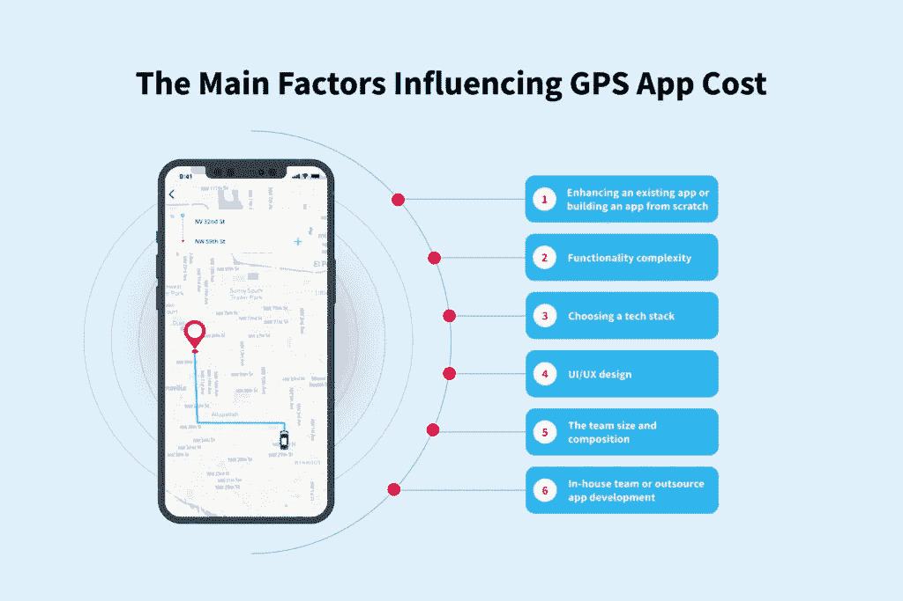

# 如何建立一个 GPS 应用程序:技术要求和陷阱解释

> 原文：<https://medium.com/codex/how-to-build-a-gps-app-tech-requirements-pitfalls-explained-nix-united-d2a0b514b3b5?source=collection_archive---------8----------------------->

您想从头开始创建一个 GPS 应用程序，或者用基于位置的技术增强现有的应用程序。出现的问题是如何构建一个成功的 GPS 应用程序。市场研究、技术组合、功能、测试、供应商、时间框架、预算、发布——需要做出决策的范围非常广泛。挑战不仅在于创建一个具有许多有用功能的多级应用核心，还在于在您的预算范围内与可靠的技术合作伙伴一起开发一个强大且高要求的应用。你最后怎么开始吃这头大象？

关于 GPS 应用程序，您应该知道的第一件事是，它们有机会通过提供新的商业机会、提升客户体验和扩大您的目标受众来为您带来丰厚的收入。导航技术正在兴起，因为它概念简单，用途广泛，从送比萨饼到在海洋和太空中进行位置跟踪。没有必要模仿现有的移动应用来设计你的商业理念。GPS 远不仅仅是日常生活需求的标准解决方案，而是创新的舞台。看看“没有比家更好的地方”品牌的所有者，他们创造了一种 GPS 鞋，可以在鞋跟点击三次后引导一个人回家。

GPS 跟踪应用程序的开发可能是一个真正的挑战，但了解这些步骤的后果并拥有一个可靠的技术合作伙伴将会把你的想法变成一个受欢迎的应用程序，可以达到市场的顶端。以下是如何建立一个高要求的 GPS 应用程序的具体步骤。

# 什么是 GPS 技术？

全球定位系统(GPS)是为世界任何地方的用户处理导航、精确位置和定时信号的高级工具。这项技术让我们在一点上同步人、对象和服务。

GPS 是在卫星基础上运行的跟踪单元。它全天候工作，并且需要订阅费。GPS 信号最初被用作美国的秘密军事单位，后来被转变成每个人都可以使用的日常工具。在过去的十年中，它的发展得益于信息技术的快速发展、商品化以及提供强大无线解决方案的小工具的小型化。需求和可用性推动创新者和公司创造产品和服务，为人们提供技术便利，提高生产力，节省时间和金钱等资源。

# GPS 跟踪应用市场的容量

全球 GPS 应用市场潜力巨大——其规模在 2021 年已经达到近 10 亿美元，预计在 2025 年达到 15 亿美元(T2)。[移动应用开发的主要趋势](https://nix-united.com/blog/top-14-mobile-app-dev-trends-that-will-change-business/)由于按需云技术、电信、物联网、人工智能、增强现实等，推动导航平台的增长。

每个行业在 GPS 领域都有自己的机会。你可以在真实的项目中看到这一点，这些项目从像你今天这样的想法开始。

# 按需服务

如今，像出租车和快递这样的按需服务越来越受欢迎。打车应用需要特定的功能，如连接乘客和附近的司机，提供实时位置跟踪，智能地图和旅行时长。送货应用程序需要选项来订购食物、在地图上看到快递员的位置、检查送货时间等。[优步](https://www.uber.com/)、[妖孽吃](https://www.ubereats.com/)、[佐玛托](https://www.zomato.com/)是这个领域最大的玩家。例如，Uber Eats 的收入在 2021 年超过了 50 亿美元，拥有近 7000 万用户。在这里你可以学到更多关于如何建立一个比优步更好的 GPS 应用程序。

# 汽车和物流

GPS 能力广泛应用于公共交通和车队管理，例如 [Onfleet](https://onfleet.com/) 、 [Geotab](https://www.geotab.com/) 和 [Moovit](https://moovit.com/) 。导航服务已经从只显示位置和路线的基本功能发展到具有天气和交通警报、交通堵塞时的路线优化、位置共享、多站等易于使用的应用程序。现在，如果你想知道如何制作一个拥有数百万用户的 GPS 应用程序，下面的公司知道如何做:

*   [谷歌地图](https://www.google.com/maps/)使用简单，用户友好，经常更新，有卫星和 360°街景，具有增强现实和实时交通，行程进度共享，集成谷歌助手。
*   [Badger Maps](https://www.badgermapping.com/) 为现场销售人员管理日常会议和路线优化工作。
*   [与谷歌地图相比，Waze](https://www.waze.com/) 有一个带有高级定制选项的简约界面。
*   [Maps.me](https://maps.me/) 离线可用，电池消耗低，百万用户每日更新。他们的地图是摄影和迷人的。
*   Komoot 为练习运动的人提供了许多功能，如离线地图和探索未开发区域的能力。
*   [北极星 GPS 导航](https://play.google.com/store/apps/details?id=com.discipleskies.android.polarisnavigation&hl=en&gl=US)是一款内置指南针，用于户外活动，如小径、航海旅行、越野徒步旅行和日落/日出跟踪。

# 零售

像[宜家](https://www.ikea.com/)、[塔吉特](https://www.target.com/)和[沃尔玛](https://www.walmart.com/)这样的大型零售店使用地理追踪应用来扩大他们的店内基地。他们的客户可以找到最近的商店，选择送货服务或方便的取件服务。为客户提供准确的室内和室外定位和完整的设计是提高销售额的关键。

# 旅游业和酒店业

预订应用在 2021 年已经达到 5000 万次下载。以下是成功的旅行应用程序示例:

*   连锁酒店也可能有自己的应用，比如[万豪](https://www.marriott.com/)。
*   [ByHours](https://www.byhours.com/en.html) 用于当天按小时住宿。
*   一晚提供未售出的房间和当晚住宿的优惠。

# 建筑

地理定位广泛应用于建筑工地。例如， [HubStaff](https://hubstaff.com/) 应用程序可以通过 GPS 位置跟踪检查时间和进度，并使用地理围栏来创建工作现场并提高现场生产率，从而防止返工。

可以实现基于地理的增强现实，以帮助对建筑工地上的整个建筑物和单独组件进行 3D 可视化。

# 电子商务

许多人整天都在移动设备上度过。电子商务成功地利用这种能力来提高销售额。零售商可以提供相关的报价并交付所需的服务。[全球速卖通](https://www.aliexpress.com/)，[易贝](https://www.ebay.com/)，[亚马逊](https://www.amazon.com/)是这里的领头羊。2021 年初，亚马逊达到 1090 亿美元，拥有 190 万卖家。

# 社会化媒体

像 Instagram 和脸书这样的社交媒体积极地整合了 GPS 功能，比如帖子的地理标签、向相关受众显示广告、寻找和添加朋友等。

# 运动

健康公司也是地理定位应用的粉丝，例如 [Nike+](https://www.nike.com/) 、 [Strava](https://www.strava.com/) 、 [Runtastic](https://www.runtastic.com/) 、 [Runkeeper](https://runkeeper.com/) 、[和 MyFitnessPal](https://www.myfitnesspal.com/) 。他们跟踪你的实时路线和速度，并帮助你与你所在地区的其他跑步者联系。你可以在社交媒体上分享你的成就。MyFitnessPal 已经发展到 2 亿用户，2021 年收入 1.28 亿美元。

# 比赛

如果你的公司开发游戏，实施全球定位系统将增加活力和社会互动，并将玩家团结在一起。《精灵宝可梦 Go》是一个疯狂成功的例子，收入近 8 亿美元。实时社交互动是一个制胜因素。

# 物联网

物联网是一个创新领域，在智能手表、健身可穿戴设备、宠物护理应用程序(如[宠物侦察员](https://pawscout.com/))和行李定位器应用程序(如 [LugLoc](https://www.lugloc.com/) 等)中使用导航。

# 其他的

GPS 追踪应用行业不仅仅是传统的谷歌地图。这种类型的技术可以用于非商业目的，如跟踪执法、社会影响、公共安全和救灾、医疗机器人等。以下是一些非营利的 GPS 项目:

*   OCEARCH 组织在白鲨身上贴上 GPS 标签，如果鲨鱼靠近海岸，就提醒人们和当地救生员。
*   药店小偷可能会因为像奥施康定这样的止痛药的 GPS 追踪而被抓。
*   GPS 跟踪用于照顾穿着 GPS 鞋的阿尔茨海默病和痴呆症患者。护理人员可以在应用程序中查看其家庭成员的位置。

# 如何制作强大的基于位置的应用程序的步骤

问题是如何创建一个高效的、吸引用户的、市场上有需求的基于位置的应用程序。开发 GPS 追踪应用程序是一系列相互关联的过程。雇佣合适的开发团队将把你的项目引向[包装良好的移动产品](https://nix-united.com/blog/5-essential-stages-of-mobile-app-development/)，拥有强大的技术栈和高观众参与度。如何构建 GPS 应用程序的步骤如下:

# 1.市场和目标受众研究

从市场探索开始-分析竞争对手、他们的方法、商业策略、提供的服务和使用的技术。有一个核心想法很好，但对于一个强有力的发布来说还不够。申请业务分析师将使你理解需要付诸行动的需求和任务，有助于提高软件产品的远景，并设定其在市场上的增长向量。

# 2.选择一个技术堆栈——iOS 或 Android

技术栈结合了操作系统、框架、库、编程语言和开发应用程序所需的其他工具。选择 Android 还是 iOS 取决于许多因素，例如:

*   目标受众、产品目的、货币化类型等。
*   Android 可以在多种设备上运行，包括不同品牌的智能手机和平板电脑、电视、汽车音响系统等。，这扩大了潜在的市场规模。iOS 仅与苹果设备兼容，但这些设备的所有者比安卓用户更经常进行应用内购买。
*   Android 在更多类型的设备上支持更多的操作系统版本，这就是为什么 Android 应用程序开发可能比 iOS 需要更多的时间和更多的预算。iOS 开发者对苹果设备使用单一风格准则；这可能会加快应用程序的开发。
*   苹果对其应用审核流程的要求更为严格，因此相比 Google Play，从 App Store 下载有问题应用的几率更少。然而，最近 Android 也收紧了应用程序安全规则。这条线相当模糊，因为两者都旨在为用户创造安全的体验。

Android 和 iOS 是对立的操作系统，各有利弊。在选择技术组合时，您主要需要考虑产品本身、其特性、用途和目标受众。

# 3.MVP 作为第一次真正的检查

最小可行产品(MVP)将是你的项目的第一个真正的介绍。它的功能很基本，但足以提供功能并满足目标受众的需求。MVP 阶段是可选的，但是实现它是合理的，因为它为企业提供了许多优势。以下是 MVP 的一些目标:

*   关注产品的核心功能，不要添加超出规格的功能
*   在最短的时间和预算内测试业务概念
*   开始项目需要业务分析，但是来自真实用户的反馈提供了更有效的开发。在 MVP 阶段，你可能会从早期采用者那里得到反馈，这些反馈将被用来把一个应用变成一个 100%面向客户的产品。
*   它提供了更快发布和系统假设验证的能力。
*   MVP 确保以最小的时间和金钱风险进行开发。打磨大型项目需要花费大量的时间和金钱。这就是为什么通过逐步测试和升级来申请 MVP 是构建高需求 GPS 应用程序的正确解决方案。

# 4.QA 永远是合理的

QA 旨在检查应用程序的功能是否响应及时并符合规范，测试其在特定工作负载下的性能，验证与各种操作系统和设备的兼容性，检查应用程序在使用中的用户友好性和直观性，通过安全边界等。GPS 跟踪应用程序的测试是一个复杂的过程，因为有许多因素影响导航精度——从行驶速度到天空的多云程度。在所有类型的测试后，团队会得到一份报告，其中包含 QA 结果，包括一系列错误和应用程序改进建议。

# 5.系统抛光

在从不同方面测试了一个应用程序并得到建议后，你的团队需要修改功能，消除错误，使应用程序更直观，等等。范围取决于前一阶段获得的结果。

# 6.启动并发布您的解决方案

当你的地理定位应用程序完成后，是时候在 Google Play 市场和/或苹果应用商店等移动应用商店发布了。如果计划运行更多的测试，您可以发布一个 beta 模式。

# 7.发布后维护

应用程序需要定期更新，因为 SDK 映射会发生变化，移动操作系统更新可能会破坏某些功能。不断更新的功能将让您紧跟未来技术和市场需求的潮流。

许多公司已经在业务中实现了地理定位功能，并成功地从中获益。如果你还有关于 GPS 应用开发的问题，[联系 NIX United](https://nix-united.com/blog/how-to-build-a-gps-app-tech-requirements-pitfalls-explained/#contact-us) 。

# GPS 应用程序的挑战，或者如何构建一个 GPS 应用程序而不失败

要解决的主要问题是如何创建一个基于位置的应用程序，而不是落在终点线上。统计显示，只有[1/3 的用户会在下载](https://www.statista.com/statistics/751532/worldwide-application-user-retention-rate/)后返回某个 app。[四分之一的访问者在一次之后就放弃了申请](https://uplandsoftware.com/localytics/resources/blog/25-of-users-abandon-apps-after-one-use/)。因此，你只有一次机会用你的想法和产品的功能打动大众。当像 Waze 这样的其他公司取得巨大进步时，大量的想法由于在产品的达成、交付、执行和包装方面的错误而失败。

Waze 是一个地理定位应用程序，于 2008 年推出，名为“LinQmap”，筹集了 5500 万美元的资金。2013 年，谷歌以 11 亿美元收购了 Waze。因此，主要问题是如何制作一个 GPS 应用程序，接触到您的观众，并给出令人印象深刻的表现。要实现 Waze 这样的指标，必须解决更深层次的挑战:

# 为应用功能收集个人信息

当 30%的用户在分享数据时要求完全隐私时，将近 57%的人愿意公开他们的地理位置。这就是为什么应用程序开发人员在数据处理的目的、使用规则和存储方面对用户保持透明至关重要。解释为什么需要获得用户的许可。提供附加价值作为 GPS 信息的交换是打击隐私异议的一种方式。

个人数据必须是安全的。这个关键任务可以通过高级安全协议和安全测试措施的实施的组合来提供。

# 参与以获得期望的受众行为

应用参与度低是[移动开发](https://nix-united.com/services/mobile-app-development/)的常见问题。游戏化、实时交流、通过社交媒体分享信息、个性化、相关通知和奖励快速、有机地增加了用户的参与度。例如:

*   Waze 使用游戏化、头像、排行榜等功能和徽章奖励系统。
*   [GasBuddy](https://www.gasbuddy.com/) 利用排行榜和竞争力，奖励用户报告当地加油站的价格。这些积分可以兑换成礼品卡、奖券等。
*   [StriveCloud](https://strivecloud.io/) 追踪个性化里程碑，并根据客户的进展和活动给予奖励。该应用程序在正确的时间发送相关信息——它以有利可图的方式修改观众行为并激活项目的参与触发器。

# 位置跟踪的背景模式

位置跟踪的后台模式将补充应用程序的技术和功能，主要是如果你的 GPS 平台依赖于本地通知。与谷歌助手或 Siri 的语音集成将是一个应用程序的优势。

# 节约能源消耗

如果不进行优化，使用地理定位应用程序时的电池消耗相当高。这个问题可以通过批量地理请求、关闭不必要的更新、控制 GPS 精度等来解决。

# 地理精度至关重要

在基于位置的应用开发中，准确的位置显示是决定性的。路线的扭曲可能包括波浪线而不是直线，在错误的点穿过建筑物或水域等。这些违规必须在技术上预见到，例如，通过使用来自 Google 的融合位置提供商 API，以及通过指定地理数据的更新频率。苹果自动实现这个功能。

# 消除弱点

需要对框架和库之类的第三方入口中的所有漏洞进行筛选。挑战在于揭示安全漏洞并消除麻烦点。传输中的安全通信是通过加密和安装来自可信机构的 SSL 证书来提供的。应使用高级加密算法对敏感数据进行加密，以确保数据存储的安全。

如你所见，构建导航应用不仅包括遵循和实现技术要求，还包括考虑广泛的深层问题和挑战，以确保竞争优势结果。

# 创建一个基于位置的应用程序需要多少成本？

一个应用程序需要补充和添加的核心功能越多，软件开发的成本就越高。以下是可能影响应用程序整体成本的项目:

# 增强现有应用程序或从头构建应用程序

费用将在很大程度上取决于您是需要增强现有应用程序的能力，还是从头开始创建应用程序。

# 功能复杂性

一个应用程序的功能越多，它的价格就越贵。GPS 应用程序可能包括推送通知、音频和视频流、支付网关、在线和离线模式、外部设备连接、第三方集成、高级分析、聊天、广告等。

# 选择技术组合

Android 和 iOS 平台上的开发速率都在同一费用范围内。Android 通常需要兼容比 iOS 更广泛的设备、操作系统和版本。因此，由于任务范围更广，Android 可能会有更高的费用。

# 用户界面/UX 设计

UI/UX 设计的成本可能会有所不同，这取决于 UI 套件的复杂性、视觉层次、屏幕数量、是否会有现代图形元素或动画等。

# 团队规模和组成

从零开始构建一个应用程序需要一个多达 10 人的团队，通常担任以下角色:业务分析师、项目经理、UI/UX 设计师、Android 和 iOS 平台的应用程序开发人员、后端和前端开发人员、QA 工程师等。团队越大，预算越多。应用程序开发服务的小时费率也取决于团队的位置和经验。

# 内部团队或外包应用开发

你有两个选择——创建一个内部团队或外包应用程序开发。选择建立自己的团队总是会导致额外的支出，如购买设备、支付租金、耗时的招聘流程和现场员工管理。你无法避免这些巨大的开支，尤其是如果你是一家持续增长的公司。

如果你决定外包，注意团队的经验、相关的投资组合、认可、证书、组成、法律实践和服务定价。将开发外包给有经验的软件提供商会为您的企业带来广泛的优势:

*   通过提供端到端服务，覆盖所有任务
*   使用最新的技术解决方案为各种业务领域开发应用程序的专业知识
*   随时准备工作的团队来处理您的项目，而无需浪费时间来搜索、检查、雇用和更新人员
*   强大的项目管理

综合考虑以上各项，你会得到最终的基于位置的 app 开发预算。在这里你可以了解更多关于[制作一个应用需要多少钱。](https://nix-united.com/blog/how-much-does-it-cost-to-make-an-app-a-simple-answer-to-a-complex-question/)

# NIX 联合地理定位应用专家

创建一个地理定位应用程序似乎是一项艰巨的任务，但是有一个熟练的技术合作伙伴在身边，你的想法将转化为一系列准确的技术目标、固定的时间框架和透明的预算。

NIX United 知道如何在熟练人才库的帮助下构建一个强大的 GPS 应用程序。我们在类似优步的应用程序开发方面有很高的专业知识。实时数据和智能地图功能被实现到一个多功能出租车应用程序中。我们还为[在线食品配送服务](https://nix-united.com/success_stories/online-food-delivery-service/)开发了一款应用，其客户是欧洲最大的在线食品订购和配送市场之一。NIX 团队创造了一个[高负载&实时位置跟踪器](https://nix-united.com/success_stories/high-load-real-time-location-tracker/)，以及许多其他项目。我们的经验和专业知识让我们确信我们知道如何创建高效的 GPS 应用程序。

# 结论

GPS 在同一时间同一地点连接人、物体和服务。高需求使地理定位成为一项新兴技术——数十亿美元的收入不是空洞的承诺，而是现实。按照上述步骤，你将设定目标，然后一点一点地吃掉 GPS 应用程序大象。GPS 是创新解决方案的舞台，将您的业务提升到一个全新的水平。NIX United 可以成为您可靠的技术合作伙伴，因为我们知道如何将想法转化为实际产品。

*原载于 2021 年 11 月 17 日*[*https://nix-united.com*](https://nix-united.com/blog/how-to-build-a-gps-app-tech-requirements-pitfalls-explained/)*。*