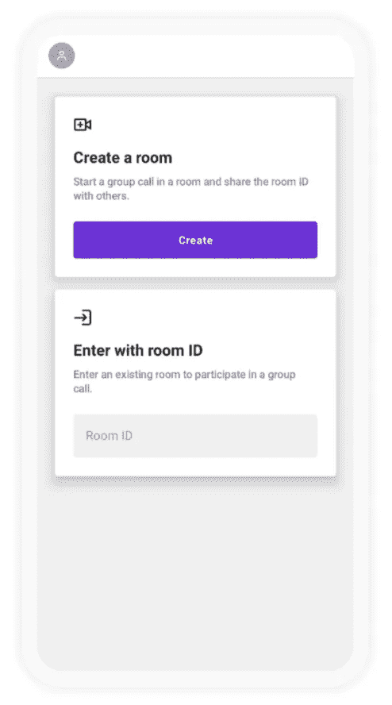
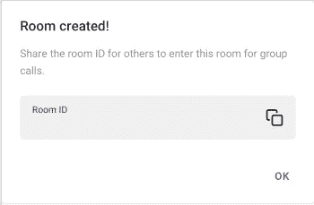
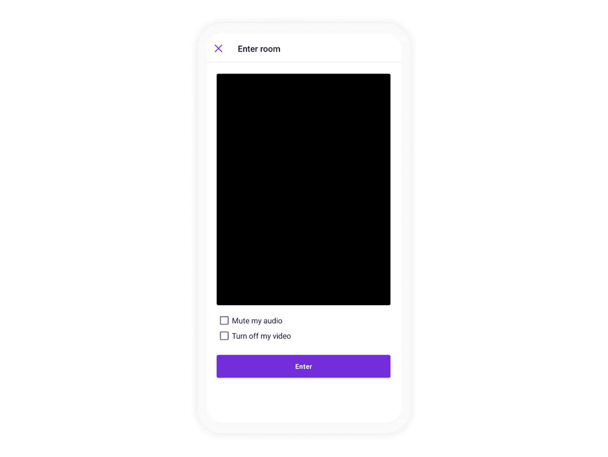
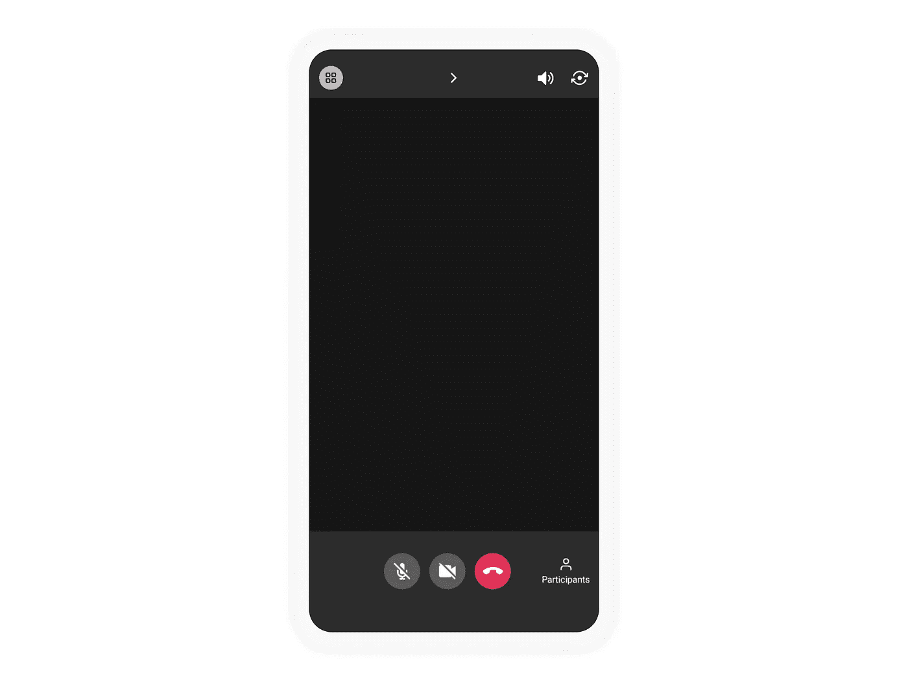
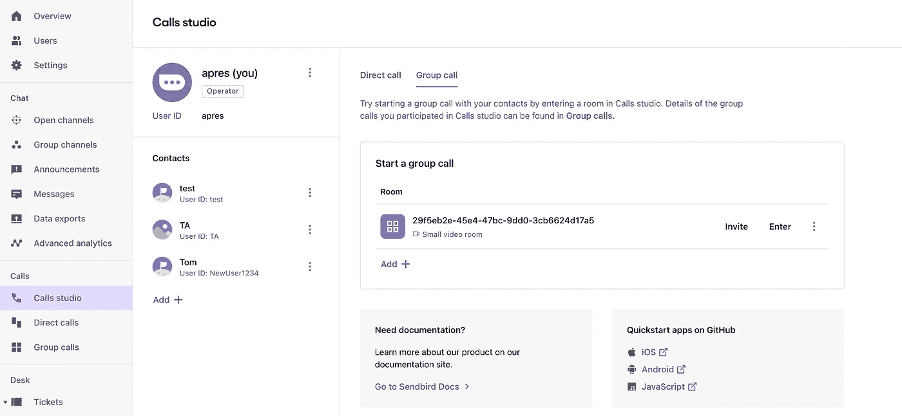
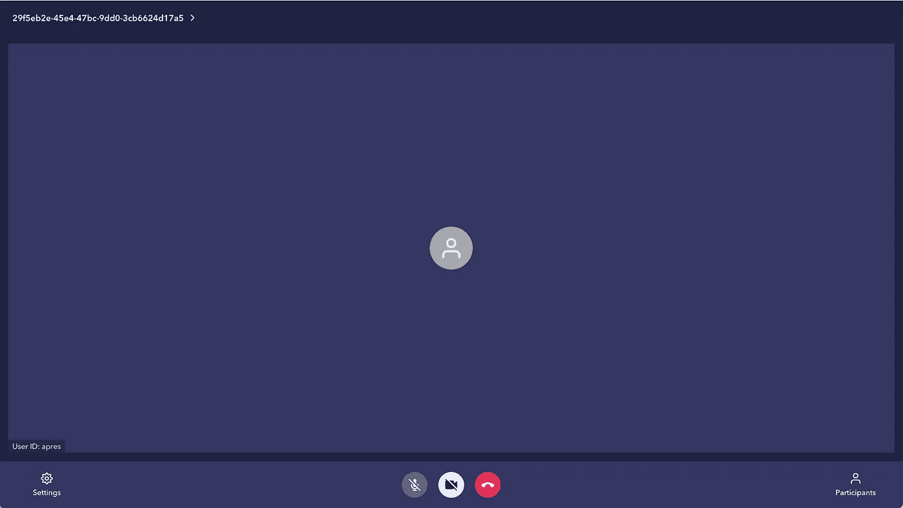
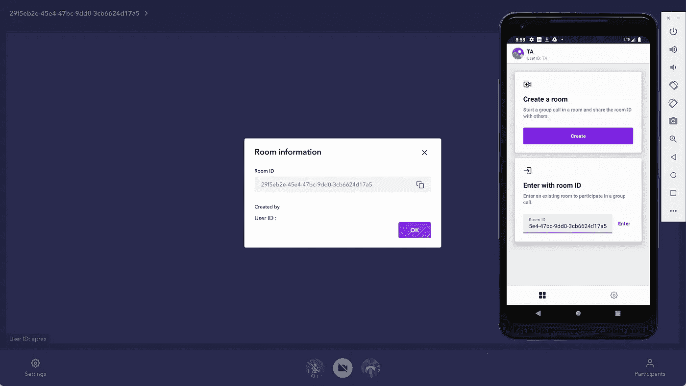
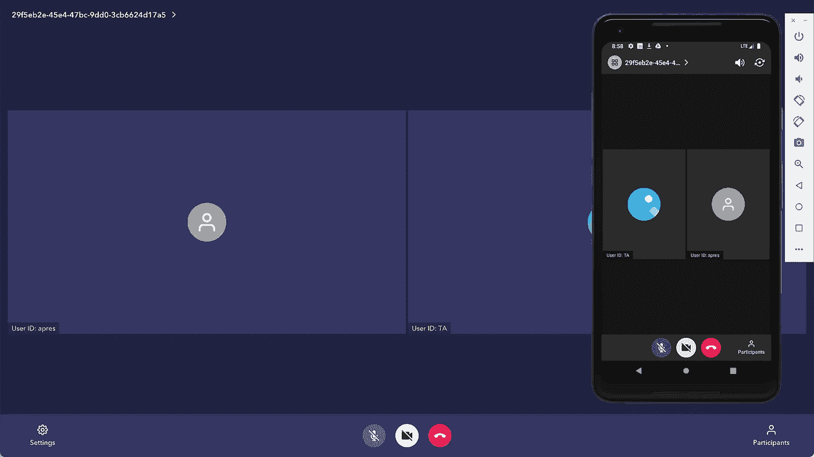

# 如何搭建一个 Kotlin 视频群聊 app

> 原文：<https://medium.com/codex/how-to-build-a-kotlin-video-group-chat-app-cbc918942069?source=collection_archive---------6----------------------->


仙鸟 2022

## 构建用户界面和实现丰富、有趣的应用内视频通话的指南

解决方案工程师| [Sendbird](https://www.sendbird.com)

*您可能会发现下载我们的示例应用程序很有用。如需更多指导，请查看我们的* [*文档*](https://sendbird.com/docs/calls/v1/android/guides/group-call#1-group-call) *。有关 Sendbird 调用的更多信息，请参见此* [*页*](https://sendbird.com/features/voice-and-video) *。*

> *为了第一时间了解新教程、开发者相关聊天/电话发布以及其他重要更新，* [*注册*](https://get.sendbird.com/dev-newsletter-subscription.html) *获取我们的开发者简讯。*

# 介绍

在 Sendbird 推出 1:1 语音和视频后，我们迅速提供了群组呼叫，以提供与我们的群组聊天功能相当的服务。目前，Sendbird Calls 在视频通话中最多允许六名参与者，在语音通话中最多允许二十五名参与者。

本指南旨在解释 Sendbird 群组呼叫的核心概念，并展示如何在我们的官方示例中实现它们。它不会涵盖你可能已经熟悉的一些基本的 Android 概念，并且会为了简洁而掩盖许多无关的代码；然而，官方示例展示了整个实现。

本教程的代码是 Kotlin，但是许多概念适用于其他平台。如果您还没有，请下载 [Sendbird 呼叫组示例。](https://github.com/sendbird/quickstart-calls-android)

# 第 1 部分:用户界面(UI)

在我们开始解释任何代码之前，我们先来看看 Sendbird Calls 团队已经为我们设计好的 UI。如果你进入项目视图并导航到 [res](https://github.com/sendbird/quickstart-calls-directcall-android/tree/master/app/src/main/res) 文件夹，你会看到所有的 UI 类都已经被处理好了。下面是我们将使用的所有关键 UI 视图。如果你在 res 文件夹中查找，你会注意到更多的文件，请在方便的时候随意查看它们，但它们不会在本教程中涉及。

**仪表盘 UI:**

如果您已经下载了上面的示例，请在模拟器或设备上启动该示例。您会注意到启动/登录后看到的第一个屏幕将是仪表板 UI。这个 UI 处理创建和进入房间以及检索和进入房间之间的流程。

仪表板视图:



图一。Fragment _ 仪表板. xml

基于您在上面看到的仪表板流程，下面的 UI 部分将被分成两部分。

**创建房间界面:**

假设您点击“创建”按钮，它将显示以下用户界面。这个对话框覆盖在 activity_room.xml 之上。这个 UI 所做的只是显示一个房间确实已经创建，并允许您复制 RoomID。如果您单击“确定”,您将进入房间。

房间创建预览界面:



图二。Dialog_room_creation.xml

# 使用房间 ID UI 进入:

另一个流是进入一个房间。该流程假设您已经输入了有效的 RoomID，并且该房间是您作为用户能够加入的房间。进入房间后，将显示 activity_preview.xml UI。这个 xml 类似于其他视频聊天，允许您在进入房间之前预览自己。把它想象成一个大厅或等候室。您可以在这里调整关闭麦克风或无视频输入的设置。

活动 _ 预览:



图 3。activity_preview.xml

**群组呼叫界面:**

以上两者都导致了 activity_room.xml，这个 xml 包含了组调用的主要部分。这个 xml 包含 fragment_group_call.xml。

活动室:



图 4。activity_room.xml

在 fragment_group_call.xml 中，您将看到各种 UI 元素。最关键的一个是 Recycler 视图，它允许在屏幕上显示多个参与者。与之相伴的是 item_participant.xml，它是组呼叫中每个相应用户的单独视图。

Fragment_group_call.xml

item_participant.xml:

下面是示例所需布局的完整列表。您会注意到我们没有涉及到的几个问题。其中包括登录视图、闪屏和视频通话的各种设置。

这是所需布局的完整[列表](https://github.com/sendbird/quickstart-calls-groupcall-android/tree/main/app/src/main/res/layout)。

既然我们已经给出了所需 UI 的高级概述，我们将看看所需的一些主要类/函数。接下来的这些部分将分为两个流程:

*   创建房间
*   检索现有房间

两者都将显示结束房间的流程，并共享相同的代码库来启用视频。在介绍完这些部分后，我们将在您进入房间后讨论实际群组呼叫的代码。

# 第 2 部分:创建并进入房间

与 UI 部分类似，假设您单击“创建”按钮，下面的代码将由 onClickListener 触发。您可以在 DashboardViewModel 类中找到此代码。本准则涵盖了群组呼叫中的两个关键概念:

*   首先，它创造了一个房间。如您所见，它创建了一个小型视频房间。这将房间的大小限制为 6 个参与者。

**注意:**尽管该房间是视频类型，但也只能使用音频。如果您创建了一个 LARGE_ROOM_FOR_AUDIO_ONLY 类型的房间，您可以将限制增加到 25 个人，但您将仅限于语音。

*   第二，代码片段涵盖了进入房间的概念。它获取新创建的房间(使用其唯一的房间 ID)，并将其与当前登录的用户 ID 相结合。这允许登录的用户参与到房间中。进入房间时，您应该指定是启用音频还是视频。

# 第 3 部分:检索并进入一个现有的房间

上面的 UI 部分中的第二个流是检索一个现有的房间并输入它。您也可以在 DashboardViewModel 类中找到此代码。在 UI 中，您需要输入所需房间的 RoomID 才能进入。要进入一个房间，您必须首先从 Sendbird 服务器获取带有房间 ID 的房间实例。若要从 Sendbird 服务器获取最新的 room 实例，请使用 SendBirdCall.fetchRoomById()方法。此外，您可以使用 SendBirdCall.getCachedRoomById()方法，该方法从 sendbirdcallsdk 返回最近缓存的 room 实例。

```
Note: Not shown in this tutorial is the ability to [**list existing rooms**](https://sendbird.com/docs/calls/v1/android/guides/group-call#2-retrieve-a-list-of-rooms). This would be a way to easily pick and choose which room you want to enter.
```

获取房间后，我们的示例向用户展示了一个预览。如上所述，这个预览包含一个屏幕和在进入之前关闭音频和视频的功能。下面的类展示了如何从 UI 中选择选项并进入房间。

PreviewActivity.kt:

PreviewViewModel.kt:

# 第四部分:在房间里

上面的两个代码片段最终都导致一个参与者在一个房间里。下面的代码显示了如何在房间中处理事件。它们显示了如何启用/禁用视频、音频，以及当另一个参与者加入呼叫时如何处理 UI。它们还显示了如何导航到设置活动，这在本教程中没有讨论。它们展示了如何实现处理所有参与组调用的回调所需的各种侦听器。为了简洁起见，我们不会详细讨论下面的类。

RoomActivity.kt:

GroupCallViewModel.kt:

GroupCallFragment.kt:

请看群组呼叫示例应用程序的完整[源代码](https://github.com/sendbird/quickstart-calls-groupcall-android/tree/main/app/src/main/java/com/sendbird/calls/quickstart/groupcall)。

# 第 5 部分:测试群组呼叫

要测试群组通话，请登录到[仪表盘](https://dashboard.sendbird.com/)的通话应用程序。


图 5。仪表板登录用户界面

单击正确的应用程序后，单击仪表板左侧的 Calls Studio。如果您尚未创建新的群组通话室，请创建一个。



图 6。调用 studio 仪表板 UI

创建房间后，或者如果您已经有一个房间，请单击“输入”按钮。



图 7。房间用户界面

点击左上角的房间 ID。复制 ID 并将其粘贴到已启动的群组通话应用程序中。



图 8。使用房间 ID 进入房间时的客户端用户界面

在模拟器上，粘贴 ID 并输入呼叫。



图 9。室内客户端用户界面

现在，您已作为另一位参与者成功加入通话。随意添加更多用户。

# 结论

就是这样！我们已经讨论了群组呼叫的基本 UI，并强调了群组呼叫如何工作的基本概念。概括地说，用户必须创建/获取房间，然后进入房间。如需更多信息，请查看我们的[群组通话文档](https://sendbird.com/docs/calls/v1/platform-api/guides/group-call)。