# 如何用 Python 构建 LinkedIn Scraper【不需要无头浏览器】

> 原文：<https://medium.com/codex/how-to-build-a-linkedin-scraper-in-python-no-headless-browser-needed-2398b7c67645?source=collection_archive---------9----------------------->

在 ScraperAPI 上找到的关于 [Linkedin Scraper 与 Python](https://www.scraperapi.com/blog/linkedin-scraper-python/) 的原创文章。

LinkedIn 是一个巨大的数据来源，对用户和非用户都是公开的，而且在我写这篇文章的时候，抓取数据是合法的。然而，就像在 [2019 LinkedIn 诉 HiQ 案](https://jeremiahtang.medium.com/scraping-linkedin-in-2021-is-it-legal-f6aafc93ba41)中显示的那样，这并不意味着 LinkedIn 对此感到舒服。

因此，在本文中，我们将向您展示如何构建一个不违反任何隐私政策或不需要无头浏览器来访问登录墙后的任何数据的 web scraper 这虽然不违法，但可能被视为不道德。

相反，我们将使用 Requests 和 Beautiful Soup 提取职位名称、公司招聘、位置和到职位列表的链接，并将数据导出到 CSV 文件，供以后分析或使用。

**注意:**如果你对 JavaScript 更精通，我们有一个关于[使用 Node.js 和 Cheerio](https://www.scraperapi.com/uncategorized/how-to-build-a-linkedin-scraper/%5C) 构建 LinkedIn scraper 的教程，你可以查看一下。

# 1.设置我们的项目

我们将从安装我们将用于这个项目的所有依赖项开始。假设您已经安装了 Python 3，打开 vs code——或者您最喜欢的文本编辑器——并打开一个新的终端窗口。在那里，使用以下命令安装库:

*   请求:`pip3 install requests`
*   美汤:`pip3 install beautifulsoup4`
*   CSV: Python 附带了一个随时可用的 CSV 模块

安装完依赖项后，让我们创建一个新文件，命名为`linkedin_python.py`，并在顶部导入库:

现在我们的文件已经准备好了，让我们先来探索我们的目标网站。从 InPrivate 浏览器窗口(在 Chrome 中匿名)导航到位于[https://www.linkedin.com/](https://www.linkedin.com/)的主页，然后点击页面顶部的*工作*。

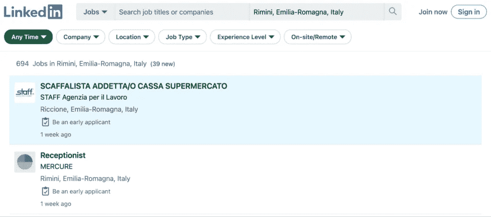

它会将我们直接发送到职务搜索结果页面，在那里我们可以创建新的搜索。对于这个例子，假设我们试图在旧金山建立一个产品管理工作列表。

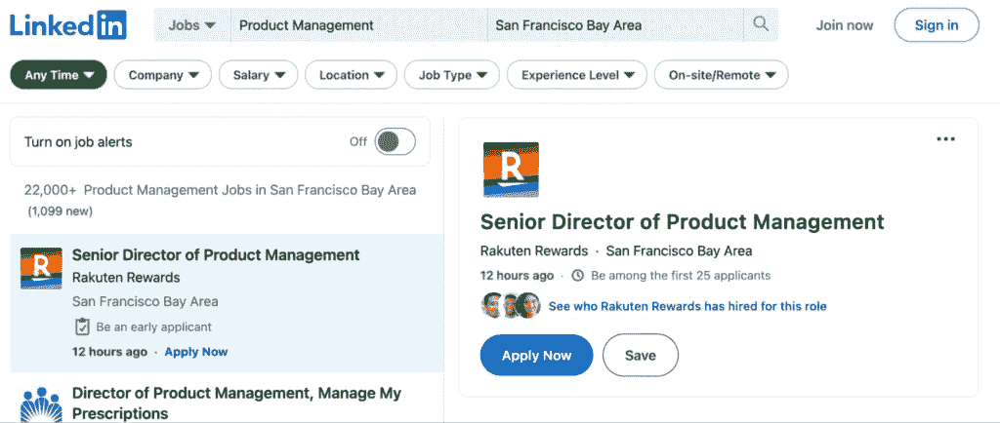

乍一看，似乎每个作业数据都在一个类似卡片的容器中，果然，在检查页面(右键单击> inspect)后，我们可以看到每个作业结果都被包装在一个`<ul>`元素中的`<li>`标记之间。

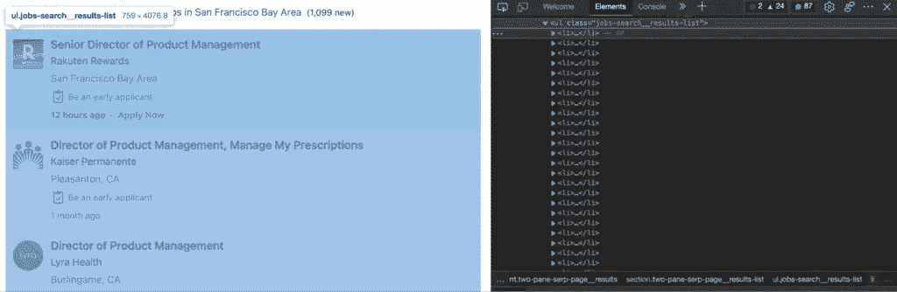

因此，第一种方法是获取`<ul>`元素并遍历其中的每个`<li>`标签，以提取我们正在寻找的数据。

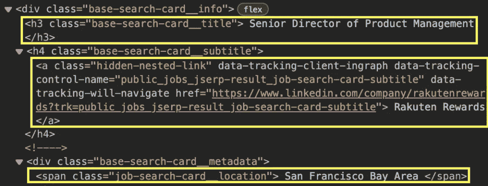

但有一个问题:为了访问新的工作，LinkedIn 使用无限滚动分页，这意味着没有“下一页”按钮来获取下一页 URL 链接，URL 本身也不会改变。

在这种情况下，我们可以使用类似于 [Selenium](https://www.selenium.dev/) 的无头浏览器来访问站点，提取数据，然后向下滚动以显示新数据。

当然，正如我们之前所说的，我们不会那样做。相反，让我们通过使用 DevTools 中的*网络选项卡*来智胜网站。

# 3.使用 DevTool 的网络选项卡

打开 DevTools 后，我们可以从窗口顶部的下拉菜单中导航到 [*网络选项卡*](https://developer.chrome.com/docs/devtools/network/) 。

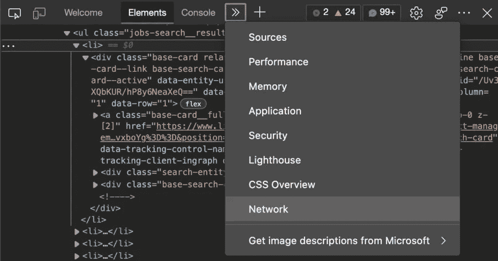

要填充报告，只需重新加载页面，您将能够看到浏览器正在运行的所有获取请求，以便在页面上呈现数据。滚动到底部后，浏览器向下面截图中的 URL 发送新的请求。

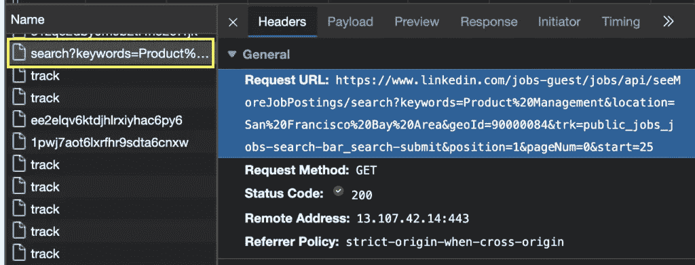

让我们在浏览器中试试这个新的 URL，看看它会把我们带到哪里:

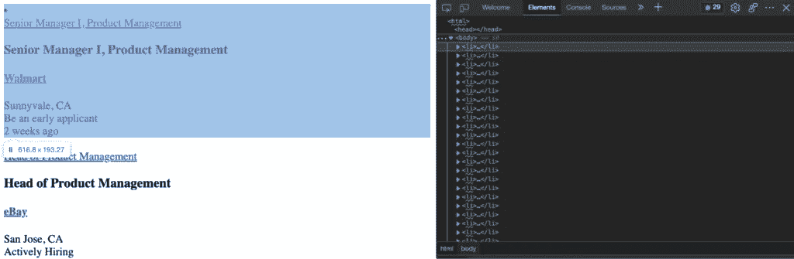

完美！这一页有我们想要的所有信息。一个额外的发现是，这个 URL 有一个结构，我们实际上可以很容易地操纵它。只需更改 start 参数中的值，我们就可以访问新数据。

为了测试这一点，让我们将值改为 0 —这是有机 URL 的起始值:

[https://www.linkedin.com/jobs/search?keywords = Product % 20 management&location = San % 20 Francisco % 20 bay % 20 area&geoId = 90000084&trk = public _ jobs _ jobs-search-bar _ search-submit&position = 1&pageNum = 0](https://www.linkedin.com/jobs/search?keywords=Product%20Management&location=San%20Francisco%20Bay%20Area&geoId=90000084&trk=public_jobs_jobs-search-bar_search-submit&position=1&pageNum=0)

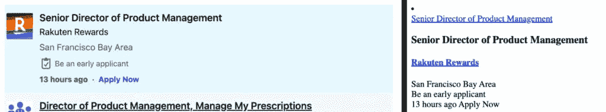

是的，这的确奏效了。已确认，因为每页的第一个作业是相同的。

实验对于网络抓取至关重要，因此在接受这个解决方案之前，我们尝试了以下几件事:

*   改变`pageNum`参数不会改变页面上的任何东西。
*   对于每个新的 URL，`start`参数增加 25。我们通过向下滚动页面并比较站点本身发送的获取请求发现了这一点。
*   将`start`参数改变 1(因此 start=2，start=3，依此类推)将会通过隐藏之前的工作列表来改变结果页面——这不是我们想要的。
*   当前最后一页是 start=975。打到 1000 就转到 404 页了。

有了初始 URL，我们可以进入下一步。

# 4.使用请求和漂亮的汤解析 LinkedIn

在 Python 中，发送请求并解析返回的响应非常简单。首先，让我们创建一个包含初始 URL 的变量，并将其传递给 requests.get()方法。然后，我们将返回的 HTML 存储在一个名为“response”的变量中，以创建我们的 Python 对象。为了测试，让我们打印响应:

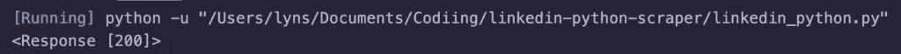

太棒了。200 状态代码表示 HTTP 请求成功。

在我们开始提取任何数据之前，我们需要解析原始的 HTML 数据，以便更容易使用 CSS 选择器进行导航。为此，我们只需要创建一个新的漂亮的 Soup 对象，将 response.content 作为第一个参数，将我们的解析器方法作为第二个参数:

因为测试应该是我们开发过程的一部分，所以让我们使用我们的新 soup 对象做一个简单的实验，选择并打印页面上的第一个职位，我们已经知道它包含在带有`class base-search-card__title`的

### 标记中。

soup.find 会完全按照它所说的去做，它会在我们漂亮的 soup 对象中找到一个元素，这个元素与我们指定的参数相匹配。通过添加。方法，它将只返回元素内部的文本，而不返回围绕它的整个 HTML。

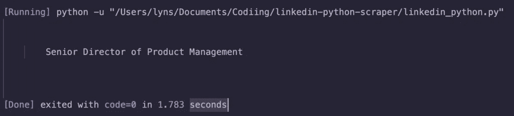

要删除文本周围的所有空白，我们需要做的就是添加。strip()方法放在字符串的末尾。

# 5.使用条件处理多个页面

这是事情变得有点棘手的地方，但我们已经完成了最困难的部分:弄清楚如何浏览页面。简单地说，我们需要做的就是创建一些逻辑来改变 URL 中的 start 参数。

在之前的一篇文章中，我们谈到了[在 Scrapy](https://www.scraperapi.com/blog/how-to-deal-with-pagination-in-python-step-by-step-guide-full-code/) 中抓取分页页面，但是对于 Beautiful Soup，我们将做一些不同的事情。

首先，我们将定义一个包含我们全部代码的新函数，并将网页和页码作为参数传递——将使用这两个参数来构建用于发送 HTTP 请求的 URL。

在变量 next_page 中，我们组合了两个参数——其中,`webpage`是一个字符串，而,`page_number`是一个数字，需要转换成一个字符串——然后将其传递给发送结果 URL 的请求。

为了使下一步有意义，我们需要了解我们的铲运机将:

*   创建新的 URL
*   发送 HTTP 请求
*   解析响应
*   提取数据
*   将其发送到 CSV 文件
*   增加开始参数
*   重复直到它断裂

为了增加循环中的开始参数，我们将创建一个 If 条件:

我们在这里说的是，只要 page_number 不高于 25(所以如果它是 26 或更高，它将中断)，page_number 将增加 25，并将新的数字传递给我们的函数。

为什么你问 25？因为在全押之前，我们想确保我们的逻辑在一个简单的测试中有效。

我们将打印响应状态代码和 page_number，以验证我们正在访问这两个页面。要运行我们的代码，我们需要用相关的参数调用我们的函数。

**注意:**注意，在参数中，我们将开始参数与其值分开。我们需要它的值变成一个数字，这样我们就可以在 If 语句中增加它。

我们还为创建的新 URL 添加了一个 print()语句，只是为了验证一切都正常工作。

# 6.测试我们的选择器

我们已经找到了将用于解析器的元素和类。然而，在脚本之外测试它们以避免对服务器不必要的请求总是很重要的。

就在 DevTools 的控制台内，我们可以使用`document.querySelectorAll()`方法从浏览器测试每个 CSS 选择器。以下是一个职位名称的例子:

它返回一个 25 的节点列表，这与页面上的作业数量相匹配。我们可以对其他目标做同样的事情。以下是我们的目标:

*   职务:' h3 '，class _ = ' base-search-card _ _ title '
*   公司:' h4 '，class _ = ' base-search-card _ _ subtitle '
*   位置:' span '，class _ = ' job-search-card _ _ location '
*   URL: 'a '，class_='base-card__full-link '

注意我们改变了语法来匹配[。](https://www.w3schools.com/python/ref_string_find.asp)寻找()【方法】。如果您想继续使用相同的类似 JQuery 的选择器，可以使用[。选择()](https://www.projectpro.io/recipes/select-function-beautiful-soup#:~:text=Beautiful%20Soup%20provides%20the%20.,the%20data%20from%20web%20pages.)功能代替。

# 7.提取 LinkedIn 工作数据

提取数据非常简单，只需选择包装数据的所有父元素，然后遍历它们来提取我们想要的信息。

在每个

*   元素中，都有一个 div，它包含一个我们可以作为目标的类: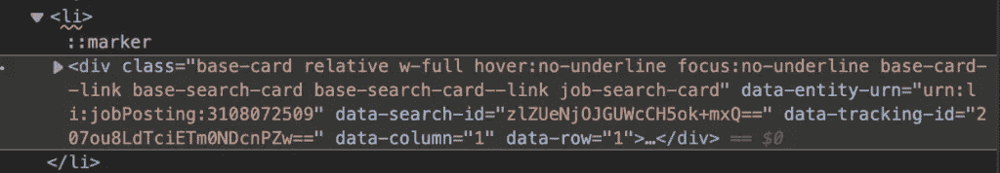

为了访问里面的数据，让我们创建一个新变量来选择所有这些

。

现在，我们有了一个

列表，我们可以使用我们选择的 CSS 选择器创建循环的[:](https://www.w3schools.com/python/python_for_loops.asp)

**注意:**如果你觉得我们进展太快，我们推荐你阅读我们的 [python 网页抓取初学者教程](https://www.scraperapi.com/blog/web-scraping-python/)。它更详细地介绍了这一过程。

# 9.将提取的数据发送到 CSV 文件

在我们的 main 函数之外，我们将打开一个新文件，创建一个新的 writer，并告诉它使用。writerow()方法:

当打开一个你想要不断添加新行的文件时，你需要在*追加模式*下打开它，这就是为什么 a 作为 open()函数的第二个参数。

现在，我们将使用从解析器提取的数据添加一个新行。我们只需要在 for 循环的末尾添加以下代码片段:

在作业列表的每次迭代结束时，我们的 scraper 会将所有数据追加到一个新行中。

**注意:**确保我们添加新数据的顺序与我们的标题顺序相同是很重要的。

为了完成这一步，让我们添加一个 else 语句，以便在循环中断时关闭文件。

# 10.使用 ScraperAPI 避免阻塞

我们的最后一步是可选的，但从长远来看，可以节省您的工作时间。毕竟，我们并不打算只刮一两页纸。要扩展您的项目，您需要处理 IP 轮换，管理代理池，处理验证码，并发送正确的标题，以避免被阻止甚至终身禁止。

然而，只需对我们现在使用的基本 URL 进行一些更改，ScraperAPI 就可以处理这些和更多的挑战，并且[创建一个新的免费 ScraperAPI 帐户](https://www.scraperapi.com/signup)来访问我们的 API 密钥。

从那以后，我们唯一要做的就是在 URL 的开头添加这个字符串:

导致以下函数调用:

这样，我们的 HTTP 请求将由 ScraperAPI 的服务器处理。它会在每次请求后轮换我们的 IP，并根据多年的统计分析和机器学习选择正确的标题。

此外，ScraperAPI 还特别选择了超高级代理来处理 LinkedIn 这样的硬网站。使用它们就像在我们的请求中添加参数`ultra_premium=true`一样简单。

# 总结:完整代码

如果您已经了解了，那么您的代码库应该是这样的:

我们添加了一些`print()`语句作为视觉反馈。运行代码后，脚本将使用抓取的数据创建一个 CSV 文件:

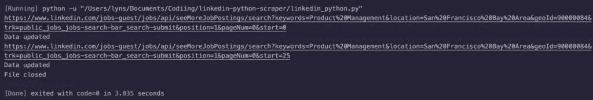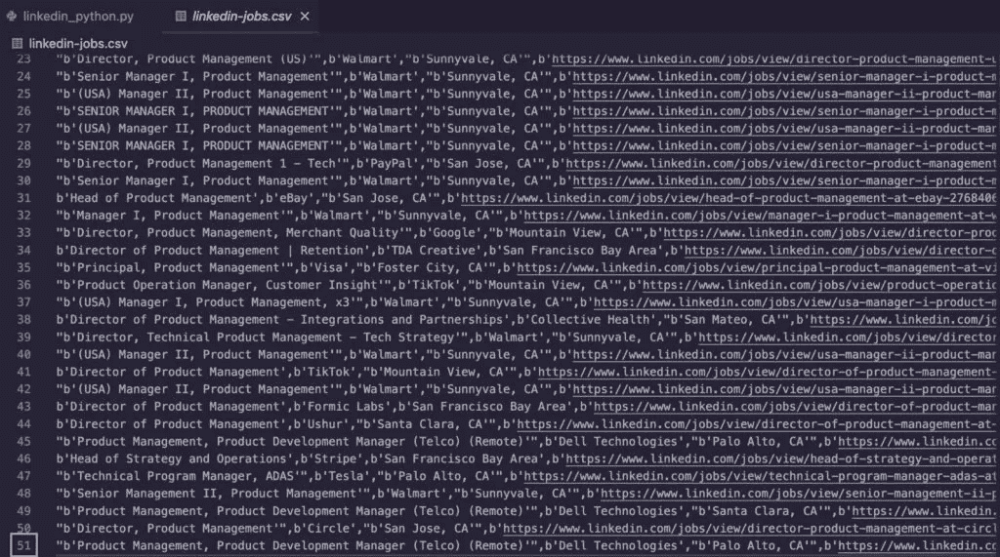

接下来，您可以增加`if`条件中的限制来抓取更多的页面，处理`keywords`参数来遍历不同的查询，和/或更改`location`参数来抓取不同城市和国家的同一职位。

请记住，如果项目不仅仅是几个页面，使用 ScraperAPI 的集成将帮助您避免路障，并使您的 IP 免受反抓取系统的攻击。

下次见，刮刮快乐！