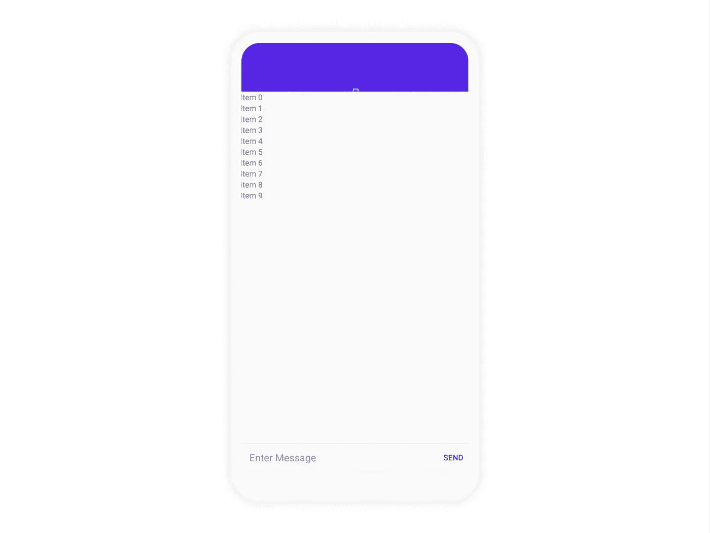

# 如何为你的 Android 聊天应用建立一个消息用户界面

> 原文：<https://medium.com/codex/how-to-build-a-messaging-ui-for-your-android-chat-app-883fad05f43a?source=collection_archive---------3----------------------->


仙鸟 2022

## 创建一个 UI，将消息与 UI 连接起来，并初始化活动中所有必需的组件

解决方案工程师| [Sendbird](https://www.sendbird.com/)

*我们建议您查看* [*示例应用*](https://github.com/sendbird/Sendbird-Android) *获取您可能需要的代码。如需更多指导，请访问我们的* [*文档*](https://sendbird.com/docs/chat/v3/android/quickstart/send-first-message) *。别忘了查看应用内聊天的* [*演示*](https://sendbird.com/demos/in-app-chat) *，并访问我们的* [*网站*](https://sendbird.com/features/chat-messaging) *了解更多关于 Sendbird Chat 可以提供的服务。*

> *为了第一个了解新教程、开发者相关聊天/电话发布以及其他重要更新，* [*注册*](https://get.sendbird.com/dev-newsletter-subscription.html) *获取我们的开发者简讯。*

# 介绍

尽管聊天和消息应用越来越流行，但实现起来仍然很乏味。这很大程度上是因为官方文档不存在，而非官方教程很少并且通常已经过时。

本教程试图弥合这一差距。

我们都见过充满文本、图像、甚至可播放媒体的彩色聊天气泡——他们是如何构建的？答案出奇的简单:RecyclerViews，加上 ViewHolder 模式。

本教程将引导您完成构建高质量消息传递 UI 所需的步骤，该 UI 为支持上述文本、图像和可播放媒体奠定了基础。

本指南旨在创建:

1.  消息传递用户界面
2.  RecyclerView 的适配器
3.  渠道活动

本教程要求:

1.  安卓工作室:4.0.2
2.  Android 版本:10 API 29
3.  Sendbird 核心 SDK: 3.0.148


请注意，本教程假设您对 Android 开发有基本的了解。

# 第一步。创建消息传递用户界面

**创建活动界面**



在本教程中，我们将创建一个专门的活动来托管我们的消息。对于这个活动，我们需要一个 XML。因此，我们要做的第一件事是创建 activity_channel.xml。

此活动中的主要组件是 RecyclerView，它将占据屏幕的大部分。您会注意到还有一个带有工具栏的 AppBarLayout。我们现在不会做太多，但一般来说，你可以添加一个“后退”按钮，一个“关于”按钮，或者关于频道的信息。我们要添加的最后一个东西是一个 RelativeLayout，它将包含“编辑文本”和“发送”按钮。这将分别是用户如何输入和发送文本。在这个 RelativeLayout 中，还可以添加图标来支持添加[视频/图像](https://sendbird.com/docs/chat/v3/android/guides/group-channel#2-send-a-message)。

**为每条消息创建一个列表项**


使用单独的 XML 文件为 RecyclerView 定义每个项目(即邮件)的布局。通常，每封邮件都包含类似上面的内容(例如，发件人的姓名、他们的个人资料图像和时间戳)。由于聊天气泡的排列通常指示消息的所有者，所以显示每条消息的发件人的个人资料图像和姓名是多余的。例如，在上面的图像中，右对齐的聊天气泡表示它属于发送者，因此我们不需要包含图像或名称。

我们需要创建两个不同的 XML。第一个。xml 将用于从“我”的角度来看的消息，或者由当前用户发送的消息。为此，我们选择将实际消息的 TextView 包装在 Cardview 中。围绕这个文本视图的是其他文本视图，比如日期。


第二个。xml 将用于“其他”角度的消息——这意味着当前用户没有发送的任何消息。这个用户界面将类似于“我”用户界面。但是，它是左对齐的，包含关于“其他”用户的信息，例如用于配置文件图像的 ImageView 和用于用户名的 TextField。除此之外，观点都比较相似。

# 第二步。为 recyclerview 创建适配器

现在我们已经创建了聊天的 UI，我们需要将消息与 UI 连接起来。我们将使用 RecyclerView.Adapter 来实现这一点。

这个适配器将完成三件事。它将:

*   存储邮件列表
*   确定是否发送或接收了消息
*   在 RecyclerView 中展开适当的布局

但是在进一步探索之前，我们需要一个消息列表！

为实时消息传递设计后端超出了本教程的范围。因此，我们将继续使用 Sendbird 的聊天 SDK 中的模型。它大致采用以下结构:

**通用消息和用户模型**

```
class Message {
  String message;
  User sender;
  long createdAt;
}

class User {
  String nickname;
  String profileUrl;
}
```

因为以这种方式设计消息传递实现是很常见的，所以希望您能够遵循本教程，只需对代码做最小的更改。

现在，让我们创建一个适配器，并将其命名为 MessageListAdapter。这将包含将在 RecyclerView 中显示的消息列表。

默认情况下，一个适配器至少需要一个视图保持器。这是一个布局，可以被它所包含的对象膨胀和绑定。在我们的例子中，我们将从两个开始:一个 SendMessageHolder 和一个 ReceivedMessageHolder。随着您添加更多类型的邮件，您可以添加更多的持有者。本教程侧重于用户消息或基于文本的消息。

为此，我们将在 MessageListAdapter 中有两个私有内部类。

每个视图持有者持有可以绑定到消息中包含的特定信息的成员视图。例如，TextView messageText 绑定到消息的内容，而 nameText 绑定到消息发送者的姓名。Antonio Leiva 建议我们在 ViewHolder 类中实现一个 bind(object)方法。这将视图绑定到 ViewHolder 类，而不是 onBindViewHolder。因此，它在多个视图持有者和视图类型中产生更干净的代码。如果需要，它还允许我们轻松地添加 OnClickListeners。

完成 ViewHolder 后，返回适配器并覆盖必要的方法:

1.  从消息列表中获取消息
2.  确定它是发送的消息还是接收的消息
3.  为视图持有者放大适当的布局
4.  将消息传递给视图持有者进行绑定

实现这个过程对于大多数适配器来说是标准的，并且相对来说是不言自明的；因此，我们将展示完整适配器的代码，无需进一步解释。

我们刚刚完成了适配器。我们现在可以在前面定义的聊天气泡中显示已发送和已接收消息的列表。

# 第三步。创建渠道活动

我们已经创建了所有的组件，现在我们需要在活动中初始化它们。创建一个名为 MessageListActivity 的活动。在 onCreate 中，用消息列表实例化 RecyclerView 和 MessageListAdapter，瞧！您刚刚创建了自己的消息传递 UI。

# 结论

您可以构建高级功能，如图像预览、聊天气泡中的动画 gif 等。在 Sendbird 的开源[示例 UI 应用中查看高级聊天 UI 的示例！](https://github.com/sendbird/Sendbird-Android)这基于我们在本教程中介绍的 RecyclerViews 和 adapters 的使用，将帮助您创建一个具有各种功能的生产级聊天应用。

开心聊楼！