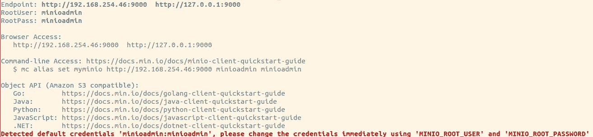
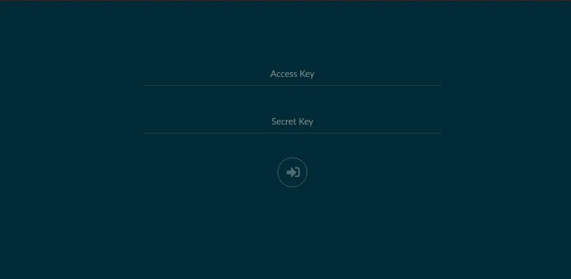
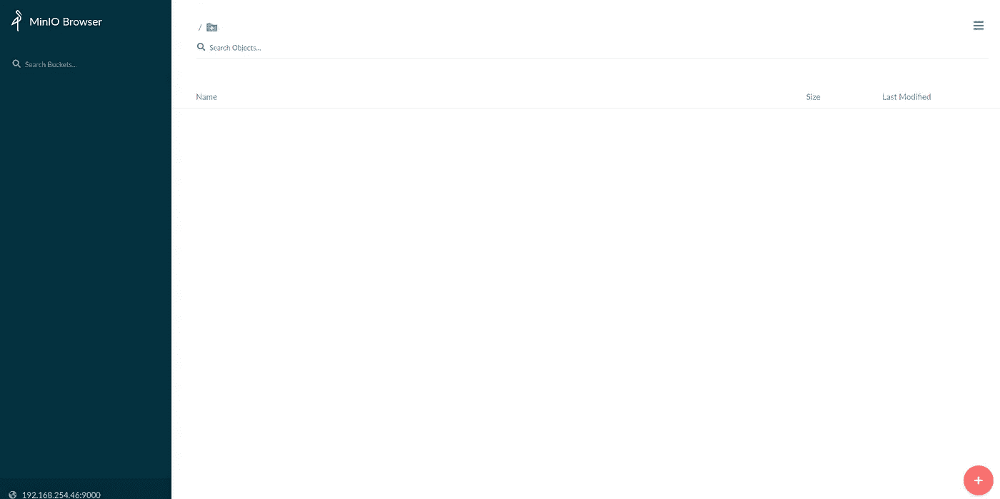
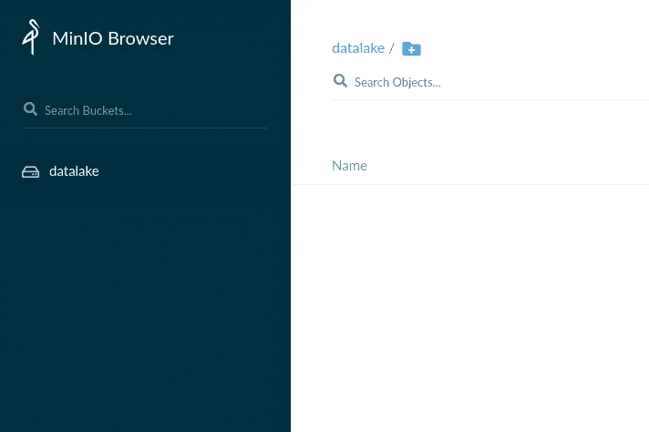

# 如何用 MinIO 构建现代数据湖

> 原文：<https://medium.com/codex/how-to-build-a-modern-data-lake-with-minio-db0455eec053?source=collection_archive---------2----------------------->

## [法典](https://medium.com/codex)

在本文中，重点是仅使用开源技术构建一个现代数据湖。我将一步一步地演示我们如何利用 S3 兼容的对象存储( [MinIO](https://min.io/) )和分布式 SQL 查询引擎( [Trino](https://trino.io/) )来实现这一点。数据工程师和开发人员可以使用这种设置进行开发。我在这里讨论的方法也可以扩展到在您组织的分布式生产环境中部署。


# 先决条件

1.  Linux 操作系统(64 位)
2.  Python 2.6.x、2.7.x 或 3.x
3.  爪哇 JDK

# 步骤 1:下载 MinIO 和 MinIO 客户端

让我们使用 **wget** 从 MinIO 下载可执行文件，并使用以下命令使这些文件可执行。

```
**$ wget** [https**://**dl.min.io**/**server**/**minio**/**release**/**linux-amd64**/**minio](https://dl.min.io/server/minio/release/linux-amd64/minio)
**$ chmod** **+x** minio **$ wget** [https**://**dl.min.io**/**client**/**mc**/**release**/**linux-amd64**/**mc](https://dl.min.io/client/mc/release/linux-amd64/mc)
$ **chmod** **+x** mc
```

# 步骤 2:创建存储并启动 MinIO 服务器

为了让 MinIO 工作，需要一个本地目录来存储数据。让我们在本地文件系统中创建一个目录，并启动指向该本地目录的 MinIO 服务器。

```
**$ mkdir** minio_storage **$ ./minio server** /home/demo/minio_storage
```

一旦执行了上面的命令，您应该会在终端中看到如下所示的输出。请记下端点 IP 地址、AccessKey 和 SecretKey，以便通过 web 浏览器访问 MinIO。让我们让这个终端窗口保持打开，这样 MinIO 服务器就可以继续运行，我们可以在剩下的步骤中使用它。



MinIO 服务器终端输出

# 步骤 3:访问 Web 用户界面

您应该能够使用上一步中的端点 IP 地址访问 MinIO Web UI。这证实了我们的 MinIO 实例已经启动并正在运行。



MinIO Web UI 登录页面

一旦您在登录页面提交了您的访问密钥和秘密密钥，您应该可以访问 MinIO 主页，在这里您可以创建新的存储桶和上传新的文件。



MinIO 登录页面

我们不通过 Web UI 创建 bucket，而是看一下我们在步骤 1 中下载的 MinIO 客户端，我们将利用它从那里创建一个 bucket。

# 步骤 4:使用 MinIO 客户端为 MinIO 设置一个别名

在我们开始与我们的 MinIO 实例交互之前，为它设置一个别名是很重要的。MinIO 别名会很有帮助，尤其是当你使用 MinIO 客户端的时候。让我们在一个新的终端窗口中执行以下命令，为我们的 minio 实例创建一个名为“myminio”的别名。

```
**$ ./mc config host add** myminio [http://127.0.0.1:9000](http://127.0.0.1:9000) minioadmin minioadmin
```

一旦您执行了上面的命令，您应该会得到下面的成功消息“**成功地添加了‘myminio’**”。

# 步骤 5:在 MinIO 中创建一个 S3 桶

让我们利用 MinIO 客户端来创建您的第一个名为“ **datalake** ”的 S3 存储桶。

```
**$ ./mc mb** myminio/datalake
```

让我们通过执行以下命令来确认您的 S3 存储桶已经成功创建:

```
**$ ./mc ls** myminio
```

您应该在列表中看到一个“数据湖”作为您的 S3 对象。您也可以使用 MinIO web 控制台通过导航到 [http://127.0.0.1:9000](http://127.0.0.1:9000) 来确认这一点。



MinIO client 还有许多其他命令，这些命令有助于管理您的环境。您可以参考 [MinIO 客户端文档](https://docs.min.io/docs/minio-client-complete-guide.html)中可用命令的完整列表。

耶！MinIO 服务已启动并正在运行。如果您需要在分布式模式下设置 MinIO，请参考此[文档](https://docs.min.io/docs/distributed-minio-quickstart-guide.html)。我们的数据湖设置已经完成了一半。我们只需要再设置一个工具— Trino(以前称为 PrestoSQL)，它将使我们能够与我们刚刚创建的 MinIO 环境进行交互。

# 步骤 6:下载 Trino 服务器

为了更好地组织，让我们用下面的命令创建一个名为 trino 的父文件夹。

```
**$ cd** /opt
**$ mkdir** trino **$ cd trino**
```

让我们获取 Trino 服务器文件并解压缩它。为了方便起见，我喜欢将版本从文件夹中删除。

```
**$ wget** [https://repo1.maven.org/maven2/io/trino/trino-server/351/trino-server-351.tar.gz](https://repo1.maven.org/maven2/io/trino/trino-server/351/trino-server-351.tar.gz)
**$ tar xvf** trino-server-351.tar.gz
**$ mv** trino-server-351 server
```

# 步骤 6:配置 Trino 服务器

Trino 需要一个数据目录来存储日志等。Trino 建议在安装目录之外创建一个数据目录，这样可以在升级 Trino 时轻松保存。所以让我们在/opt/trino 文件夹下创建一个数据目录。

```
**$ mkdir** data
```

在/opt/trino/server 文件夹下创建以下两个目录来保存配置文件。

```
**$ mkdir** etc **
$ mkdir** catalog
```

现在我们需要创建四个新文件，如下所示:

*   **etc/node.properties** :针对每个节点的环境配置
*   **etc/JVM . config**:JVM 的命令行选项
*   **etc/config . properties**:Trino 服务器配置
*   **catalog/data lake . properties**:MinIO 数据源配置
*   **catalog/MySQL . properties**:MySQL 的配置(此文件不是必需的。添加这个只是为了演示数据湖的用法。您可以为不同的数据库创建自己的配置。关于[支持的连接器](https://trino.io/docs/current/connector.html)，请参考 Trino 文档。)

**节点属性:**

```
node.environment=development
node.id=0bc6c957-0404-490f-8f6a-8db6e8f3cf2b
node.data-dir=/opt/trino/data
```

***注意:*** *你可以为 node.environment 取任何你喜欢的名字，对于 node.id，你可以使用 uuidgen 工具生成你自己的 uuid。*

**配置属性:**

```
coordinator=true
node-scheduler.include-coordinator=true
http-server.http.port=8080
query.max-memory=1GB
query.max-memory-per-node=1GB
query.max-total-memory-per-node=2GB
discovery-server.enabled=true
discovery.uri=http://127.0.0.1:8080
http-server.authentication.type=PASSWORD
```

**jvm.config:**

```
-server
-Xmx16G
-XX:-UseBiasedLocking
-XX:+UseG1GC
-XX:G1HeapRegionSize=32M
-XX:+ExplicitGCInvokesConcurrent
-XX:+ExitOnOutOfMemoryError
-XX:+HeapDumpOnOutOfMemoryError
-XX:ReservedCodeCacheSize=512M
-XX:PerMethodRecompilationCutoff=10000
-XX:PerBytecodeRecompilationCutoff=10000
-Djdk.attach.allowAttachSelf=true
-Djdk.nio.maxCachedBufferSize=2000000
```

**datalake.properties:**

```
connector.name=hive-hadoop2
hive.metastore=file
hive.s3-file-system-type=TRINO
hive.metastore.catalog.dir=s3://datalake/
hive.s3.aws-access-key=minioadmin
hive.s3.aws-secret-key=minioadmin
hive.s3.endpoint=127.0.0.1:9000
hive.s3.path-style-access=true
hive.s3select-pushdown.enabled=true
hive.s3.ssl.enabled=false
```

**mysql.properties:**

```
connector.name=mysql
connection-url=jdbc:mysql://192.168.254.210:3306
connection-user=myuser
connection-password=mypassword
case-insensitive-name-matching=true
```

有关所有配置选项，请参考 [Trino 文档](https://trino.io/docs/current/index.html)。

# 步骤 7:运行 Trino 服务器

如果一切都配置正确，您应该能够从/opt/presto/server 目录执行以下命令。如果您在启动 Trino 服务器时遇到任何问题，请检查您的配置文件。

```
bin/launcher run
```

# **第 8 步:测试我们的数据湖**

我们将需要一个 Trino 命令行客户机来运行查询和测试我们的数据湖，所以让我们下载它。打开一个新的终端，从/opt/trino 文件夹运行以下命令。

```
**$ wget** [https://repo1.maven.org/maven2/io/trino/trino-cli/351/trino-cli-351-executable.jar](https://repo1.maven.org/maven2/io/trino/trino-cli/351/trino-cli-351-executable.jar)
```

运行以下命令连接到 Trino。

```
**$ java -jar** trino-cli-351-executable.jar
```

您现在应该在 Trino 控制台中，您可以键入 show catalogs，您应该看到三个目录名:datalake、mysql 和 system。

```
**trino>** SHOW CATALOGS;
 Catalog  
----------
 datalake 
 mysql    
 system   
(3 rows)
```

在我们开始在数据湖中创建任何东西之前，我们需要创建一个模式。

```
**trino>** CREATE SCHEMA datalake.myschema;
CREATE SCHEMA
```

现在我们已经创建了模式，让我们只使用一条 SQL 语句将一个表从 MySQL 复制到我们的数据湖。

```
**trino>** CREATE TABLE datalake.myschema.category AS SELECT * FROM mysql.homedb.category;
CREATE TABLE: 22 rows
```

我们刚刚用一条普通的 SQL 语句在数据湖中创建了一个表。我们不需要任何 ETL 工具，也不需要编写任何 Python 或 Java 代码。让我们确认数据湖中的数据是可用的。

```
**trino>** SELECT * FROM datalake.myschema.category;
  id   |            name            
-------+----------------------------
  1900 | Beer                       
  1901 | Beverages                  
  1902 | Deli                       
  1903 | Floral                     
  1904 | Health and Beauty Care     
  1905 | Delivered Fresh Daily      
  1906 | From Our Kitchen           
  1907 | Meal Makers                
  1908 | Canned goods & Soup        
  1909 | Pet care                   
  1910 | Condiments Spices & Baking 
  1911 | Baby                       
  1912 | Dairy Eggs & Cheese        
  1913 | Paper Cleaning & Home      
  1914 | Cookies Snacks & Candy     
  1915 | Breakfast & Cereal         
  1916 | General merchandise        
  1917 | Bread & Bakery             
  4628 | Meat                       
  4629 | Seafood                    
  4630 | Produce                    
  4634 | Frozen food                
(22 rows)
```

# 结论

在本文中，我解释了如何在本地机器或虚拟机上快速建立数据湖。这种设置可以扩展到在您的组织中部署一个本地数据湖，而不需要像 AWS 或 GCP 这样的第三方供应商。MinIO 和 Trino 都是可扩展的解决方案，它们在其网站上提供了全面的文档。

如果你想了解更多关于 Trino 和 MinIO 的信息，你可以阅读我的文章[使用开源技术的现代数据平台](https://tmarvadi.medium.com/modern-data-platform-using-open-source-technologies-212ba8273eab)。希望这篇文章对你有用。请在下面留下你对这篇文章的评论。