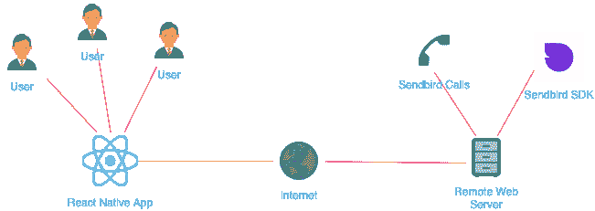
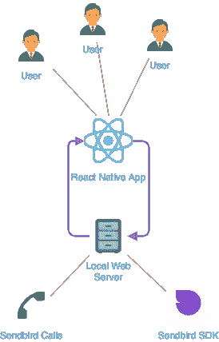
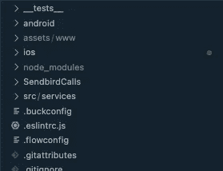
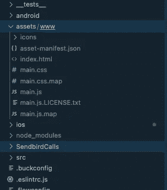
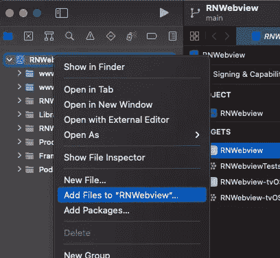
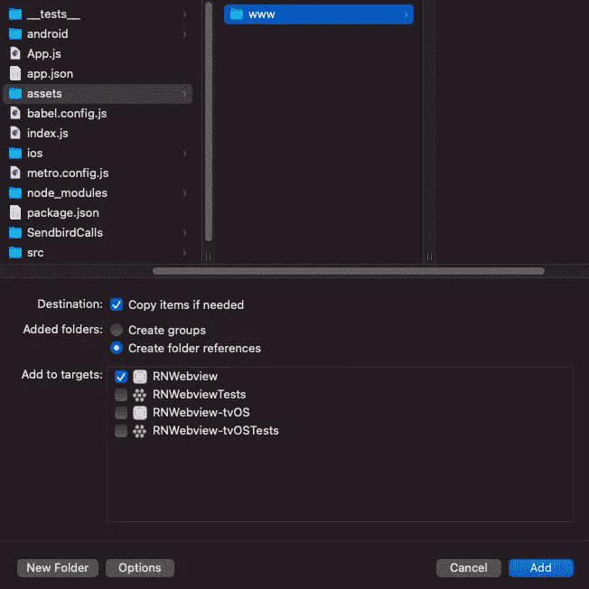
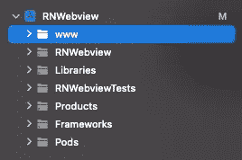
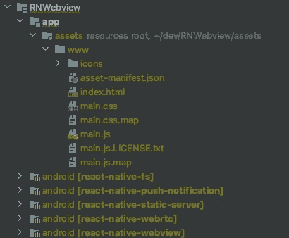
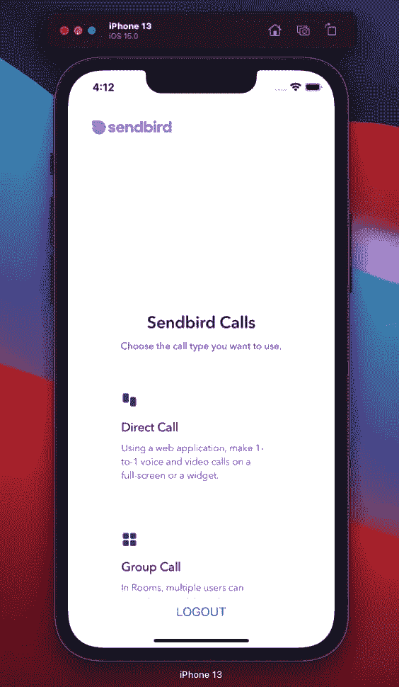
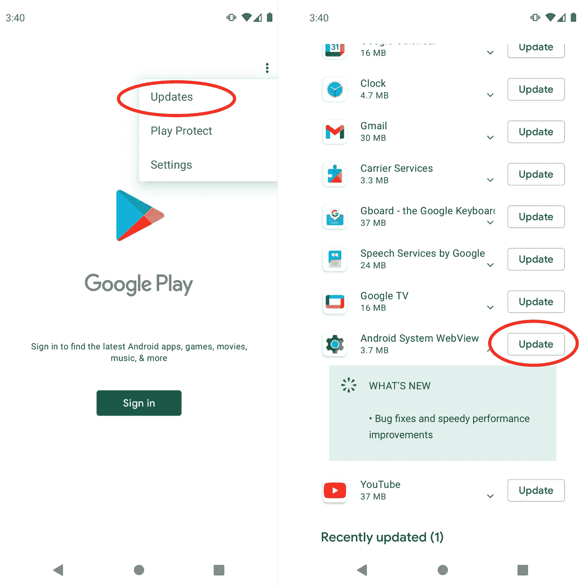

# 如何用 Sendbird 调用构建 React 原生视频聊天应用

> 原文：<https://medium.com/codex/how-to-build-a-react-native-video-chat-app-with-sendbird-calls-bd1e4029f415?source=collection_archive---------7----------------------->

2022 仙鸟

## 使用 JavaScript 允许用户在 iOS 和 Android 应用程序中进行 1:1 呼叫并接收推送通知

由 Charis Theodoulou
解决方案工程师| send bird

*您可能会发现查看我们的* [*样本代码*](https://github.com/charisTheo/RNWebview) *很有用。如果需要额外的指导，请参考我们的* [*文档*](https://sendbird.com/docs/calls) *。别忘了查看一下* [*Sendbird 调用*](https://sendbird.com/features/voice-and-video) *提供的所有特性。*

> *成为第一个了解新教程、开发者相关聊天/电话发布以及其他重要更新的人，* [*注册*](https://get.sendbird.com/dev-newsletter-subscription.html) *我们的开发者简讯。*

# 介绍

本文演示了如何在 React 本地应用程序中实现 [Sendbird 调用](https://sendbird.com/features/voice-and-video)。在本教程结束时，您将学习如何呼叫另一个用户，并在 Android 和 iOS 上都启用推送通知的情况下接收来电。

本教程涵盖了两种解决方案，它们都使用 WebView 组件进行 [WebRTC](https://webrtc.org/) 通信。

1.  带有远程服务器的 WebView
2.  带有本地服务器的 WebView

如果您已经托管了一个实现 Sendbird 调用的 web 应用程序，那么远程服务器解决方案是理想的，因为您可以从 React 本地应用程序中链接它。

本地服务器解决方案(2)是一个更易于维护的解决方案，它将拥有最快和最友好的开发体验，因为您将所有的物理文件都放在一个项目或存储库中。

在讨论这两种解决方案之前，我们将分别讨论这两种解决方案，我们需要做一些基础准备工作。

# 步骤 1:环境设置

作为先决条件，您需要一个 React 本机应用程序。对于快速设置，使用[创建-反应-本地-应用](https://github.com/expo/create-react-native-app)。如果您已经有了自己的应用程序，您可以将以下步骤应用于您的代码库。

**注意**:不推荐使用[原生 react-原生 WebView](https://reactnative.dev/docs/0.61/webview) 。因此，你应该使用 [react-native-webview](https://github.com/react-native-webview/react-native-webview) 来代替。

如果使用 React Native >= 0.6.x，则不需要手动链接。安装后在 iOS 目录下运行 pod install 即可。如果您使用的是旧版本，请查看 React Native Webview 的[入门文档。](https://github.com/react-native-webview/react-native-webview/blob/master/docs/Getting-Started.md#2-link-native-dependencies)

接下来，转到要在其中呈现<webview>组件的组件(在本例中是<app>组件)并插入以下代码:</app></webview>

allowsInlineMediaPlayback 属性以及？uri 中的 playsinline=1 参数在 iOS 中应该为 true。否则，WebView 组件中的视频将全屏显示。

# 推送通知

如果您想要包含推送通知，请确保查看[react-native-Push-notification](https://github.com/zo0r/react-native-push-notification#readme)以了解如何处理远程推送通知。注意，要处理来自 Sendbird 调用的远程推送通知，您必须实现在注册令牌发布时调用的 [onRegister 回调](https://github.com/zo0r/react-native-push-notification/blob/da7dde752d83bef782afe05ef33af9fa44593b31/example/NotificationHandler.js#L12)。然后，您必须通过 SendBirdCall.reigsterPushToken()将其传递给 Sendbird 服务器，以从 Sendbird 服务器获取推送通知。

请记住，应该在身份验证之后调用 SendBirdCall.reigsterPushToken()函数。

每当您的应用程序获得远程推送通知时，就会调用 [onNotification 回调](https://github.com/zo0r/react-native-push-notification/blob/da7dde752d83bef782afe05ef33af9fa44593b31/example/NotificationHandler.js#L4)。这意味着您必须决定它是否是 Sendbird 消息。您可以通过查找数据对象的 sendbird_call 属性来区分它们。如果设置了该属性，那么它就是一个 Sendbird 消息，因此您可以将它传递给 JavaScript SDK 来正确处理它。

实现示例请参考 [RemotePushController.js 文件](https://github.com/charisTheo/RNWebview/blob/main/src/services/RemotePushController.js)。

# Polyfill 网络视图

为了让 WebView 在不同的设备上统一工作，我们必须使用 [react-native-webrtc](https://github.com/react-native-webrtc/react-native-webrtc) 来填充它。

在 App.js 文件中，添加以下代码:

尽早调用 bypass 函数非常重要。

还要注意，支持引入 WebRTC 的 WebView v37 的最低 Android 版本是 [Android 5.0(棒棒糖)](https://developer.android.com/about/versions/lollipop.html#WebView)。

# 添加登录功能

对于基本的身份验证功能，我们将添加文本输入字段，我们可以在其中添加我们的应用 ID、用户 ID 和访问令牌(如果适用)。在 App.js 文件中，添加以下内容:

authQuery 变量包含有关应用程序 ID、用户 ID 和访问令牌的编码信息，这些信息将用于登录 WebView 组件内呈现的网站。要了解 authQuery 是如何编码的，请查看以下步骤。

现在，让我们添加状态挂钩和事件侦听器:

在接下来的步骤中，我们将查看 WebView 组件的 uri 字段的两个选项。让我们从带有远程服务器的 WebView 开始。

# 步骤 2a:使用远程服务器的 WebView

您必须准备公共远程服务器来服务 HTML 页面，包括 Sendbird 调用 JS SDK。在本指南中，我们将使用[自托管示例](https://sample.calls.sendbird.com/)。

这个远程服务器必须提供 HTML 页面，这个页面最终会转到 call view。呼叫视图应该包含或标签，标签需要具有自动播放、在线播放和可能静音的属性。在我们的示例库中查看调用视图的最小形式。

按照前面详细介绍的设置，我们可以使用 WebView 组件从 React 本地应用程序中呈现 Sendbird 调用示例 web 应用程序[。](https://sample.calls.sendbird.com/)

这里唯一需要的是将上述 URL 传递到 WebView 的 source prop 的 uri 字段中:

# 步骤 2b:带有本地服务器的 WebView(推荐)

或者，您可以启动一个本地服务器，在 React Native app 项目中托管一些本地文件。通过将所有文件整合到一个项目/存储库中，您可以更快地进行开发。它还降低了管理成本，因为这不需要主持一个网站的工作。

首先，安装[react-native-static-server](https://www.npmjs.com/package/react-native-static-server)和 [react-native-fs](https://www.npmjs.com/package/react-native-fs) 包。根据你的 React Native 和 Gradle 版本，安装[合适的 react-native-fs 版本](https://github.com/itinance/react-native-fs#important)。

如果使用 React Native >= 0.6.x，则不需要手动链接。否则，运行以下命令:

然后针对 iOS 运行以下命令:

# 为本地服务器创建文件

在项目的根目录下添加一个名为 assets/www 的目录。这是我们的构建工件将要去的地方，并且将由我们的本地服务器托管。我们将在接下来的步骤中创建这个本地服务器。

现在，对于这些构建工件的源代码，我们将在一个名为 SendbirdCalls 的文件夹中克隆这个存储库。在 React 本地项目的根目录中，运行以下命令:

因此，您的项目结构现在应该如下所示:

最后，安装依赖项并构建我们刚刚克隆的 SendbirdCalls 项目。

一旦上面的命令完成，您应该在 <project root="">/assets/www/目录中获得构建工件。</project>

# 将文件添加到 iOS 捆绑包

首先，在 Xcode 中打开您的 iOS 项目。iOS 项目应该位于 ios/ <projectname>.xcodeproj 下 React 原生项目的根目录下。</projectname>

然后，右键单击项目最顶层的目录，选择“将文件添加到<projectname>”。</projectname>

然后选择项目根目录下的 assets/www 目录。

单击“Add”后，您应该会看到捆绑到 iOS 项目中的资产。

# 向 Android 捆绑包添加文件

在 <project root="">/android/app/build.gradle 文件中，添加以下代码行，将静态服务器的文件捆绑到 android 应用程序中:</project>

然后，如果您在 android Studio 中打开 Android 目录，您应该会看到与 Android 应用程序捆绑在一起的资产目录:

# 在 Android 上启用明文流量

这一步对于访问 localhost 上的本地服务器非常重要。Android 默认不允许来自本地主机的流量；为此，我们必须配置一些网络安全参数。

为此，在 app/src/main/res/xml 下创建一个名为 network_security_config.xml 的新文件，并包含以下代码:

然后，在 app/src/main/Android manifest . XML 文件中，添加以下两行:

现在重复上面的步骤，但是在您的调试目录(app/src/debug/res/xml)中。

你可以在本文中了解更多信息。

# 创建本地服务器挂钩

在这一步中，我们将创建一个 useStaticServer 钩子，当组件挂载并返回它的 URL 时，它会旋转一个本地静态服务器，这样我们就可以将它传递给<webview>组件。</webview>

对于 useStaticServer 钩子，创建一个 StaticServer.js 文件，如下所示:

创建新的 StaticServer 时，传入{localOnly: true}很重要；否则，宿主将无法在 localhost 上工作。

如果您到目前为止一直在关注整个教程，并在 SendbirdCalls 目录中克隆了[这个存储库](https://github.com/charisTheo/quickstart-calls-reactjs/)，您也可以复制图标——尽管这对于本教程来说不是必需的。如果您想这样做，您必须在复制图标之前创建另一个目录:

这是本项目中使用的图标的完整列表。

请记住，此本地静态服务器将在本地主机上运行。如果通过设备的本地 IP(例如 192.168.10.1)访问服务器，将无法正确初始化 Sendbird Calls，因为它需要 HTTPS 连接，或者需要在本地主机上运行。

最后，在 App.js 代码中，添加以下代码行，并将 url 变量传递到 WebView 组件的源代码支柱中:

# 第 3 步:运行应用程序

要运行应用程序，只需从项目的根执行 npm 运行 android 或 npm 运行 ios 在终端上运行应用程序，无论是在真实的设备上还是在仿真器上。

如果您遵循本地服务器实现并克隆了 [Sendbird Calls 存储库](https://github.com/charisTheo/quickstart-calls-reactjs/)，您可以在 Sendbird Calls 目录中运行第二个终端命令 npm run watch 来自动重建 SendbirdCalls 网站，并重新加载运行在 Android 设备或仿真器中的 React Native 应用程序。

如果您正在模拟器上测试 android，请确保在运行 npm 运行 Android 之前关闭所有模拟器实例，否则 metro 服务器将与模拟器中的应用程序断开连接。当没有仿真器运行时，React Native 脚本应该自动启动仿真器并成功连接到 metro 服务器。

可能会出现请求允许使用麦克风和摄像机的提示。如果您解决了这个问题，您可以像在浏览器版本上一样使用这个调用。

# 第 4 步:故障诊断

## ios

1.  错误“NSNumber 类型的 JSON 值“1”无法转换为 NSString”
    a)从 WebView 组件中删除 allowReadAccessToURLs 属性-请在本文中阅读更多内容。
2.  白屏或 HTTPS 错误
    a)您需要在 [http://localhost/](http://localhost/) 上访问本地服务器的 URL，而不是 StaticServer 返回的 IP(即 192.168.18.1)
3.  在 macOS 上运行 react-native run-ios 后出现错误“Build error domain = com . apple . core simulator . simerror，code = 405:
    a)使用提供的模拟器名称运行相同的命令:

## 机器人

1.  白屏或 HTTPS 错误
    a)您需要在 AndroidManifest.xml 中启用明文流量(遵循“在 Android 上启用明文流量”的步骤)——在本文的[中了解更多信息。
    b)如果在没有 Google Play 服务和自动更新的模拟器上进行测试，请确保从 Play Store 更新 Google Play 服务和 Android 系统 WebView(WebView 将为装有](/astrocoders/i-upgraded-to-android-p-and-my-react-native-wont-connect-to-my-computer-to-download-index-delta-42580377e1d3) [Android L 和更高版本](https://developer.chrome.com/docs/multidevice/webview/#will-the-new-webview-auto-update)的移动设备自动更新)。

c)如果您在更新下没有看到 Android 系统 WebView，您可能需要从设备设置的应用程序信息部分在设备上启用它。如果你也不能从那里启用它，你可能需要在启用和更新 Android 系统 WebView 之前暂时禁用 Chrome。

1.  错误"*无法加载脚本。确保您正在运行 Metro 服务器，或者您的捆绑包“index.android.bundle”已正确打包以发布* "
    a)确保在运行 npm run android 之前关闭所有仿真器实例。当没有模拟器运行时，React 本地脚本应该自动启动模拟器并成功连接到 metro 服务器。
2.  WebView 加载时出现错误“net::ERR _ CONNECTION _ rejected”
    a)创建新的静态服务器(new StaticServer(PORT，path，{localOnly: true})时需要将 localOnly 参数设置为 true

# 结论

在本教程中，我们讨论了在带有 WebView 的 React 本机应用程序中实现 Sendbird 调用。现在，您知道如何利用 JavaScript 的强大功能，允许用户在 Android 和 iOS 设备上进行 1:1 呼叫，并在您的应用程序中接收推送通知。干得好！

借助支持 WebRTC 的高质量语音和视频聊天，您正在提升应用参与度和用户满意度。

一如既往，如果您对我们的[社区站点](https://community.sendbird.com/)有任何疑问，请告诉我们，感谢您使用 Sendbird！

编码快乐！🖥

> *为了第一时间了解新教程、与开发者相关的聊天/电话发布以及其他重要更新，* [*注册我们的开发者简讯*](https://get.sendbird.com/dev-newsletter-subscription.html) *。*