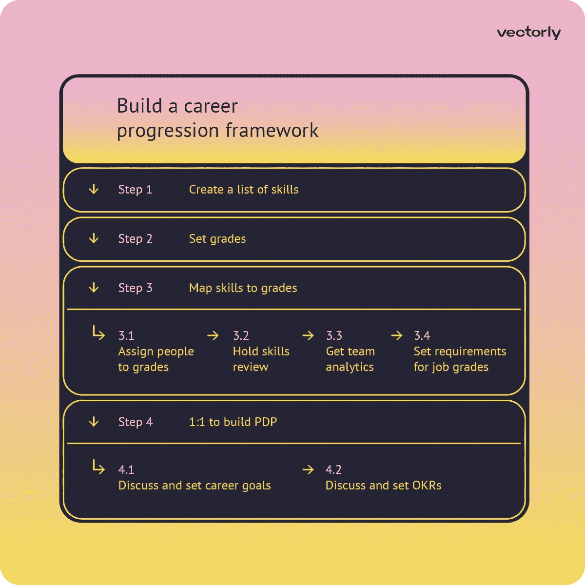
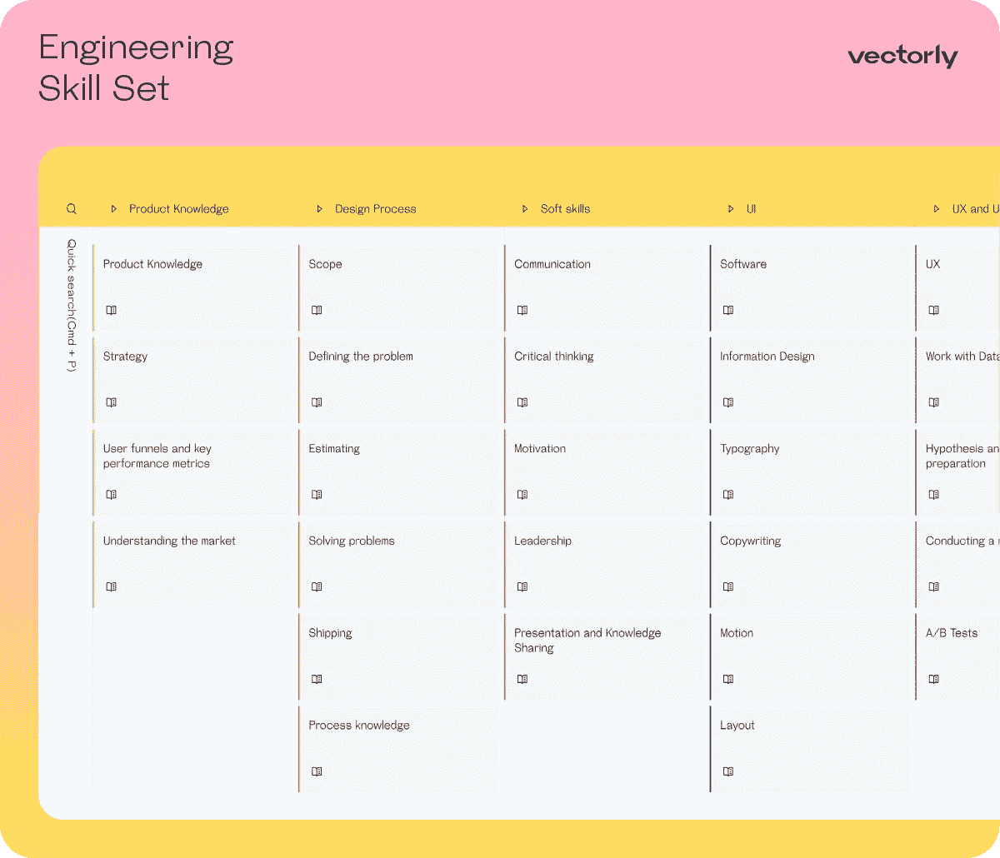
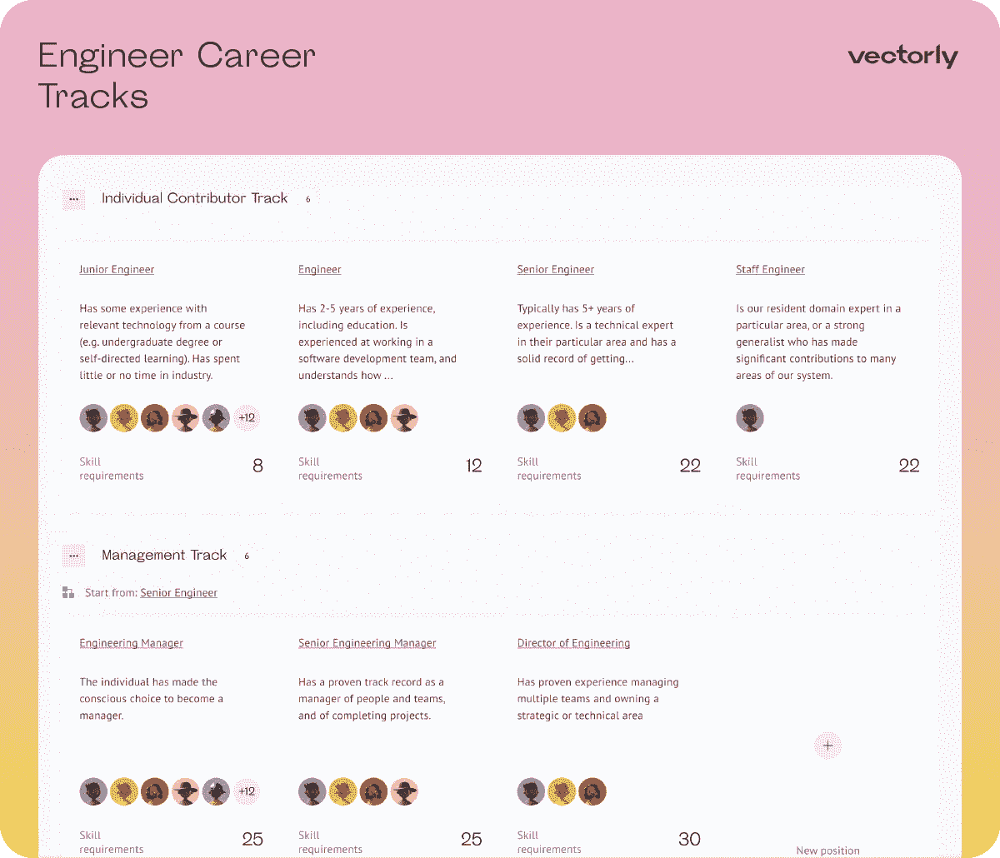
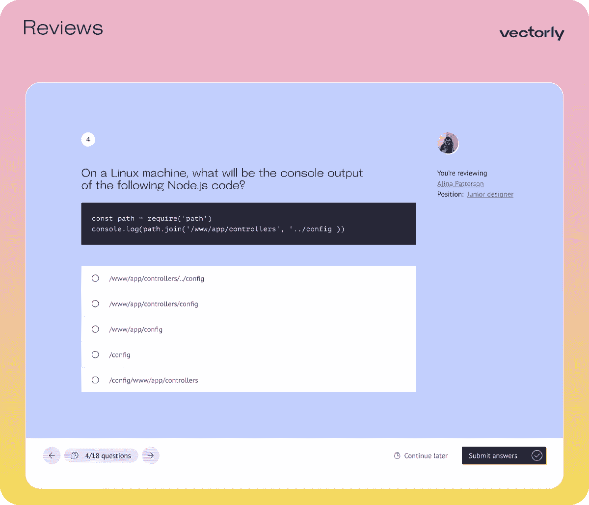
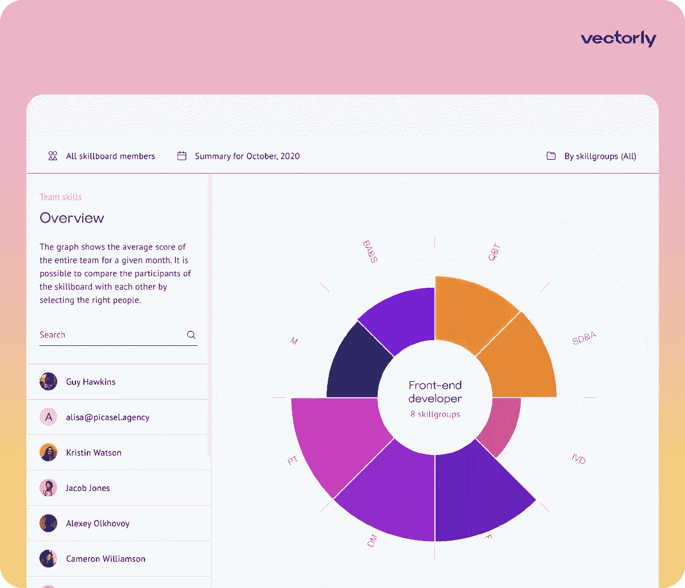
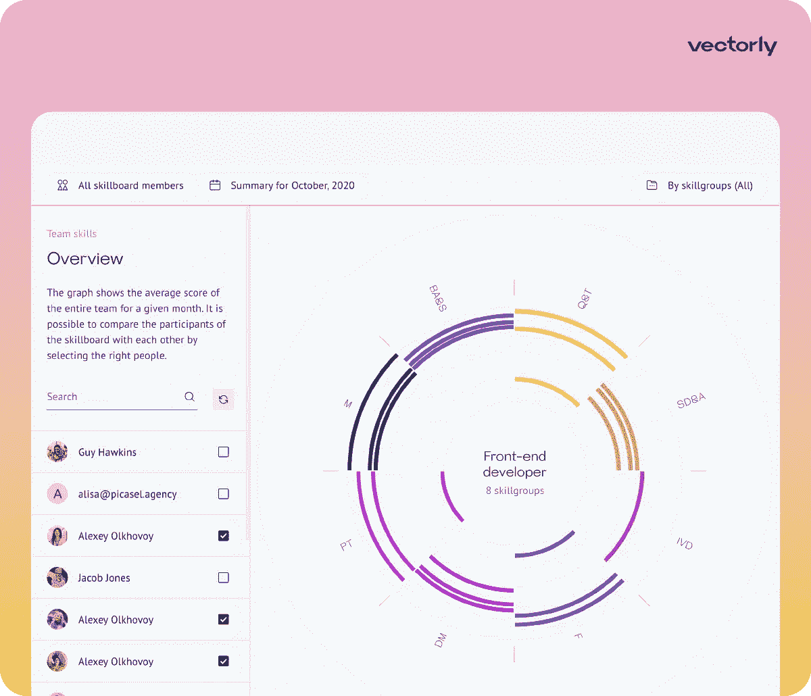
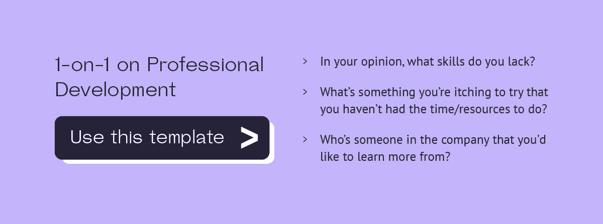
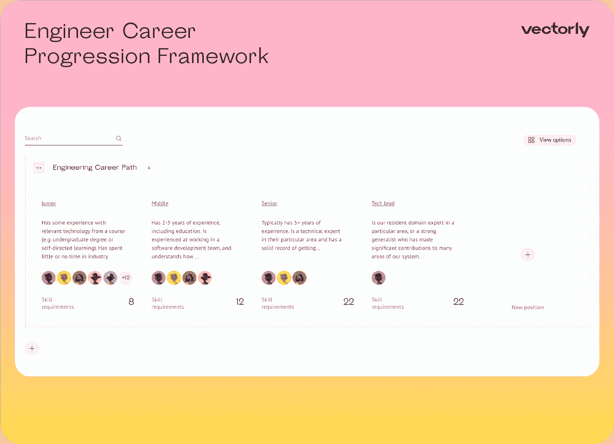
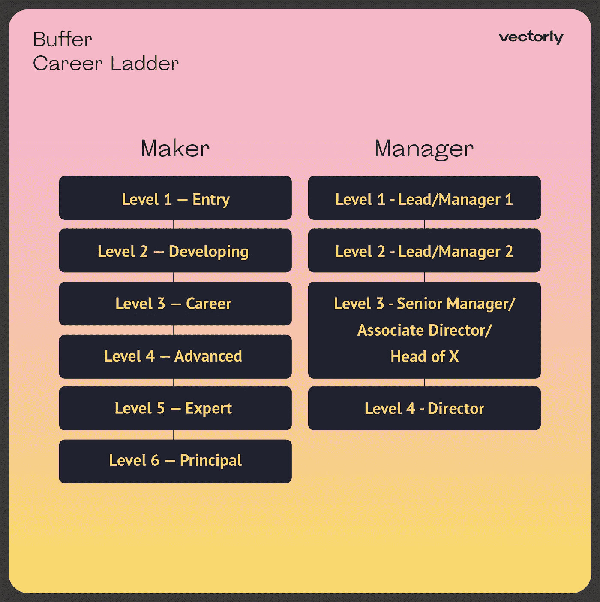
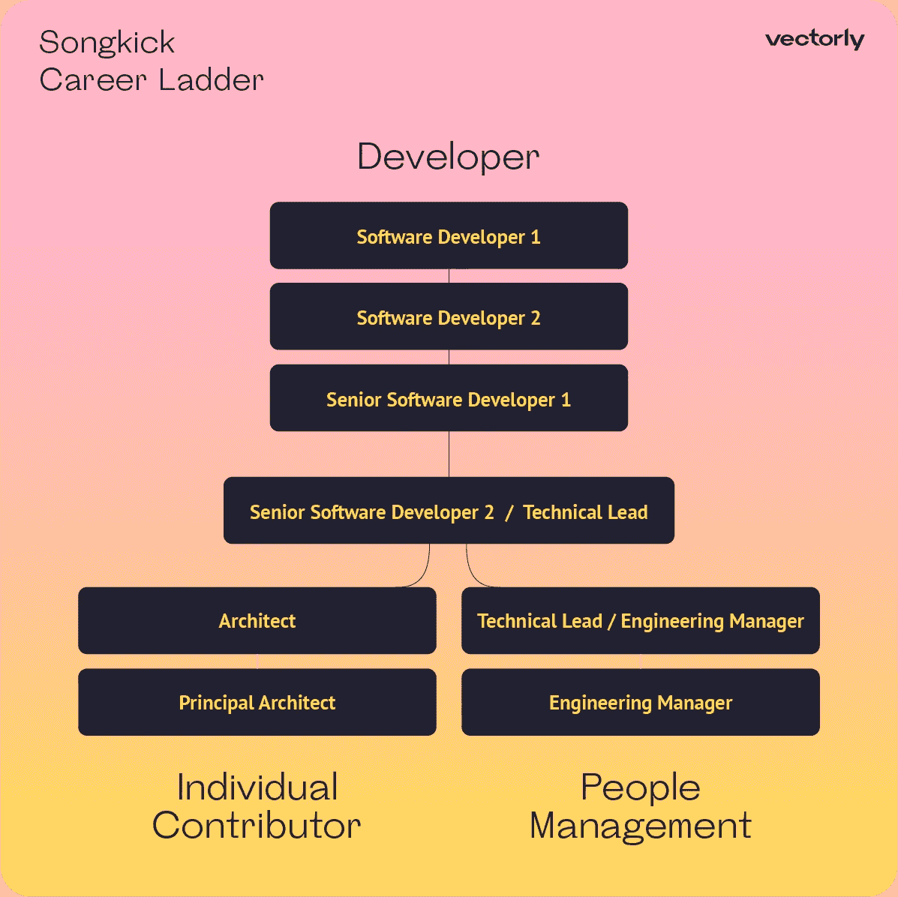

# 如何建立软件工程师职业阶梯(示例)

> 原文：<https://medium.com/codex/how-to-build-a-software-engineer-career-ladder-example-ba3b543d27f?source=collection_archive---------5----------------------->

你是一名工程经理，想知道“如何为我的技术团队建立职业发展框架？”那你来对地方了！在这篇文章中，你会发现:

*   经理的基本工具箱
*   如何创建工程师职业阶梯的分步指南
*   职业发展框架示例

# 如何打造工程师职业阶梯？

工程职业阶梯(或工程师职业发展)不仅仅是开发人员职位和职责的列表。这是一个系统化的职业发展路线图，包括技能、职业目标、薪资期望和职业发展计划。

为了帮助员工在职业上发展和跳级，你需要将他们的职业道路系统化。要做到这一点，为你的公司建立一个职业发展框架是很重要的。这个分步指南将帮助你有效地做到这一点，并达到公司的目标。

# 创建工程师职业阶梯的工具包

在我们进入如何在你的公司建立职业阶梯的部分之前，你需要得到一个基本的工具包。这是一个工具列表(带有有用的链接和模板),可以帮助管理工程师的职业发展，并有效地为他们建立职业发展框架。

## 工具 1:技能矩阵

技能矩阵包括特定角色所需的一系列技能。这些技能被映射到职业道路上的级别，因此经理可以了解如何确定每个员工的级别，以及需要哪些技能来帮助工程师跳过级别。

公司可以创建自己的技能矩阵，或者简单地使用技能矩阵模板，并根据团队的需要进行调整。

有用链接:[60+科技角色免费技能矩阵模板](https://www.getace.io/templates?utm_source=medium_partners&utm_campaign=codex#skill-matrix)。

## 工具 2:职业道路模板

职业道路是一个路线图，包含等级和技能，并帮助开发人员了解需要做什么才能达到新的职业水平:在经理线和专家线。

通常，分数代表从低年级到高年级的路径。但是随着公司的发展，工程师的职业道路会变得更加复杂。要了解更多关于评分系统的信息，请阅读本文的前一篇文章— [什么是软件工程师职业发展](https://blog.getace.io/all-posts/engineer-career-ladder-definition?utm_source=medium_partners&utm_campaign=codex)。

有用链接:[60 多个技术职位的免费职业道路模板](https://www.getace.io/templates?utm_source=medium_partners&utm_campaign=codex#skill-matrix)。

## 工具 3:回顾

评审有助于评估团队的当前技能，并确定等级要求。在回顾的帮助下，你可以找到弱点(技能差距)和增长点。定期进行评估很重要，以确保队友的技能符合某个等级的要求，并检查他们的职业发展进度。

要获得更多关于如何组织有效的技术团队技能评估的信息，请阅读我们有史以来最详细的指南:[软件工程师绩效评估示例](https://blog.getace.io/all-posts/software-engineer-performance-review-example?utm_source=medium_partners&utm_campaign=codex)。

有用链接:[王牌 360 度点评](https://www.getace.io/?utm_source=medium_partners&utm_campaign=codex)。

## 工具 4:一对一会议

个人会议有助于与员工讨论职业目标、制定工作目标和发展计划。此外，在这些会议上，经理可以监督员工的进步，并就加薪做出决定。

有用链接:[一对一会议模板](https://www.getace.io/templates?utm_source=medium_partners&utm_campaign=codex#1-to-1-meeting)。

## 工具 5: PDP

PDP 是一项职业发展计划，帮助经理系统地接近工程师职业阶梯组织，同时满足工程师的职业目标和公司的目标。

好的 PDP 应包括教育活动和发展重点技能的工作任务的组合，以便在技术团队的工作流程中成功实施持续学习，并更快地实现职业目标。

要为您的技术团队建立有效的 PDP，请阅读我们的指南:[将职业发展计划融入您的工作流程的 4 个步骤](https://blog.getace.io/all-posts/how-to-create-professional-development-plan?utm_source=medium_partners&utm_campaign=codex)。

有用链接: [Ace 的成长计划](https://www.getace.io/?utm_source=medium_partners&utm_campaign=codex)。

# 构建工程师职业阶梯的逐步指南

现在，您已经拥有了为您的技术团队创建职业阶梯框架所需的一套工具。让我们继续它的创建步骤。

## 构建工程师职业阶梯的 4 个步骤:

1.  创建技能列表
2.  设置等级
3.  将技能映射到等级
4.  1:1 构建 PDP

下图显示了如何创建适应团队当前技能水平的工程师职业阶梯的主要步骤，以及每个等级的透明要求和达到理想职位的职业发展计划。

构建工程师职业阶梯的 4 个步骤

现在，让我们深入细节，考虑上面提到的每个步骤。

# 第一步:创建一个技能列表

在这个阶段，形成了特定角色所必需的技能列表。经理可以创建自己的列表，或者使用现成的[技能矩阵模板](https://www.vectorly.team/templates?utm_source=medium_partners&utm_campaign=codex#skill-matrix)并根据团队的需求进行定制。

这是工程师技能集在 Ace 中的样子:

[Ace 中的工程师技能集](https://www.getace.io/templates?utm_source=medium_partners&utm_campaign=codex#skill-matrix)

> 通过您的电子邮件获取 60 多个技术角色的[免费技能矩阵模板](https://www.getace.io/templates?utm_source=medium_partners&utm_campaign=codex#skill-matrix)。

# 第二步:设置等级

接下来，职业道路就形成了。它包含工作级别(或工作等级)及其描述——获得某个职位或跳到下一个级别需要什么技能。

根据公司的规模，职业道路可能会有所不同。您可以使用现成的模板构建自己的职业发展道路，并根据公司的需求进行定制。

[Ace 中的工程师职业道路模板](https://www.getace.io/templates?utm_source=medium_partners&utm_campaign=codex#skill-matrix)

> 免费为您的技术团队使用 Ace 的[工程师职业阶梯模板](https://www.getace.io/templates?utm_source=medium_partners&utm_campaign=codex#skill-matrix)。

# 步骤 3:将技能映射到等级

为了在您的团队中设置工作级别的相关要求，您需要将员工分配到他们当前的级别并进行技能评估。在这样做之后，你将了解不同等级的队友的真实技能水平，并基于这些分析，设定职业道路上的工作水平要求。

## 3.1.将人员分配到级别

当你创建了一个职业发展路径，根据他们当前的等级来分配员工——初级、中级、高级、技术主管(或你在公司采用的其他等级)。

## 3.2.举行技能评审

运行一个评审来评估技能，并获得团队当前状态的真实图片。

阅读:[软件工程师绩效考核示例](https://blog.getace.io/all-posts/software-engineer-performance-review-example?utm_source=medium_partners&utm_campaign=codex)

[Ace 中的审核流程](https://www.getace.io/?utm_source=medium_partners&utm_campaign=codex)

> 使用 [Ace](https://www.getace.io/?utm_source=medium_partners&utm_campaign=codex) 轻松自如地进行 360 度全方位检查。

## 3.3.获取团队分析

根据技能评审的结果，了解团队技能的当前状态。

[Ace 中的评审结果](https://www.getace.io/?utm_source=medium_partners&utm_campaign=codex)

## 3.4.设定工作等级的要求

在你完成技能评估并发现技能差距后，为职业道路上的每个级别设定要求。这将有助于你了解工程师需要发展哪些技能，以获得加薪。

[对 Ace 中期望位置的要求](https://www.getace.io/?utm_source=medium_partners&utm_campaign=codex)

# 步骤 4:一对一地构建 PDP

一旦你确定了团队成员目前的技能水平，并设定了成绩要求，就该讨论他们的职业发展计划了。

## 4.1.讨论并设定职业目标

为此，安排一次一对一的会议，讨论开发人员的职业目标，以及他们对公司未来的规划和期望薪资。

## 4.2.讨论并设置 okr。

在这些一对一的会议中，经理还应该告知员工公司的业务目标，并为他们制定有助于实现这些目标的 okr。

作为讨论的结果，创建了个人职业发展计划，该计划应包括发展重点技能的学习和工作任务。

阅读:[将职业发展计划融入工作流程的 4 个步骤](https://blog.getace.io/all-posts/how-to-create-professional-development-plan?utm_source=medium_partners&utm_campaign=codex)

> 为了节省准备时间，使用 Ace 的[一对一会议模板](https://www.getace.io/templates?utm_source=medium_partners&utm_campaign=codex#1-to-1-meeting)，用现成的议程与工程师进行建设性的有益对话。

[一对一会议模板](https://www.getace.io/templates?utm_source=medium_partners&utm_campaign=codex#1-to-1-meeting)

# 工程师职业阶梯示例

基本的(也是最常见的)软件工程师职业道路看起来像是级别的变化——工程师在一开始批准的角色框架内从一个级别跳到另一个级别:初级开发人员、中级开发人员、高级开发人员、技术主管。

Ace 中的[工程师职业道路模板](https://www.getace.io/templates?utm_source=medium_partners&utm_campaign=codex#skill-matrix)

> 免费为您的技术团队使用 Ace 的[工程师职业阶梯模板](https://www.getace.io/templates?utm_source=medium_partners&utm_campaign=codex#skill-matrix)。

随着公司的发展，职业发展框架应该变得更加复杂——可以引入职业道路上的中级职位(级别)。

[Buffer](https://buffer.com/resources/career-framework/) 开发了自己的职业发展框架，允许员工在不成为经理的情况下获得职业发展和职业晋升。这个框架有两个平等的发展机会——个人贡献者轨道和管理轨道。

[缓冲职业阶梯模板](https://public.vectorly.team/skillboard/5cf236c0-bc3c-11ec-82cd-f1b8d5ef1b06?utm_source=medium_partners&utm_campaign=codex)

> 您可以使用[缓冲职业道路模板](https://public.vectorly.team/skillboard/5cf236c0-bc3c-11ec-82cd-f1b8d5ef1b06?utm_source=medium_partners&utm_campaign=codex)为您的技术团队构建工程师职业阶梯。

[Songkick Technology](https://www.songkick.com/downloads/growth-framework/sk-growth-framework.pdf) 开发了双阶梯方法的一种变体:

[Songsick 职业阶梯模板](https://public.vectorly.team/skillboard/f9a54410-b9f0-11ec-a273-6f01cebe2f96?_gl=1*1u4h60b*_ga*MTQxNDk2NzY0My4xNjQ4MDQ5MjQw*_ga_38XH30XY3T*MTY0OTk2MzUzNi42MC4xLjE2NDk5NjU2NzAuNDc.&utm_source=medium_partners&utm_campaign=codex)

> 您可以为自己的公司改编 [Songkick 开发人员职业道路模板](https://public.vectorly.team/skillboard/f9a54410-b9f0-11ec-a273-6f01cebe2f96?_gl=1*1u4h60b*_ga*MTQxNDk2NzY0My4xNjQ4MDQ5MjQw*_ga_38XH30XY3T*MTY0OTk2MzUzNi42MC4xLjE2NDk5NjU2NzAuNDc.&utm_source=medium_partners&utm_campaign=codex)。