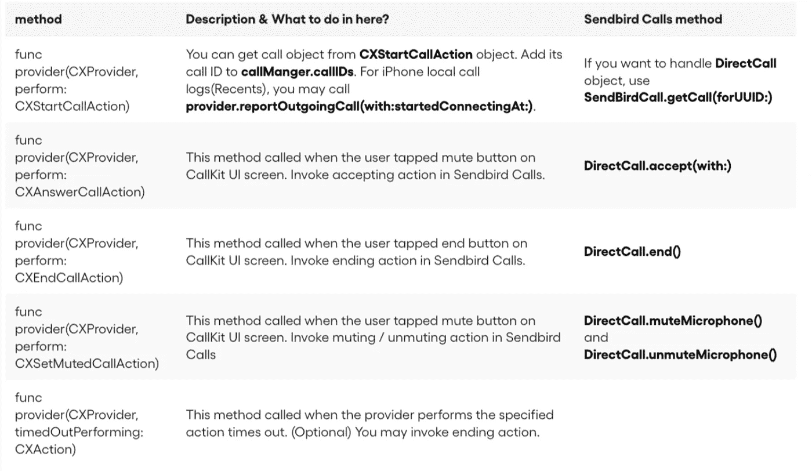

# 如何使用 iOS CallKit 和 Sendbird Calls 构建 VoIP 应用程序

> 原文：<https://medium.com/codex/how-to-build-a-voip-app-with-ios-callkit-and-sendbird-calls-d943d2efbddf?source=collection_archive---------0----------------------->

仙鸟 2022

## 如何配置呼叫套件、设计用户界面以及管理呼叫套件操作和事件，以构建引人入胜的语音和视频通话

软件工程师|仙鸟

*你可能会发现查看 iOS 调用* [*样例*](https://github.com/sendbird/quickstart-calls-directcall-ios) *很有用。有关本教程中材料的其他指导，请参见* [*文档*](https://sendbird.com/docs/calls/v1/ios/quickstart/make-first-call#2-make-1-to-1-call-3-step-7-add-capabilities-to-your-app) *。您也可以访问我们的* [*网站*](https://sendbird.com/features/voice-and-video) *了解更多关于 Sendbird Calls 可以提供的服务。*

# 介绍

本教程解释了如何使用 Sendbird 调用和苹果的 iOS CallKit 框架开发 VoIP 应用程序。本教程结束时，您将了解如何:

*   配置呼叫工具包
*   设计呼叫套件用户界面
*   执行呼叫工具包操作
*   创建呼叫管理器
*   处理 CallKit 事件
*   启用与自定义用户界面的交互

每个部分都提供了文件的完整代码；您可以将代码复制并粘贴到适当的文件中。请记住，所提供的代码可能不是唯一的实现；您可以定制代码以满足您的需求。

请注意，如果您具备 Swift 的工作知识，您将从本教程中获得最大收益。

也就是说，让我们开始吧！💻

# 第一步。创建一个 Sendbird 帐户

1.  注册一个免费的 Sendbird 帐户。
2.  使用您的电子邮件创建一个帐户，或者选择“继续使用 Google”。
3.  通过填写“组织名称”和“电话号码”字段来设置您的组织。
4.  在离您所在地最近的地区创建一个新的“聊天+通话”应用程序。

*   在屏幕的左侧，您应该会看到一个“通话”菜单。进入“工作室”并创建一个新用户。按照屏幕上的提示进行操作。

# 步骤 2:配置呼叫工具包

现在我们已经创建了一个 Sendbird 帐户并添加了用户，让我们来讨论一下如何为我们的目的配置 CallKit。

## 2.1

要开发 VoIP 应用程序服务，您需要该应用程序的 VoIP 证书。进入 [**苹果开发者**](https://idmsa.apple.com/IDMSWebAuth/signin?appIdKey=891bd3417a7776362562d2197f89480a8547b108fd934911bcbea0110d07f757&path=%2Faccount%2F&rv=1) 页面并登录。

## 2.2

转到证书、标识符和配置文件>证书>创建新证书。您可以在服务部分找到 VoIP 服务证书。创建 VoIP 服务证书。( [**下面介绍一下**](https://help.apple.com/developer-account/#/dev9249db258) 的做法。)

## 2.3

转到目标>签名和功能。添加背景模式并启用 IP 语音。这将创建一个. entitlements 文件和允许您使用 VoIP 服务的适当权限。如果您不启用 IP 语音，将出现呼叫套件错误代码 1。

# 步骤 3:设计 CallKit UI

## 3.1

为了配置 CallKit 的本地化信息，创建一个名为**cxproviderconfiguration . extension . swift**的文件。

**CXProvider**

CXProvider 是一个代表电话提供商的对象。 **CXProvider** 用**CX provider configuration**初始化。VoIP 应用程序应该只为每个应用程序创建一个 **CXProvider** 实例，并在全局范围内使用它。更多信息见苹果官方 [**文档**](https://developer.apple.com/documentation/callkit/cxprovider) 。

每个提供商可以指定一个符合 **CXProviderDelegate** 协议的对象来响应事件，例如开始呼叫、保持呼叫或激活提供商的音频会话。

## 3.2

一个**CXProviderConfiguration**对象控制传入和传出呼叫的本地呼叫 UI，包括提供者的本地化名称、传入呼叫要播放的铃声以及呼叫期间要显示的图标。更多信息请看苹果官方 [**文档**](https://developer.apple.com/documentation/callkit/cxproviderconfiguration) 。

1.  用本地化名称初始化**CXProviderConfiguration**对象。当您的用户通过 CallKit 收到呼叫时，此名称将出现在呼叫视图中。使用适当的命名，例如您的应用服务名称，作为本地化名称。在这种情况下，我们使用了“信鸽”。
2.  配置用户界面及其功能。在此步骤中，设置 **iconTemplateImageData、supportsVideo** 和 **supportedHandleTypes** 。如果您想进一步定制 CallKit，请参见下表。也可以参考苹果官方 [**文档**](https://developer.apple.com/documentation/callkit/cxproviderconfiguration) 。

**支持视频**

这是一个布尔值，它指示呼叫除了音频之外是否还支持视频功能。默认设置为**假**。更多信息参见苹果 [**文档**](https://developer.apple.com/documentation/callkit/cxproviderconfiguration/1779574-supportsvideo) 。

如果您的服务提供视频通话，请将 **supportsVideo** 设置为 **true** 。如果您的服务不提供视频通话，请跳过此设置。

**supportedHandleTypes**

这是您想要处理的呼叫提供商的类型。关于 CXHandle.HandleType 见苹果 [**文档**](https://developer.apple.com/documentation/callkit/cxhandle/handletype) 。

**CXHandle** 指的是在每次通话中如何识别你的用户。三种可能的手柄类型是:**。电话号码**，**。电子邮件**和**。通用**。根据您提供的服务和管理用户的方式，您可以选择不同的选项。如果通过电话号码或电子邮件地址识别用户，选择**。电话号码**或**。电子邮件**。但是，如果它是基于某个随机的 **UUID** 值或其他未指定的值，则使用**。泛型**，它是一个未指定的**字符串**值，可以更灵活地使用。

**iconTemplateImageData**

这是为提供者显示的图标图像的 PNG 数据。

根据 [**文档**](https://developer.apple.com/documentation/callkit/cxproviderconfiguration/2274376-icontemplateimagedata) ，“图标图像应该是一个边长为 40 点的正方形。图像的 alpha 通道用于创建白色图像蒙版，该蒙版在系统的原生调用 UI 中用于按钮，该按钮将用户从该系统 UI 带到第三方应用程序。

设置**。iconTemplateImageData** 到图标图像，该图标图像将显示在 CallKit 屏幕上本地化名称的旁边。指派**。pngData()** 到你的应用图标。

# 第四步。请求呼叫套件操作

我们已经配置了 CallKit 并设计了 UI。现在，让我们了解更多关于 CallKit 操作以及如何实现它们的信息。

CallKit 提供许多与呼叫相关的功能，如拨号、结束、静音、保持等。这些特性中的每一个都应该由名为 **CXCallAction** 的适当的 CallKit 动作来执行。这些动作是从一个 **CXCallController** 对象调用的，该对象使用 **CXTransaction** 对象来执行每个 **CXCallAction** 。为了控制 CallKit，您必须创建相应的 **CXCallActions** ，并通过使用 **CXTransaction** 请求一个事务来执行它们。

向 CallKit 发送请求有三个步骤:

1.  创建 **CXCallAction** 对象
2.  创建 **CXTransaction** 对象
3.  通过 **CXCallController** 请求 **CXTransaction** 对象

# 4.1 交易

添加 **CXCallController** 属性和另一个名为**request transaction(with:completion handler:)**的方法。该方法使用 **CXCallAction** 创建 **CXTransaction** ，并通过 **callController** 请求事务。在创建一个 **CXCallAction** 对象后，你总是需要调用这个方法。

## 4.2.呼叫操作

**开始通话动作**

下面实现了 **CXStartCallAction** 的一个方法。这个动作代表了通话的开始。如果动作请求成功，将调用相应的**cxproviderdelegate . provider(_:perform:)**事件。

1.  您必须创建一个与调用相关联的 **CXHandle** 对象，该对象将用于标识调用所涉及的用户。该对象将与 UUID 一起包含在 **CXStartCallAction** 中。
2.  如果通话有视频，设置**。isVideo** 到 **true** 。

3.如上所述，在创建一个 **CXStartCallAction** 对象后，不要忘记调用**request transaction(with:completion handler:)**方法。

**结束通话动作**

下面实现了 **CXEndCallAction** 的另一种方法。此动作表示通话已结束。如果动作请求成功，将调用相应的**cxproviderdelegate . provider(_:perform:)**事件。 **CXEndCallAction** 只需要调用的 **UUID** 。用 **UUID** 创建一个 **CXEndCallAction** 对象。

**其他呼叫动作**

其他 **CXCallActions** 可以和 **CXStartCallAction** 和 **CXEndCallAction** 一样实现。以下是其他通话操作的列表:

# 第五步。管理通话

为了轻松管理 **CXCallController** 和通话 id，您可能需要创建一个可以从任何地方访问的通话管理器。呼叫管理器将存储和管理正在进行的呼叫的 **UUID** 以处理呼叫事件。

*注意:您还可以使用****cxcallcontroller . call observer . calls****属性来管理活动呼叫列表(包括结束的呼叫)并观察呼叫变化。每个调用都是一个代表 CallKit 中一个调用的****CX call****对象。通过勾选***属性，可以处理正在进行的通话。**

*有关更多信息，请参见关于 CXCallObserver 的 [**文档**](https://developer.apple.com/documentation/callkit/cxcallobserver) 和关于 CXCall 的 [**文档**](https://developer.apple.com/documentation/callkit/cxcall) 。*

*创建一个名为 **CallManager** 的新类。然后，添加一个共享的静态实例，以便从任何地方访问它(您可以选择使用除 singleton 之外的模式)。*

*如果你想了解更多关于这种模式的知识，请看苹果 [**文档**](https://developer.apple.com/documentation/swift/managing-a-shared-resource-using-a-singleton) 关于使用单例管理共享资源。*

*添加类型为**【UUID】**的 **callIDs** 属性，并添加管理 callIDs 的方法: **addCall(uuid:)** ， **removeCall(uuid:)** 和 **removeAllCalls()** 。*

# *第六步。处理呼叫工具包事件*

*要报告新的来电或响应新的 CallKit 操作，您必须使用在第 3 节中创建的**CX provider configuration**创建一个 **CXProvider** 对象。您还可以通过**cxprovidereddelegate**处理该调用的 CallKit 事件。*

1.  *导入 **CallKit** 并创建一个符合**n object**和 **CXProviderDelegate** 的 **ProviderDelegate** 类。*
2.  *添加两个属性: **callManager** 和 **provider** 。 **callManager** 是您在 [**第 5 节**](https://sendbird.com/developer/tutorials/make-local-calls-with-callkit-and-sendbird-calls#anchor_6) 中创建的 **CallManager** 类。提供程序报告 CallKit 的操作。当您初始化一个提供者时，使用您已经创建的**cxproviderconfiguration . custom**。*

*3.要报告一个新的来电，您需要创建一个带有来电相关信息的 **CXCallUpdate** 实例，以及标识参与通话的用户的 **CXHandle** 。*

*4.为了让你的调用更加丰富，你可以定制 **CXHandle** 和 **CXCallUpdate** 实例。如果通话有视频，设置 **hasVideo** 为真。上层 iPhone 通话记录基于 **CXHandle** 对象。*

*5.在报告一个新的来电后，您必须使用之前添加的 **addCall(uuid:)** 方法将其添加到**call manager . shared . calls**。*

*6.CallKit 通过侦听适当的 CallKit 事件来跟踪呼叫的接通时间和结束时间。要告诉 CallKit 呼叫已连接，请调用**reportOutgoingCall(with:connected at:)**。这将启动通话持续时间，并通知 iPhone 应用程序的通话日志中显示的通话起点。*

*要告诉 CallKit 呼叫已结束，请调用**report call(with:ended at:reason:)**。这将通知通话的结束点，该点也将显示在 iPhone 应用程序的通话记录中。*

# *第七步。处理 CXCallAction 事件*

## *与 CallKit UI 的交互*

*当提供者执行 **CXCallActions** 时，可以调用相应的 **CXProviderDelegate** 方法。为了正确响应用户的操作，您必须在方法中实现适当的 Sendbird 调用操作。*

***重要**:在方法结束之前，不要忘记执行 **action.fulfill()** 。*

**注意:要访问该调用的****【UUID】****，必须使用****action . calluuid****属性，而不是****action . uuid****。**

**

*关于**cxprovideredirect**方法的更多信息，请参考苹果官方 [**文档**](https://developer.apple.com/documentation/callkit/cxproviderdelegate) 。*

# *第八步。与用户界面的交互*

*您可以使用 CallKit 的默认视图开始和结束呼叫。接下来，让我们尝试使用带有 CallKit 的自定义 UI。为了清楚起见，本教程跳过创建相关的故事板文件和 **ViewController** 文件。相反，假设有一个文本字段用于输入远程用户的 ID，一个按钮用于发出呼叫，另一个按钮用于接收呼入，最后一个按钮用于结束呼叫。*

*这是您的代码看起来的样子:*

1.  ***发出呼叫**:因为用户正在发起呼叫，所以您必须创建一个呼叫请求。该操作需要被叫方的**用户 ID** 和呼叫的唯一 **UUID** 。*
2.  ***执行结束按钮**的动作:该动作将根据 **callID** 结束通话。*
3.  ***接听音频来电**:为此，你必须模拟一个音频来电。因为 CallKit 不知道来电，所以您必须向 CallKit 报告来电。此操作需要呼叫者的用户 ID 和呼叫的唯一 UUID。目前，因为来电是在本地进行的，所以您将使用一个随机生成的 **UUID()** 而不是一个真实来电者的 **UUID** 。如果您想要测试传入的视频呼叫，将 **hasVideo** 参数的值指定为 **true** 。*

# *结论*

*就是这样！您知道如何使用 Sendbird Calls 和 Apple CallKit 框架构建 VoIP 应用程序。在本教程中，您学习了如何配置 CallKit、设计 UI 以及管理和处理 CallKit 操作和事件。您正在构建出色的、引人入胜的语音和视频通话应用。快乐的 iOS 呼叫应用程序构建—我们迫不及待地想看看您构建了什么！😎*