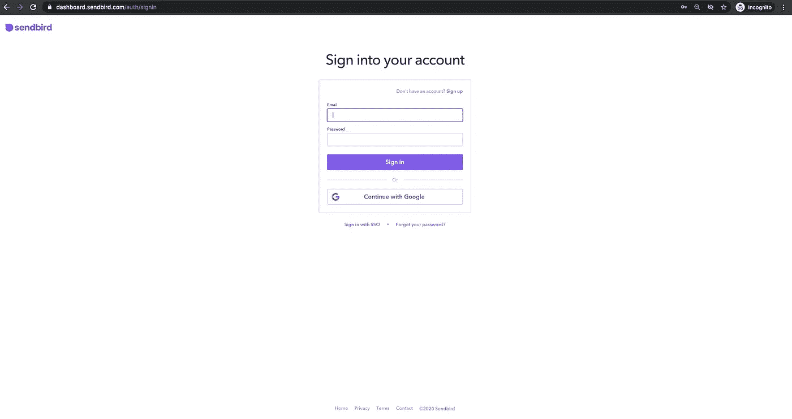
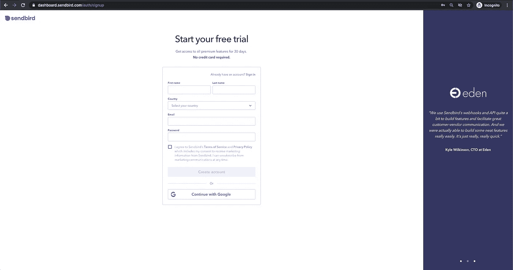
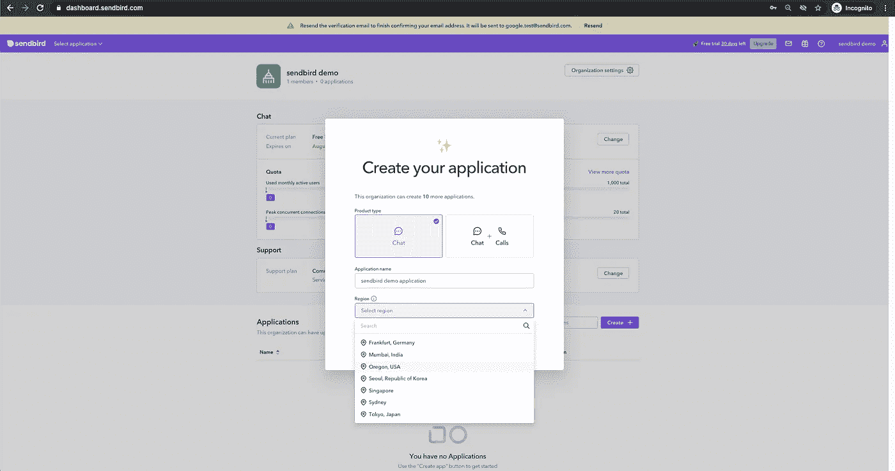
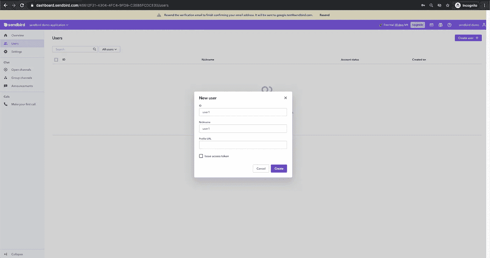
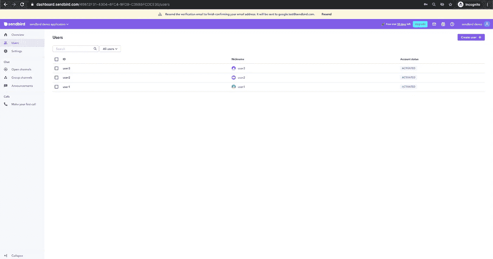
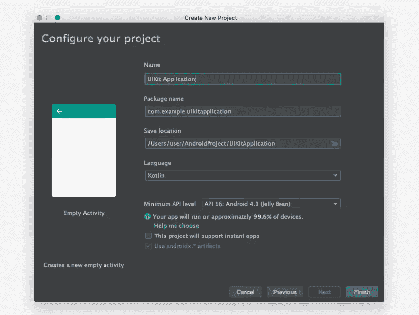
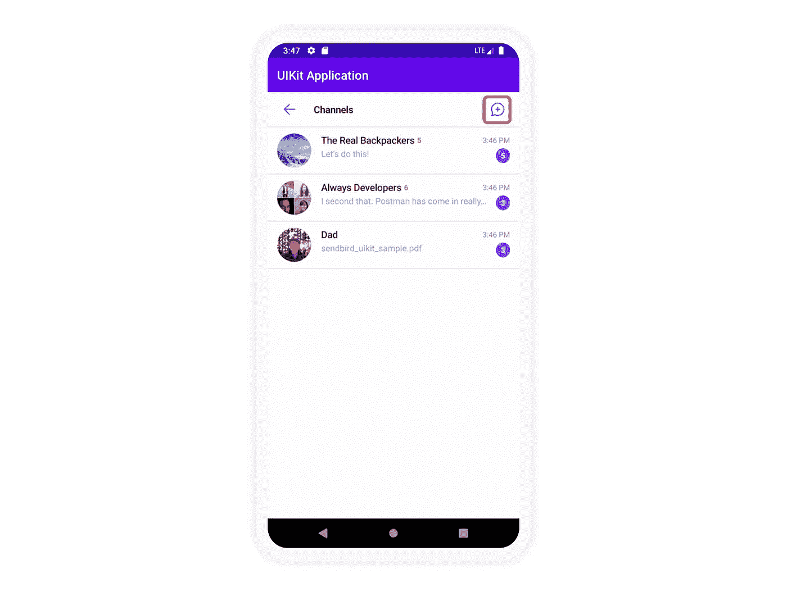
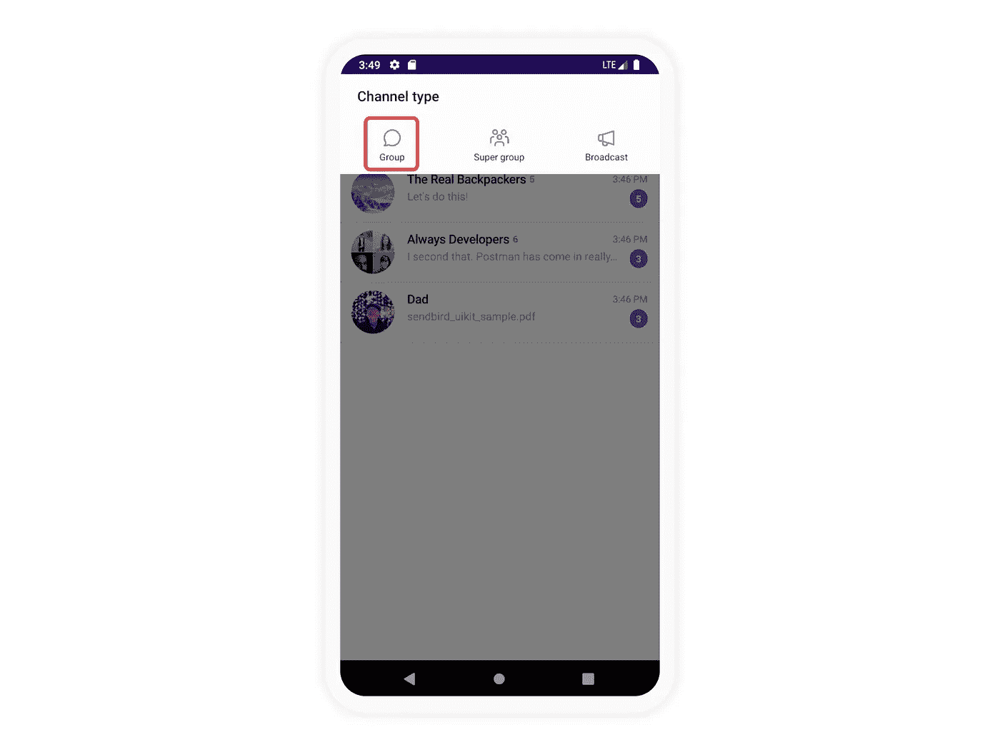
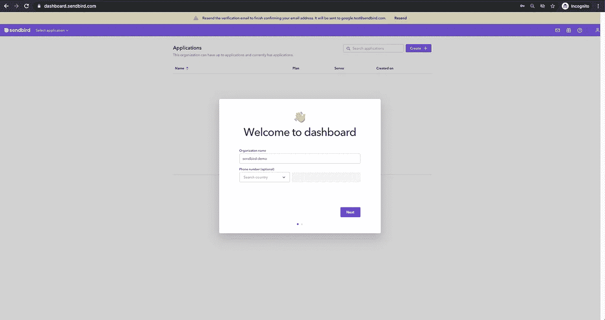
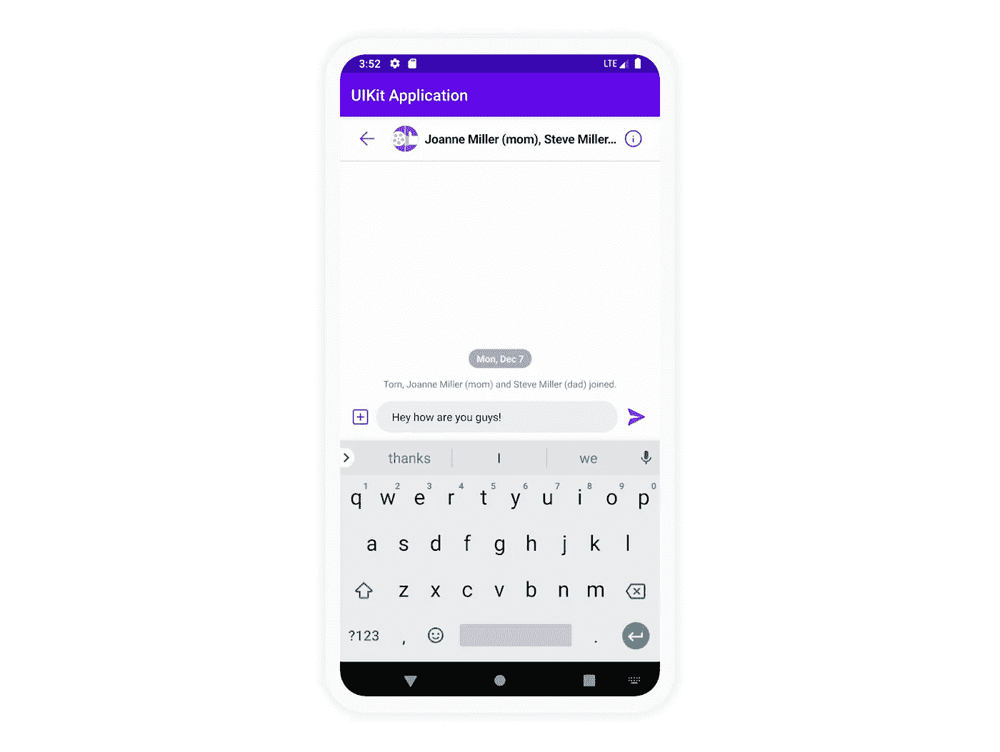

# 如何用 Sendbird UIKit 构建 Android 聊天应用

> 原文：<https://medium.com/codex/how-to-build-an-android-chat-app-with-sendbird-uikit-fcadfaa457d9?source=collection_archive---------7----------------------->

仙鸟 2022

## 使用预构建的 UI 组件构建功能丰富的应用内聊天

解决方案工程师| [Sendbird](https://www.sendbird.com)

*您可能会发现查看 Android Chat UIKit* [*示例代码*](https://github.com/sendbird/sendbird-uikit-android) *很有用。如需更多指导，请参考我们的* [*文档*](https://sendbird.com/docs/uikit/v1/android/quickstart/send-first-message) *。要查看您的现代、功能齐全的聊天工具，请查看我们的* [*演示*](https://sendbird.com/demos/in-app-chat) *。最后，查看我们的* [*Chat UIKit 页面*](https://sendbird.com/features/chat-messaging/uikit) *了解详情。*

*别忘了访问我们的* [*开发者门户*](https://sendbird.com/developer) *获取更多有用的教程和开发者资源！*

# 介绍

Sendbird UIKit 是一套丰富的预建 UI 组件，您可以使用它在 10 分钟内在您的应用程序中创建现代 messenger 体验。您也可以将 [Sendbird Chat SDK](https://sendbird.com/docs/chat%22) 与您自己的自定义 UI 一起使用。

本教程将向你展示如何用 Sendbird 发送你的第一条消息。阅读完本文后，您将使用客户端和服务器端代码构建一个通信通道来发送和接收消息。尽管对 Kotlin 和 Sendbird UIKit 的基本熟悉会有所帮助，但本指南适用于所有熟练程度的开发人员。

要发送您的第一封邮件，您需要:

1.创建:
a. [Sendbird 账号](https://dashboard.sendbird.com/auth/signup)b . send bird 环境中的用户
2 .导入 Sendbird UIKit 依赖关系
3。将 Sendbird UIKit SDK 集成到您的应用程序中

本指南详细介绍了这些步骤。我们开始吧！

# 第一步。创建一个 Sendbird 帐户

1.1 注册一个免费的 [Sendbird 帐户](https://dashboard.sendbird.com/auth/signup)

1.2 使用您的电子邮件地址创建一个帐户，或单击“继续使用 Google”

1.3 通过输入“组织名称”和“电话号码”来设置您的组织

1.4 选择“产品类型”并输入“应用程序名称”和“地区”后，创建您的 Sendbird 应用程序

1.5 您将被引导至 Sendbird 仪表板的主页，开始在您的产品中实施 Sendbird Chat SDK 和 API

1.6 进入后，从“应用程序”部分复制您唯一的“应用程序 ID”，并将其粘贴到您的剪贴板中。这将在步骤 4.1 中初始化 UIKit SDK 时使用。

# 第二步。在 Sendbird 仪表板中创建用户

2.1 导航至仪表板左侧导航中的用户部分

2.2 单击右上角的“创建用户+”图标

2.3 通过填写以下字段来创建新用户:
–‘ID’
–‘昵称’
–‘个人资料 URL’—可选
–‘颁发访问令牌’—可选

首先创建至少两个用户，这样您的应用程序中就有了可以互相聊天的用户。

# 第三步。添加 [Sendbird UIKit](https://sendbird.com/blog/introducing-sendbird-uikit-get-chat-running-in-minutes) SDK

为了构建我们的项目，我们将使用 Android Studio 作为我们的 IDE。您可以创建一个新项目或添加到一个现有项目中，这与下面将要介绍的内容没有什么不同。

**3.1 创建项目**

3.1.1.在欢迎界面中，点击“启动一个新的 Android Studio 项目”

3.1.2.在“选择项目模板”窗口中，选择“空活动”，然后单击“下一步”

3.1.3.在“配置您的项目”窗口的“名称”字段中输入您的项目名称

3.1.4.从语言下拉菜单中选择您的语言 Java 或 Kotlin

3.1.5.启用使用 androidx。*工件

3.1.6.选择最低 API 等级为 16 或更高

**3.2 使用扳手安装 UIKit】**

3 . 2 . 1 Android 版 UIKit 通过 Gradle 安装。将以下内容添加到项目级`build.gradle`文件中:

3.2.2 然后，打开你的 app 级`build.gradle`文件。对于 Java 和 Kotlin，添加如下代码块和依赖项，并同步以应用更改。

# 第四步。初始化 UIKit SDK

4.1 创建一个名为`BaseApplication`的类，并初始化一个`SendBirdUIKit`实例，绕过`SendBirdUIKitAdapter`实例作为`SendBirdUIkit.init()`方法中一个参数的自变量。这里您可能需要使用您之前复制的 ApplicationID。

4 . 1 . 1`SendBirdUIkit.init()`必须在客户端 app 的应用实例的`onCreate()`方法中调用一次。

4.1.2 将创建的`BaseApplication`添加到`AndroidManifest.xml`中

4.2 通道活性

`ChannelListActivity`是在应用程序中启动 Sendbird UIKit 的起点。只需一行代码，整个 UIKit 就可以在您的应用程序中实现。

*注意*:你可以从一个片段或者一个活动中启动 UIKit，你不需要扩展`ChannelListActivity`。

# 第五步。测试您的集成

5.1 在仿真器或插入式设备上运行应用程序。

5.2 继续创建一个通道，如下所示。

5.2.1.添加用户

5.2.2.单击创建按钮

5.3 发送您的第一条消息

试着输入一条信息，然后点击发送。您应该能够在应用程序中新建的聊天中成功发送您的第一条消息。

# 结论

恭喜你！您已经准备好使用 Sendbird 从您的 Android 应用程序发送和接收信息。您正在构建一个优秀且吸引人的应用程序！

开心聊楼！🙂