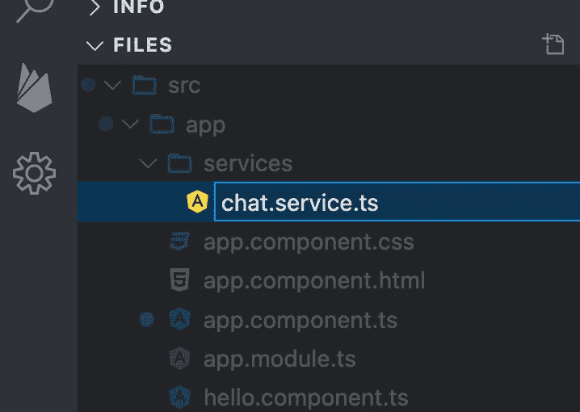

# 如何搭建一个有角度的聊天 app

> 原文：<https://medium.com/codex/how-to-build-an-angular-chat-app-af7a403cba89?source=collection_archive---------8----------------------->


仙鸟 2022

使用 Sendbird SDK 构建您自己的聊天应用程序，能够发送和接收消息

解决方案工程师| [Sendbird](https://www.sendbird.com/)

*看看* [*角样 app*](https://stackblitz.com/edit/angular-ivy-mzphea?file=src%2Fapp%2Fapp.component.ts) *你可能会觉得很有用。有关本教程中材料的其他指导，请参见* [*文档*](https://sendbird.com/docs/chat/v4/javascript/overview) *。查看 Sendbird Chat 的* [*演示*](https://sendbird.com/demos/in-app-chat) *并访问我们的* [*网站*](https://sendbird.com/features/chat-messaging) *以了解更多有关 Sendbird Chat 的信息。*

> *为了第一个了解新教程、开发者相关聊天/电话发布以及其他重要更新，* [*注册*](https://get.sendbird.com/dev-newsletter-subscription.html) *获取我们的开发者简讯。*

# 介绍

本教程将讨论如何使用 Angular 构建一个聊天应用程序。本教程结束时，您将已经构建了自己的聊天应用程序，能够发送和接收消息。

我们将从一些先决条件开始，在 [**Stackblitz**](http://stackblitz.com/) 中创建一个项目。然后我们将讨论如何创建角度服务。之后，我们将构建一个 HTML 模板，然后对组件进行编码。

对于本教程，我们将使用[**stack blitz**](http://stackblitz.com/)IDE。我们强烈建议您查看最终工作的 [**代码**](https://stackblitz.com/edit/angular-ivy-mzphea?file=src%2Fapp%2Fapp.component.ts) 。当然，您可以使用 **angular-cli** 创建一个常规的 Angular 项目，并使用您喜欢的任何 IDE 对其进行编码。为了速度和简单，我们将保持在线。

我们开始吧！💻

## 先决条件

为了充分利用本教程，您应该对以下内容有一个基本的了解:

*   [**HTML**](https://developer.mozilla.org/docs/Learn/HTML)
*   [**JavaScript**](https://developer.mozilla.org/docs/Web/JavaScript)
*   [**打字稿**](https://www.typescriptlang.org/)

# 步骤 1:创建一个空白项目

首先创建一个新项目。Stackblitz 提供了广泛的框架和库。我们将选择 Angular with TypeScript support 作为新的项目类型。


一旦创建了项目，您需要将 **Sendbird** 作为一个依赖项包含进来。


本教程适用于 Sendbird SDK 版本 3。

# 步骤 2:创建角度服务

为了保持代码有条理，我们将在 Angular 服务中编写所有 Sendbird 函数。

让我们首先为此创建一个新文件夹。


## 2.1:创建新的 TypeScript 文件

Angular 用打字稿工作。我们将创建一个新的空白文件，并将其命名为 **chat.service.ts.**

你可以使用任何你喜欢的名字。



## 2.2:导入 Sendbird

打开您刚刚创建的文件，并添加以下代码。

第一行由服务使用。

第二行将整个 Sendbird SDK 代码导入到我们的服务中。

## 2.3:使用您的应用程序 ID 初始化 Sendbird

为了初始化 SDK，您需要定义一个应用程序 ID ( **APP_ID** )。您可以从 [**Sendbird 仪表板**](https://dashboard.sendbird.com/) 中获得该值。我们为低规模项目和测试目的提供免费试用和免费永久开发者账户。要访问您的仪表板，请创建您的 [**账户**](http://sendbird.com/signup) 。

## 2.4:添加将您的用户连接到聊天的功能

初始化之后，您需要将一个用户连接到 Sendbird 的 WebSocket 服务器，以便发送和接收消息。Sendbird WebSocket 执行其他功能，如创建通道和接收各种事件。

请注意，Sendbird SDK 也适用于离线模式。这意味着您可以在没有连接的情况下启动应用程序，并显示设备上自动缓存的所有信息。请查看我们的 [**文档**](https://sendbird.com/docs/chat/v3/javascript/guides/local-caching#1-local-caching) 以了解更多关于本地缓存的信息。

现在让我们添加**连接**功能:

**连接**功能接受以下参数:

*   **userId** :这是一个不带空格的字母数字值。创建后，用户将出现在 [**Sendbird 仪表板**](https://dashboard.sendbird.com/) 的列表中。
*   **访问令牌**:一旦为您的登录启用了安全性，您将需要为这个用户生成一个会话令牌。在这里阅读[](https://sendbird.com/docs/chat/v3/platform-api/user/managing-session-tokens/issue-a-session-token#1-issue-a-session-token)**。**

**如果连接成功，**错误**值将为*空值*，并且**用户**对象将包含您的登录用户的所有信息。**

## **2.5:有用的功能**

**Sendbird SDK 提供了您的应用程序所需的所有有用的功能。这里我们再补充两个: **isConnected()** 和 **getConnectedUser()** 。**

**这两个函数将验证是否有连接的用户，并随时返回连接用户的信息。**

## **2.6:事件处理器**

**在聊天对话中，会发生多个事件。其中一些是:**

*   **我们被邀请参加对话(群组频道)**
*   **其他用户被邀请到我们所在的频道**
*   **我们通过频道接收信息**
*   **一个或多个频道成员正在键入消息**
*   **用户离开一个频道**

**对于这些聊天事件中的任何一个，Sendbird SDK 都会通知我们，以便我们做出相应的响应。以下是可用功能的列表:**

**您可以将自己的逻辑应用于这些功能中的一部分或全部。**

**在本教程中，我们将只实现其中的一个: **onMessageReceived** 。**

**当我们的任何群组频道的成员发送消息时，该功能被自动调用。我们收到的参数是:**

*   ****通道**:消息发送到的通道**
*   ****消息**:发送到频道的消息的详细内容**

**我们要做的是用我们想要发送给应用程序的信息调用**回调**函数。**

## **2.7:创建群组频道**

**函数 **createGroupChannel** 将使用 Sendbird SDK 创建群组通道。频道是进行对话的地方。Sendbird 支持许多不同的通道类型；在 [**文档**](https://sendbird.com/docs/chat/v3/platform-api/channel/channel-overview#2-channel-types) 中阅读所有关于它们的内容。**

**这里的 解释了所有可用的参数 [**。查看我们的**](https://sendbird.com/docs/chat/v3/javascript/guides/group-channel#2-create-a-channel) **[**文档**](https://sendbird.com/docs/chat/v4/javascript/quickstart/send-first-message) 了解更多关于 Javascript 的 Sendbird Chat SDK 的细节。****

## **2.8:获取我的群组频道**

**在我们的服务中，我们还需要一个函数来检索我们创建的群组频道和我们被邀请的频道。**

**在此 阅读更多关于使用 Sendbird Chat SDK 获取群组频道的 [**。**](https://sendbird.com/docs/chat/v3/javascript/guides/group-channel#2-retrieve-a-list-of-channels)**

## **2.9:从通道获取消息**

**对话发生在一个渠道内；当选择一个频道时，获取这些信息并显示给用户是很重要的。**

**Sendbird 提供了几个过滤器和排序选项来列出您的邮件。在这里阅读[](https://sendbird.com/docs/chat/v3/javascript/guides/group-channel#2-load-previous-messages)**。****

## ****2.10:发送消息****

****我们服务中的最后一个函数用于向通道发送消息。一旦我们向频道发送消息，所有成员都可以阅读它。****

****Sendbird 有三种类型的消息:****

*   ****用户消息****
*   ****文件消息****
*   ****管理消息****

****在 [**文档**](https://sendbird.com/docs/chat/v3/javascript/guides/group-channel#2-send-a-message) 中阅读更多关于消息类型的信息。****

****消息不仅仅是文本；Sendbird 为消息对象提供了几个属性，您可以在其中添加额外的信息(其中一些是:数据、元数组和自定义类型)****

****借助这些元数据，您可以在两个或更多用户之间实现复杂的通信系统。您可以超越基于文本的聊天来思考问题！****

****点击 阅读所有关于发送信息 [**的内容。**](https://sendbird.com/docs/chat/v3/javascript/guides/group-channel#2-send-a-message)****

# ****我们的服务准备好了！****

****现在，我们已经构建了管理频道和消息的基本功能。下一步是移动到我们的组件，并构建一个向用户显示信息的屏幕。****

# ****第三步:模板****

****Angular 使用组件在屏幕上显示所有信息。组件由一个模板(用 HTML 文件编写)和一个类(用 TypeScript 编写)组成。先说模板。****

## ****3.1:连接聊天****

****添加一个按钮，它将从我们的类组件内部调用 **connect()** 函数。点击或点击此按钮连接聊天。****

****注意，这个 **connect()** 函数还没有创建。我们将在第 4.2 步解释如何编写 **connect()** 函数；现在，让我们专注于构建模板。****

****您的模板现在应该如下所示:****

********

****运行应用程序以实时查看按钮。****

## ****3.2:开始对话****

****一旦建立了连接，您就可以创建对话(或频道)。让我们再添加一个按钮来创建我们的第一个群组通道，名为“ **angular-tutorial** ”。****

****一旦你运行它，它应该是这样的。****

********

****我们将很快对这些新按钮的功能进行编码。让我们首先添加更多的 HTML 代码，允许您显示您的频道(或对话)。****

*   ******ngFor** 是一个角度指令，用于遍历**对话**数组并显示每个频道的名称。****

********

****创建频道后，它们将在模板中显示如下。**获取消息**按钮将显示该频道的消息。****

****现在让我们了解如何创建群组频道，并在此列表中显示它们。****

## ****3.3:列出发送到频道的消息****

****消息存在于群组频道中(本例中为 **android-tutorial** )。我们将再次使用 ***ngFor** 指令，但这一次我们将遍历 **messages** 对象。****

## ****3.4:发送新消息****

****以下代码显示了一个用于输入文本的输入框。我们还在边上添加了一个按钮来执行发送消息的功能。****

****这是所有组件最终在屏幕上显示的方式:****

********

# ****步骤 4:编码组件类变量****

****模板完成后，我们需要使用 TypeScript 对组件类进行编码。****

****让我们从类变量开始。这是你需要的所有变量的要点。****

****下面是对每个变量的解释。如果你不想看这些解释，请随意跳到下一部分。****

```
**connected = false;**
```

******连接**是一个布尔对象，允许整个组件定义 SDK 是否连接。****

```
**startConversationResult: string;**
```

****当尝试创建组通道时，此字符串将显示任何错误。****

```
**conversations: Array<SendBird.GroupChannel> | null;listConversationsResult: string | null;**
```

******对话**包含我们的群组频道列表。****

******listConversationsResult**在尝试获取群组频道列表时会显示任何错误消息。****

```
**selectedChannel: SendBird.GroupChannel | null;**
```

******selectedChannel** 在用户点击某个频道查看其消息时被填充。****

```
**messages: Array< SendBird.UserMessage | SendBird.FileMessage | SendBird.AdminMessage> | null;**
```

******消息**是所选频道内的消息数组。****

```
**textMessage: any;**
```

****我们使用 **textMessage** 来存储要发送给通道的文本。****

## ****4.1:实现 OnInit****

****在 Init 上添加 Angular 接口**允许我们在组件初始化时执行代码。******

****我们将使用它来调用我们的服务并初始化 Sendbird SDK。****

## ****4.2:连接到 Sendbird****

****一旦 SDK 被初始化，我们就可以连接一个用户。发送 **userId** 中的值(以及可选的会话或访问令牌)。如果你想了解更多关于用户和连接的信息，请查看我们的 [**文档。**](https://sendbird.com/docs/chat/v3/unreal/application/authenticating-a-user/authentication#2-connect-to-the-sendbird-server-with-a-user-id-and-an-access-token)****

****为该演示选择的用户 Id 是 **sendbird** 。您可以使用任何您喜欢的 ID。****

****我们将发送一个 **null** 值作为会话/访问令牌，因为这个演示没有应用安全性。****

****第三个参数是我们的回调，它通知我们错误或成功登录。****

****连接后，我们调用两个函数: **registerEventHandlers()** 和 **getMyConversations()** 。请继续阅读，了解更多相关信息。****

****最后，我们将连接的布尔变量**设置为**真**，这样整个组件都知道最新的状态。******

## **4.3:注册事件处理程序**

**当我们连接到 websocket 时，Sendbird SDK 会通知我们的应用程序发生了不同的事件。**

**如果来自 [**平台 API**](https://sendbird.com/docs/chat/v3/platform-api/overview) 的任何活动被执行，事件处理器也会收到通知。**

**SDK 每次收到事件都会传给我们。我们在本演示中分析的唯一事件是 **onMessageReceived** ，因为我们将该消息添加到屏幕上已有的消息列表中。**

**我们向列表中添加一条新消息，该消息仅在满足以下所有条件时到达:**

*   **如果有选定的频道**
*   **如果事件是正确的(我们检查字符串**‘on message received’**)**
*   **如果所选择的频道 URL(频道的唯一 ID)与来自所接收事件的频道 URL 相同**

## **4.4:开始对话**

**此功能将创建一个新的群组通道，用于在两个或多个用户之间发送和接收消息。**

**对于这个例子，我们将频道命名为 **android-tutorial** 。**

**Sendbird SDK 将自动定义一个频道 URL(这是每个频道的唯一 ID)。**

**可以用相同的名称创建多个频道，因为这不是唯一的 ID。**

**对于这个例子，我们邀请一个名为 **myTestUserId** 的用户 ID。我们可以在创建频道时邀请多个用户加入。我们也可以稍后添加成员。**

**如果创建频道时出现错误，变量**startConversationResult**将在屏幕上显示错误。**

## **4.5:获取频道列表**

**一旦我们创建了群组频道，我们需要获得群组频道的列表。**

**组通道包含几个属性。你可以在这里看到它们的全部细节[](https://sendbird.com/docs/chat/v3/platform-api/channel/channel-overview#4-list-of-properties-for-group-channels)**。****

****如果出现任何错误，我们将使用 **listConversationsResult** 对象在屏幕上显示出来。如果请求是正确的，我们将信息存储在**对话**对象中。****

## ****4.6:列出频道中的消息****

****一旦选择了一个频道，您就可以获得其所有消息的列表。****

****要查看消息的属性，请查看我们的 [**文档**](https://sendbird.com/docs/chat/v3/platform-api/message/message-overview#2-resource-representation) 。****

****数组**消息**将包含所选频道的消息列表。****

****在屏幕上，我们显示了*消息*属性，但是您还可以使用其他属性:****

*   ****创建消息的时间****
*   ****消息发送者****
*   ****元数据(数据、排序元数组和自定义类型)****
*   ****提到的用户****
*   ****如果文本中包含任何 URL，则打开图形元数据****
*   ****父消息 ID****
*   ****还有更多！****

## ****4.7:发送消息****

****现在我们知道如何接收信息。我们需要学习如何向频道发送新消息，让其他成员看到。****

****这个被发送的消息将为信道的其他连接成员触发一个事件。****

****由于事件处理程序，他们将能够看到新消息被添加到列表中。****

# ****结论****

****就是这样！你现在知道如何构建一个 Angular 聊天应用程序来发送和接收消息。我们讨论了如何创建 Angular 服务、构建模板以及对组件进行编码。本教程的完整代码可以在 [**Stackblitz**](https://stackblitz.com/edit/angular-ivy-mzphea?file=src%2Fapp%2Fapp.component.ts) 上找到。一如既往，如果您需要帮助，请在 [**仙鸟社区**](https://community.sendbird.com/) 或 [**发帖直接联系我们**](https://sendbird.com/contact-us) 。我们总是乐意帮忙！****

****现在只需添加您的 Sendbird 应用程序 ID 并开始构建！****

****开心聊楼！✌️****