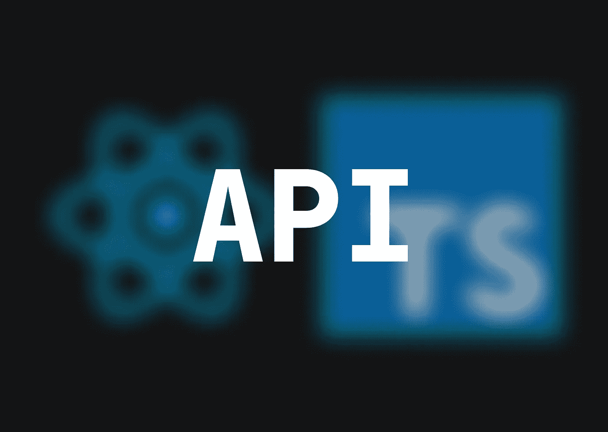

# 如何用 TypeScript 构建 API 并在 React 中使用它(第 1 部分)

> 原文：<https://medium.com/codex/how-to-build-an-api-with-typescript-and-use-it-in-react-part-1-2dab843d12be?source=collection_archive---------6----------------------->

API 的使用在编程中是必不可少的。从数据解释的角度来看，这些是两个应用程序之间最关键的层。本文解释了如何创建一个并在 React 应用程序中使用它。



```
💡 *API = Application Programming Interface*
```

首先，我们需要一个简单的应用程序作为我们的“编程接口”此应用程序将只能发送一个响应对象；它将无法管理或更改数据。回应将会是

```
{
  message: 'Awesome!'
}
```

我们还需要在计算机上安装一些东西，但是不要担心，它们在以后仍然会有帮助！

好吧，回到我们的 API。对于此任务，将使用 TypeScript。要测试它，请在文件夹中创建一个新的 TypeScript 文件，在代码编辑器中打开它，然后向其中添加一行。

```
🤞 **FIRST OF ALL CREATE YOUR TYPESCRIPT FILE AND ADD A SIMPLE LOG**
my-first-api/index.ts
console.log('Test!')
```

既然我们必须以某种方式利用它，那么`nodemon`就出现了。`nodemon` CLI 应用程序在您的终端中运行 JavaScript 和 TypeScript infinite，并在您的代码更改时重新启动它们。

所以让我们安装一些新的包来运行您的 TypeScript 文件！首先，我们 are⚙️将需要`nodemon`,当然是支持打字稿的:

```
👆 **INSTALL REQUIRED DEPENDENCIES**
npm i -g nodemon ts-node
```

然后将`tsconfig.json`文件添加到您的文件夹的根目录，以处理类型脚本功能，并用以下内容更新它，以便能够使用`console.log()`功能:

```
🔧 **BE AWARE OF THE CONFIGURATION**
{
  "compilerOptions": {
    "lib": [ "dom" ]
  }
}
```

在你的终端输入`nodemon index.ts`后，你会看到你的日志

```
😎 **TEST WORKS OUT JUST FINE**
nodemon index.ts
'Test!'
```

太好了！我们的代码现在需要更新成为一个 API。我们需要一个 API 调用控制器，在我们的例子中，它是`express`库，所以我们需要安装它。但是首先，要在我们的文件夹中安装库，我们必须首先创建并更新`package.json`文件。

```
📦 **CREATE AND UPDATE package.json FILE**
my-first-api/package.json
{
  "name": "my-first-api",
  "version": "1.0.0",
  "dependencies": {
  }
}
```

并安装`express`

```
🚝 **INSTALL EXPRESS & DEVELOPER DEPENDENCIES**
npm i express
npm i --save-dev [@types/node](http://twitter.com/types/node)
```

现在我们有了创建 API 的库，我们必须在文件中定义它是一个 **express** 应用程序

```
📞 **DEFINE EXPRESS IN OUR TYPESCRIPT FILE**
const express = require('express')
const app = express()
const port = 3000
**app.listen**(port, () => {
  console.log('App is listening on port', port)
})
```

这意味着我们定义了`express`，创建了一个`express`应用程序，并定义了一个通信端口。`app`上的`listen`函数基本上启动 API。

```
💡 *In order to ensure that our API runs indefinitely, we use nodemon to launch it. Otherwise, we won't be able to interact with it.*
```

为了继续，我们必须指定当我们调用 API 时，我们想要发送一条消息

```
📡 **DEFINE THE MESSAGE**
const express = require('express')
const app = express()
const port = 3000
app.listen(port, () => {
  console.log('App is listening on port', port)
})
**app.get('/', (req, res) => {
  res.send({
    message: 'Awesome!'
  })
})**
```

上面的代码简单地暗示了您想要在`”/”`路径(这是根端点)上从`app`获得`.get`信息，并且您想要使用`res`发送的消息(类似于响应)是一个对象:

```
{
  message: 'Awesome!'
}
```

嘣。您的 API 是功能性的。它在您的`localhost`上运行，因为您是从终端启动它的，因此您可以使用您已经在应用程序中提供的地址和端口号来访问它，如下所示:

```
🧑‍💻 **TYPE THIS ADDRESS INTO YOUR WEB BROWSER BAR AND SEE WHAT HAPPENS**
localhost:3000
```

您的邮件将以纯文本形式出现在浏览器中。太棒了，对吧？因此，您现在可以在 API 中定义任何端点，也可以从浏览器访问它。

敬请关注第 2 部分，了解如何在周日的 React 应用程序中从这个令人敬畏的新 API 获取数据！

👋我希望这在你寻找新的学习材料时对你有用。**感谢您抽出时间阅读本文！**

如果你从我的文章中更好地理解了一些东西，**你可以请我喝咖啡来支持我**:[https://www.buymeacoffee.com/daanworks](https://www.buymeacoffee.com/daanworks)

📯**订阅我的电子邮件列表**，如果你想在未来读到更多这样的故事，请在这里或在 [Twitter](https://twitter.com/daanwords) **上关注我！**