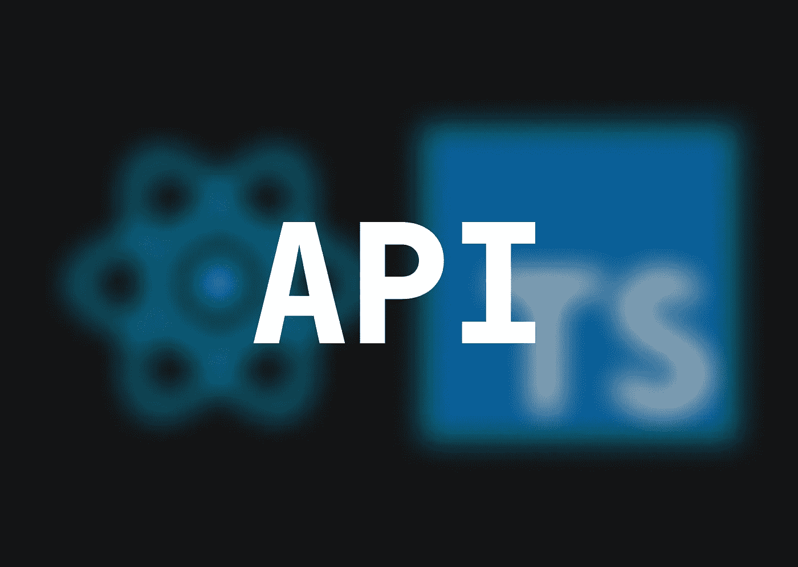

# 如何用 TypeScript 构建 API 并在 React 中使用它(第 2 部分)

> 原文：<https://medium.com/codex/how-to-build-an-api-with-typescript-and-use-it-in-react-part-2-2c789fa38a0?source=collection_archive---------7----------------------->

API 的使用在编程中是必不可少的。从数据解释的角度来看，这些是两个应用程序之间最关键的层。本文解释了如何创建一个并在 React 应用程序中使用它。



好吧，我们说到哪了？

我们有一个运行在`localhost:3000`上的完美的 API，如果我们进行调用，它会发送一个对象:

```
{
  message: 'Awesome!'
}
```

记住，因为用`nodemon`运行我们的 API，我们完全有能力在任何时候到达它，直到我们停止它。我们不仅可以手动调用，还可以从另一个应用程序调用，所以让我们创建一个新的 React TypeScript 项目。您可以从这里开始在前端应用程序中使用来自 API 的数据！

```
😎 **CREATE A NEW REACT APPLICATION FROM YOUR TERMINAL**
npx create-react-app awesome-app --template typescript
```

在我们开始新的前端应用程序之前，请想一想这里会发生什么。我们有一个 API 运行在`localhost`，端口`3000`。现在我们将启动我们的 React 应用程序，它最初也会尝试在`localhost`端口`3000`上启动！

为了与 React 应用程序并行运行 API，我们需要更改 API 的端口

```
❗️ **CHANGE THE PORT NUMBER OF THE API BEFORE STARTING REACT APP**
...
**const port = 3001**
app.listen(port, () => {
  console.log('App is listening on port', port)
})
...
```

为了支持 React 应用程序的调用，另一件要做的事情是向服务器添加一个 CORS 头。

```
💡 *CORS = Cross-Origin Resource Sharing*
```

首先，将`cors`库添加到 API 中

```
➕ **ADD CORS LIBRARY TO YOUR API**
cd ../my-first-api
npm i cors
```

为了让 API 实际使用它，我们必须定义它并允许服务器文件中的`localhost:3000`请求

```
🍏 **DEFINE CORS**
...
const cors = require('cors')
...
app.use(cors({
  origin: '[http://localhost:3000'](http://localhost:3000')
}))
...
```

如果想不起来或者根本不知道，可以再读一遍第 1 部分的 API 代码:

[](/codex/how-to-build-an-api-with-typescript-and-use-it-in-react-part-1-2dab843d12be) [## 如何用 TypeScript 构建 API 并在 React 中使用它(第 1 部分)

### API 的使用在编程中是必不可少的。从数据解读的角度来看，这些是最关键的…

medium.com](/codex/how-to-build-an-api-with-typescript-and-use-it-in-react-part-1-2dab843d12be) 

接下来，您应该打开 React 应用程序文件夹(在我们的示例中，文件夹名称是您的应用程序的名称`awesome-app`)并开始处理您的项目

```
🔌 STEP INTO YOUR REACT APP FOLDER AND START IT
cd ../awesome-app
npm start
```

干得好！如果一切按计划进行，您应该会看到一个旋转的 React 徽标和一些文本。现在继续删除`App.tsx`中的所有内容，并在`return`键后留下一个空白`<div></div>`。

```
🦴 **LEAVE JUST A BLANK PAGE IN App.tsx FOR NOW**
function App() {
  return (
    <div>
    </div>
  )
}
export default App
```

现在，我们必须以某种方式将数据从正在运行的 API 中获取到前端应用程序中。我们可以用`fetch`来实现。首先，我们需要创建一个名为`data`的新的简单`state`

```
💾  **CREATE A NEW STATE**
function App() {
  **const [data, setData] = useState<{ message: string } | null>(null)**
  return (
    <div>
    </div>
  )
}
export default App
```

你必须意识到

```
💡 *You must type your new state to prevent type errors since we are using TypeScript yet again*
```

最后一步是以某种方式将来自 API 的数据设置为前端的`data`状态。为此，我们将利用`useEffect`钩子中的`fetch`函数。

```
🦄 **SET THE DATA FROM THE API TO THE FRONTEND'S STATE**
import {useEffect, useState} from "react";
function App() {
  const [data, setData] = useState<{ message: string } | null>(null)
  **useEffect(() => {
    fetch('**[**http://localhost:3001/'**](http://localhost:3001/')**, {
      method: "GET",
      headers: {
        'Accept': 'application/json',
        'Content-Type': 'application/json',
        'Access-Control-Allow-Origin': '*'
      },
    })
      .then(res => res.json())
      .then(_data => setData(_data))
  }, [])**
  return (
    <div>
    </div>
  )
}
export default App;
```

如你所见，我们将一些重要的参数传递给这里的`fetch`。首先我们设置地址，地址是`[http://localhost:3001/](http://localhost:3001/`)`。然后我们开始添加额外的参数，比如`method`。还记得我们在 API 中使用了`app.get`吗？这个`get`(或`GET`)也是在前端 app 中定义的！在一些请求头设置和`JSON`格式化之后，瞧，我们可以用来自 API 的对象设置`data`状态了！最后要做的是在组件中将其显示为`{data.message}`

```
⭐️ SHOW THE MESSAGE
import {useEffect, useState} from "react";
function App() {
  const [data, setData] = useState<{ message: string } | null>(null)
  useEffect(() => {
    fetch('[http://localhost:3001/'](http://localhost:3001/'), {
      method: "GET",
      headers: {
        'Accept': 'application/json',
        'Content-Type': 'application/json',
        'Access-Control-Allow-Origin': '*'
      },
    })
      .then(res => res.json())
      .then(_data => setData(_data))
  }, [])
  return (
    <div>
 **<div>Message from the API:</div>
      <div>{data?.message && data.message}</div>**
    </div>
  )
}
export default App;
```

恭喜你！您已经创建了一个正常工作的 API，并使用定制的前端 React 应用程序从中检索数据。这是一个重要的时刻！

👋我希望这在你寻找新的学习材料时对你有用。感谢您花时间阅读本文！

如果你从我的文章中更好地理解了一些东西，**你可以请我喝杯咖啡来支持我**:[https://www.buymeacoffee.com/daanworks](https://www.buymeacoffee.com/daanworks)

📯**订阅我的电子邮件列表**，如果你想在未来读到更多这样的故事，请在这里或在 [Twitter](https://twitter.com/daanwords) **上关注我！**