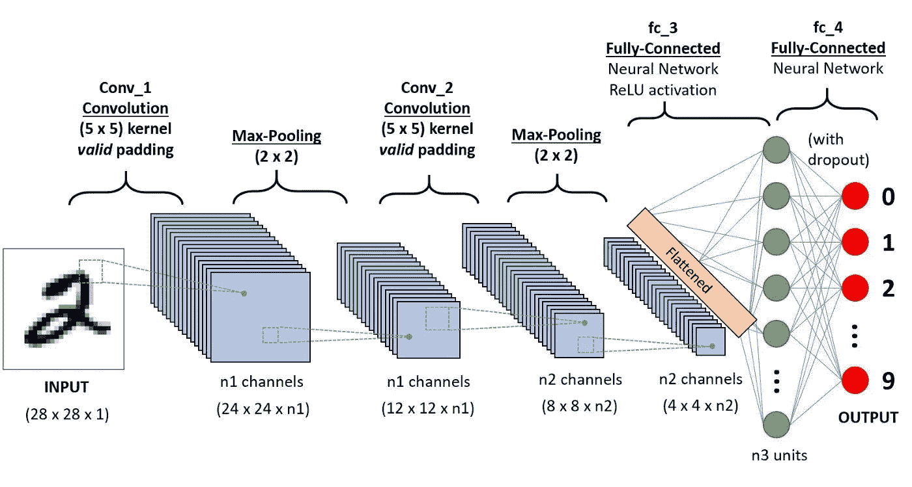
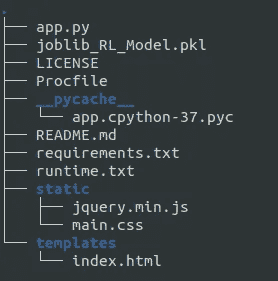

# 如何构建端到端的机器学习应用

> 原文：<https://medium.com/codex/how-to-build-an-end-to-end-machine-learning-application-40cd6ac7f66f?source=collection_archive---------23----------------------->


沙哈达特·拉赫曼在 [Unsplash](https://unsplash.com?utm_source=medium&utm_medium=referral) 上拍摄的照片

## 这比你想象的要简单！



通用有线电视新闻网

**简介:**

你有没有想过如何向世界展示你的技能和知识，并可能在你的简历上有一个杀手级项目？

你可能有一个想法，或者甚至是这个想法的实现，无论是在 Kaggle 上还是在你的本地工作区。很好！，但是你如何向其他人展示这个呢——给他们发一个你的 Kaggle 笔记本或者你的 GitHub 库的链接？

这听起来很麻烦，如果有一个应用程序向他们展示你的模范作品，岂不是很酷或者很方便。因此，我将尝试解释如何建立一个完整的工作流程。我做的项目是手写值的数字识别。这个想法很简单，我们画一个数字，然后预测它在 0-9 之间。(啊！另一个数字识别 BS，相信我这将解释很多，你可以建立更酷的东西)。我们将在 Heroku 部署我们的项目。让我知道这篇文章可以如何改进。

# 你问我们如何做到这一点？

答案很简单:你需要的只是一些 HTML、CSS 和 JavaScript 的基础知识。这将有助于建立我们的前端。对于我们的后端，我们将使用烧瓶。所有这些都没问题，但是我们应该如何开始，我们需要遵循的架构是什么？—在我们开始编码之前，这些是必须回答的问题。

## 应该如何开始？！

这个古老问题的答案是，首先要知道我们的目标到底是什么。我知道有太多的问题我问过自己:P(大部分是反问句)。但是这些对我们的问题来说确实是必要的。项目结构将是:



所以这回答了我们两个的问题。首先，我们将所有的静态文件(CSS，JS)保存在一个名为 *static* 的文件夹中，我们的*index.html*保存在一个名为 *templates* 的文件夹中。重要的是不要更改这些名称。至此，我们完成了模板的设置。

其次，我们将遵循的体系结构是众多体系结构中的一种，有许多方法可以实现这一点。我们将使用以下流程:

1.  用户在 HTML5 画布上画一个数字并点击提交按钮。
2.  该图像在客户端被编码为 base64 以减少服务器计算。
3.  我们的服务器将接收编码后的字符串(用 python 编写)，然后我们解码这个字符串，将其转换成图像。我们将使用 AJAX 进行客户端-服务器通信。
4.  然后，我们将对该图像执行一些基本操作，以适应我们已经保存的 ML 模型，因此我们不会一次又一次地训练它。为了获得更好的结果，可以在将来这样做，但是我们将限制自己，以节省本文的时间。

在这篇文章中，我会让你知道如何建立我们的前端。如果你喜欢这篇文章，请继续关注服务器端！(又来了，有人试图与用户建立融洽的关系)。

# 客户端

所以我已经使用基本的 HTML，CSS 和 JS 来构建我的 web 应用程序，但对你没有任何限制，如果你对构建一个更好的应用程序感到舒服，我说继续，让我也知道:p。我对漂亮的网页很着迷！

我的登录页面(索引)将放在“模板”文件夹中，CSS 和 JS 文件将放在“静态”文件夹中。我们将只使用 JQuery 脚本来触发请求和响应。画布的代码看起来像这样

```
var canvas = document.getElementById(‘myCanvas’);
var ctx = canvas.getContext(‘2d’);
var painting = document.getElementById(‘paint’);
var paint_style = getComputedStyle(painting);canvas.width = parseInt(paint_style.getPropertyValue(‘width’));
canvas.height = parseInt(paint_style.getPropertyValue(‘height’));var mouse = { x: 0, y: 0 };canvas.addEventListener(‘mousemove’, function (e) {mouse.x = e.pageX — this.offsetLeft;
mouse.y = e.pageY — this.offsetTop;}, false);ctx.lineWidth = 10;
ctx.lineJoin = ‘round’;
ctx.lineCap = ‘round’;
ctx.strokeStyle = ‘white’;
ctx.fillStyle = ‘black’;
ctx.fillRect(0, 0, ctx.canvas.width, ctx.canvas.height);var onPaint = function () {
ctx.lineTo(mouse.x, mouse.y);
ctx.stroke();
};
```

上面的代码将创建我们需要的画布，背景为黑色，笔画颜色为白色。如果我们不设置背景，那么结果将是只有笔画的图像，这可能使数字的预测更加困难。现在基本代码可以在我的 [GitHub](https://github.com/adityasingh22/Digit-recognition-using-real-time-drawn-value) 上找到。

> 为了处理**提交**和**清除**按钮，我们需要添加 JavaScript 来处理它们

这方面的代码可以是这样的

目前，我们的画布只能检测鼠标移动，但不能触摸。触摸动作也可以添加，但这是另一个故事。

我所做的是为鼠标移动添加一个 EventListener 在 mouseup 时，监听器是关闭的，所以笔画不会一直变化。clearArea()函数将清除画布，每当我们单击 clear 或 Submit 按钮时，就会发生这种情况。稍后将解释 **innerHTML** 的用法。toDataURL()函数会将画布编码为 base64:供 FLask 使用。

我希望你喜欢这篇文章，请继续关注，我将很快发表另一篇文章来训练我们的模型和后端。