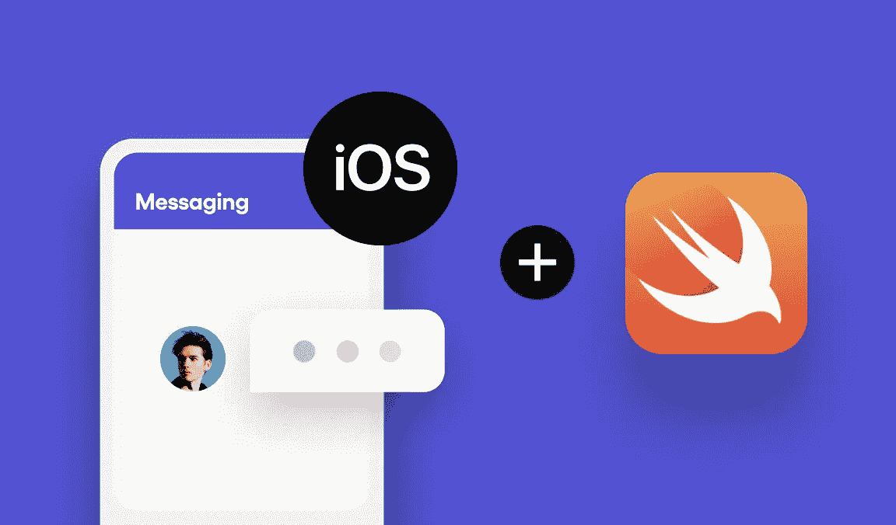

# 如何使用 Swift 构建 iOS 报文传送应用程序:第 1 部分

> 原文：<https://medium.com/codex/how-to-build-an-ios-messaging-app-with-swift-part-1-c50edb3de7e6?source=collection_archive---------17----------------------->

仙鸟 2022

## 为 iOS 消息应用程序创建一个用户界面，并利用 [**Sendbird Chat SDK**](https://sendbird.com/docs/chat/v3/ios/quickstart/send-first-message) 开发支持消息传递的功能

由迦娜·麦克劳克林
解决方案工程师| [Sendbird](https://www.sendbird.com/)

*为了更好地理解，我们建议您查看* [*示例代码*](https://github.com/janna-sendbird/SendbirdSwiftBlog/tree/part1_userloginview) *。如需更多指导，请访问我们的* [*文档*](https://sendbird.com/docs/chat/v3/ios/quickstart/send-first-message) *。不要忘记查看应用内聊天的* [*演示*](https://sendbird.com/demos/in-app-chat) *，并访问我们的* [*网站*](https://sendbird.com/features/chat-messaging) *以了解更多关于仙鸟聊天可以提供的内容。*

> *成为第一个了解新教程、开发者相关聊天/电话发布以及其他重要更新的人，* [*注册*](https://get.sendbird.com/dev-newsletter-subscription.html) *订阅我们的开发者简讯。*

# 介绍

在本教程中，您将学习如何为 iOS 消息应用程序实现用户界面，并开发支持使用[**Sendbird Chat SDK**](https://sendbird.com/docs/chat/v3/ios/quickstart/send-first-message)发送消息的功能。完成后，您将创建自己的登录视图，并将您的用户连接到 Sendbird。这是用 Swift 和故事板创建自己的聊天应用程序的第 1 部分。

未来的样品将被列在[这个储存库**的**或](https://github.com/janna-sendbird/SendbirdSwiftBlog/tree/part1_userloginview)主分支或零件特定分支下。

本教程是使用以下工具构建的:

*   Xcode 版本 12.5
*   iOS 版本 14.5
*   Sendbird 核心 iOS SDK 版本 3.0.224

请注意，本教程假设您对 Swift 有基本的了解。也就是说，让我们开始吧！

# 第一步。创建一个新的 Xcode 应用程序并导入 Sendbird Chat SDK

1.在 Xcode 中新建一个 App:
要启动一个新项目，运行 Xcode，选择**文件>新建>项目**，选择 **App** 。点击**下一个**。

将你的 app 命名为 Messenger，设置界面为**故事板**，选择 **Swift** 为语言。点击下一个的**。**

选择您想要创建项目的文件夹，然后单击**创建**。

Xcode 将自动使用我们将在本教程中编辑的 **AppDelegate.swift** 、 **ViewController.swift** 和 **Main.storyboard** 文件创建您的应用程序。

2.按照**第二步:通过 CocoaPods 或者 Carthage** 和**安装 SDK 第三步:使用 GitHub 上 Sendbird Chat iOS SDK readme . MD[**page**](https://github.com/sendbird/sendbird-ios-framework#step-2-install-sdk-via-cocoapods-or-carthage)中 Objective-C** 中的聊天 SDK。这将引导您完成 SDK 安装。

对于本教程，我选择 CocoaPods 通过终端应用程序进行安装:

我的 Podfile 如下所示:

安装和 SDK 配置完成后，请务必关闭任何当前 Xcode 会话，并从现在开始对此项目使用“Messenger.xcworkspace”文件。这将使以后构建和运行应用程序成为可能。

对于**步骤 3** 中的导入行，可以在 **AppDelegate.swift** 文件顶部添加“import SendBirdSDK ”,如下所示:

**注意:**如果您发现该导入行有任何问题，无法找到该模块，请从左栏中选择**Pods**project>**Build Settings**>**Build Active Architecture Only**(您也可以使用搜索来找到它)并将其设置为“NO”。

在顶部，选择**产品** > **构建**。此时，导入错误应该会自行解决，您现在可以运行应用程序来查看一个空屏幕。如果没有，你可以在这个 StackOverflow 帖子 中找到其他有用的替代解决方案 [**。**](https://stackoverflow.com/questions/37852614/xcode-cant-find-a-module-after-updating)

# 第二步。在仪表板上创建 Sendbird 应用程序

首先，您需要在 Sendbird 仪表板上创建一个应用程序。为此，请访问 [**Sendbird 仪表盘**](https://dashboard.sendbird.com/) 。

注册以创建仪表板帐户。

注册后，遵循初始设置过程。完成后，您可以在仪表板概览中查看您的新应用程序。

客户端使用**应用程序 ID** 来识别您的应用程序。

# 第三步。实现登录视图

## 了解推荐的登录过程

想要和某人聊天的用户必须获得访问 Sendbird 服务器的许可。如果您想发布一个具有更安全认证的产品版本，必须实现一个用户认证服务器。认证服务器有一个用户数据库，通过发送鸟 [**平台 API**](https://sendbird.com/docs/chat/v3/platform-api/guides/user#2-create-a-user) 与发送鸟服务器通信。

上图解释了从用户认证服务器获得许可的过程。

1.  iOS 客户端使用用户 ID 和密码登录用户认证服务器。
2.  用户认证服务器(通过平台 API)创建一个用户，或者检查该用户是否已经存在于 Sendbird 中。
3.  Sendbird 服务器向用户认证服务器返回访问令牌或会话令牌。
4.  用户认证服务器将访问令牌返回给 iOS 客户端。
5.  iOS 客户端通过 Sendbird 的 SDK 使用用户 ID 和访问令牌连接到 Sendbird 服务器。
6.  SendBird 服务器向 SDK 返回成功，并连接用户。

## 简化登录程序

然而，本教程并没有介绍用户认证服务器。为了模仿登录过程并易于实现，本教程省略了用户认证服务器。

根据 Sendbird 仪表板上的应用程序设置，Sendbird 允许用户在没有访问令牌的情况下进行连接。

在本教程中，我们将使用**读&写**策略。

## 构建登录视图

登录用户界面有两个基本元素:(1)获取用户 ID 的文本字段和(2)开始连接的按钮。还有一个接受用户昵称的文本字段，以便其他用户可以识别该用户。在 Sendbird 应用程序中，用户 ID 必须是惟一的，但是昵称可以是任何东西。

登录视图将包含以下元素:

*   **UIImageView** 用于应用程序徽标图像
*   **UILabel** 为用户 Id 标签
*   **UITextField** 用于输入用户 ID
*   **UILabel** 为昵称标签
*   **UITextField** 用于输入昵称
*   **ui 按钮**用于连接

1.当前的 Xcode 项目被命名为 **ViewController.swift** 。在左侧窗格的**项目导航器**中双击文件名，将名称改为**loginview controller . swift**。

2.点击**LoginViewController . swift**并将类名改为 **LoginViewController** 。保存文件(键盘快捷键:**命令**–**S**)。

3.打开 **Main.storyboard** 文件，将**视图控制器**重命名为**登录视图控制器**。

4.选择**登录视图控制器**并点击右侧窗格中的**身份检查器**。将**自定义类**部分中的类字段更改为 **LoginViewController** 。

5.选择右上角的 **+** 图标，搜索 **UIImageView** 并将其拖动到视图的上半部分。

我在我的项目中添加了一个自定义图像，Sendbird 徽标。您可以将您自己的图像从您的计算机拖放到左侧窗格的**项目导航器**中。在右侧窗格的**属性检查器**中，点击图像旁边的箭头，您应该会看到您的新图像作为一个可供选择的选项。

6.再次选择右上方的 **+** 图标，找到一个**文本字段**，将其拖动到视图中央。

现在让我们为您的**文本字段**添加约束。**按住 Control 键点击**文本字段**上的**，并将鼠标拖到主**视图**上。

按住**换挡**选择**在安全区**水平居中**在安全区**约束垂直居中。这将使文本字段固定在视图的中心。

选择 Xcode 底部的**添加新约束**图标，将**宽度**设置为 **240** 。

7.再次点击顶部的 **+** 图标，添加一个**标签**。**双击**标签**上的**将其重命名为**用户 Id** 。

这一次，我们将在刚刚创建的**用户 Id 标签**和**文本字段**之间添加一个约束。**按住 Control 键点击**用户 Id 标签**上的**，并将光标拖到**文本字段**上。

按住 **Shift** ，选择**垂直标准间距**、**前导**和**尾随**约束。将**文本字段**重命名为**用户 Id 文本字段**。

8.接下来，我们将为用户的昵称添加一个标签和文本字段。选择左栏中的**用户 Id 文本字段**。按住 **Shift** 选择**用户 Id 标签**。复制并粘贴( **command-c** 和 **command-v** )它们来创建第二个标签和第二个文本字段。将第二个标签重命名为**昵称标签**。将第二个文本字段重命名为**昵称文本字段**。在 iPhone 视图中向下移动它们，这样它们就不会与第一个字段重叠。向上移动**昵称标签**，使其不与**昵称文本字段**重叠。

现在，让我们修复约束。在选择了**昵称标签**和**昵称** **文本字段**的情况下，**按住 control 键单击**，并将鼠标拖动到第一个**用户 Id 文本字段**。按住 **Shift** 选择**垂直标准间距**、**前导**和**尾随**约束。

9.接下来，单击右上角的 **+** ，创建一个**按钮**，并将其拖动到视图中央**昵称文本字段**的下方。**双击**按钮**并将其重命名为**连接**。
如果你愿意，在**属性检查器**中调整按钮的宽度以匹配文本字段，添加背景，并改变字体使其变大。**

**按住 Control 键并点击**，拖动鼠标到**昵称文本字段**，添加**垂直间距**、**前导、** **水平居中**和**尾随**约束。

## 将登录视图连接到登录视图控制器

1.在 **Main.storyboard** 文件仍然打开的情况下，选择右侧图标上的**添加编辑器。选择 Messages 文件夹旁边的 Main.storyboard 文件夹，然后选择**loginview controller . swift**。**

2.接下来，我们将为文本字段添加变量。

**@IBOutlet 弱 var userIdTextField: UITextField！
@IBOutlet 弱 var 昵称 TextField: UITextField！**

在左边的 **Main.storyboard** 中， **control-click** 上的**用户 Id 文本字段**并将鼠标拖动到**loginview controller . swift**类以插入 IBOutlet 变量。将文本字段命名为 **userIdTextField** 并点击**连接**。

重复这个步骤，为**昵称文本字段**创建 IBOutlet。

3.现在我们将为按钮添加一个函数。

**@ I action func didTapConnectButton(_ sender:Any){ }**

**按住 Control 键点击****连接**按钮，拖动鼠标到**loginviewcontroller . swift**类，插入 IBAction 变量。将名称设置为 **didTapConnectButton** 并点击**连接**。

您的代码现在应该如下所示:

4.在我们运行应用程序之前，我们需要添加一些代码来处理当用户用键盘编辑文本时发生的事情，让应用程序知道用户已经完成了键入。

在 **viewDidLoad()** 函数中，设置**userid textfield . delegate = self**和**昵称 TextField.delegate = self** 。在类的顶部，添加 **UITextFieldDelegate** 并覆盖 **touchesBagan** 函数。添加 **textFieldShouldReturn** 方法，以告知应用程序用户何时停止键入并在文本区域外单击，或者用户何时选择了键盘的 Return 按钮。

5.现在，我们准备运行应用程序来查看视图。点击用户 Id 和昵称文本框，并在键盘外单击或选择返回按钮隐藏视图。在下一部分，我们将使用**连接**按钮将用户连接到 Sendbird。

## 将用户连接到 Sendbird

在上一节中，我们添加了一个**I action**函数**diddapconnectbutton**，它连接到我们的 **Connect** 按钮。让我们填写这个方法，以便当按下 **Connect** 时，用户登录到您的 Sendbird 应用程序。

1.首先，让我们用你的应用程序初始化 Sendbird。在 **AppDelegate.swift** 中，更新**difinishlaunchingwithoptions**方法以包含以下内容:

**sbd main . init with application ID(" YOUR-APP-ID-HERE ")** 这个 app id 可以在你的 [**Sendbird 仪表盘**](https://dashboard.sendbird.com/) 上找到。

2.在 **dIdTapConnectButton** 方法的**loginview controller . swift**类中，从这些文本字段的用户输入中提取用户 id 和昵称:

**let userId = userId textfield . text
let nickname = nickname textfield . text**

3.用 userId 连接到 Sendbird。添加以下内容:

**sbd main . connect(with userId:userId？？""，completionHandler: { (user，error)in
guard error = = nil else { return/*/Handle connection errors in this block*}**

4.(可选)为警报添加一个 helper 方法，以显示用户是否能够成功连接。

在以下情况下调用此方法:

a)用户成功连接
b)用户未成功连接
c)用户在选择连接按钮之前没有输入用户 id 和昵称

在 GitHub 上的 这里可以看到[的连接代码。：](https://github.com/janna-sendbird/SendbirdSwiftBlog/blob/part1_userloginview/Messenger/LoginViewController.swift#L22-L50)

您的用户现在应该成功连接到 Sendbird 了！

在您的 Sendbird 仪表板中，您应该能够通过“Users”部分中的用户 Id 找到用户。选择用户并检查聊天>状态，查看该用户是否“在线”。

# 结论

本教程的第 1 部分到此结束，您正在使用 Swift 中的 Sendbird 创建自己的聊天应用程序！在本教程中，您将:

*   导入的依赖项
*   用 Sendbird 初始化你的应用
*   为 UI 创建了 LoginViewController 和登录视图
*   将您的用户连接到 Sendbird

敬请关注 Swift 指南的第 2 部分，在该部分中，您将通过添加频道列表和聊天 UI 来完成您自己的聊天应用程序，以便用户发送和接收消息。

开心聊楼！✌