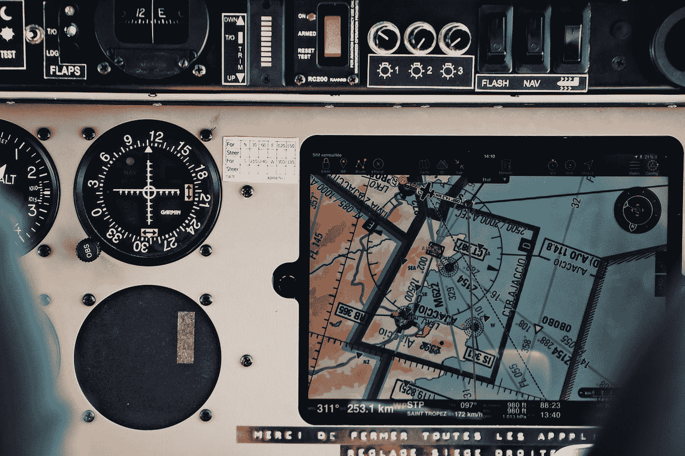
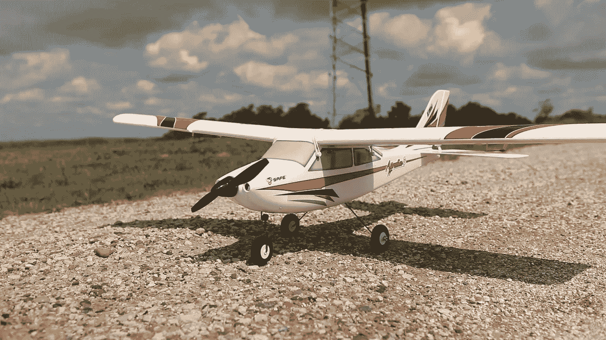
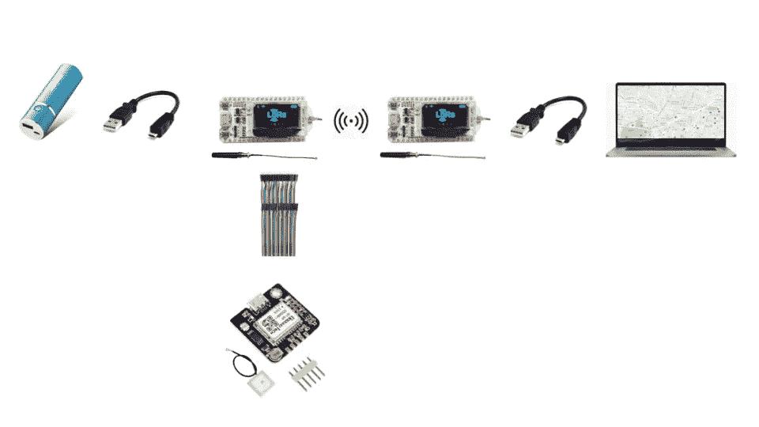
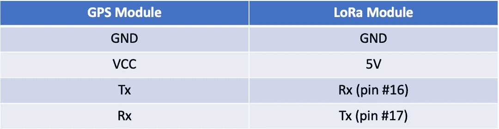

# 如何使用 LoRa(Mac OS)建立离线 GPS 跟踪器

> 原文：<https://medium.com/codex/how-to-build-an-offline-gps-tracker-using-lora-for-mac-os-21e359c8ebc9?source=collection_archive---------2----------------------->

由 [Unsplash](https://unsplash.com?utm_source=medium&utm_medium=referral) 上的 [Mael BALLAND](https://unsplash.com/@mael_balland?utm_source=medium&utm_medium=referral) 拍摄的照片

在这篇文章中，我将详细描述使用 LoRa 建立你自己的离线 GPS 追踪器的所有必要步骤，而不需要互联网接入。您将能够在本地谷歌地图文件上显示模块的实时位置，并在本地文本文件中存储 GPS 数据(纬度、经度、高度、速度和一些其他指标)，以供参考和随后的路线绘制(例如通过[谷歌地球](https://www.google.com/earth/outreach/learn/importing-global-positioning-systems-gps-data-in-google-earth/)！).

**目录**

1.  项目背景
2.  硬件要求
3.  软件要求
4.  未来的改进和参考

# **背景**

几年前，我买了一个学徒的 S 15e 模型飞机(见下文),我在纽约长岛南部飞行。我喜欢做翻滚和空翻，但我喜欢升级它。在增加了更大的轮子之后，我决定用一个安装在机翼顶部的廉价相机和一个旧的模拟监视器把水上飞机变成一个 FPV 平台。我会让它飞得足够高，从一个方向看佩科尼克湾，然后转过身，从另一个方向看大西洋。有一天，我太专注于风景，我的眼睛离开飞机很长时间，以至于看不到它。我转向我的 FPV 监视器，但它逐渐充满了越来越多的静电干扰，直到我完全失去了信号。在花了几天的时间开车绕着田野跑了几英里后，我再也没有找到它。

*学徒 S 15e。资料来源:flite test*[https://www.flitetest.com/articles/e-flite-apprentice-s-15e](https://www.flitetest.com/articles/e-flite-apprentice-s-15e)

经过一番自我反省，我决定再买一架飞机——学徒 STS T1，它是最初的学徒 S 15e 的更新版本。我经常驾驶它在同一个场地飞行，但只是用视线。我想回到 FPV，但是在没有安全保障的情况下，我觉得这样做还不够舒服。我有一个想法，要制造一个 GPS 追踪器，在飞行期间放在飞机上，但很快就遇到了问题——即如何远程实时传输 GPS 数据。蓝牙和 WiFi 都不能满足它，但经过一些初步的研究，我遇到了 [LoRa](https://lora-alliance.org/) ，它方便地代表“远程”。本质上，它是一种用于远距离传输少量数据的机制。它经常被用在农场上，用来监测超过 1000 公里的农业数据.你不能用它来播放电影，但是它可以很好地发送字节的数字数据。从而催生了这个项目！

无论你是想为航模还是其他应用建立你的 GPS 跟踪系统，我希望这个指南能帮助你实现你的目标！

# **硬件**

## **架构概述**

如下图所示，该 GPS 追踪器可使用以下硬件元件和连接器构建，按以下顺序连接(左侧为 Tx，右侧为 Rx):

## **材料清单**

1.  [LoRa ESP32 模块(2 件装)](https://www.amazon.com/gp/product/B07HJ49VN8/ref=as_li_tl?ie=UTF8&camp=1789&creative=9325&creativeASIN=B07HJ49VN8&linkCode=as2&tag=techblogs0e-20&linkId=8990e79cd61f5d44202b424993bbeb1d)
2.  便携式手机充电器，比如这个(不需要昂贵的电池，因为即使是便宜的电池也会比飞机电池耐用得多)
3.  USB 转 Micro USB 线，像[这个](https://www.amazon.com/gp/product/B003YKX6WM/ref=as_li_tl?ie=UTF8&camp=1789&creative=9325&creativeASIN=B003YKX6WM&linkCode=as2&tag=techblogs0e-20&linkId=7e1b2dbc6c6402f9b1a63a8845332295)(一定要选支持数据传输的，不只是充电！)
4.  [GPS 模块](https://www.amazon.com/gp/product/B07P8YMVNT/ref=as_li_tl?ie=UTF8&camp=1789&creative=9325&creativeASIN=B07P8YMVNT&linkCode=as2&tag=techblogs0e-20&linkId=1696dbbbd3086cfc4d6cd425b471d48c)
5.  【Arduino 或 Raspberry Pi 的试验板跳线(你不需要所有 120 根线。我发现这些品种很有用，而且它们很便宜！)

## **模块连接**

如上图所示，这些硬件元件通过三种方法之一连接:LoRa、USB 或 GPIO。当然，LoRa 收发器通过 LoRa 无线信号连接。其余部分按如下方式连接:

*   便携式充电器→ (USB 转微型 USB) → LoRa 发射器
*   GPS 模块→ (GPIO) → LoRa 发射器
*   LoRa 接收器→(微型 USB 转 USB) →计算机

对于 GPIO 连接，确保将 GPS 模块连接到相应的 LoRa 发射器:

GPS 和 LoRa 发射器模块之间的 GPIO 连接

*   GND 是接地引脚，需要连接到 LoRa 发射器模块上的 GND 引脚。
*   VCC 为模块供电。您可以直接将其连接到 LoRa 发射器上的 5V 引脚。
*   TxD(发射器)引脚用于串行通信，应连接到 LoRa 发射器上的 Rx GPIO 端口。我用的是 16 号针。
*   RxD(接收器)引脚用于串行通信，应连接到 LoRa 发射器上的 Tx GPIO 端口。我用了 17 号针。

此时，您应该已经正确设置了所有的硬件，并准备好编码了！

*注意:在设置和测试期间，LoRa 发射器可以由 120V 交流电源适配器供电，以延长电池寿命。两个 LoRa 收发器都可以通过使用 USB 转 Micro USB 电缆进行编程，就像* [*这个*](https://www.amazon.com/gp/product/B003YKX6WM/ref=as_li_tl?ie=UTF8&camp=1789&creative=9325&creativeASIN=B003YKX6WM&linkCode=as2&tag=techblogs0e-20&linkId=7e1b2dbc6c6402f9b1a63a8845332295) *。*

*免责声明:以上是亚马逊联盟链接，将有助于支持我的项目，无需额外费用。*

# **软件**

完成这个项目需要三个不同的软件文件:LoRa 发射器 Arduino 代码、LoRa 接收器 Arduino 代码和一个用于操作 GPS 数据的 Python 脚本。所有这些文件都可以从我的 [GitHub 库](https://github.com/DanielWestrich/GPS)下载。此外，你还需要一个文本编辑器来运行 Python 脚本(我在终端中使用了 [Sublime Text](https://www.sublimetext.com/) ，以及用于 LoRa 模块的 [Arduino IDE](https://www.arduino.cc/en/guide/macOSX) 。

下面的链接对我起草自己的代码很有帮助:

*   [Arduino 发射器和接收器代码](https://www.aeq-web.com/heltec-esp32-lora-arduino-ide-setup-and-test/)
*   [Arduino 串行监视器到 Python 转换器](https://github.com/Chams123456/Arduino_to_python/blob/master/DHT11_Arduino_to_Python.py)
*   [Python 谷歌地图绘图仪](https://www.geeksforgeeks.org/python-plotting-google-map-using-gmplot-package/)

## **提示和技巧**

要运行 Arduino 代码，您需要执行以下操作:

*   将“esp32”板添加到可用 Arduino 板和相关库的列表中，以写入该板。此处的说明[为](https://heltec-automation-docs.readthedocs.io/en/latest/esp32+arduino/quick_start.html)。
*   将以下 Arduino 库添加到 IDE 中:“LoRa”、“U8g2”、“EspSoftwareSerial”、“Heltec ESP32”、“TinyGPS”、“SPI”。此处的说明[为](https://www.aeq-web.com/heltec-esp32-lora-arduino-ide-setup-and-test/)。
*   确保在 Arduino IDE 设置和串行监视器窗口中将波特率设置为 9600。
*   在 Arduino IDE 中选择“WiFi Kit 32”作为主板，而不是 LoRa 命名的主板。
*   将端口设置为“/dev/cu。Arduino IDE 中的 SLAB_USBtoUART。

要运行 Python 代码，您需要包含以下导入语句:

*   导入 csv
*   导入时间
*   导入数学
*   导入编解码器
*   导入序列
*   导入 gmplot
*   导入 webbrowser
*   从日期时间导入日期时间
*   从 bs4 导入 BeautifulSoup
*   从 selenium 导入 web 驱动程序
*   从 webdriver_manager.chrome 导入 ChromeDriverManager

一旦你下载了上面的包并相应地设置了环境变量，你应该能够通过 USB 发送 Arduino 脚本(TX 和 RX)到 LoRa 模块。一旦打开电源，LoRa 模块将自动运行这些 Arduino 脚本。因此，只需将 TX 模块插入电池(如上图所示)，将 RX 模块插入电脑，然后通过终端运行 Python 脚本。该脚本将自动打开并定期刷新一个谷歌浏览器窗口，所以一旦运行就不需要与它互动！

就是这样！我真的希望你喜欢这个项目的建设，并希望它能为你省去一些麻烦。如果你遇到任何问题或者对我的设计有任何改进，请在评论区告诉我。接下来，我需要在我的飞机上安装 GPS 追踪器，敬请关注！

*附:如果你想通过物联网将你的 GPS 模块连接到互联网，作为一个物联网设备，我推荐你使用* [*伊夫的文章*](https://yves-debeer.medium.com/build-your-own-lora-gps-tracker-59d1870097d0) *。*