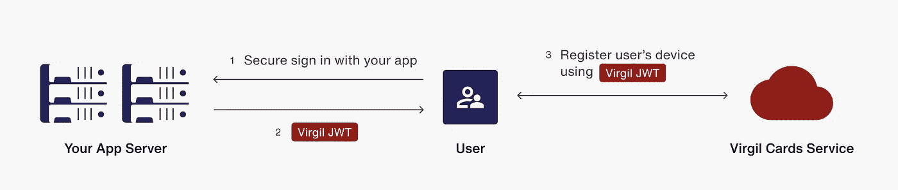
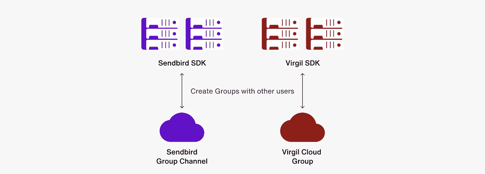

# 如何与 Sendbird 和 Virgil 建立端到端的加密聊天

> 原文：<https://medium.com/codex/how-to-build-end-to-end-encrypted-chat-with-sendbird-and-virgil-d6cb03601fac?source=collection_archive---------7----------------------->

仙鸟 2022

## 通过将 Virgil 的 E3Kit 群组加密应用到您的应用程序的聊天消息中，建立私密和安全的聊天

杰森·奥尔肖恩
解决方案工程师| [仙鸟](https://www.sendbird.com)

*您可能会发现查看我们的 JavaScript 示例代码很有用。如需更多指导，请参考我们的* [*文档*](https://sendbird.com/docs/chat/v3/javascript/quickstart/send-first-message) *。您还可以查看仙鸟聊天的* [*演示*](https://sendbird.com/demos/in-app-chat) *和* [*了解更多关于*](https://sendbird.com/features/chat-messaging) *的功能。*

> *成为第一个了解新教程、开发者相关聊天/电话发布以及其他重要更新的人，* [*注册*](https://get.sendbird.com/dev-newsletter-subscription.html) *我们的开发者简讯。*

# 介绍

本教程将向您展示如何使用 Sendbird 的 [UIKit](https://sendbird.com/features/chat-messaging/uikit) 将 [Virgil 的 E3Kit 组加密](https://developer.virgilsecurity.com/docs/e3kit/end-to-end-encryption/group-chat/)应用于您的应用程序的聊天消息。在深入实施细节之前，我们将首先了解更多关于端到端加密的知识，并仔细看看 [Virgil Security](https://virgilsecurity.com/) 。然后，我们将介绍一个核心用例，并用一个用户故事来说明它。

但首先，让我们来看看一些先决条件。

# 先决条件

为了从本教程中获得最大收益，最好具备以下条件:

1.  运行 UIKit 的基于 React.js 的应用程序
2.  向 Virgil 用户发布 jwt(JSON Web Token)的正常运行的服务器。请阅读维吉尔文件来理解 JWT 是如何工作的。[这个 GitHub repo](https://github.com/VirgilSecurity/demo-backend-nodejs) 包含了显示如何生成 JWT 的示例代码。

请注意，本教程的目标读者是具备 JavaScript 和网络安全背景知识的开发人员。

说完了，让我们开始吧！

# 什么是端到端加密？

端到端加密是一种安全的通信系统，其中只有拥有私钥的用户才能读取传输的消息。受监管行业(如医疗保健或金融)通常需要端到端加密，以满足对数据可访问性的法规遵从性要求。端到端加密对传输、存储和检索的消息有效负载进行加密。只有有权使用用于加密数据的私钥的用户才能读取内容。

在 [Sendbird](https://www.sendbird.com/) 的上下文中，端到端加密意味着 Sendbird 系统和人员无法访问消息的内容。这是 Sendbird 隐私保证的关键部分。值得注意的是，Sendbird 中的所有通信在运动时都在传输层加密，在静止时都在持久性层加密。

以一家医疗保健公司为例。HIPAA 合规性在医疗保健行业是强制性的。需要采取一切手段保护患者数据。

用户故事是这样的:**作为一个用户，我想发送只有我和我的收件人才能阅读的信息，以保护我的隐私。**端到端加密满足用户需求。

记得考虑发送加密消息的影响。加密信息可以用于好的目的，也可以用于坏的目的。请务必检查在您的辖区内实施加密邮件的法律含义。

如果你想了解更多关于端到端加密的知识，请查看电子前沿基金会的[这篇优秀文章](https://ssd.eff.org/en/module/deep-dive-end-end-encryption-how-do-public-key-encryption-systems-work)。

现在基础打好了，我们来讨论一下为什么要考虑用维吉尔的 E3Kit 搭配 Sendbird。

# 为什么要用维吉尔的 E3Kit 搭配 Sendbird？

Virgil Security 是一家加密软件和服务提供商。它提供了 [E3Kit](https://developer.virgilsecurity.com/docs/e3kit/) ，这是一个面向许多平台的端到端加密 SDK，可以简化加密、密钥管理和其他复杂的安全任务。

E3Kit 提供:

1.  **完全隐私**:只有用户可以阅读他们的消息；Sendbird、Virgil 和任何其他第三方服务都无法解密消息和数据来访问私人信息。
2.  **端到端加密**:用户数据在静态和传输中受到保护。
3.  **独立数据保护**:有了 E3Kit，对第三方服务提供商及其网络的任何攻击都不会影响数据的完整性和保密性。
4.  **数据完整性**:作为加密和解密功能的一部分，E3Kit 对数据进行签名和验证，确认数据来自加密数据的用户，并且在传输或存储过程中未被篡改。

# 广泛的实施概述

实施由 3 个主要部分组成:

1.  注册用户
2.  创建仙鸟群频道和维吉尔群
3.  在 Sendbird 的 UIKit 中加密和解密消息

首先，让我们快速浏览一下概述，然后通过代码示例更深入地研究实现。

## 注册用户

1.  收藏一幅维吉尔·JWT 的作品
2.  向 Virgil 注册用户的设备

下图显示了高层沟通流程。请记住，注册的设备需要对应的消息发送者用户。

## 创建仙鸟群频道和维吉尔群

假设维吉尔`user_id`和仙鸟`user_id`是一样的:

当前用户:

1.  创建与其他用户的 Sendbird 群组频道
2.  与其他用户创建一个 Virgil 群，并且 Sendbird 频道 URL 与 Virgil 群 ID 相同

当前用户自动:

1.  在 Sendbird 组频道中设置`created_by`字段
2.  设为维吉尔群主

## 在 Sendbird 的 UIKit 中加密和解密消息

1.  加载 Sendbird 组通道
2.  获取 Sendbird 组频道 URL 和`create_by user_id`。使用它们来加载相应的维吉尔组
3.  使用[加载的 Virgil 组来](https://developer.virgilsecurity.com/docs/e3kit/end-to-end-encryption/group-chat/) :
    a)解密获取的 Sendbird 组通道中的任何消息
    b)加密新的传出消息
    c)解密新到达的消息

现在让我们详细地看一下所有这些步骤。

# 第一步。注册用户

假设您有一个正在运行的 Web 应用服务器来颁发 Virgil 用户 JWT 令牌，请运行以下代码。

我们需要获得一个 JWT 和 init Virgil 实例，并在应用程序加载时获取一个 JWT 令牌。

# 第二步。创建仙鸟群和维吉尔群

1.  利用 Sendbird 的 UIKit 内置 onBeforeCreateChannel 方法
    1。生成一个随机的`channel_url`。考虑使用 UUID。
    2。开始创建维吉尔集团。请注意，Sendbird UIKit 自带的`onBeforeCreateChannel`方法是同步的。因此，等待维吉尔集团被创建。输入任何冻结代码。
    a)不要在参与者身份中包含当前用户。只有由`onBeforeCreateChannel`的参数提供的用户列表。
    3。从`onBeforeCreateChannel`开始无任何延迟地返回所需的 Sendbird 组通道参数。

创建维吉尔群:

通道参数的同步生成:

# 第三步。在 Sendbird 的 UIKit 中加密和解密消息

## 1.在 Sendbird 频道选择上，加载关联的 Virgil 组

1.  Sendbird 的 UIKit 有一个名为`onChannelSelect`的方法，当 UIKit 频道列表第一次加载时以及当用户点击频道列表中的一个频道时触发。
2.  `onChannelSelect`是同步。所以，加载维吉尔组不回调。加载的 Virgil 组将自动驻留在 E3 实例中进行加密操作。
3.  考虑实现自己的错误处理。

**重要提示:**要加载正确的 Virgil 组，您需要 Sendbird 频道 URL 和 Virgil 组创建者的`user_id`。在这种情况下，详细信息存储在 Sendbird 通道的 creator 字段中。

## 2.加载自定义消息输入

Sendbird 的 UIKit 消息输入目前不支持消息发送前的异步操作。因此，建议将 Sendbird 的 useSendbirdStateContext 与 sendbirdSelectors 结合使用。

呈现自定义消息输入并向下传递 Sendbird SDK，以便访问 useSendbirdStateContext 和 sendbirdSelectors。

在这里检查代码[中的整个输入组件。](https://github.com/SendbirdCommunity/sendbird-uikit-javascript-e2e-encryption-sample/blob/1cb23db3d2ea1c808fdec5bd1ec79ebb3bbc89e7/src/CustomMessageInput.js#L43)

# 3.对在频道的消息列表视图中自动更新的消息进行加密

当用户发送消息时，会发生以下操作:

1.  该消息被撰写用于发送，并且用户点击发送(输入占位符被重置)。
2.  消息是加密的，这需要在上面的步骤 2 中加载相应的 Virgil 组。
3.  将创建一个 Sendbird 消息实例。
4.  UIKit 的`sendbirdSelectors`被用来发送消息，并将自动更新消息视图(下一步将有更多介绍)。
    1。注意，通过设置消息的内置`custom_type`(字符串)，消息被标记为加密的

# 4.解密邮件并自动更新邮件列表视图

使用 Sendbird 的 UIKit，可以监听消息列表视图的变化，并为每个新消息呈现一个消息卡。客户消息卡可以通过利用通道组件上 UIKit 的`renderChatItem`属性来创建。

*   原始的加密消息文本被传入。
*   当前的`user_id`被传入并用于检测当前用户是否发送了它们。
*   E3 实例也包括在内。
*   添加当前频道，因为解密需要其`channel_url`和`created_by`字段。

每个消息的解密是异步的。因此，我们为每个消息设置占位符，完成解密，然后重新呈现未加密的消息。

1.  用占位符呈现所有邮件。
2.  检查每封邮件是否加密。
3.  解密每条消息。
4.  使用解密的文本重新呈现邮件，根据邮件的发送者将其放在左侧或右侧。

注意消息发送者的`user_id`是必需的。然后我们得到了仙鸟群频道的关联维吉尔群。最后，消息可以被解密并返回。

# 结论

就是这样！我们已经介绍了如何将 Virgil 组与 Sendbird 组通道相关联，以及如何使用 Sendbird 的 UIKit 定制来加密、解密和显示解密的消息。使用 Sendbird 的 UIKit 和 Virgil Security，您可以放心，您所有用户的消息都是安全的。

如果你需要额外的指导，查看一下[仙鸟](https://sendbird.com/docs/uikit)和[维吉尔](https://developer.virgilsecurity.com/)的文档。一如既往，如果您需要任何帮助，请不要犹豫[联系我们](https://sendbird.com/contact-sales)！

我们迫不及待地想看看你的作品！编码快乐！✌️

> *为了第一个了解新教程、与开发者相关的聊天/电话发布以及其他重要更新，* [*注册*](https://get.sendbird.com/dev-newsletter-subscription.html) *我们的开发者简讯。*