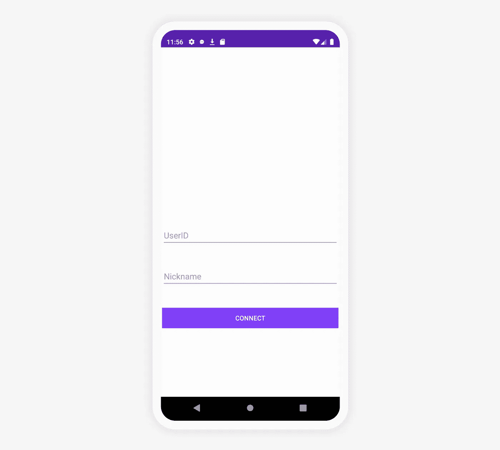

# 如何使用 Kotlin 构建应用内聊天——第 1 部分

> 原文：<https://medium.com/codex/how-to-build-in-app-chat-using-kotlin-part-1-750b3ebd4457?source=collection_archive---------4----------------------->

解决方案工程师| [Sendbird](https://www.sendbird.com/)

*如果你正在寻找关于 Swift、React 等的教程，请查看我们的* [*开发者门户*](https://sendbird.com/developer/tutorials) ***。***

*您可能会发现查看 Android 聊天示例应用程序的* [*代码*](https://github.com/sendbird/SendBird-Android) *很有用。如需更多指导，请查看我们的* [*文档*](https://sendbird.com/docs/chat/v3/android/quickstart/send-first-message) *。记住一个应用内聊天的* [*演示*](https://sendbird.com/demos/in-app-chat) *可能也会有用。更多信息，请查看我们的* [*聊天页面*](https://sendbird.com/features/chat-messaging) *。*

# 介绍

本教程是使用[**send bird Chat SDK**](https://docs.sendbird.com/android/quick_start)构建聊天应用的一个简单易懂的 Kotlin 实现指南。完整的教程包括两部分。完成后，你就可以用 Kotlin 创建自己的聊天应用程序了。

在第一部分中，我们将回顾初始化和登录，以及频道的显示、选择和创建。Sendbird 有两种频道类型:开放频道和群组频道。本指南重点介绍了创建一对一私人聊天和私人群组聊天的群组渠道实施。

我们将创建三个活动:

*   **登录活动** —用户登录和设置昵称的基本登录界面
*   **channelistactivity**—显示用户可以加入的群组频道的频道列表
*   **频道创建活动** —允许用户邀请其他用户并创建频道的屏幕

然后，我们将介绍以下步骤:

*   导入依赖项并添加权限
*   登录活动，包括:

1.  创建基本登录用户界面
2.  创建**逻辑活动**

*   显示频道列表，包括:

1.  创建频道列表用户界面
2.  创建**通道活动**
3.  为**回收视图**创建**通道适配器**

*   创建渠道，包括:

1.  实现一个**通道创建**用户界面
2.  实现**通道创建活动**
3.  为**回收视图**实现**通道创建适配器**

请注意，本教程假设您对 Kotlin 有基本的了解。

我们开始吧！

# 第一步。导入依赖项并添加权限

首先，将最新的 Sendbird SDK 添加到应用程序级别的 build.gradle 文件中。

# 第二步。登录活动

要开始聊天，用户必须能够登录或创建一个用户。

本节包括两个部分，包括如何:

1.  用您各自的 AppID 初始化 Sendbird 应用程序
2.  用用户名和昵称连接到 Sendbird

但是首先，我们需要创建一个基本的登录 UI。

*   基本的登录 UI 包括一个用于用户 ID 的编辑文本字段、一个用于所需昵称的字段和一个用于连接的按钮。见下图。

您可以在此查看完整代码:

**activity_login.xml**

**创建** **逻辑活动**

创建一个名为 **LoginActivity.kt** 的新活动。请务必在清单中注册此活动。这个活动负责初始化和处理到 Sendbird 应用程序的连接。

理想情况下，您会选择将初始化放在不同的活动中。为了简单起见，我们将在 LoginActivity 中初始化。

添加一个 **onCreate** 方法。该方法处理 UI 元素和初始化过程。

**loginactivity . kt**中的 onCreate 方法

方法 **connectToSendBird()** 将传递的 UserID 连接到 SendBird，然后更新连接用户的昵称。完成后，它启动我们的**渠道活动**。

**LoginActivity.kt** 中的 **connectToSendBird()** 方法

**LoginActivity.kt** 的完整内容见以下要点。

# 第三步。显示频道列表

创建登录后，创建一个活动来显示、选择和创建频道。下面向您展示如何查询与用户相关的频道列表，并在 **RecyclerView** 中渲染和显示它们。

创建频道列表用户界面

为频道列表 **RecyclerView** 创建一个基本项目。为了简单起见，我们将创建一个 **CardView** 和 **TextViews** 用于频道名称、成员计数和最近的消息。

**item _ channel _ chooser . XML**

然后，为频道列表创建一个包含 **RecyclerView** 的实际视图。该视图还包含一个**浮动操作按钮**，使用户能够创建频道。

**activity_channel.xml**

创建**通道活动**

接下来，创建一个名为**channelistactivity**的新活动。确保**在清单中登记此活动**。该活动负责向 **RecyclerView** 添加通道，在用户创建新通道时处理 UI 交互，并使用所选通道启动下一个活动。

**onCreate** 方法设置布局，设置 **RecyclerView** ，并为启动 **ChannelCreateActivity** 的 **FloatingActionButton** 包含 **onClickListener** 。

**onCreate()** 方法在**channelistactivity . kt**中

onCreate 方法调用了一个方法 **addChannels()** 。此方法创建检索指定范围的频道的查询。通过检查**检索更多频道。hasNext()** 在查询对象上调用。结果返回后，可以将通道添加到适配器中。

**addChannels()** 方法在**channelistactivity . kt**中

**onItemClicked()** 方法覆盖了您将在适配器中实现的接口的方法调用。它允许您在单个视图上设置点击监听器。在这个方法中，您需要创建一个意图来启动 channel.URL 的 **ChannelActivity** 。本指南的第二部分将介绍 **ChannelActivity** 的创建以及处理启动 **ChannelActivity** 的意图。

**onItemClicked**channelistactivity . kt**中的**

要查看该类的完整实现，请参见下面的要点:

为**回收视图**创建**通道适配器**

创建一个适配器，用返回的频道列表填充**回收视图**。这个适配器填充视图，并向每个视图添加一个 **onClickListener** ，为相应的通道启动聊天活动。

该指南将该课程分为两部分:

1.  用于**回收视图**的适配器**信道适配器**的标准实现
2.  一个内部类， **ChannelHolder** ，它实现了**viewcholder**模式

参见第一部分的以下要点，即使用返回的频道列表填充 **RecyclerView** 的适配器

**通道适配器**:

这个类的第二部分涉及一个实现视图持有者模式的内部类。这将数据绑定到相应的视图。在 **bindViews** 方法中，可以看到我们传递了一个 **groupChannel** 对象和一个 **OnChannelClickedListener** 。这两个对象建立了视图。确保将 **itemView** 上的 **onClickListener** 设置为在 **bindViews** 方法中传递的监听器。

**通道适配器**中的通道座:

参见下面要点中的**channelistadapter . kt**的完整实现:

# 第四步。创建频道

本节介绍如何查询用户列表、显示这些用户以及使用该用户列表创建频道。

实现频道创建用户界面

像以前一样，创建一个带有 **RecyclerView** 和一个简单按钮的布局。

**Activity_create.xml**

创建一个包含用户内容的项目。为此，创建一个包含一个**复选框**和一个**文本视图**的简单布局。

**Item_create.xml**

创建另一个活动，并将其命名为 **ChannelCreateActivity** 。确保在清单中注册此活动。该活动加载用户列表，设置 UI 元素和**recycle view**适配器，并处理通道的创建。

**onCreate** 方法设置必要的组件。在 **ChannelCreateActivity** 的完整代码中，初始化一个名为 **selectedUsers** 的全局变量，这个变量将是你创建通道时传递的用户列表。设置您的**回收视图**和适配器。调用之后，请参见下面实现的方法 **loadUsers()** 。最后，设置一个 **onClickListener** 用于用户选择创建频道的时候。

**channelcreateactivity . kt 中的 onCreate()**

现在，实现 **loadUsers()** 方法。该示例使用默认的通用查询来获取应用程序的用户。与频道查询一样，可以通过在**用户列表查询**上设置某些变量来定制返回的内容。当查询返回时，将返回的用户添加到适配器中。

**channelcreateactivity . kt**中的 loadUsers()

像前面一样，向我们的适配器类添加一个接口，以处理对 **RecyclerView** 中的单个项目的操作。这个接口将有一个方法， **onItemChecked()** ，实现如下。它指示用户是否已被检查，并相应地更新**选择的用户**列表。

**ChannelCreateActivity.kt** 中的 **onItemChecked()**

最后，实现 **createChannel()** 方法。顾名思义，这个方法使用传递的用户创建通道。在 Sendbird 中创建频道时，可以自由定制频道。通过创建 params val，您可以添加用户、添加操作员(管理员)、设置通道名称等等。指定可选参数后，使用传递的参数创建组通道。一旦它返回，创建一个意图来启动 **ChannelActivity** ，并将频道 URL 作为“额外”内容。

**channelcreateactivity . kt**中的 **createChannel()**

下面是 **ChannelCreateActivity** 的完整实现。

**channelcreateactivity . kt**

为**回收视图**实现**通道创建适配器**

最后要实现的是我们的 **RecyclerView** 的定制适配器。

如前所述，本指南将其分为两个部分:

1.  用于**回收视图**的适配器 **ChannelCreateAdapter** 的标准实现
2.  一个内部类 **UserHolder** ，它实现了 **ViewHolder** 模式

**ChannelCreateAdapter** 部分涵盖了适配器实现的基本方法。这需要一个接口来处理项目何时被选中，以及一个**sparsebooleanaray()**来处理用户何时被选中/取消选中。除了这两个要求，遵循实现所需方法的标准方法。

**通道创建适配器**

创建一个扩展**recycle view**的内部类。**取景器**。这个类绑定了来自 **item_create.xml** 的视图。它还将负责检查和取消检查**复选框**，并分别更新用户列表。

**用户持有者**

有关**channelcreateadapter . kt**的完整实现，请参见以下要点

# 结论

使用 Kotlin 创建自己的聊天应用程序的工作已经完成了一半！

在 Kotlin 实施指南的第一部分中，我们介绍了如何:

*   导入依赖项并添加权限
*   创建**登录活动**和一个基本的登录 UI
*   为 **RecyclerView** 创建**频道活动**、**频道适配器**和一个频道列表 UI
*   实现 **ChannelCreateActivity** ， **ChannelCreateAdapter** 用于 **RecyclerView** ，以及一个通道创建 UI

您现在可以查看 Kotlin 指南的 [**第二部分**](https://sendbird.com/developer/tutorials/kotlin-chat-tutorial-part-2) ！在第 2 部分中，您将通过添加聊天 UI 并使用户能够发送和接收消息来完成您自己的聊天应用程序。如有疑问，记得查看我们的 [**社区网站**](https://community.sendbird.com/) 并咨询我们的 [**文档**](https://sendbird.com/docs/chat/v3/android/getting-started/about-chat-sdk) 。

你正在创建一个吸引人的 Android 移动应用程序。坚持下去，快乐手机聊天建设！