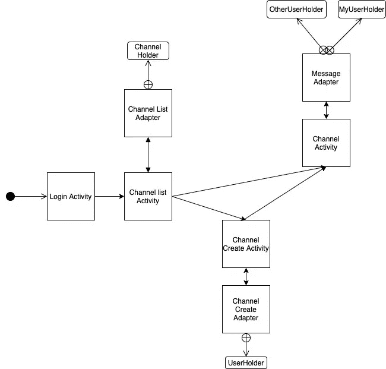
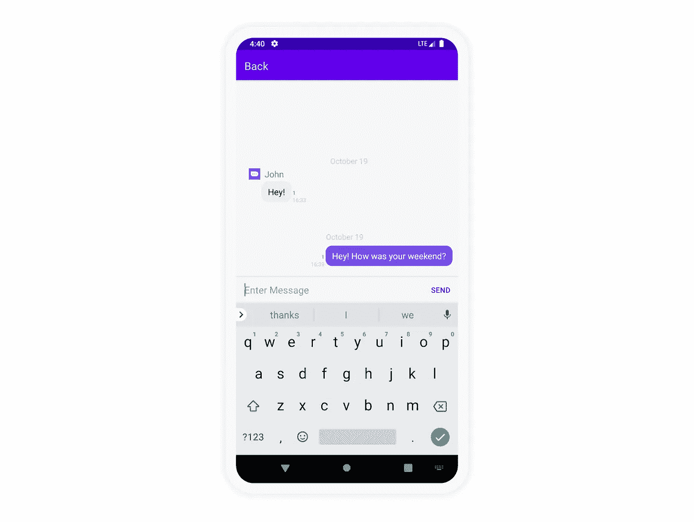

# 如何使用 Kotlin 构建应用内聊天——第 2 部分

> 原文：<https://medium.com/codex/how-to-build-in-app-chat-using-kotlin-part-2-2558f208a3ee?source=collection_archive---------6----------------------->

仙鸟 2022

## 使用 Sendbird Android SDK 构建消息传递 UI 并实现发送和接收应用内聊天消息的功能

由 Alex Preston
解决方案工程师| [Sendbird](https://www.sendbird.com)

这是关于如何使用 Kotlin 建立应用内聊天的两部分指南的第二部分。您可能会发现查看我们的 Android 示例应用程序的 [*代码*](https://github.com/sendbird/SendBird-Android) *很有用。如果需要额外的指导参见* [*文档*](https://sendbird.com/docs/chat/v3/android/quickstart/send-first-message) *。别忘了看看用 Sendbird 构建的应用内* [*聊天*](https://sendbird.com/features/chat-messaging) *的* [*演示*](https://sendbird.com/demos/in-app-chat) *。*

> *成为第一个了解新教程、开发者相关聊天/电话发布以及其他重要更新的人，* [*注册*](https://get.sendbird.com/dev-newsletter-subscription.html) *订阅我们的开发者简讯。*

# 介绍

本教程遵循关于如何使用 Kotlin 建立应用内聊天的教程的第 1 部分。这个由两部分组成的指南旨在通过展示一个简单的聊天实现来帮助您入门和运行。

UIKit 入门非常容易，但是在某些情况下，您可能需要从我们的核心 SDK 实现 chat。本指南继续我们在第 1 部分中停止的地方。在第 1 部分中，我们构建了:

*   注册
*   创建和列出频道的能力

在本教程中，我们将创建:

*   `ChatActivity`的用户界面
*   `MessageAdapter`设置 UI 组件
*   `ChannelActivity`阶级

在我们开始之前，请注意以下几点:

a.下图描述了类关系。当你继续学习本教程时，你会发现它是一个有用的参考。

图 1:kot Lin 示例的类图

b.本指南仅涵盖发送和接收用户消息。要查看如何发送文件消息，请访问我们的[文档](https://docs.sendbird.com/android/group_channel#3_send_a_message)。

c.本指南侧重于三个不同的部分:

*   `Channel Activity`的用户界面
*   `MessageAdapter.kt`类
*   `ChannelActivity.kt`阶级

d.本教程是使用以下工具构建的:

*   安卓工作室:4.0.2
*   Android 版本:10 API 29
*   科特林:1.3.72
*   Sendbird 核心 SDK: 3.0.148

e.本教程假设预先了解 Android 和 Android 概念。

f.请查看第 1 部分和第 2 部分的完整源代码[。](https://github.com/AlexPrestonSB/SendbirdKotlinBlog)

# 步骤 1:为渠道活动构建 UI

1.  `activity_chat.xml`
    我们需要做的第一件事是创建一个聊天界面。我们将添加一个顶部带有“返回”按钮的 **AppBarLayout** ，以返回到**channelistactivity**。在此之下，我们将添加一个 **RecyclerView** 来显示实际的消息。最后，在底部，我们将添加一个简单的布局来处理消息的输入和发送。这是要点:

2.`item_chat_me.xml`
现在我们已经完成了这个活动框架的 UI，我们需要为消息创建两个不同的项目视图。我们将需要这样做，因为我们将为当前用户发送的消息提供不同的 UI，并且我们将为聊天中其他人发送的消息提供不同的 UI。(随着您实现更多类型的消息，您将拥有更多这样的. XML。)

第一个。xml 将用于从“我”的角度来看的消息，或者由当前用户发送的消息。为此，我们选择了一个用于实际消息的`TextView`，它被包装在一个`Cardview`中。围绕这个`TextView`的是其他的`TextViews` 比如日期之类的东西。这是要点:

3.`item_chat_other.xml`
第二种。xml 将用于来自“其他”视角的消息或者不是来自当前用户的任何消息。这个 UI 将类似于“我”UI；但是，它是左对齐的，包含关于“其他”用户的信息。这包括像一个用于概要图像的`ImageView`和一个用于用户名的`TextField`这样的东西。除此之外，观点都比较相似。这是要点:

# 第二步。MessageAdapter.kt 类

现在我们已经实现了 UI，我们将实现`MessageAdapter.kt`类。我们跳过了`ChannelActivity.kt`，因为在我们进入通道处理程序之前讨论 UI 如何设置更有意义。这个类将把传递给它的数据附加到`recyclerView`中的特定视图。

现在，创建一个名为`MessageAdapter.kt`的类。这个类将扩展`RecyclerView.Adapter` < RecyclerView。ViewHolder >()，因此您将需要确保实现以下方法:

1.  `onCreateViewHolder`
    这将返回对应于消息类型的`customViewHolder`。
2.  `getItemViewType`
    这是我们弄清楚消息类型的地方。目前我们只实现了`UserMessage`。该功能将确定它是“我”消息还是“其他”消息。我们将相应地返回。
3.  `onBindViewHolder`
    该功能将消息绑定到视图。
4.  `getItemCount`
    该函数返回消息的当前位置。

我们需要添加两个额外的功能。这些是:

1.  `loadMessages`
    这个方法的要点是加载我们将在`ChannelActivity`中得到的初始过去消息。
2.  `addFirst`
    该功能将刚刚发送或接收的消息添加到适配器中。显然，这两个函数都需要调用`notifyDataSetChanged()`来更新`recyclerView`。这是要点:

在我们处理了一个`recyclerView` **适配器**的基本功能之后，我们将需要实现我们自己的`customViewHolders`。我们有两个内部类，分别表示为:

1.  这个类简单地将“我”发送的相应消息绑定到项目，我们之前已经为其创建了视图。这是要点:

2.这个类简单地将“Other”发送的消息绑定到条目，我们之前已经为其创建了视图。这是要点:

为了看起来更整洁，我们还添加了一个对象，它有两个帮助日期格式化的函数。这是要点:

这就完成了`MessageAdapter`类的代码。要查看`MessageAdapter.kt`的完整课程，请点击处的[。](https://github.com/AlexPrestonSB/SendbirdKotlinBlog/blob/master/app/src/main/java/com/example/sendbirdkotlinblog/adapters/MessageAdapter.kt)

# 第三步。ChannelActivity.kt 类

现在我们已经实现了 UI，并负责将 UI 连接到传递的数据的适配器，我们将实现`ChannelActivity.kt`。

下面的类将:

*   设置好`recyclerView`和`Adapter`
*   处理获得和进入通过`CreateChannelActivity` 或`ChannelListActivity`的通道
*   处理发送和接收消息

首先，创建一个`ChannelActivity.kt`类。在`onCreate`函数中，我们将设置`contentView`并调用两个函数来处理设置。

`onCreate`

第一个函数设置了我们刚刚创建的`recyclerView`和`messageAdapter`。这段代码遵循实例化一个`recyclerView`的基本实现。确保为`messageAdapter`传递`Activity`的上下文，因为我们在设置图像时需要它，就像我们上面做的那样。

`setUpRecyclerView.kt`

第二个功能处理设置**活动**上的两个按钮:**返回**和**发送**。**返回**按钮不言而喻，下面我们重点介绍一下**发送**按钮。

`setButtonListeners`

对于发送按钮，我们有一个叫做`sendMessage`的方法。该功能从`editText`中取出文本，并将其设置在`UserMessageParams()`的参数上。使用 [UserMessageParams()](https://sendbird.com/docs/chat/v3/android/guides/group-channel#3-send-a-message) 还可以做更多的事情，我鼓励你去看看，但是为了简单起见，我们将只添加消息。那我们就拿`groupChannel`实例和`sendMessage()`来说吧。一旦返回成功发送，我们将把它添加到适配器，然后清除`editText`。

`sendMessage`

现在我们已经讨论了`onCreate`呼叫的情况，让我们开始讨论`onResume` 呼叫。在这个调用中，我们将处理获取传递的通道，并注册通道处理程序来获取各种事件——在本例中是`onMessageReceived`事件。

首先，我们想从意图中获取`channelURL`。为了便于理解，我们将把它移到一个单独的方法中。

`getChannelUrl`

有了`channelURL`之后，我们将需要使用函数`GroupChannel.getChannel()`进行调用。这个调用将使用`channelUrl` 并检索通道对象来发送消息并获取相关的通道信息。一旦成功返回频道，设置频道并确保调用`getMessages()`。

这个函数非常简单。它创建一个`[previousMessageListQuery](https://sendbird.com/docs/chat/v3/android/guides/group-channel#3-load-previous-messages)` (这里也可以进行很多定制)，然后加载消息，最后在适配器上调用`loadMessages`。这将获取对话中所有以前的消息。该函数支持分页，因此您可以获得整个对话历史。

`getMessages()`

在`onResume`调用中，我们需要做的最后一件事是设置一个通道处理程序。通道处理程序是您获取各种事件的方式，比如输入指示器、消息读取、消息传递事件和`onMessageReceived`事件。我们实现的唯一方法是`[onMessageReceived](https://sendbird.com/docs/chat/v3/android/guides/group-channel#3-receive-messages-through-a-channel-event-handler)`。每当另一个用户发来消息时，都会触发此事件。一旦我们获得了事件，我们就将它添加到适配器中，如下面的代码所述。

`onResume()`

既然我们有一个`onResume`呼叫，让我们添加一个`onPause`。这里我们要做的唯一一件事就是移除通道处理程序进行清理。

`onPause()`

这就完成了 `ChannelActivity`类的代码。参见`ChannelActivity.kt` [此处](https://github.com/AlexPrestonSB/SendbirdKotlinBlog/blob/master/app/src/main/java/com/example/sendbirdkotlinblog/ChannelActivity.kt)的完成类。

# 结论

在本教程中，我们讲述了如何:

*   创建聊天用户界面
*   连接聊天界面，以便能够发送/接收和显示消息

本教程是你可以用 [Sendbird SDK](https://sendbird.com/docs/chat/v3/android/quickstart/send-first-message) 做很多事情的垫脚石。借助我们刚刚实施的内容，您可以轻松开始:

*   合并其他类型的消息
*   为邮件生命周期添加更完整的视图
*   添加推送通知、输入指示器、翻译等等

你做到了！您现在正在您的 Android 应用程序中通过聊天连接用户！查看我们的[文档](http://sendbird.com/docs)和[开发者门户](http://sendbird.com/developer)以构建更多功能。如果您有任何问题，请通过[社区网站](https://community.sendbird.com/)联系我们。同时，开心聊楼！🙂

> *成为第一个了解新教程、开发者相关聊天/电话发布以及其他重要更新的人，* [*注册*](https://get.sendbird.com/dev-newsletter-subscription.html) *获取我们的开发者简讯。*