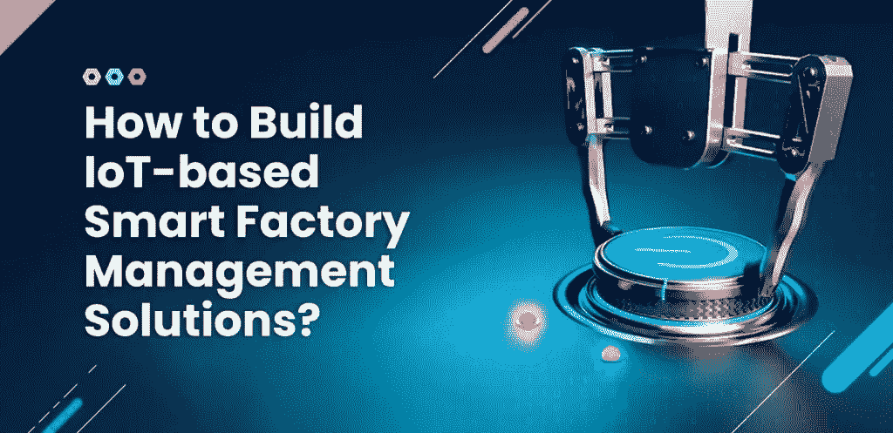
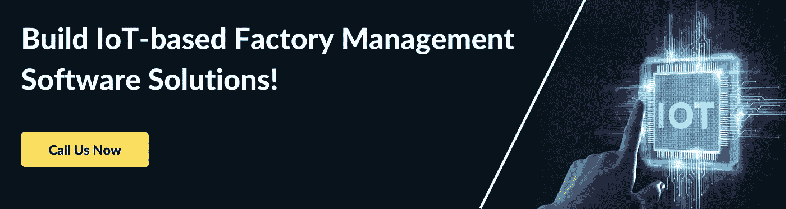
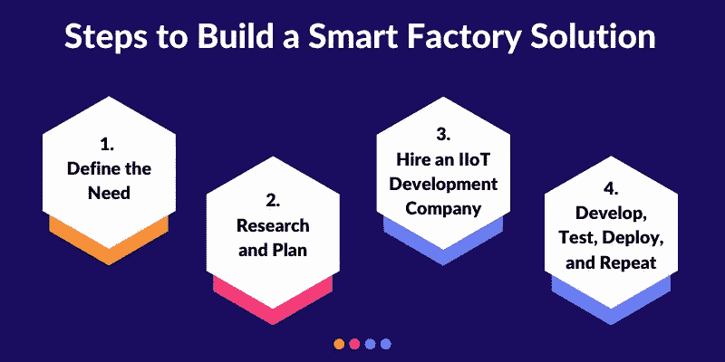

# 如何构建基于物联网的智能工厂管理解决方案？

> 原文：<https://medium.com/codex/how-to-build-iot-based-smart-factory-management-solutions-1e222d2a10b9?source=collection_archive---------31----------------------->

基于物联网的智能工厂正在帮助全球制造商改善生产线、劳动力效率和生产力。在今天这个时代，质量和数量对最终用户都很重要，工厂必须生产尽可能多的产品，并达到一定的质量标准。为了在短时间内满足惊人的高需求，企业必须消除生产过程中的各种浪费和低效，将工厂变成运转良好的机器。换句话说，他们需要数字化转型。

制造业是世界上最大的行业之一，工厂需要几个组件来完成数字化转型:物联网、人工智能、机器人自动化、大数据和工业分析。物联网和自动化是任何公司数字化转型努力的关键要素。在物联网的帮助下，公司可以简化制造流程，改善员工管理和后端流程。很明显，物联网处于工业数字化转型的中间，因此，物联网的一个新子集出现了:工业物联网(IIoT)。

根据 Statista 发布的统计数据，2028 年 IIoT 的全球市场价值超过 2630 亿美元，预计到 2028 年将达到 1.1 万亿美元。这些数字清楚地表明，企业对 IIoT 的兴趣和信心在不断增长。智能工厂是未来的工厂，能够提高整体效率和产品质量。在今天的文章中，我们将了解什么是智能工厂，它们的好处，以及如何让您的工厂也变得智能。

*   一个智能工厂包括许多联锁过程，其中大部分是自动化的，以使商品的生产更加顺畅和更加精简。
*   基于物联网的智能工厂管理解决方案可以帮助您提高员工效率、工厂生产率和产品质量。
*   专门针对大小工厂的物联网被称为工业物联网或 IIoT。
*   IIoT 不仅帮助经理们更顺利地管理工厂，还能削减额外成本。
*   要通过下一代技术集成构建用户友好的基于物联网的智能工厂管理解决方案，您需要像 Matellio Inc .这样经验丰富的技术合作伙伴来指导您完成整个过程。

# 什么是智能工厂？

智能工厂是一个术语，用于描述各种机器和设备相互连接的环境。不同类型的现代和下一代技术聚集在一起，实现工作流程自动化，使制造和相关流程更加简化、灵活和高效。智能工厂使用人工智能、机器人、数据分析等技术。，以创建一个高度灵活和自适应的环境。然而，智能工厂的好处不仅仅局限于生产车间。从物流到库存和资产管理，智能工厂覆盖所有基地，以确保最大效率。

为了理解智能工厂是如何工作的，请考虑以下示例:

一个国际运动鞋品牌最终决定与时俱进，走向数字化。他们已经把他们的一个工厂变成了智能工厂。现在，当我们称之为智能时，我们的意思是所有类型的浪费和低效率已经从制造和相关过程中被剔除。这意味着机器人手臂在生产线上不需要人类的制造过程中工作。资产管理解决方案确保所有机器和机器人处于良好状态。实时数据跟踪让这些解决方案拥有关于机器和机器人健康状况的最新数据。使用人工智能，他们可以预测失败或故障是否即将发生。如果一台机器即将发生故障，那么就可以向机械师发出警报，他们就可以去维修这些有问题的设备，以免造成任何问题。这样，生产继续进行。

**阅读更多:** [为什么数字资产管理系统适合您的企业？](https://www.matellio.com/blog/digital-asset-management-system-business/)

同样，物流和库存也可以简化。可以跟踪进货和出货。例如，如果运动鞋中有不同公司生产的组件，我们公司可以跟踪他们的订单并确保及时交付。此外，对于大型工厂来说，存储始终是一个问题。知道他们有多少存储空间，他们有多少订单要履行，以及其他类似的问题都可以通过智能工厂来解决。

不难看出，通过选择建立智能工厂，我们的运动鞋公司减少了因机器故障而停产的机会，并通过自动化和监控所有相关流程加快了整体生产流程。

现在我们了解了什么是智能工厂，我们可以回到之前的一点，讨论它们通常有哪些组件。正如我们所说，智能工厂是不同的下一代和最新技术的集合。但是它们是如何联系在一起的呢？是什么把所有这些不同的技术联系在一起并管理它们呢？答案是 IIoT。

# 什么是 IIoT？

工业物联网(IIoT)就像智能家居、智能医院、智能零售店等任何其他物联网实施一样。不同之处在于，由于制造业是一个如此庞大的行业，并且有如此多的物联网可以提供帮助的用例，因此我们需要一个全新的物联网品牌，一个专门针对制造业的品牌。

IIoT 是一个由支持互联网的工厂级设备和机器组成的网络，它们相互共享数据，并将数据实时传输回服务器。各种设备和机器应该连接起来，这样才能工作。这个想法是为了最大限度地减少人为干预。因此，这些互联设备必须足够智能，能够自行做出较小的决定，并根据接收到的数据进行调整。智能工厂的这种自我调节特性对所有者尤其有利，因为它确保生产永远不会停止。

现在就给我们打电话吧！

# IIoT 有什么好处？

除了传感器和 IIoT 设备，智能工厂的一个关键组成部分是 IIoT 管理软件。[基于物联网的管理软件](https://www.matellio.com/solutions/iot-development-services/)对于管理者远程控制工厂至关重要。工厂机器发送的实时数据可以通过设计良好的用户界面访问。此外，在人工智能的帮助下，管理人员可以获得关键的分析，如资产效率、功耗、废物管理、库存和物流管理等。管理者可以快速筛选大量数据，检索趋势，研究行为。在这些信息的帮助下，管理者可以改进他们的管理政策、工人政策等。人力和其他资产管理也变得更加容易。资产跟踪对 IIoT 来说是小菜一碟；使用跟踪设备，您可以找到任何设备或员工所在的位置。自动门和面部识别技术可以帮助你跟踪你的员工。

现在的公司都非常清楚他们对环境的影响。事实上，在许多国家，工厂必须遵守严格的环境法，否则将面临法律诉讼。IIoT 帮助企业减少碳足迹。在智能暖通空调和照明系统的帮助下，工厂可以确保最大限度地减少电力浪费。更进一步，各种类型的传感器可以帮助公司检测固体、液体和气体的浪费。随着 IIoT 的实施，工厂可以找出烟雾中的有害成分，并在通过烟囱排放到大气中之前进行处理。液体和固体废物部门也可以这样做。公司通常会竭尽全力确保他们不会向河流和其他水源排放有害或有毒的废物。固体废物必须正确标记，凡是可以回收的都必须标记。我可以帮你解决这些问题。此外，如果废物中有以前没有检测到的未知成分，那么，由于基于人工智能的分析，它将在经理的物联网软件上标记出来。经理可以调查问题并解决问题。

# 如何构建智能工厂解决方案？

构建智能工厂，需要多个组件。简单地安装支持网络的设备和平庸的软件层来控制它是不够的，是浪费金钱和时间。如果你想创造更好的收入，精简你的工厂，你必须考虑所有的用例，并致力于你的工厂的数字化转型。

下面是你开始时需要知道的一切。然而，请记住以下几点并不是一成不变的。最终，您如何处理 IIoT 实施流程将取决于工厂和您的业务类型。此外，您决定与之合作的物联网合作伙伴将有自己的流程来实现最终目标。

# 1.定义需求

每个企业都是不同的，都有独特的要求。所以你需要分析你的业务和工厂，找出你的关键痛点。例如，并非预测生产线上的所有过程都可以由机械臂完成。有些部分需要更多的人情味。此外，一些过程容易出错或需要精确度；这些过程用机器人手臂可以更好地自动化。因此，在承诺像 IIoT 实施这样的大事情之前，您必须对您的工厂了如指掌。这是一项大工程，如果你不小心的话，可能会变成一场灾难。因此，**定义你的物联网目标。**

弄清楚你的痛点是什么，并列出优先列表。像任何传统物联网一样，IIoT 将在您的工厂中造成许多中断。全厂实施将导致完全停产。因此，最好分阶段实施 IIoT，以最大限度地减少生产力中断。

你的目标、难点和优先列表将构成你整个旅程的基础。当然，在物联网的开发和实施过程中，目标可能会发生变化，但它们很难发生 80 度的转变。所以在前进之前，你必须明确你的目标。

# 2.研究和计划

一旦你知道你想要实现什么目标，就该去寻找能帮助你实现目标的解决方案了。最好的方法是进行广泛的市场调查。阅读关于其他制造商如何完成数字化转型的案例研究。这个想法是从他们的经验和错误中学习。阅读他们的案例研究将为你提供信息，比如他们与哪些物联网开发公司合作，他们从数字化之旅中学到了什么，等等。这也可以让你避免犯他们犯过的错误。你可以向不同的公司学习，然后找出你想要如何实现你的数字化转型。

进行市场调查的另一个原因是为了找出你能得到的解决方案。数字化转型市场非常广阔，并不是每个解决方案都适合您的公司。正如我们所说，不同的业务有独特的要求。市场调查会让你找到可以帮助你解决棘手问题的解决方案。

接下来，是时候将您的研究付诸实践，并制定数字化转型计划了。根据优先级列表，您必须决定要开发什么类型的解决方案。例如，如果您最初只是想实现资产管理和远程控制，您将需要基于物联网的设备，这些设备不仅可以定位您的资产，还可以让您远程打开和关闭它们。这些设备通常安装在机器内部，可以接触到内部机器的关键部件。或者你将不得不购买更智能的联网设备。根据您选择的设备，您还需要数据管理和用于经理的 UI。

虽然拥有自己的计划是必不可少的，但它可以从物联网专家的经验丰富的眼光中受益匪浅。您的物联网专家将帮助您完善您的计划，并在初始阶段对其进行改进。

**阅读更多:** [基于物联网的家庭自动化发展:对企业有什么好处？](https://www.matellio.com/blog/iot-based-home-automation-development-whats-in-it-for-businesses/)

# 3.雇佣一个 IIoT 开发公司

拥有合适人才和工具的经验丰富的 IIoT 开发公司对于您的 IIoT 实施项目的成功至关重要。IIoT 比普通的 IoT 更难实现，因为它要求极高的精度和效率。因此[雇佣最好的 IIoT 开发公司](https://www.matellio.com/)来帮助你实现数字化转型目标是必须的。

市场上有许多才华横溢的 IIoT 软件解决方案开发人员和顾问，他们提供出色的服务。但是你必须找到一个能满足你要求的物联网合作伙伴。找到这样的物联网开发者的一个很好的方法是借助像 Clutch 这样的网站。另外，看看他们的网站。大多数好的技术合作伙伴展示他们投资组合中最好的工作，他们可以让你对他们过去做过的项目有一个很好的想法。

# 4.开发、测试、部署和重复

IIoT 实施是一个漫长而复杂的过程，可能需要一些时间。为了确保您的投资实现最大价值，您最好首先要求您的物联网开发人员构建您的概念证明(POC)或最小可行产品(MVP)。POC 将向您展示建议的体系结构和设备是否有效，是否符合您的目标。如果 POC 没有达到标准，那么您的开发人员可以返工和改进。同样，MVP 帮助你获得对你产品的初步反馈。在 IIoT 的情况下，MVP 将意味着您的 IIoT 实现的精简版本将提供给您的员工。他们会使用一段时间，根据他们的反馈，你可以为最终的解决方案做出改变。

开发之后是测试，然后是部署。测试对于任何数字化转型项目来说都是必不可少的，以确保服务器中没有漏洞或裂缝可供黑客利用。

然而，旅程并没有在部署时结束。在这个阶段，你可能只在你的优先事项清单上划掉了一两点。因此，一旦关于前一个版本的所有事情都解决了，事情开始正常工作，您就可以开始下一个项目了。当然，这次你不会从零开始，你也会有你的经验，这将防止你犯同样的错误。

[预约免费咨询！](https://www.matellio.com/request-a-quote)

# 结论

智能工厂可以帮助制造商变得更加高效和精简。IIoT 有助于提高生产的速度和质量，并有助于后台和物流工作流程。如果您希望将您的工厂转变为智能工厂，那么 Matellio 是您合适的 IIoT 合作伙伴。

我们在为大大小小的工厂开发最先进的 IIoT 数字解决方案方面拥有多年的经验。我们提供灵活的数字化转型服务和各种招聘模式，以确保我们满足各种规模的企业需求。我们经验丰富、才华横溢的物联网开发人员擅长分析工厂的需求，并为您的客户提供最高效、最优雅的解决方案。我们致力于敏捷开发方法，这允许我们将客户放在开发过程的中心。

如果您想了解更多关于 IIoT 软件解决方案开发服务的信息，[请点击此处](https://www.matellio.com/request-a-quote)。