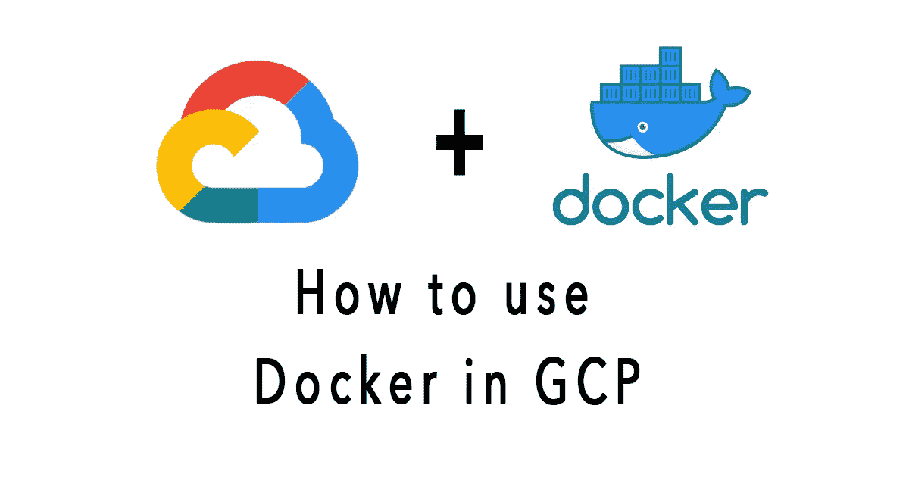

# 如何在 GCP 构建、运行和调试 Docker 容器

> 原文：<https://medium.com/codex/how-to-build-run-and-debug-docker-containers-in-gcp-4a1a29824d31?source=collection_archive---------4----------------------->

## [法典](http://medium.com/codex)



# 介绍

打开 Cloud Shell 并输入以下命令来运行 hello world 容器:

```
docker run hello-world
```

这个简单的容器将`Hello from Docker!`返回到你的屏幕。虽然这个命令很简单，但是请注意输出中它执行的步骤数。的…