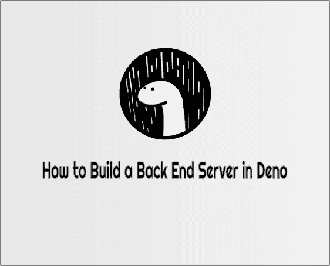

# 用 Deno 构建您的后端服务器

> 原文：<https://medium.com/codex/how-to-build-your-back-end-server-with-deno-4ee773c7ddbb?source=collection_archive---------0----------------------->

## [法典](http://medium.com/codex)

在本教程中，我们将讨论 Deno。Deno 是 JavaScript 和 TypeScript 的运行时，它基于 V8 JavaScript 引擎和 Rust 编程语言。它是由 Node.js 的创始人 Ryan Dahl 创建的，专注于生产力。这是达尔在 2018 年的一次谈话“我对 Node.js 后悔的 10 件事”中宣布的。

德诺